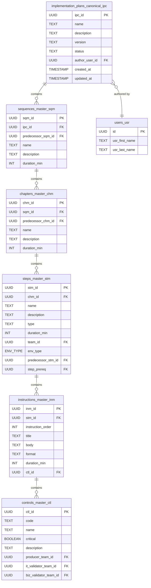

# UMIG Data Model

This document provides a comprehensive overview of the UMIG application's PostgreSQL database schema. The schema is managed via Liquibase, with the baseline defined in [`001_baseline_schema.sql`](../../local-dev-setup/liquibase/changelogs/001_baseline_schema.sql).

This model is a direct translation of the original SQL Server schema, located at [`docs/dataModel/sql/UMIG.sql`](./sql/UMIG.sql).

## Schema Overview

The database consists of tables designed to manage both canonical (template) implementation plans and instance/execution data for migrations, steps, teams, applications, and related metadata.

---

## Canonical Implementation Plan Hierarchy

**As of ADR-015, UMIG separates canonical (template) implementation plan data from instance/execution data.**

### Purpose
Canonical tables define the authoritative, reusable, and versionable structure of an implementation plan. They form a hierarchy that can be instantiated for specific migrations and tracked independently.

### Canonical Tables and Relationships

| Table Name                         | Purpose                                 | Key Fields & Relationships                  |
|-------------------------------------|-----------------------------------------|---------------------------------------------|
| implementation_plans_canonical_ipc  | Canonical implementation plan (template) | ipc_id (PK), name, description, version, status, author_user_id, created_at, updated_at |
| sequences_master_sqm                | Canonical sequence/phase                | sqm_id (PK), ipc_id (FK), predecessor_sqm_id (FK, nullable, self), name, description, duration (min) |
| chapters_master_chm                 | Canonical chapter                       | chm_id (PK), sqm_id (FK), predecessor_chm_id (FK, nullable, self), name, description, duration (min) |
| steps_master_stm                    | Canonical step                          | stm_id (PK), chm_id (FK), name, description, type, duration (min), team_id (FK), env_type (enum: PROD, TEST, BACKUP), predecessor_stm_id (FK, nullable, self), step_prereq (FK, nullable, self) |
| instructions_master_inm             | Canonical instruction                   | inm_id (PK), stm_id (FK), instruction_order, title, body, format, duration (min), ctl_id (FK, nullable) |
| controls_master_ctl                 | Canonical control/validation check      | ctl_id (PK), code, name, critical (boolean), description, producer_team_id (FK), it_validator_team_id (FK), biz_validator_team_id (FK) |

#### Hierarchy
- implementation_plans_canonical_ipc → sequences_master_sqm → chapters_master_chm → steps_master_stm → (instructions_master_inm, controls_master_ctl)

#### Key Points
- Canonical tables are used to define templates and plans of record.
- All *_id fields are UUID unless otherwise noted; all FKs reference the PK of the named table.
- Predecessor fields (e.g., predecessor_sqm_id) are self-referencing and nullable.
- Duration fields are in integer minutes.
- Enum fields (e.g., env_type) are PostgreSQL ENUMs.
- Boolean fields (e.g., critical) use PostgreSQL BOOLEAN.
- Instance/execution tables (e.g., migrations_mig, steps_stp) reference these canonical tables for traceability and plan-vs-actual analysis.
- See [ADR-015](../adr/ADR-015-canonical-implementation-plan-model.md) for rationale and detailed structure.

---

### Naming Conventions

-   **Tables**: Suffixes are used to denote the entity type (e.g., `_tms` for teams, `_app` for applications).
-   **Columns**: Foreign key columns are named after the entity they reference, followed by `_id` (e.g., `tms_id`, `app_id`).
-   **Primary Keys**: All tables use a surrogate `id` column of type `SERIAL` as the primary key, except for `environments_env` which uses a natural key.

## Entity Relationship Diagram (ERD)

## Table and Field Listing

#### **RELEASE_NOTES_RNT**
- `id` SERIAL PRIMARY KEY
- `rnt_code` VARCHAR(10)
- `rnt_name` VARCHAR(64)
- `rnt_description` TEXT
- `rnt_date` TIMESTAMP

#### **ADDITIONAL_INSTRUCTIONS_AIS**
- `id` SERIAL PRIMARY KEY
- `stp_id` INTEGER NOT NULL
- `instructions` TEXT
- `usr_id` INTEGER NOT NULL
- `ite_id` INTEGER

#### **APPLICATIONS_APP**
- `id` SERIAL PRIMARY KEY
- `app_code` VARCHAR(50) NOT NULL
- `app_name` VARCHAR(10)
- `app_description` TEXT

#### **CHAPTER_CHA**
- `id` SERIAL PRIMARY KEY
- `cha_code` VARCHAR(10)
- `cha_name` VARCHAR(10)
- `sqc_id` INTEGER
- `cha_previous` INTEGER
- `cha_start_date` TIMESTAMP
- `cha_end_date` TIMESTAMP
- `cha_effective_start_date` TIMESTAMP
- `cha_effective_end_date` TIMESTAMP

#### **CONTROLS_CTL**
- `id` SERIAL PRIMARY KEY
- `ctl_code` VARCHAR(10)
- `ctl_name` TEXT
- `ctl_producer` INTEGER
- `ctl_it_validator` INTEGER
- `ctl_it_comments` TEXT
- `ctl_biz_comments` TEXT
- `ctl_biz_validator` INTEGER

#### **ENVIRONMENTS_ENV**
- `id` VARCHAR(10) PRIMARY KEY
- `env_code` VARCHAR(10)
- `env_name` VARCHAR(64)
- `env_description` TEXT

#### **ENVIRONMENTS_APPLICATIONS_EAP**
- `id` SERIAL PRIMARY KEY
- `env_id` VARCHAR(10) NOT NULL
- `app_id` INTEGER NOT NULL
- `comments` TEXT

#### **ENVIRONMENTS_ITERATIONS_EIT**
- `id` SERIAL PRIMARY KEY
- `env_id` VARCHAR(10) NOT NULL
- `ite_id` INTEGER NOT NULL
- `eit_role` VARCHAR(10)

#### **INSTRUCTIONS_INS**
- `id` SERIAL PRIMARY KEY
- `ins_code` VARCHAR(10)
- `ins_description` TEXT
- `stp_id` INTEGER NOT NULL
- `tms_id` INTEGER
- `ctl_id` INTEGER

#### **ITERATIONS_ITE**
- `id` SERIAL PRIMARY KEY
- `ite_code` VARCHAR(10)
- `ite_name` VARCHAR(64)
- `mig_id` INTEGER
- `ite_type` VARCHAR(16)
- `description` TEXT
- `ite_start_date` TIMESTAMP
- `ite_end_date` TIMESTAMP

#### **ITERATIONS_TRACKING_ITT**
- `id` VARCHAR(10) PRIMARY KEY
- `mig_code` VARCHAR(10)
- `ite_code` VARCHAR(10)
- `entity_type` VARCHAR(10)
- `entity_id` VARCHAR(10)
- `entity_status` VARCHAR(10)
- `start_date` TIMESTAMP
- `end_date` TIMESTAMP
- `comments` TEXT

#### **MIGRATIONS_MIG**
- `id` SERIAL PRIMARY KEY
- `mig_code` VARCHAR(10)
- `mig_name` VARCHAR(128)
- `mig_description` TEXT
- `mig_planned_start_date` TIMESTAMP
- `mig_planned_end_date` TIMESTAMP
- `mty_type` ENUM('EXTERNAL', 'INTERNAL')

> **Note:** The migration type is now an ENUM (`migration_type_enum`) with allowed values: 'EXTERNAL', 'INTERNAL'. The `migration_type_mty` table has been removed for simplicity and clarity.

#### **ROLES_RLS**
- `id` SERIAL PRIMARY KEY
- `rle_code` VARCHAR(10)
- `rle_name` VARCHAR(64)
- `rle_description` TEXT

#### **SEQUENCES_SQC**
- `id`: Surrogate PK
- `mig_id`: FK to `migrations_mig.id`
- `ite_id`: FK to `iterations_ite.id` (**NEW: links sequence to its iteration**)
- `sqc_name`: Sequence name
- `sqc_order`: Sequence order within iteration
- `start_date`, `end_date`: Sequence timing
- `sqc_previous`: FK to previous sequence (if any)

- `id` SERIAL PRIMARY KEY
- `mig_id` INTEGER NOT NULL
- `sqc_name` VARCHAR(255)
- `sqc_order` INTEGER
- `start_date` TIMESTAMP
- `end_date` TIMESTAMP
- `sqc_previous` INTEGER

#### **STATUS_STS**
- `id` SERIAL PRIMARY KEY
- `sts_code` VARCHAR(10)
- `sts_name` VARCHAR(64)
- `sts_description` TEXT

#### **STEPS_STP**
- `id` SERIAL PRIMARY KEY
- `stp_code` VARCHAR(10)
- `stp_name` VARCHAR(64)
- `cha_id` INTEGER
- `tms_id` INTEGER
- `stt_type` INTEGER
- `stp_previous` INTEGER
- `stp_description` TEXT
- `sts_id` INTEGER
- `owner_id` INTEGER
- `target_env` VARCHAR(10)

#### **STEP_TYPE_STT**
- `id` SERIAL PRIMARY KEY
- `stt_code` VARCHAR(10)
- `stt_name` VARCHAR(64)
- `stt_description` TEXT

#### **TEAMS_TMS**
- `id` SERIAL PRIMARY KEY
- `tms_code` VARCHAR(10)
- `tms_name` VARCHAR(64)
- `tms_description` TEXT
- `tms_email` VARCHAR(255)

#### **TEAMS_APPLICATIONS_TAP**
- `id` SERIAL PRIMARY KEY
- `tms_id` INTEGER NOT NULL
- `app_id` INTEGER NOT NULL

#### **USERS_USR**
- `id` SERIAL PRIMARY KEY
- `usr_first_name` VARCHAR(64)
- `usr_last_name` VARCHAR(64)
- `usr_trigram` VARCHAR(3)
- `usr_email` VARCHAR(128)
- `rle_id` INTEGER
- `tms_id` INTEGER
