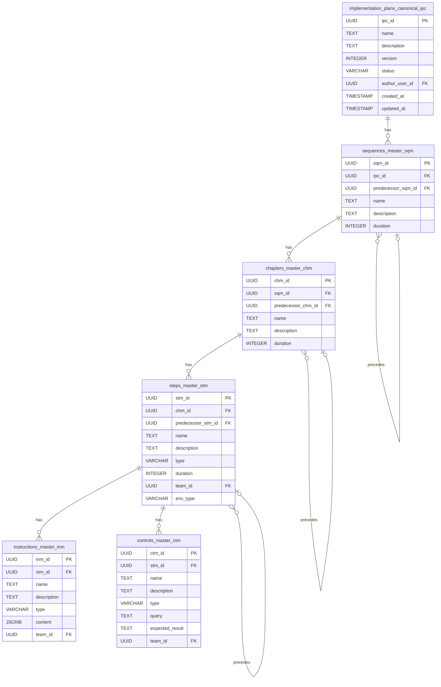

# UMIG Data Model

This document provides a comprehensive overview of the UMIG application's PostgreSQL database schema. The schema is managed via Liquibase, with the baseline defined in [`001_unified_baseline.sql`](../../local-dev-setup/liquibase/changelogs/001_unified_baseline.sql).

The data model has been designed from scratch to support a clean, template-based approach for managing IT cutover events.

## Schema Overview

The database consists of tables designed to manage both canonical (template) implementation plans and instance/execution data for migrations, steps, teams, applications, and related metadata.

## Canonical Implementation Plan Hierarchy

### Purpose
Canonical tables define the authoritative, reusable, and versionable structure of an implementation plan. They form a hierarchy that can be instantiated for specific migrations and tracked independently.

### Canonical Tables and Relationships

| Table Name                         | Purpose                                 | Key Fields & Relationships                  |
|-------------------------------------|-----------------------------------------|---------------------------------------------|
| implementation_plans_canonical_ipc  | Canonical implementation plan (template) | ipc_id (PK), name, description, version, status, author_user_id, created_at, updated_at |
| sequences_master_sqm                | Canonical sequence/phase                | sqm_id (PK), ipc_id (FK), predecessor_sqm_id (FK, nullable, self), name, description, duration (min) |
| chapters_master_chm                 | Canonical chapter                       | chm_id (PK), sqm_id (FK), predecessor_chm_id (FK, nullable, self), name, description, duration (min) |
| steps_master_stm                    | Canonical step                          | stm_id (PK), chm_id (FK), name, description, type, duration (min), team_id (FK), env_type (enum: PROD, TEST, BACKUP), predecessor_stm_id (FK, nullable, self) |
| instructions_master_inm             | Canonical instruction                   | inm_id (PK), stm_id (FK), name, description, type, content (jsonb), team_id (FK) |
| controls_master_ctm                 | Canonical control                       | ctm_id (PK), stm_id (FK), name, description, type, query, expected_result, team_id (FK) |

### ER Diagram: Canonical Plan Tables



## Instance/Execution & Audit Tables

### Purpose
Instance tables capture the live execution of a canonical plan. They are created when a plan is instantiated for a specific migration event and track real-time progress, statuses, and assignments. The audit log provides an immutable record of all significant actions.

### Instance and Audit Tables

| Table Name                   | Purpose                                     | Key Fields & Relationships                                                              |
|------------------------------|---------------------------------------------|-----------------------------------------------------------------------------------------|
| migration_iterations_mic     | A live instance of a canonical plan         | mic_id (PK), ipc_id (FK), name, description, status, start_date, end_date                |
| sequences_instance_sqi       | A live instance of a canonical sequence     | sqi_id (PK), mic_id (FK), sqm_id (FK), status, start_date, end_date                     |
| chapters_instance_chi        | A live instance of a canonical chapter      | chi_id (PK), sqi_id (FK), chm_id (FK), status, start_date, end_date                      |
| steps_instance_sti           | A live instance of a canonical step         | sti_id (PK), chi_id (FK), stm_id (FK), status, assignee_usr_id (FK), start_date, end_date |
| instructions_instance_ini    | A live instance of a canonical instruction  | ini_id (PK), sti_id (FK), inm_id (FK), status, comments                                 |
| controls_instance_cti        | A live instance of a canonical control      | cti_id (PK), sti_id (FK), ctm_id (FK), status, result, comments                          |
| audit_log_aud                | Immutable audit log for all major events    | aud_id (PK), entity_type, entity_id, action, user_id (FK), details (jsonb), timestamp   |

### ER Diagram: Instance/Execution Tables & Audit Log

```mermaid
erDiagram
    migration_iterations_mic {
        UUID mic_id PK
        UUID ipc_id FK
        TEXT name
        TEXT description
        VARCHAR status
        TIMESTAMP start_date
        TIMESTAMP end_date
    }

    sequences_instance_sqi {
        UUID sqi_id PK
        UUID mic_id FK
        UUID sqm_id FK
        VARCHAR status
        TIMESTAMP start_date
        TIMESTAMP end_date
    }

    chapters_instance_chi {
        UUID chi_id PK
        UUID sqi_id FK
        UUID chm_id FK
        VARCHAR status
        TIMESTAMP start_date
        TIMESTAMP end_date
    }

    steps_instance_sti {
        UUID sti_id PK
        UUID chi_id FK
        UUID stm_id FK
        VARCHAR status
        UUID assignee_usr_id FK
        TIMESTAMP start_date
        TIMESTAMP end_date
    }

    instructions_instance_ini {
        UUID ini_id PK
        UUID sti_id FK
        UUID inm_id FK
        VARCHAR status
        TEXT comments
    }

    controls_instance_cti {
        UUID cti_id PK
        UUID sti_id FK
        UUID ctm_id FK
        VARCHAR status
        TEXT result
        TEXT comments
    }

    audit_log_aud {
        UUID aud_id PK
        VARCHAR entity_type
        UUID entity_id
        VARCHAR action
        UUID user_id FK
        JSONB details
        TIMESTAMP timestamp
    }

    implementation_plans_canonical_ipc ||--o{ migration_iterations_mic : "instantiates as"
    migration_iterations_mic ||--o{ sequences_instance_sqi : "contains"
    sequences_instance_sqi ||--o{ chapters_instance_chi : "contains"
    chapters_instance_chi ||--o{ steps_instance_sti : "contains"
    steps_instance_sti ||--o{ instructions_instance_ini : "contains"
    steps_instance_sti ||--o{ controls_instance_cti : "contains"

    sequences_master_sqm ||--o{ sequences_instance_sqi : "is instance of"
    chapters_master_chm ||--o{ chapters_instance_chi : "is instance of"
    steps_master_stm ||--o{ steps_instance_sti : "is instance of"
    instructions_master_inm ||--o{ instructions_instance_ini : "is instance of"
    controls_master_ctm ||--o{ controls_instance_cti : "is instance of"

    migration_iterations_mic ||..o{ audit_log_aud : "is audited"
    steps_instance_sti ||..o{ audit_log_aud : "is audited"
