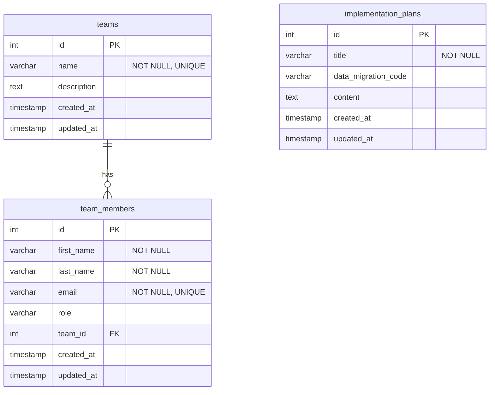

# UMIG Application Data Model

This document provides a detailed overview of the database schema for the UMIG application. The schema is managed via Liquibase migrations.

## Entity-Relationship Diagram (ERD)

The following diagram illustrates the relationships between the primary tables in the database.

## Table Schemas

### `teams`

Stores information about different teams.

| Column      | Type                      | Constraints        | Description                               |
|-------------|---------------------------|--------------------|-------------------------------------------|
| `id`        | `SERIAL`                  | `PRIMARY KEY`      | Unique identifier for the team.           |
| `name`      | `VARCHAR(255)`            | `NOT NULL`, `UNIQUE` | The name of the team.                     |
| `description` | `TEXT`                    |                    | A brief description of the team's purpose.|
| `created_at`  | `TIMESTAMP WITH TIME ZONE`| `DEFAULT NOW()`    | Timestamp of when the team was created.   |
| `updated_at`  | `TIMESTAMP WITH TIME ZONE`| `DEFAULT NOW()`    | Timestamp of the last update.             |

### `team_members` (Persons)

Stores information about individual persons. A person can exist independently of a team.

| Column       | Type                      | Constraints        | Description                                        |
|--------------|---------------------------|--------------------|----------------------------------------------------|
| `id`         | `SERIAL`                  | `PRIMARY KEY`      | Unique identifier for the person.                  |
| `first_name` | `VARCHAR(255)`            | `NOT NULL`         | The person's first name.                           |
| `last_name`  | `VARCHAR(255)`            | `NOT NULL`         | The person's last name.                            |
| `email`      | `VARCHAR(255)`            | `NOT NULL`, `UNIQUE` | The person's unique email address.                 |
| `role`       | `VARCHAR(100)`            |                    | The person's role (e.g., Developer, PM).           |
| `team_id`    | `INTEGER`                 | `FOREIGN KEY`      | References `teams(id)`. Can be `NULL`.             |
| `created_at`   | `TIMESTAMP WITH TIME ZONE`| `DEFAULT NOW()`    | Timestamp of when the person was created.          |
| `updated_at`   | `TIMESTAMP WITH TIME ZONE`| `DEFAULT NOW()`    | Timestamp of the last update.                      |

### `implementation_plans`

Stores information about implementation plans.

| Column                | Type                      | Constraints   | Description                                           |
|-----------------------|---------------------------|---------------|-------------------------------------------------------|
| `id`                  | `SERIAL`                  | `PRIMARY KEY` | Unique identifier for the implementation plan.        |
| `title`               | `VARCHAR(255)`            | `NOT NULL`    | The title of the plan.                                |
| `data_migration_code` | `VARCHAR(255)`            |               | An optional code associated with a data migration.    |
| `content`             | `TEXT`                    |               | The detailed content of the plan.                     |
| `created_at`            | `TIMESTAMP WITH TIME ZONE`| `DEFAULT NOW()` | Timestamp of when the plan was created.               |
| `updated_at`            | `TIMESTAMP WITH TIME ZONE`| `DEFAULT NOW()` | Timestamp of the last update.                         |
