# UMIG Data Model

This document provides a comprehensive, layered, and field-level overview of the Unified Migration (UMIG) data model. It is the central reference for developers, architects, and maintainers.

---

## 1. Core Design Philosophy

UMIG is built on:
- **Separation of Canonical (Master) vs. Instance (Execution) Entities**
- **Normalized, auditable, and extensible schema**
- **Explicit support for many-to-many relationships via join tables**

---

## 2. Strategic Layer

**Purpose:** Models the high-level structure and actors involved in a migration program.

### 2.1. Migrations (`migrations_mig`)
- **mig_id** (UUID, PK): Unique migration identifier
- **usr_id_owner** (INT, FK → users_usr): Owner
- **mig_name** (VARCHAR): Migration name
- **mig_description** (TEXT): Description
- **mig_status** (VARCHAR, FK → status_sts.sts_name): Status from status_sts where sts_type='Migration'
- **mig_start_date**, **mig_end_date**, **mig_business_cutover_date** (DATE): Key dates

### 2.2. Iterations (`iterations_ite`)
- **ite_id** (UUID, PK)
- **mig_id** (UUID, FK → migrations_mig)
- **plm_id** (UUID, FK → plans_master_plm): The master plan for this iteration
- **itt_code** (VARCHAR, FK → iteration_types_itt): Iteration type
- **ite_name**, **ite_description** (VARCHAR, TEXT)
- **ite_status** (VARCHAR, FK → status_sts.sts_name): Status from status_sts where sts_type='Iteration'
- **ite_static_cutover_date**, **ite_dynamic_cutover_date** (TIMESTAMPTZ): Cutover dates

### 2.3. Teams (`teams_tms`)
- **tms_id** (INT, PK)
- **tms_name** (VARCHAR)
- **tms_email** (VARCHAR, unique)
- **tms_description** (TEXT)
- **Membership:** All user-team assignments are managed via the join table `teams_tms_x_users_usr`.

### 2.4. Users (`users_usr`)
- **usr_id** (INT, PK)
- **usr_code** (VARCHAR, unique): 3-character user code
- **usr_first_name**, **usr_last_name** (VARCHAR)
- **usr_email** (VARCHAR, unique)
- **usr_is_admin** (BOOLEAN): Administrative privileges flag
- **usr_active** (BOOLEAN, NOT NULL, DEFAULT TRUE): Active/inactive status - Added in migration 011
- **rls_id** (INT, FK → roles_rls): Role
- **created_at**, **updated_at** (TIMESTAMPTZ): Audit timestamps - Added in migration 012
- **Team membership**: Managed exclusively via the many-to-many join table `teams_tms_x_users_usr` (see below; no direct FK in `users_usr`).
- **Business rule:** Each user currently belongs to exactly one team; all `ADMIN` and `PILOT` users are assigned to `IT_CUTOVER`. See [ADR-022](../adr/ADR-022-user-team-nn-relationship.md) for rationale.

### 2.5. Roles (`roles_rls`)
- **rls_id** (INT, PK)
- **rls_code** (VARCHAR, unique)
- **rls_description** (TEXT)

### 2.6. Environments (`environments_env`)
- **env_id** (INT, PK)
- **env_code** (VARCHAR, unique)
- **env_name** (VARCHAR)
- **env_description** (TEXT)

### 2.7. Applications (`applications_app`)
- **app_id** (INT, PK)
- **app_code** (VARCHAR, unique)
- **app_name** (VARCHAR)
- **app_description** (TEXT)

---

## 3. Canonical (Master) Layer

**Purpose:** Defines the reusable playbook for migrations.

### 3.1. Plans (`plans_master_plm`)
- **plm_id** (UUID, PK)
- **tms_id** (INT, FK → teams_tms): Owning team
- **plm_name**, **plm_description** (VARCHAR, TEXT)
- **plm_status** (VARCHAR)

### 3.2. Sequences (`sequences_master_sqm`)
- **sqm_id** (UUID, PK)
- **plm_id** (UUID, FK → plans_master_plm)
- **sqm_order** (INT)
- **sqm_name**, **sqm_description** (VARCHAR, TEXT)
- **predecessor_sqm_id** (UUID, FK → sequences_master_sqm, nullable)

### 3.3. Phases (`phases_master_phm`)
- **phm_id** (UUID, PK)
- **sqm_id** (UUID, FK → sequences_master_sqm)
- **phm_order** (INT)
- **phm_name**, **phm_description** (VARCHAR, TEXT)
- **predecessor_phm_id** (UUID, FK → phases_master_phm, nullable)

### 3.4. Steps (`steps_master_stm`)
- **stm_id** (UUID, PK)
- **phm_id** (UUID, FK → phases_master_phm)
- **tms_id_owner** (INT, FK → teams_tms): Owning team
- **stt_code** (VARCHAR, FK → step_types_stt): Step type
- **stm_number** (INT)
- **stm_name** (VARCHAR)
- **stm_description** (TEXT): Step description
- **stm_duration_minutes** (INTEGER): Expected duration
- **stm_id_predecessor** (UUID, FK → steps_master_stm, nullable)
- **enr_id** (INT, FK → environment_roles_enr, nullable): Environment role association - Added in migration 014 (replaced enr_id_target)

### 3.5. Controls (`controls_master_ctm`)
- **ctm_id** (UUID, PK)
- **phm_id** (UUID, FK → phases_master_phm)
- **ctm_code** (VARCHAR, unique): Unique business key (e.g., C0001, K0001) - Added in migration 007
- **ctm_order** (INT)
- **ctm_name**, **ctm_description** (VARCHAR, TEXT)
- **ctm_type** (VARCHAR)
- **ctm_is_critical** (BOOLEAN)

### 3.6. Instructions (`instructions_master_inm`)
Master instruction templates that define procedural steps within migration phases.

- **inm_id** (UUID, PK): Unique instruction identifier
- **stm_id** (UUID, FK → steps_master_stm): Parent step master
- **tea_id** (INT, FK → teams_tea, nullable): Responsible team
- **ctm_id** (UUID, FK → controls_master_ctm, nullable): Associated control point
- **inm_name** (VARCHAR): Instruction name/title
- **inm_description** (TEXT, nullable): Brief description
- **inm_content** (TEXT): Detailed instruction content/steps
- **inm_order** (INT): Order/sequence within the step
- **inm_estimated_duration** (INT, nullable): Estimated duration in minutes
- **inm_is_critical** (BOOLEAN, default false): Critical instruction flag
- **inm_require_validation** (BOOLEAN, default false): Requires validation flag
- **created_at** (TIMESTAMPTZ): Creation timestamp
- **created_by** (INT, FK → users_usr): User who created the instruction
- **updated_at** (TIMESTAMPTZ, nullable): Last update timestamp  
- **updated_by** (INT, FK → users_usr, nullable): User who last updated the instruction

**Relationships:**
- Many instructions can belong to one step master
- Instructions can optionally be assigned to a team
- Instructions can optionally reference a control point for validation

### 3.7. Labels (`labels_lbl`)
- **lbl_id** (INT, PK)
- **mig_id** (UUID, FK → migrations_mig)
- **lbl_name** (TEXT)
- **lbl_description** (TEXT)
- **lbl_color** (VARCHAR)
- **created_at** (TIMESTAMPTZ)
- **created_by** (INT, FK → users_usr)
- **Unique:** (mig_id, lbl_name)

---

## 4. Instance (Execution) Layer

**Purpose:** Tracks real-world executions of the canonical playbook.

### 4.1. Plan Instance (`plans_instance_pli`)
- **pli_id** (UUID, PK)
- **plm_id** (UUID, FK → plans_master_plm)
- **ite_id** (UUID, FK → iterations_ite)
- **pli_name** (VARCHAR)
- **pli_status** (VARCHAR, FK → status_sts.sts_name): Status from status_sts where sts_type='Plan'
- **usr_id_owner** (INT, FK → users_usr): Plan instance owner

### 4.2. Sequence Instance (`sequences_instance_sqi`)
- **sqi_id** (UUID, PK)
- **pli_id** (UUID, FK → plans_instance_pli)
- **sqm_id** (UUID, FK → sequences_master_sqm)
- **sqi_status** (VARCHAR, FK → status_sts.sts_name): Status from status_sts where sts_type='Sequence'
- **sqi_name** (VARCHAR): Override name for the sequence instance - Added in migration 010
- **sqi_description** (TEXT): Override description for the sequence instance - Added in migration 010
- **sqi_order** (INTEGER): Override order for the sequence instance - Added in migration 010
- **predecessor_sqi_id** (UUID): Override predecessor sequence instance - Added in migration 010

### 4.3. Phase Instance (`phases_instance_phi`)
- **phi_id** (UUID, PK)
- **sqi_id** (UUID, FK → sequences_instance_sqi)
- **phm_id** (UUID, FK → phases_master_phm)
- **phi_status** (VARCHAR, FK → status_sts.sts_name): Status from status_sts where sts_type='Phase'
- **phi_order** (INTEGER): Override order for the phase instance - Added in migration 010
- **phi_name** (VARCHAR): Override name for the phase instance - Added in migration 010
- **phi_description** (TEXT): Override description for the phase instance - Added in migration 010
- **predecessor_phi_id** (UUID): Override predecessor phase instance - Added in migration 010

### 4.4. Step Instance (`steps_instance_sti`)
- **sti_id** (UUID, PK)
- **phi_id** (UUID, FK → phases_instance_phi)
- **stm_id** (UUID, FK → steps_master_stm)
- **sti_status** (VARCHAR, FK → status_sts.sts_name): Execution status from status_sts where sts_type='Step' - Refactored in migration 015
- **sti_name** (VARCHAR): Override name for the step instance - Added in migration 010
- **sti_description** (TEXT): Override description for the step instance - Added in migration 010
- **sti_duration_minutes** (INTEGER): Override duration for the step instance - Added in migration 010
- **sti_id_predecessor** (UUID): Override predecessor step master ID - Added in migration 010
- **enr_id** (INT, FK → environment_roles_enr, nullable): Inherited environment role from master - Added in migration 014
- **Removed fields in migration 015:**
  - ~~usr_id_owner~~ (Owner is at master level only)
  - ~~usr_id_assignee~~ (Assignee is at master level only)
  - ~~enr_id_target~~ (Replaced with proper enr_id field)

### 4.5. Instruction Instance (`instructions_instance_ini`)
Execution instances of instruction templates created when step instances are instantiated.

- **ini_id** (UUID, PK): Unique instruction instance identifier
- **sti_id** (UUID, FK → steps_instance_sti): Parent step instance
- **inm_id** (UUID, FK → instructions_master_inm): Source master instruction
- **ini_name** (VARCHAR): Instance name (copied from master)
- **ini_description** (TEXT, nullable): Instance description (copied from master)
- **ini_content** (TEXT): Instance content (copied from master)
- **ini_order** (INT): Instance order (copied from master)
- **ini_estimated_duration** (INT, nullable): Instance estimated duration (copied from master)
- **tea_id** (INT, FK → teams_tea, nullable): Assigned team (copied from master)
- **ctm_id** (UUID, FK → controls_master_ctm, nullable): Associated control (copied from master)
- **ini_is_critical** (BOOLEAN, default false): Critical flag (copied from master)
- **ini_require_validation** (BOOLEAN, default false): Validation flag (copied from master)
- **ini_is_completed** (BOOLEAN, default false): Completion status (simplified model)
- **ini_completion_timestamp** (TIMESTAMPTZ, nullable): When instruction was completed
- **ini_completed_by** (INT, FK → users_usr, nullable): User who completed the instruction
- **ini_notes** (TEXT, nullable): Execution notes and comments
- **created_at** (TIMESTAMPTZ): Creation timestamp
- **created_by** (INT, FK → users_usr): User who created the instance
- **updated_at** (TIMESTAMPTZ, nullable): Last update timestamp
- **updated_by** (INT, FK → users_usr, nullable): User who last updated the instance

**Full Attribute Instantiation Pattern:**
All master instruction attributes are copied to instances during creation to preserve historical accuracy and allow for instance-specific overrides without affecting the master template.

**Simplified Status Model:**
Uses boolean `ini_is_completed` instead of complex status enumeration for clear binary state management - instruction is either completed or not completed.

**Relationships:**
- Each instruction instance belongs to exactly one step instance
- Each instruction instance is created from exactly one master instruction
- Multiple instances can be created from the same master instruction

### 4.6. Control Instance (`controls_instance_cti`)
- **cti_id** (UUID, PK)
- **sti_id** (UUID, FK → steps_instance_sti)
- **ctm_id** (UUID, FK → controls_master_ctm)
- **cti_status** (VARCHAR, FK → status_sts.sts_name): Status from status_sts where sts_type='Control'
- **cti_order** (INTEGER): Override order for the control instance
- **cti_name** (VARCHAR): Override name for the control instance
- **cti_description** (TEXT): Override description for the control instance
- **cti_type** (VARCHAR): Override type for the control instance
- **cti_is_critical** (BOOLEAN): Override criticality for the control instance
- **cti_code** (TEXT): Override code for the control instance

### 4.7. Comments (`step_instance_comments_sic`, `step_pilot_comments_spc`)
- **step_instance_comments_sic**: Comments on step executions (FKs: sti_id, created_by, updated_by)
- **step_pilot_comments_spc**: Pilot/release manager wisdom for canonical steps (FK: stm_id)

---

## 5. Association/Join Tables

**Purpose:** Implements all many-to-many and label relationships in a normalized way.

### 5.1. User-Team Membership (`teams_tms_x_users_usr`)
- **tms_x_usr_id** (SERIAL, PK)
- **tms_id** (INT, FK → teams_tms)
- **usr_id** (INT, FK → users_usr)
- **created_at** (TIMESTAMPTZ): When the user was added to the team
- **created_by** (VARCHAR(255)): User trigram (usr_code) of who added the user to the team
- **Unique:** (`tms_id`, `usr_id`)
- **Audit Strategy:** Tier 1 - Critical association requiring full audit tracking
- **Note:** All user-team relationships and audit trails are managed here. See [ADR-022](../adr/ADR-022-user-team-nn-relationship.md) for migration rationale and business logic.

### 5.2. Team-Application (`teams_tms_x_applications_app`)
- **tms_id** (INT, FK → teams_tms)
- **app_id** (INT, FK → applications_app)
- **created_at** (TIMESTAMPTZ): When the application was linked to the team
- **PK:** (tms_id, app_id)
- **Audit Strategy:** Tier 2 - Standard association with minimal audit (created_at only)

### 5.3. Environment-Application (`environments_env_x_applications_app`)
- **env_id** (INT, FK → environments_env)
- **app_id** (INT, FK → applications_app)
- **PK:** (env_id, app_id)

### 5.4. Environment-Iteration (`environments_env_x_iterations_ite`)
- **env_id** (INT, FK → environments_env)
- **ite_id** (UUID, FK → iterations_ite)
- **enr_id** (INT, FK → environment_roles_enr)
- **PK:** (env_id, ite_id)

### 5.5. Steps-Iteration Types (`steps_master_stm_x_iteration_types_itt`)
- **stm_id** (UUID, FK → steps_master_stm)
- **itt_code** (VARCHAR, FK → iteration_types_itt)
- **PK:** (stm_id, itt_code)

### 5.6. Steps-Impacted Teams (`steps_master_stm_x_teams_tms_impacted`)
- **stm_id** (UUID, FK → steps_master_stm)
- **tms_id** (INT, FK → teams_tms)
- **PK:** (stm_id, tms_id)

### 5.7. Labels-Steps (`labels_lbl_x_steps_master_stm`)
- **lbl_x_stm_id** (SERIAL, PK)
- **lbl_id** (INT, FK → labels_lbl)
- **stm_id** (UUID, FK → steps_master_stm)
- **created_at** (TIMESTAMPTZ): When the label was applied to the step
- **created_by** (VARCHAR(255)): User trigram (usr_code) of who applied the label
- **Unique:** (lbl_id, stm_id)
- **Audit Strategy:** Tier 2 - Standard association with minimal audit

### 5.8. Labels-Applications (`labels_lbl_x_applications_app`)
- **lbl_x_app_id** (SERIAL, PK)
- **lbl_id** (INT, FK → labels_lbl)
- **app_id** (INT, FK → applications_app)
- **created_at** (TIMESTAMPTZ): When the label was applied to the application
- **created_by** (VARCHAR(255)): User trigram (usr_code) of who applied the label
- **Unique:** (lbl_id, app_id)
- **Audit Strategy:** Tier 2 - Standard association with minimal audit

### 5.9. Labels-Controls (`labels_lbl_x_controls_master_ctm`)
- **lbl_x_ctm_id** (SERIAL, PK)
- **lbl_id** (INT, FK → labels_lbl)
- **ctm_id** (UUID, FK → controls_master_ctm)
- **created_at** (TIMESTAMPTZ): When the label was applied to the control
- **created_by** (VARCHAR(255)): User trigram (usr_code) of who applied the label
- **Unique:** (lbl_id, ctm_id)
- **Purpose:** Associates labels with control checkpoints for categorization and filtering
- **Audit Strategy:** Tier 2 - Standard association with minimal audit

---

## 6. Lookup/Reference Tables

**Purpose:** Provides controlled values and reference data for system-wide consistency.

### 6.1. Status Management (`status_sts`)
- **sts_id** (SERIAL, PK)
- **sts_name** (VARCHAR(50), NOT NULL): Status name (e.g., PENDING, IN_PROGRESS, COMPLETED)
- **sts_color** (VARCHAR(7), NOT NULL): Hex color code format (#RRGGBB)
- **sts_type** (VARCHAR(20), NOT NULL): Entity type (Migration, Iteration, Plan, Sequence, Phase, Step, Control)
- **created_at** (TIMESTAMPTZ, DEFAULT CURRENT_TIMESTAMP)
- **created_by** (VARCHAR(255))
- **Unique:** (sts_name, sts_type)
- **Purpose:** Centralizes all status values with color coding for UI consistency - Added in migration 015
- **Pre-populated values:** 31 statuses across 7 entity types

### 6.2. Environment Roles (`environment_roles_enr`)
- **enr_id** (INT, PK)
- **enr_code** (VARCHAR, unique): Role code (e.g., DEV, TEST, PROD)
- **enr_name** (VARCHAR): Display name
- **enr_description** (TEXT): Description

### 6.3. Step Types (`step_types_stt`)
- **stt_code** (VARCHAR(10), PK): Type code
- **stt_name** (VARCHAR): Display name
- **stt_description** (TEXT): Description

### 6.4. Iteration Types (`iteration_types_itt`)
- **itt_code** (VARCHAR(10), PK): Type code (e.g., RUN, DR, CUTOVER)
- **itt_name** (VARCHAR): Display name
- **itt_description** (TEXT): Description

### 6.5. Email Templates (`email_templates_emt`)
- **emt_id** (UUID, PK)
- **emt_type** (VARCHAR(50)): Template type (STEP_OPENED, INSTRUCTION_COMPLETED, STEP_STATUS_CHANGED, CUSTOM)
- **emt_name** (VARCHAR(255)): Template name
- **emt_subject** (TEXT): Email subject template
- **emt_body_html** (TEXT): HTML body template
- **emt_body_text** (TEXT, nullable): Plain text body template
- **emt_active** (BOOLEAN, DEFAULT true): Active status
- **created_at**, **updated_at** (TIMESTAMPTZ): Audit timestamps
- **created_by**, **updated_by** (VARCHAR(255)): Audit users

### 6.6. Audit Log (`audit_log_aud`)
- **aud_id** (UUID, PK)
- **aud_user_id** (INT, FK → users_usr): User performing the action
- **aud_action** (VARCHAR(100)): Action type (EMAIL_SENT, EMAIL_FAILED, STATUS_CHANGED, etc.)
- **aud_entity_type** (VARCHAR(100)): Entity type affected
- **aud_entity_id** (VARCHAR(255)): Entity ID affected
- **aud_details** (JSONB): Detailed action information
- **aud_timestamp** (TIMESTAMPTZ, DEFAULT CURRENT_TIMESTAMP): When action occurred
- **aud_ip_address** (VARCHAR(45), nullable): User's IP address
- **aud_user_agent** (TEXT, nullable): User's browser/client info

---

## 7. Entity Relationship Diagram (ERD)

```mermaid
erDiagram
    %% Lookup/Reference Tables
    status_sts {
        SERIAL sts_id PK
        VARCHAR sts_name
        VARCHAR sts_color
        VARCHAR sts_type
        TIMESTAMPTZ created_at
        VARCHAR created_by
    }
    environment_roles_enr {
        INT enr_id PK
        VARCHAR enr_code
        VARCHAR enr_name
        TEXT enr_description
    }
    step_types_stt {
        VARCHAR stt_code PK
        VARCHAR stt_name
        TEXT stt_description
    }
    iteration_types_itt {
        VARCHAR itt_code PK
        VARCHAR itt_name
        TEXT itt_description
    }
    %% Strategic Layer
    migrations_mig {
        UUID mig_id PK
        INT usr_id_owner FK
        VARCHAR mig_name
        TEXT mig_description
        DATE mig_start_date
        DATE mig_end_date
        DATE mig_business_cutover_date
    }
    iterations_ite {
        UUID ite_id PK
        UUID mig_id FK
        UUID plm_id FK
        VARCHAR itt_code FK
        VARCHAR ite_name
        TEXT ite_description
        TIMESTAMPTZ ite_static_cutover_date
        TIMESTAMPTZ ite_dynamic_cutover_date
    }
    teams_tms {
        INT tms_id PK
        VARCHAR tms_name
        VARCHAR tms_email
        TEXT tms_description
    }
    users_usr {
        INT usr_id PK
        VARCHAR usr_code
        VARCHAR usr_first_name
        VARCHAR usr_last_name
        VARCHAR usr_email
        BOOLEAN usr_is_admin
        BOOLEAN usr_active
        INT rls_id FK
        TIMESTAMPTZ created_at
        TIMESTAMPTZ updated_at
    }
    roles_rls {
        INT rls_id PK
        VARCHAR rls_code
        TEXT rls_description
    }
    environments_env {
        INT env_id PK
        VARCHAR env_code
        VARCHAR env_name
        TEXT env_description
    }
    applications_app {
        INT app_id PK
        VARCHAR app_code
        VARCHAR app_name
        TEXT app_description
    }
    %% Canonical Layer
    plans_master_plm {
        UUID plm_id PK
        INT tms_id FK
        VARCHAR plm_name
        TEXT plm_description
        VARCHAR plm_status
    }
    sequences_master_sqm {
        UUID sqm_id PK
        UUID plm_id FK
        INT sqm_order
        VARCHAR sqm_name
        TEXT sqm_description
        UUID predecessor_sqm_id FK
    }
    phases_master_phm {
        UUID phm_id PK
        UUID sqm_id FK
        INT phm_order
        VARCHAR phm_name
        TEXT phm_description
        UUID predecessor_phm_id FK
    }
    steps_master_stm {
        UUID stm_id PK
        UUID phm_id FK
        INT tms_id_owner FK
        VARCHAR stt_code FK
        INT stm_number
        VARCHAR stm_name
        TEXT stm_description
        INTEGER stm_duration_minutes
        UUID stm_id_predecessor FK
        INT enr_id FK
    }
    controls_master_ctm {
        UUID ctm_id PK
        UUID phm_id FK
        VARCHAR ctm_code
        INT ctm_order
        VARCHAR ctm_name
        TEXT ctm_description
        VARCHAR ctm_type
        BOOLEAN ctm_is_critical
    }
    instructions_master_inm {
        UUID inm_id PK
        UUID stm_id FK
        INT tms_id FK
        UUID ctm_id FK
        INT inm_order
        TEXT inm_body
    }
    labels_lbl {
        INT lbl_id PK
        UUID mig_id FK
        TEXT lbl_name
        TEXT lbl_description
        VARCHAR lbl_color
        TIMESTAMPTZ created_at
        INT created_by FK
    }
    %% Instance Layer
    plans_instance_pli {
        UUID pli_id PK
        UUID plm_id FK
        UUID ite_id FK
        VARCHAR pli_name
    }
    sequences_instance_sqi {
        UUID sqi_id PK
        UUID pli_id FK
        UUID sqm_id FK
        VARCHAR sqi_status
        VARCHAR sqi_name
        TEXT sqi_description
        INTEGER sqi_order
        UUID predecessor_sqi_id
    }
    phases_instance_phi {
        UUID phi_id PK
        UUID sqi_id FK
        UUID phm_id FK
        INTEGER phi_order
        VARCHAR phi_name
        TEXT phi_description
        UUID predecessor_phi_id
    }
    steps_instance_sti {
        UUID sti_id PK
        UUID phi_id FK
        UUID stm_id FK
        VARCHAR sti_status FK
        VARCHAR sti_name
        TEXT sti_description
        INTEGER sti_duration_minutes
        UUID sti_id_predecessor
        INT enr_id FK
    }
    instructions_instance_ini {
        UUID ini_id PK
        UUID sti_id FK
        UUID inm_id FK
        UUID tms_id
        UUID cti_id
        INTEGER ini_order
        TEXT ini_body
        INTEGER ini_duration_minutes
    }
    controls_instance_cti {
        UUID cti_id PK
        UUID sti_id FK
        UUID ctm_id FK
        INTEGER cti_order
        VARCHAR cti_name
        TEXT cti_description
        VARCHAR cti_type
        BOOLEAN cti_is_critical
        TEXT cti_code
    }
    step_instance_comments_sic {
        INT sic_id PK
        UUID sti_id FK
        TEXT comment_body
        INT created_by FK
        TIMESTAMPTZ created_at
        INT updated_by FK
        TIMESTAMPTZ updated_at
    }
    step_pilot_comments_spc {
        INT spc_id PK
        UUID stm_id FK
        TEXT comment_body
        VARCHAR author
        TIMESTAMPTZ created_at
        VARCHAR visibility
    }
    %% Association/Join Tables
    teams_tms_x_users_usr {
        INT tms_x_usr_id PK
        INT tms_id FK
        INT usr_id FK
        TIMESTAMPTZ created_at
        VARCHAR created_by
    }
    teams_tms_x_applications_app {
        INT tms_id FK
        INT app_id FK
        TIMESTAMPTZ created_at
    }
    environments_env_x_applications_app {
        INT env_id FK
        INT app_id FK
    }
    environments_env_x_iterations_ite {
        INT env_id FK
        UUID ite_id FK
        INT enr_id FK
    }
    steps_master_stm_x_iteration_types_itt {
        UUID stm_id FK
        VARCHAR itt_code FK
    }
    steps_master_stm_x_teams_tms_impacted {
        UUID stm_id FK
        INT tms_id FK
    }
    labels_lbl_x_steps_master_stm {
        INT lbl_x_stm_id PK
        INT lbl_id FK
        UUID stm_id FK
        TIMESTAMPTZ created_at
        VARCHAR created_by
    }
    labels_lbl_x_applications_app {
        INT lbl_x_app_id PK
        INT lbl_id FK
        INT app_id FK
        TIMESTAMPTZ created_at
        VARCHAR created_by
    }
    labels_lbl_x_controls_master_ctm {
        INT lbl_x_ctm_id PK
        INT lbl_id FK
        UUID ctm_id FK
        TIMESTAMPTZ created_at
        VARCHAR created_by
    }
    %% Relationships
    migrations_mig }o--|| users_usr : "owned by"
    iterations_ite }o--|| migrations_mig : "belongs to"
    plans_master_plm }o--|| teams_tms : "owned by"
    sequences_master_sqm }o--|| plans_master_plm : "belongs to"
    phases_master_phm }o--|| sequences_master_sqm : "belongs to"
    steps_master_stm }o--|| phases_master_phm : "belongs to"
    steps_master_stm }o--|| teams_tms : "owned by"
    steps_master_stm }o--|| step_types_stt : "is of type"
    steps_master_stm }o--|| environment_roles_enr : "targets environment"
    controls_master_ctm }o--|| phases_master_phm : "validates"
    instructions_master_inm }o--|| steps_master_stm : "details"
    instructions_master_inm }o--|| teams_tea : "assigned to"
    instructions_master_inm }o--|| controls_master_ctm : "can satisfy"
    plans_instance_pli }o--|| plans_master_plm : "instantiates"
    plans_instance_pli }o--|| iterations_ite : "executes for"
    sequences_instance_sqi }o--|| plans_instance_pli : "part of"
    sequences_instance_sqi }o--|| sequences_master_sqm : "instantiates"
    phases_instance_phi }o--|| sequences_instance_sqi : "part of"
    phases_instance_phi }o--|| phases_master_phm : "instantiates"
    steps_instance_sti }o--|| phases_instance_phi : "part of"
    steps_instance_sti }o--|| steps_master_stm : "instantiates"
    steps_instance_sti }o--|| environment_roles_enr : "targets environment"
    instructions_instance_ini }o--|| steps_instance_sti : "part of"
    instructions_instance_ini }o--|| instructions_master_inm : "instantiates"
    controls_instance_cti }o--|| steps_instance_sti : "validates"
    controls_instance_cti }o--|| controls_master_ctm : "instantiates"
    step_instance_comments_sic }o--|| steps_instance_sti : "comments on"
    step_instance_comments_sic }o--|| users_usr : "authored by"
    step_pilot_comments_spc }o--|| steps_master_stm : "comments on"
    teams_tms_x_users_usr }o--|| teams_tms : "team"
    teams_tms_x_users_usr }o--|| users_usr : "user"
    teams_tms_x_applications_app }o--|| teams_tms : "team"
    teams_tms_x_applications_app }o--|| applications_app : "application"
    environments_env_x_applications_app }o--|| environments_env : "environment"
    environments_env_x_applications_app }o--|| applications_app : "application"
    environments_env_x_iterations_ite }o--|| environments_env : "environment"
    environments_env_x_iterations_ite }o--|| iterations_ite : "iteration"
    environments_env_x_iterations_ite }o--|| environment_roles_enr : "role"
    steps_master_stm_x_iteration_types_itt }o--|| steps_master_stm : "step"
    steps_master_stm_x_iteration_types_itt }o--|| iteration_types_itt : "type"
    steps_master_stm_x_teams_tms_impacted }o--|| steps_master_stm : "step"
    steps_master_stm_x_teams_tms_impacted }o--|| teams_tms : "impacted team"
    labels_lbl_x_steps_master_stm }o--|| labels_lbl : "label"
    labels_lbl_x_steps_master_stm }o--|| steps_master_stm : "step"
    labels_lbl_x_applications_app }o--|| labels_lbl : "label"
    labels_lbl_x_applications_app }o--|| applications_app : "application"
    labels_lbl_x_controls_master_ctm }o--|| labels_lbl : "label"
    labels_lbl_x_controls_master_ctm }o--|| controls_master_ctm : "control"
```



---

## 7. Audit Fields Standardization (US-002b & US-002d)

### Standard Audit Fields Pattern
All tables in the UMIG database now follow a standardized audit fields pattern (migrations 016 & 017):

#### Core Audit Fields
- **created_by** (VARCHAR(255)): User trigram (usr_code), 'system', 'generator', or 'migration'
- **created_at** (TIMESTAMPTZ): Timestamp when the record was created
- **updated_by** (VARCHAR(255)): User trigram (usr_code), 'system', 'generator', or 'migration'
- **updated_at** (TIMESTAMPTZ): Timestamp when the record was last updated (auto-updated via trigger)

#### Audit Field Values (US-002d)
The `created_by` and `updated_by` fields store the following values:
- **User trigram**: The 3-character `usr_code` from the `users_usr` table (e.g., 'JDS' for John Doe Smith)
- **'system'**: For operations performed by the system or background processes
- **'generator'**: For data created by data generation scripts
- **'migration'**: For data created or modified during database migrations

A helper function `get_user_code(user_email VARCHAR)` is available to retrieve user trigrams from email addresses.

#### Tables with Audit Fields
The following tables have been standardized with the audit fields pattern:

**Master Tables:**
- sequences_master_sqm, phases_master_phm, steps_master_stm
- controls_master_ctm, instructions_master_inm

**Instance Tables:**
- sequences_instance_sqi, phases_instance_phi, steps_instance_sti
- controls_instance_cti, instructions_instance_ini

**Reference Tables:**
- teams_tms, applications_app, environments_env
- roles_rls, environment_roles_enr, step_types_stt
- iteration_types_itt, status_sts, email_templates_emt

**Special Cases:**
- **users_usr**: Has created_at/updated_at from migration 012, added created_by/updated_by in migration 016
- **labels_lbl**: Already had created_by as INTEGER (user reference), only added updated_by/updated_at

#### Automatic Update Triggers
All tables with audit fields have PostgreSQL triggers that automatically update the `updated_at` timestamp on any UPDATE operation using the `update_updated_at_column()` function.

#### Association Tables Audit Strategy (US-002d)
Association (join) tables follow a tiered audit approach based on business criticality:

**Tier 1 - Critical Associations (Full Audit)**
- `teams_tms_x_users_usr`: User-team assignments (created_at, created_by as VARCHAR)
- `environment_roles_enr_x_users_usr`: User-role assignments (when created)
- **Rationale**: These track access control and organizational structure changes

**Tier 2 - Standard Associations (Minimal Audit)**
- `teams_tms_x_applications_app`: Team-application links (created_at only)
- `labels_lbl_x_steps_master_stm`: Label-step associations (created_at, created_by)
- `labels_lbl_x_applications_app`: Label-application associations (created_at, created_by)
- `labels_lbl_x_controls_master_ctm`: Label-control associations (created_at, created_by)
- **Rationale**: These provide basic tracking without over-engineering

**Tier 3 - Simple Associations (No Audit)**
- `environments_env_x_applications_app`: Environment-application links
- `environments_env_x_iterations_ite`: Environment-iteration links
- `steps_master_stm_x_iteration_types_itt`: Step-iteration type links
- `steps_master_stm_x_teams_tms_impacted`: Step-impacted teams links
- **Rationale**: These are pure many-to-many relationships with minimal change tracking needs

#### Performance Indexes
Audit field indexes have been created for common query patterns:
- Master tables: Composite index on (created_by, created_at)
- Instance tables: Composite index on (created_by, created_at)
- Frequently queried reference tables: Index on created_at

---

## 8. Recent Changes & Migration Notes

### 2025-08-04: Audit Fields Standardization (US-002b & US-002d)
- **Migration 016**: Standardized audit fields across all 25+ tables
- **Migration 017**: Standardized association table audit fields using tiered approach
- **Key Design Decisions (US-002d)**:
  - Use user trigrams (usr_code) instead of user IDs for audit fields
  - Implement tiered audit strategy for association tables based on business criticality
  - Convert existing INTEGER created_by fields to VARCHAR(255) for consistency
- **Trigger Function**: Reused `update_updated_at_column()` function from migration 012
- **Helper Function**: Added `get_user_code(user_email)` for retrieving user trigrams
- **Special Cases**: 
  - Converted teams_tms_x_users_usr and labels_lbl_x_steps_master_stm from INTEGER to VARCHAR created_by
  - Added created_at to teams_tms_x_applications_app for Tier 2 audit tracking
- **Performance**: Added indexes for common audit field query patterns
- **Generator Updates**: Updated all data generators to populate audit fields with 'generator'

### 2025-07-15: Teams Association Management and Environment Search Enhancement
- **Teams Association APIs**: Implemented comprehensive team-application association management:
  - Enhanced `teams_tms_x_applications_app` join table utilization for team-application relationships
  - Added application association endpoints for add/remove functionality in admin interface
  - Improved team management with user and application association modals
- **Environment Search Enhancement**: Added full-stack search functionality for environments:
  - Enhanced EnvironmentsApi with search, pagination, and sorting parameters
  - Fixed GString SQL type inference issues with proper parameterized query patterns
  - Added EntityConfig support for environment search filtering
- **User Status Management**: Enhanced user management with active status filtering:
  - Migration 011: Added `usr_active` boolean field with NOT NULL constraint and TRUE default
  - Migration 012: Added `created_at` and `updated_at` audit timestamp fields with automatic triggers
  - Index created on `usr_active` for performance optimization
  - Extended Users API with active parameter for filtering active/inactive users
- **Modal Consistency**: Standardized modal UI patterns across Teams and Environments with consistent AUI styling
- **State Management**: Fixed sort field persistence bugs and confirmation dialog regressions

### 2025-07-10: Hierarchical Filtering and Labels Implementation
- **Fixed Type System Issues**: Resolved Groovy static type checking errors in StepRepository
- **Corrected Field References**: Fixed master vs instance ID filtering patterns
- **Enhanced Labels Integration**: Added proper many-to-many label-step relationship handling
- **Database Field Selection**: Ensured all referenced fields are included in SQL queries

### 2025-07-04: Full Attribute Replication (Migration 010)
- **Instance Tables Enhancement**: Added full attribute replication to all instance tables:
  - `sequences_instance_sqi`: Added `sqi_name`, `sqi_description`, `sqi_order`, `predecessor_sqi_id`
  - `phases_instance_phi`: Added `phi_order`, `phi_name`, `phi_description`, `predecessor_phi_id`
  - `steps_instance_sti`: Added `sti_name`, `sti_description`, `sti_duration_minutes`, `sti_id_predecessor`, `enr_id_target`
  - `instructions_instance_ini`: Added `ini_order`, `ini_body`, `ini_duration_minutes`, `tms_id`, `cti_id`
  - `controls_instance_cti`: Added `cti_order`, `cti_name`, `cti_description`, `cti_type`, `cti_is_critical`, `cti_code`
- **Override Capability**: Enables per-instance overrides, auditability, and future promotion capabilities
- **See**: [ADR-029](../adr/ADR-029-full-attribute-instantiation-instance-tables.md) for design rationale

### 2025-07-02: Labels and Team Membership
- **Labels System**: Created `labels_lbl` table with migration-scoped labels
- **Step-Label Association**: Added `labels_lbl_x_steps_master_stm` join table for step labeling
- **Application Labels**: Added `labels_lbl_x_applications_app` for application labeling
- **Team Membership Refactor**: Introduced `teams_tms_x_users_usr` for N-N user-team membership
- **Schema Cleanup**: Dropped `tms_id` column from `users_usr` table
- **Comments System**: Added `step_pilot_comments_spc` and `step_instance_comments_sic` tables

### 2025-06-24: Controls Enhancement
- **Control Codes**: Added `ctm_code` field to `controls_master_ctm` for business identifiers
- **Label-Control Association**: Added `labels_lbl_x_controls_master_ctm` join table

All changes are reflected in this document and the ERD.

---

## 9. Implementation Patterns & Best Practices

### 9.1. Type Safety in Repository Methods
All repository methods must use explicit type casting when handling query parameters:

```groovy
// CORRECT - Explicit casting for type safety
if (filters.migrationId) {
    query += ' AND mig.mig_id = :migrationId'
    params.migrationId = UUID.fromString(filters.migrationId as String)
}

if (filters.teamId) {
    query += ' AND stm.tms_id_owner = :teamId'  
    params.teamId = Integer.parseInt(filters.teamId as String)
}
```

### 9.2. Master vs Instance ID Filtering
Always use instance IDs for hierarchical filtering to ensure correct step retrieval:

```groovy
// CORRECT - filters by instance IDs
query += ' AND pli.pli_id = :planId'     // plan instance
query += ' AND sqi.sqi_id = :sequenceId' // sequence instance  
query += ' AND phi.phi_id = :phaseId'    // phase instance

// INCORRECT - filters by master IDs (will miss steps)
query += ' AND plm.plm_id = :planId'     // plan master
```

### 9.3. Complete Field Selection
All SQL queries must include ALL fields referenced in result mapping:

```groovy
// CORRECT - includes stm.stm_id for mapping
SELECT sti.sti_id, stm.stm_id, stm.stt_code, stm.stm_number, ...

// INCORRECT - missing stm.stm_id causes "No such property" error
SELECT sti.sti_id, stm.stt_code, stm.stm_number, ...
```

### 9.4. Many-to-Many Relationship Handling
Handle optional many-to-many relationships gracefully:

```groovy
// Graceful label fetching with error handling
def stepLabels = []
try {
    def stmId = step.stmId instanceof UUID ? step.stmId : UUID.fromString(step.stmId.toString())
    stepLabels = stepRepository.findLabelsByStepId(stmId)
} catch (Exception e) {
    stepLabels = [] // Continue with empty labels if fetching fails
}
```

### 9.5. Active User Filtering Pattern
Handle active status filtering with proper validation:

```groovy
// Active filter parameter validation
Boolean activeFilter = null
if (active) {
    if (active.toString().toLowerCase() in ['true', 'false']) {
        activeFilter = Boolean.parseBoolean(active as String)
    } else {
        return Response.status(Response.Status.BAD_REQUEST)
            .entity(new JsonBuilder([error: "Invalid active parameter. Must be true or false"]).toString()).build()
    }
}

// Apply active filter in WHERE clause
if (activeFilter != null) {
    whereConditions.add("u.usr_active = :activeFilter")
    params.activeFilter = activeFilter
}
```

### 9.6. Audit Fields Handling Pattern
Properly manage audit fields in create and update operations:

```groovy
// CREATE operation - set all audit fields
def currentUserCode = getUserCode(currentUserEmail) ?: 'system'  // Get trigram
def now = new Timestamp(System.currentTimeMillis())

params.created_by = currentUserCode  // User trigram (e.g., 'JDS')
params.created_at = now
params.updated_by = currentUserCode  // User trigram
params.updated_at = now  // Will be auto-updated by trigger on subsequent updates

// UPDATE operation - only set updated_by (updated_at handled by trigger)
params.updated_by = currentUserCode  // User trigram
// updated_at is automatically set by PostgreSQL trigger

// Helper function to get user trigram from email
def getUserCode(String email) {
    def result = DatabaseUtil.withSql { sql ->
        sql.firstRow('SELECT usr_code FROM users_usr WHERE usr_email = ?', [email])
    }
    return result?.usr_code ?: 'system'
}

// Utility class usage (AuditFieldsUtil.groovy - if created)
import umig.utils.AuditFieldsUtil

// For create operations
def auditFields = AuditFieldsUtil.getCreateAuditFields(currentUserCode)
params.putAll(auditFields)

// For update operations
def updateFields = AuditFieldsUtil.getUpdateAuditFields(currentUserCode)
params.putAll(updateFields)

// Association table audit patterns
// Tier 1 - Critical (full audit)
sql.execute("""
    INSERT INTO teams_tms_x_users_usr (tms_id, usr_id, created_at, created_by)
    VALUES (?, ?, CURRENT_TIMESTAMP, ?)
""", [teamId, userId, currentUserCode])

// Tier 2 - Standard (minimal audit)
sql.execute("""
    INSERT INTO teams_tms_x_applications_app (tms_id, app_id, created_at)
    VALUES (?, ?, CURRENT_TIMESTAMP)
""", [teamId, appId])

// Tier 3 - Simple (no audit)
sql.execute("""
    INSERT INTO environments_env_x_applications_app (env_id, app_id)
    VALUES (?, ?)
""", [envId, appId])
```

---

## 10. References & Further Reading

- [ADR-029: Full Attribute Instantiation Instance Tables](../adr/ADR-029-full-attribute-instantiation-instance-tables.md)
- [ADR-031: Groovy Type Safety and Filtering Patterns](../adr/ADR-031-groovy-type-safety-and-filtering-patterns.md)
- [ADR-022: User-Team N-N Relationship](../adr/ADR-022-user-team-nn-relationship.md)
- [Solution Architecture Documentation](../solution-architecture.md)
- [Project README](../../README.md)
