# UMIG Data Model

This document provides a comprehensive, layered, and field-level overview of the Unified Migration (UMIG) data model. It is the central reference for developers, architects, and maintainers.

---

## 1. Core Design Philosophy

UMIG is built on:
- **Separation of Canonical (Master) vs. Instance (Execution) Entities**
- **Normalized, auditable, and extensible schema**
- **Explicit support for many-to-many relationships via join tables**

---

## 2. Strategic Layer

**Purpose:** Models the high-level structure and actors involved in a migration program.

### 2.1. Migrations (`migrations_mig`)
- **mig_id** (UUID, PK): Unique migration identifier
- **usr_id_owner** (INT, FK → users_usr): Owner
- **mig_name** (VARCHAR): Migration name
- **mig_description** (TEXT): Description
- **mig_start_date**, **mig_end_date**, **mig_business_cutover_date** (DATE): Key dates

### 2.2. Iterations (`iterations_ite`)
- **ite_id** (UUID, PK)
- **mig_id** (UUID, FK → migrations_mig)
- **plm_id** (UUID, FK → plans_master_plm): The master plan for this iteration
- **itt_code** (VARCHAR, FK → iteration_types_itt): Iteration type
- **ite_name**, **ite_description** (VARCHAR, TEXT)
- **ite_static_cutover_date**, **ite_dynamic_cutover_date** (TIMESTAMPTZ): Cutover dates

### 2.3. Teams (`teams_tms`)
- **tms_id** (INT, PK)
- **tms_name** (VARCHAR)
- **tms_email** (VARCHAR, unique)
- **tms_description** (TEXT)
- **Membership:** All user-team assignments are managed via the join table `teams_tms_x_users_usr`.

### 2.4. Users (`users_usr`)
- **usr_id** (INT, PK)
- **usr_trigram** (VARCHAR)
- **usr_first_name**, **usr_last_name** (VARCHAR)
- **usr_email** (VARCHAR, unique)
- **rls_id** (INT, FK → roles_rls): Role
- **Team membership**: Managed exclusively via the many-to-many join table `teams_tms_x_users_usr` (see below; no direct FK in `users_usr`).
- **Business rule:** Each user currently belongs to exactly one team; all `ADMIN` and `PILOT` users are assigned to `IT_CUTOVER`. See [ADR-022](../adr/ADR-022-user-team-nn-relationship.md) for rationale.

### 2.5. Roles (`roles_rls`)
- **rls_id** (INT, PK)
- **rls_code** (VARCHAR, unique)
- **rls_description** (TEXT)

### 2.6. Environments (`environments_env`)
- **env_id** (INT, PK)
- **env_code** (VARCHAR, unique)
- **env_name** (VARCHAR)
- **env_description** (TEXT)

### 2.7. Applications (`applications_app`)
- **app_id** (INT, PK)
- **app_code** (VARCHAR, unique)
- **app_name** (VARCHAR)
- **app_description** (TEXT)

---

## 3. Canonical (Master) Layer

**Purpose:** Defines the reusable playbook for migrations.

### 3.1. Plans (`plans_master_plm`)
- **plm_id** (UUID, PK)
- **tms_id** (INT, FK → teams_tms): Owning team
- **plm_name**, **plm_description** (VARCHAR, TEXT)
- **plm_status** (VARCHAR)

### 3.2. Sequences (`sequences_master_sqm`)
- **sqm_id** (UUID, PK)
- **plm_id** (UUID, FK → plans_master_plm)
- **sqm_order** (INT)
- **sqm_name**, **sqm_description** (VARCHAR, TEXT)
- **predecessor_sqm_id** (UUID, FK → sequences_master_sqm, nullable)

### 3.3. Phases (`phases_master_phm`)
- **phm_id** (UUID, PK)
- **sqm_id** (UUID, FK → sequences_master_sqm)
- **phm_order** (INT)
- **phm_name**, **phm_description** (VARCHAR, TEXT)
- **predecessor_phm_id** (UUID, FK → phases_master_phm, nullable)

### 3.4. Steps (`steps_master_stm`)
- **stm_id** (UUID, PK)
- **phm_id** (UUID, FK → phases_master_phm)
- **tms_id_owner** (INT, FK → teams_tms): Owning team
- **stt_code** (VARCHAR, FK → step_types_stt): Step type
- **stm_number** (INT)
- **stm_name** (VARCHAR)
- **stm_id_predecessor** (UUID, FK → steps_master_stm, nullable)

### 3.5. Controls (`controls_master_ctm`)
- **ctm_id** (UUID, PK)
- **phm_id** (UUID, FK → phases_master_phm)
- **ctm_code** (VARCHAR, unique): Unique business key (e.g., C0001, K0001)
- **ctm_order** (INT)
- **ctm_name**, **ctm_description** (VARCHAR, TEXT)
- **ctm_type** (VARCHAR)
- **ctm_is_critical** (BOOLEAN)

### 3.6. Instructions (`instructions_master_inm`)
- **inm_id** (UUID, PK)
- **stm_id** (UUID, FK → steps_master_stm)
- **tms_id** (INT, FK → teams_tms, nullable)
- **ctm_id** (UUID, FK → controls_master_ctm, nullable)
- **inm_order** (INT)
- **inm_body** (TEXT)

### 3.7. Labels (`labels_lbl`)
- **lbl_id** (INT, PK)
- **mig_id** (UUID, FK → migrations_mig)
- **lbl_name** (TEXT)
- **lbl_description** (TEXT)
- **lbl_color** (VARCHAR)
- **created_at** (TIMESTAMPTZ)
- **created_by** (INT, FK → users_usr)
- **Unique:** (mig_id, lbl_name)

---

## 4. Instance (Execution) Layer

**Purpose:** Tracks real-world executions of the canonical playbook.

### 4.1. Plan Instance (`plans_instance_pli`)
- **pli_id** (UUID, PK)
- **plm_id** (UUID, FK → plans_master_plm)
- **ite_id** (UUID, FK → iterations_ite)
- **pli_name** (VARCHAR)

### 4.2. Sequence Instance (`sequences_instance_sqi`)
- **sqi_id** (UUID, PK)
- **pli_id** (UUID, FK → plans_instance_pli)
- **sqm_id** (UUID, FK → sequences_master_sqm)
- **sqi_status** (VARCHAR): Status of this sequence instance
- **sqi_name** (VARCHAR): Override name for the sequence instance
- **sqi_description** (TEXT): Override description for the sequence instance
- **sqi_order** (INTEGER): Override order for the sequence instance
- **predecessor_sqi_id** (UUID): Override predecessor sequence instance

### 4.3. Phase Instance (`phases_instance_phi`)
- **phi_id** (UUID, PK)
- **sqi_id** (UUID, FK → sequences_instance_sqi)
- **phm_id** (UUID, FK → phases_master_phm)
- **phi_order** (INTEGER): Override order for the phase instance
- **phi_name** (VARCHAR): Override name for the phase instance
- **phi_description** (TEXT): Override description for the phase instance
- **predecessor_phi_id** (UUID): Override predecessor phase instance

### 4.4. Step Instance (`steps_instance_sti`)
- **sti_id** (UUID, PK)
- **phi_id** (UUID, FK → phases_instance_phi)
- **stm_id** (UUID, FK → steps_master_stm)
- **sti_name** (VARCHAR): Override name for the step instance
- **sti_description** (TEXT): Override description for the step instance
- **sti_duration_minutes** (INTEGER): Override duration for the step instance
- **sti_id_predecessor** (UUID): Override predecessor step master ID
- **enr_id_target** (UUID): Override target entity reference

### 4.5. Instruction Instance (`instructions_instance_ini`)
- **ini_id** (UUID, PK)
- **sti_id** (UUID, FK → steps_instance_sti)
- **inm_id** (UUID, FK → instructions_master_inm)
- **tms_id** (UUID): Override template step ID
- **cti_id** (UUID): Override custom template ID
- **ini_order** (INTEGER): Override order for the instruction instance
- **ini_body** (TEXT): Override body for the instruction instance
- **ini_duration_minutes** (INTEGER): Override duration for the instruction instance

### 4.6. Control Instance (`controls_instance_cti`)
- **cti_id** (UUID, PK)
- **sti_id** (UUID, FK → steps_instance_sti)
- **ctm_id** (UUID, FK → controls_master_ctm)
- **cti_order** (INTEGER): Override order for the control instance
- **cti_name** (VARCHAR): Override name for the control instance
- **cti_description** (TEXT): Override description for the control instance
- **cti_type** (VARCHAR): Override type for the control instance
- **cti_is_critical** (BOOLEAN): Override criticality for the control instance
- **cti_code** (TEXT): Override code for the control instance

### 4.7. Comments (`step_instance_comments_sic`, `step_pilot_comments_spc`)
- **step_instance_comments_sic**: Comments on step executions (FKs: sti_id, created_by, updated_by)
- **step_pilot_comments_spc**: Pilot/release manager wisdom for canonical steps (FK: stm_id)

---

## 5. Association/Join Tables

**Purpose:** Implements all many-to-many and label relationships in a normalized way.

### 5.1. User-Team Membership (`teams_tms_x_users_usr`)
- **tms_x_usr_id** (SERIAL, PK)
- **tms_id** (INT, FK → teams_tms)
- **usr_id** (INT, FK → users_usr)
- **created_at** (TIMESTAMPTZ)
- **created_by** (INT): User ID of creator (not FK, but is an integer `usr_id` for audit)
- **Primary Key:** (`tms_id`, `usr_id`)
- **Note:** All user-team relationships and audit trails are managed here. See [ADR-022](../adr/ADR-022-user-team-nn-relationship.md) for migration rationale and business logic.

### 5.2. Team-Application (`teams_tms_x_applications_app`)
- **tms_id** (INT, FK → teams_tms)
- **app_id** (INT, FK → applications_app)
- **PK:** (tms_id, app_id)

### 5.3. Environment-Application (`environments_env_x_applications_app`)
- **env_id** (INT, FK → environments_env)
- **app_id** (INT, FK → applications_app)
- **PK:** (env_id, app_id)

### 5.4. Environment-Iteration (`environments_env_x_iterations_ite`)
- **env_id** (INT, FK → environments_env)
- **ite_id** (UUID, FK → iterations_ite)
- **enr_id** (INT, FK → environment_roles_enr)
- **PK:** (env_id, ite_id)

### 5.5. Steps-Iteration Types (`steps_master_stm_x_iteration_types_itt`)
- **stm_id** (UUID, FK → steps_master_stm)
- **itt_code** (VARCHAR, FK → iteration_types_itt)
- **PK:** (stm_id, itt_code)

### 5.6. Steps-Impacted Teams (`steps_master_stm_x_teams_tms_impacted`)
- **stm_id** (UUID, FK → steps_master_stm)
- **tms_id** (INT, FK → teams_tms)
- **PK:** (stm_id, tms_id)

### 5.7. Labels-Steps (`labels_lbl_x_steps_master_stm`)
- **lbl_x_stm_id** (SERIAL, PK)
- **lbl_id** (INT, FK → labels_lbl)
- **stm_id** (UUID, FK → steps_master_stm)
- **created_at** (TIMESTAMPTZ)
- **created_by** (INT, FK → users_usr)
- **Unique:** (lbl_id, stm_id)

### 5.8. Labels-Applications (`labels_lbl_x_applications_app`)
- **lbl_x_app_id** (SERIAL, PK)
- **lbl_id** (INT, FK → labels_lbl)
- **app_id** (INT, FK → applications_app)
- **created_at** (TIMESTAMPTZ)
- **created_by** (VARCHAR)
- **Unique:** (lbl_id, app_id)

---

## 6. Entity Relationship Diagram (ERD)

```mermaid
erDiagram
    %% Strategic Layer
    migrations_mig {
        UUID mig_id PK
        INT usr_id_owner FK
        VARCHAR mig_name
        TEXT mig_description
        DATE mig_start_date
        DATE mig_end_date
        DATE mig_business_cutover_date
    }
    iterations_ite {
        UUID ite_id PK
        UUID mig_id FK
        UUID plm_id FK
        VARCHAR itt_code FK
        VARCHAR ite_name
        TEXT ite_description
        TIMESTAMPTZ ite_static_cutover_date
        TIMESTAMPTZ ite_dynamic_cutover_date
    }
    teams_tms {
        INT tms_id PK
        VARCHAR tms_name
        VARCHAR tms_email
        TEXT tms_description
    }
    users_usr {
        INT usr_id PK
        VARCHAR usr_trigram
        VARCHAR usr_first_name
        VARCHAR usr_last_name
        VARCHAR usr_email
        INT rls_id FK
    }
    roles_rls {
        INT rls_id PK
        VARCHAR rls_code
        TEXT rls_description
    }
    environments_env {
        INT env_id PK
        VARCHAR env_code
        VARCHAR env_name
        TEXT env_description
    }
    applications_app {
        INT app_id PK
        VARCHAR app_code
        VARCHAR app_name
        TEXT app_description
    }
    %% Canonical Layer
    plans_master_plm {
        UUID plm_id PK
        INT tms_id FK
        VARCHAR plm_name
        TEXT plm_description
        VARCHAR plm_status
    }
    sequences_master_sqm {
        UUID sqm_id PK
        UUID plm_id FK
        INT sqm_order
        VARCHAR sqm_name
        TEXT sqm_description
        UUID predecessor_sqm_id FK
    }
    phases_master_phm {
        UUID phm_id PK
        UUID sqm_id FK
        INT phm_order
        VARCHAR phm_name
        TEXT phm_description
        UUID predecessor_phm_id FK
    }
    steps_master_stm {
        UUID stm_id PK
        UUID phm_id FK
        INT tms_id_owner FK
        VARCHAR stt_code FK
        INT stm_number
        VARCHAR stm_name
        UUID stm_id_predecessor FK
    }
    controls_master_ctm {
        UUID ctm_id PK
        UUID phm_id FK
        VARCHAR ctm_code
        INT ctm_order
        VARCHAR ctm_name
        TEXT ctm_description
        VARCHAR ctm_type
        BOOLEAN ctm_is_critical
    }
    instructions_master_inm {
        UUID inm_id PK
        UUID stm_id FK
        INT tms_id FK
        UUID ctm_id FK
        INT inm_order
        TEXT inm_body
    }
    labels_lbl {
        INT lbl_id PK
        UUID mig_id FK
        TEXT lbl_name
        TEXT lbl_description
        VARCHAR lbl_color
        TIMESTAMPTZ created_at
        INT created_by FK
    }
    %% Instance Layer
    plans_instance_pli {
        UUID pli_id PK
        UUID plm_id FK
        UUID ite_id FK
        VARCHAR pli_name
    }
    sequences_instance_sqi {
        UUID sqi_id PK
        UUID pli_id FK
        UUID sqm_id FK
        VARCHAR sqi_status
        VARCHAR sqi_name
        TEXT sqi_description
        INTEGER sqi_order
        UUID predecessor_sqi_id
    }
    phases_instance_phi {
        UUID phi_id PK
        UUID sqi_id FK
        UUID phm_id FK
        INTEGER phi_order
        VARCHAR phi_name
        TEXT phi_description
        UUID predecessor_phi_id
    }
    steps_instance_sti {
        UUID sti_id PK
        UUID phi_id FK
        UUID stm_id FK
        VARCHAR sti_name
        TEXT sti_description
        INTEGER sti_duration_minutes
        UUID sti_id_predecessor
        UUID enr_id_target
    }
    instructions_instance_ini {
        UUID ini_id PK
        UUID sti_id FK
        UUID inm_id FK
        UUID tms_id
        UUID cti_id
        INTEGER ini_order
        TEXT ini_body
        INTEGER ini_duration_minutes
    }
    controls_instance_cti {
        UUID cti_id PK
        UUID sti_id FK
        UUID ctm_id FK
        INTEGER cti_order
        VARCHAR cti_name
        TEXT cti_description
        VARCHAR cti_type
        BOOLEAN cti_is_critical
        TEXT cti_code
    }
    step_instance_comments_sic {
        INT sic_id PK
        UUID sti_id FK
        TEXT comment_body
        INT created_by FK
        TIMESTAMPTZ created_at
        INT updated_by FK
        TIMESTAMPTZ updated_at
    }
    step_pilot_comments_spc {
        INT spc_id PK
        UUID stm_id FK
        TEXT comment_body
        VARCHAR author
        TIMESTAMPTZ created_at
        VARCHAR visibility
    }
    %% Association/Join Tables
    teams_tms_x_users_usr {
        INT tms_x_usr_id PK
        INT tms_id FK
        INT usr_id FK
        TIMESTAMPTZ created_at
        VARCHAR created_by
    }
    teams_tms_x_applications_app {
        INT tms_id FK
        INT app_id FK
    }
    environments_env_x_applications_app {
        INT env_id FK
        INT app_id FK
    }
    environments_env_x_iterations_ite {
        INT env_id FK
        UUID ite_id FK
        INT enr_id FK
    }
    steps_master_stm_x_iteration_types_itt {
        UUID stm_id FK
        VARCHAR itt_code FK
    }
    steps_master_stm_x_teams_tms_impacted {
        UUID stm_id FK
        INT tms_id FK
    }
    labels_lbl_x_steps_master_stm {
        INT lbl_x_stm_id PK
        INT lbl_id FK
        UUID stm_id FK
        TIMESTAMPTZ created_at
        INT created_by FK
    }
    labels_lbl_x_applications_app {
        INT lbl_x_app_id PK
        INT lbl_id FK
        INT app_id FK
        TIMESTAMPTZ created_at
        VARCHAR created_by
    }
    %% Relationships
    migrations_mig }o--|| users_usr : "owned by"
    iterations_ite }o--|| migrations_mig : "belongs to"
    plans_master_plm }o--|| teams_tms : "owned by"
    sequences_master_sqm }o--|| plans_master_plm : "belongs to"
    phases_master_phm }o--|| sequences_master_sqm : "belongs to"
    steps_master_stm }o--|| phases_master_phm : "belongs to"
    steps_master_stm }o--|| teams_tms : "owned by"
    steps_master_stm }o--|| step_types_stt : "is of type"
    controls_master_ctm }o--|| phases_master_phm : "validates"
    instructions_master_inm }o--|| steps_master_stm : "details"
    instructions_master_inm }o--|| teams_tms : "owned by"
    instructions_master_inm }o--|| controls_master_ctm : "can satisfy"
    plans_instance_pli }o--|| plans_master_plm : "instantiates"
    plans_instance_pli }o--|| iterations_ite : "executes for"
    sequences_instance_sqi }o--|| plans_instance_pli : "part of"
    sequences_instance_sqi }o--|| sequences_master_sqm : "instantiates"
    phases_instance_phi }o--|| sequences_instance_sqi : "part of"
    phases_instance_phi }o--|| phases_master_phm : "instantiates"
    steps_instance_sti }o--|| phases_instance_phi : "part of"
    steps_instance_sti }o--|| steps_master_stm : "instantiates"
    instructions_instance_ini }o--|| steps_instance_sti : "part of"
    instructions_instance_ini }o--|| instructions_master_inm : "instantiates"
    controls_instance_cti }o--|| steps_instance_sti : "validates"
    controls_instance_cti }o--|| controls_master_ctm : "instantiates"
    step_instance_comments_sic }o--|| steps_instance_sti : "comments on"
    step_instance_comments_sic }o--|| users_usr : "authored by"
    step_pilot_comments_spc }o--|| steps_master_stm : "comments on"
    teams_tms_x_users_usr }o--|| teams_tms : "team"
    teams_tms_x_users_usr }o--|| users_usr : "user"
    teams_tms_x_applications_app }o--|| teams_tms : "team"
    teams_tms_x_applications_app }o--|| applications_app : "application"
    environments_env_x_applications_app }o--|| environments_env : "environment"
    environments_env_x_applications_app }o--|| applications_app : "application"
    environments_env_x_iterations_ite }o--|| environments_env : "environment"
    environments_env_x_iterations_ite }o--|| iterations_ite : "iteration"
    environments_env_x_iterations_ite }o--|| environment_roles_enr : "role"
    steps_master_stm_x_iteration_types_itt }o--|| steps_master_stm : "step"
    steps_master_stm_x_iteration_types_itt }o--|| iteration_types_itt : "type"
    steps_master_stm_x_teams_tms_impacted }o--|| steps_master_stm : "step"
    steps_master_stm_x_teams_tms_impacted }o--|| teams_tms : "impacted team"
    labels_lbl_x_steps_master_stm }o--|| labels_lbl : "label"
    labels_lbl_x_steps_master_stm }o--|| steps_master_stm : "step"
    labels_lbl_x_applications_app }o--|| labels_lbl : "label"
    labels_lbl_x_applications_app }o--|| applications_app : "application"
```



---

## 7. Recent Changes & Migration Notes

- **2025-07:** Added full attribute replication to all instance tables (sequences, phases, steps, instructions, controls) to enable per-instance overrides, auditability, and future promotion capabilities. See [ADR029](../adr/ADR029-full-attribute-instantiation-instance-tables.md) for design rationale.
- **2025-07:** Introduced `teams_tms_x_users_usr` for N-N user-team membership; dropped `tms_id` from `users_usr`.
- **2025-06:** Added `labels_lbl_x_applications_app` for flexible application labeling.
- All changes are reflected in this document and the ERD.

---

## 8. References & Further Reading
- [ADR-012: Standardized Database Management](../adr/ADR-012_standardized_database_management_and_documentation.md)
- [ADR-014: Naming Conventions and Schema Design](../adr/ADR-014_schema_naming_conventions.md)
- [UMIG Developer Journal]
- [Project README](../../README.md)


### 1. The Strategic Layer

- **Migration (`migrations_mig`)**: The highest-level container representing a complete strategic initiative (e.g., "Data Center Consolidation 2025"). It has a business owner and a final cutover date.
- **Iteration (`iterations_ite`)**: A specific, time-bound execution event under a Migration (e.g., "Go-Live Weekend," "Q3 Disaster Recovery Test"). It has its own technical cutover dates and is linked to a specific set of environments.

### 2. The Canonical (Master) Layer

This layer defines

#### Table: teams_tms_x_users_usr

- **Purpose:** Implements a normalized many-to-many relationship between users and teams, allowing each user to belong to multiple teams and each team to have multiple users.
- **Fields:**
  - `tms_x_usr_id`: Primary key.
  - `tms_id`: Foreign key to `teams_tms` (the team).
  - `usr_id`: Foreign key to `users_usr` (the user).
  - `created_at`: Timestamp of association creation.
  - `created_by`: User or process that created the association.
- **Relationship:**
  - Each user can be a member of multiple teams via this table.
  - Each team can have multiple users.
  - Unique constraint on (`tms_id`, `usr_id`) prevents duplicate memberships.

**Note:** The previous direct `tms_id` foreign key in `users_usr` has been removed. All team membership logic is now managed exclusively through `teams_tms_x_users_usr`.


#### Table: step_pilot_comments_spc

- **Purpose:** Stores accrued comments, tips, and recommendations for each canonical step, specifically for pilots and release managers. These are distinct from formal instructions and intended to capture operational wisdom and context.
- **Fields:**
  - `spc_id`: Primary key.
  - `stm_id`: Foreign key to `steps_master_stm` (the step this comment relates to).
  - `comment_body`: The comment or tip content.
  - `author`: (Optional) Who wrote the comment.
  - `created_at`: Timestamp of creation.
  - `visibility`: Intended audience (default: 'pilot').

**Relationship:**  
Each `steps_master_stm` row can have zero or more related `step_pilot_comments_spc` rows (one-to-many).

**ERD Update:**  
Add a one-to-many arrow from `steps_master_stm` to `step_pilot_comments_spc`.

the reusable playbook.

- **Plan (`plans_master_plm`)**: The master playbook containing the end-to-end set of procedures.
- **Sequence (`sequences_master_sqm`)**: A major chapter in the plan (e.g., "Pre-Migration Setup," "Application Failover").
- **Phase (`phases_master_phm`)**: A distinct stage of work within a sequence (e.g., "Configure Network ACLs," "Start Database Replication").
- **Control (`controls_master_ctm`)**: A quality gate or verification checkpoint linked to a **Phase**. It defines a standard check that must be performed (e.g., "Verify End-to-End Connectivity").
- **Step (`steps_master_stm`)**: A granular, executable task within a phase (e.g., "Restart the primary application server").
- **Instruction (`instructions_master_inm`)**: The most detailed level of the playbook, providing the specific command or procedure for a step. An instruction can be optionally linked to a master **Control** to indicate that this specific procedure satisfies the phase-level quality check.

### 3. The Instance (Execution) Layer

This layer defines

#### Table: step_instance_comments_sic

- **Purpose:** Stores user comments on the execution of a specific step instance (`steps_instance_sti`). Enables collaborative, auditable commentary during plan/iteration runs.
- **Fields:**
  - `sic_id`: Primary key.
  - `sti_id`: Foreign key to `steps_instance_sti` (the executed step).
  - `comment_body`: The comment text (long, unbounded).
  - `created_by`: User who wrote the comment (FK to `users_usr`).
  - `created_at`: Timestamp of creation.
  - `updated_by`: User who last edited (nullable, FK to `users_usr`).
  - `updated_at`: Timestamp of last update (nullable).

**Relationship:**  
Each `steps_instance_sti` row can have zero or more related `step_instance_comments_sic` rows (one-to-many).

**ERD Update:**  
Add a one-to-many arrow from `steps_instance_sti` to `step_instance_comments_sic`.

a direct, time-stamped snapshot of the canonical layer for a specific iteration.

- **Plan Instance (`plans_instance_pli`)**: A snapshot of a master plan, created for and linked to a single **Iteration**.
- **Sequence Instance (`sequences_instance_sqi`)**: An instance of a sequence for a specific plan instance.
- **Phase Instance (`phases_instance_phi`)**: An instance of a phase.
- **Step Instance (`steps_instance_sti`)**: An instance of a step, where status (e.g., 'COMPLETED', 'FAILED') is tracked.
- **Instruction Instance (`instructions_instance_ini`)**: The record of a specific instruction being performed at a specific time by a specific user.
- **Control Instance (`controls_instance_cti`)**: The record of a control being executed, linked directly to the **Step Instance** it validates. This provides an audit trail confirming that the phase-level quality check was performed for a given step.

## Entity Relationship Diagram (ERD)

The following ERD illustrates the relationships between all entities in the UMIG data model.

```mermaid
erDiagram
    labels_lbl_x_applications_app }o--|| labels_lbl : "label"
    labels_lbl_x_applications_app }o--|| applications_app : "application"
    applications_app {
        INT app_id PK
        VARCHAR app_code
        VARCHAR app_name
        TEXT app_description
    }

    environments_env {
        INT env_id PK
        VARCHAR env_code
        VARCHAR env_name
        TEXT env_description
    }

    teams_tms {
        INT tms_id PK
        VARCHAR tms_name
        VARCHAR tms_email
        TEXT tms_description
    }

    users_usr {
        INT usr_id PK
        VARCHAR usr_trigram
        VARCHAR usr_first_name
        VARCHAR usr_last_name
        VARCHAR usr_email
    }

    teams_tms_x_users_usr {
        INT tms_x_usr_id PK
        INT tms_id FK
        INT usr_id FK
        TIMESTAMPTZ created_at
        VARCHAR created_by
    }

    teams_tms_x_users_usr }o--|| teams_tms : "team"
    teams_tms_x_users_usr }o--|| users_usr : "user"

    roles_rls {
        INT rls_id PK
        VARCHAR rls_name
    }

    environment_roles_enr {
        INT enr_id PK
        VARCHAR enr_name
    }

    step_types_stt {
        VARCHAR stt_code PK
        VARCHAR stt_name
    }

    iteration_types_itt {
        VARCHAR itt_code PK
        VARCHAR itt_name
    }

    migrations_mig {
        UUID mig_id PK
        UUID usr_id_owner FK
        VARCHAR mig_name
        TEXT mig_description
        DATE mig_business_cutover_date
    }

    iterations_ite {
        UUID ite_id PK
        UUID mig_id FK
        VARCHAR ite_name
        TEXT ite_description
        TIMESTAMPTZ ite_static_cutover_date
        TIMESTAMPTZ ite_dynamic_cutover_date
    }

    plans_master_plm {
        UUID plm_id PK
        INT tms_id FK
        VARCHAR plm_name
        TEXT plm_description
    }

    sequences_master_sqm {
        UUID sqm_id PK
        UUID plm_id FK
        INT sqm_order
        VARCHAR sqm_name
        UUID predecessor_sqm_id FK
    }

    phases_master_phm {
        UUID phm_id PK
        UUID sqm_id FK
        INT phm_order
        VARCHAR phm_name
        UUID predecessor_phm_id FK
    }

    steps_master_stm {
        UUID stm_id PK
        UUID phm_id FK
        INT tms_id_owner FK
        VARCHAR stt_code FK
        INT stm_number
        VARCHAR stm_name
        UUID stm_id_predecessor FK
    }

    controls_master_ctm {
        UUID ctm_id PK
        UUID phm_id FK
        INT ctm_order
        VARCHAR ctm_name
        VARCHAR ctm_type
        BOOLEAN ctm_is_critical
    }

    instructions_master_inm {
        UUID inm_id PK
        UUID stm_id FK
        INT tms_id FK
        UUID ctm_id FK
        INT inm_order
        TEXT inm_body
    }

    %% Instance Tables

    plans_instance_pli {
        UUID pli_id PK
        UUID plm_id FK
        UUID ite_id FK
        VARCHAR pli_name
    }

    sequences_instance_sqi {
        UUID sqi_id PK
        UUID pli_id FK
        UUID sqm_id FK
    }

    phases_instance_phi {
        UUID phi_id PK
        UUID sqi_id FK
        UUID phm_id FK
    }

    steps_instance_sti {
        UUID sti_id PK
        UUID phi_id FK
        UUID stm_id FK
    }

    instructions_instance_ini {
        UUID ini_id PK
        UUID sti_id FK
        UUID inm_id FK
    }

    controls_instance_cti {
        UUID cti_id PK
        UUID sti_id FK
        UUID ctm_id FK
    }

    %% Join Tables

    teams_tms_x_applications_app {
        INT tms_id FK
        INT app_id FK
    }

    environments_env_x_applications_app {
        INT env_id FK
        INT app_id FK
    }

    environments_env_x_iterations_ite {
        UUID ite_id FK
        INT env_id FK
        INT enr_id FK
    }

    steps_master_stm_x_iteration_types_itt {
        UUID stm_id FK
        VARCHAR itt_code FK
    }

    steps_master_stm_x_teams_tms_impacted {
        UUID stm_id FK
        INT tms_id FK
    }

    %% Relationships

    users_usr }o--|| teams_tms : "belongs to"
    migrations_mig }o--|| users_usr : "owned by"
    iterations_ite }o--|| migrations_mig : "belongs to"
    plans_master_plm }o--|| teams_tms : "owned by"
    sequences_master_sqm }o--|| plans_master_plm : "belongs to"
    phases_master_phm }o--|| sequences_master_sqm : "belongs to"
    steps_master_stm }o--|| phases_master_phm : "belongs to"
    steps_master_stm }o--|| teams_tms : "owned by"
    steps_master_stm }o--|| step_types_stt : "is of type"
    controls_master_ctm }o--|| phases_master_phm : "validates"
    instructions_master_inm }o--|| steps_master_stm : "details"
    instructions_master_inm }o--|| teams_tms : "owned by"
    instructions_master_inm }o--|| controls_master_ctm : "can satisfy"

    plans_instance_pli }o--|| plans_master_plm : "instantiates"
    plans_instance_pli }o--|| iterations_ite : "executes for"
    sequences_instance_sqi }o--|| plans_instance_pli : "part of"
    sequences_instance_sqi }o--|| sequences_master_sqm : "instantiates"
    phases_instance_phi }o--|| sequences_instance_sqi : "part of"
    phases_instance_phi }o--|| phases_master_phm : "instantiates"
    steps_instance_sti }o--|| phases_instance_phi : "part of"
    steps_instance_sti }o--|| steps_master_stm : "instantiates"
    instructions_instance_ini }o--|| steps_instance_sti : "part of"
    instructions_instance_ini }o--|| instructions_master_inm : "instantiates"
    controls_instance_cti }o--|| steps_instance_sti : "validates"
    controls_instance_cti }o--|| controls_master_ctm : "instantiates"

    teams_tms_x_applications_app }o--|| teams_tms : ""
    teams_tms_x_applications_app }o--|| applications_app : ""
    environments_env_x_applications_app }o--|| environments_env : ""
    environments_env_x_applications_app }o--|| applications_app : ""
    environments_env_x_iterations_ite }o--|| environments_env : ""
    environments_env_x_iterations_ite }o--|| iterations_ite : ""
    environments_env_x_iterations_ite }o--|| environment_roles_enr : ""
    steps_master_stm_x_iteration_types_itt }o--|| steps_master_stm : ""
    steps_master_stm_x_iteration_types_itt }o--|| iteration_types_itt : ""
    steps_master_stm_x_teams_tms_impacted }o--|| steps_master_stm : ""
    steps_master_stm_x_teams_tms_impacted }o--|| teams_tms : ""
