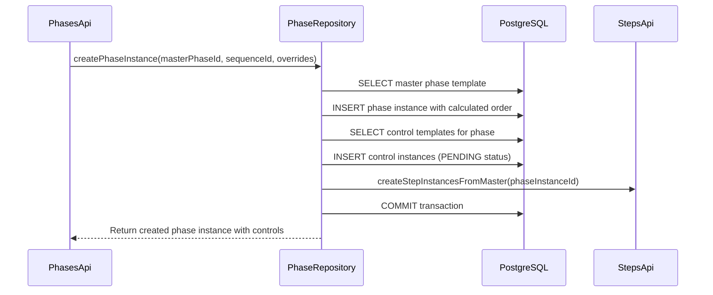
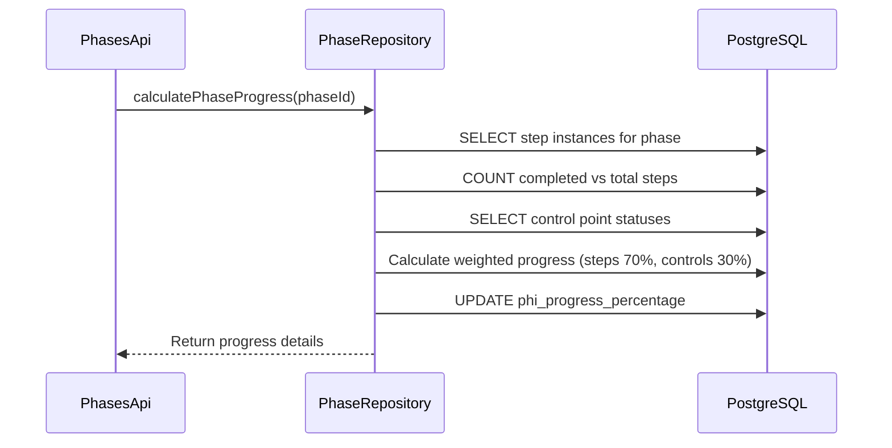
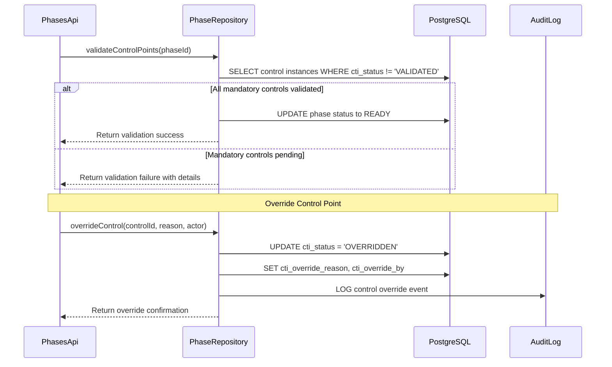

# US-003: Phases API with Control Points - Technical Architecture

**Sprint:** Sprint 0  
**Priority:** High  
**Dependencies:** US-001 (Plans API), US-002 (Sequences API)  
**Created:** 2025-08-04  
**Status:** ✅ COMPLETED (2025-08-04)

## Implementation Complete

This technical architecture was successfully implemented with all planned features:
- ✅ All 21 API endpoints implemented and tested
- ✅ Control point validation with override capabilities
- ✅ Progress aggregation from steps (70%) and controls (30%)
- ✅ Hierarchical filtering with full type safety (ADR-031)
- ✅ Ordering management with bulk and single operations
- ✅ Comprehensive testing (30 integration tests, enhanced unit tests)
- ✅ Complete documentation and Postman collection  

## 1. System Architecture Overview

The Phases API follows the established UMIG architectural patterns from US-001 and US-002, implementing a canonical-first approach with master/instance separation. The system introduces control point validation as a critical quality gate mechanism for enterprise migration safety.

### 1.1 Core Architecture Components

```
┌─────────────────────────────────────────────────────────────┐
│                    PhasesApi.groovy                         │
│  ┌─────────────────┬─────────────────┬─────────────────────┐ │
│  │   GET Handlers  │  POST Handlers  │   PUT/DELETE        │ │
│  │   - Hierarchical│   - Master      │   - Status Updates  │ │
│  │   - Filtering   │   - Instance    │   - Order Management│ │
│  │   - Master/Inst │   - Bulk Create │   - Control Overr.  │ │
│  └─────────────────┴─────────────────┴─────────────────────┘ │
└─────────────────────────┬───────────────────────────────────┘
                          │
┌─────────────────────────▼───────────────────────────────────┐
│                PhaseRepository.groovy                       │
│  ┌─────────────────┬─────────────────┬─────────────────────┐ │
│  │   Data Access   │ Control Points  │  Progress & Order   │ │
│  │   - CRUD Ops    │ - Validation    │  - Aggregation      │ │
│  │   - Hierarchical│ - Override Mgmt │  - Reordering       │ │
│  │   - Type Safety │ - Status Checks │  - Dependencies     │ │
│  └─────────────────┴─────────────────┴─────────────────────┘ │
└─────────────────────────┬───────────────────────────────────┘
                          │
┌─────────────────────────▼───────────────────────────────────┐
│                 DatabaseUtil.withSql                       │
│            PostgreSQL Database Layer                       │
│  ┌─────────────────┬─────────────────┬─────────────────────┐ │
│  │ phases_master   │controls_master  │ phases_instance     │ │
│  │ (phm)           │(ctm)            │ (phi)               │ │
│  │                 │controls_instance│                     │ │
│  │                 │(cti)            │                     │ │
│  └─────────────────┴─────────────────┴─────────────────────┘ │
└─────────────────────────────────────────────────────────────┘
```

### 1.2 Integration Architecture

The Phases API integrates seamlessly within the UMIG hierarchy:

```
Migration → Iteration → Plan Instance → Sequence Instance → Phase Instance → Step Instance
     ↓           ↓             ↓               ↓               ↓                ↓
Master Plan → Master Sequence → Master Phase → Master Step → Master Instruction
```

## 2. Component Design with Separation of Concerns

### 2.1 API Layer (PhasesApi.groovy)

**Responsibilities:**
- HTTP request/response handling
- Path routing and parameter extraction
- Input validation and type safety (ADR-031)
- Error response formatting
- Security group enforcement

**Key Design Patterns:**
- Lazy repository instantiation to avoid class loading issues
- Consistent error handling with standardized JSON responses
- Type-safe parameter casting with explicit validation
- Path-based routing similar to PlansApi and SequencesApi

### 2.2 Repository Layer (PhaseRepository.groovy)

**Responsibilities:**
- Database operations using DatabaseUtil.withSql pattern
- Business logic for control point validation
- Progress aggregation from child steps
- Order management and dependency resolution
- Transaction management for complex operations

**Key Design Patterns:**
- Comprehensive error handling with SQL state mapping
- Hierarchical filtering support
- Type-safe parameter handling throughout
- Optimized queries with proper JOIN strategies

### 2.3 Database Layer

**Existing Schema Integration:**
- `phases_master_phm` - Phase templates with ordering
- `phases_instance_phi` - Phase execution instances
- `controls_master_ctm` - Control point templates
- `controls_instance_cti` - Control point validation tracking

## 3. Data Flow Architecture for Phase Operations

### 3.1 Phase Instance Creation Flow



### 3.2 Progress Calculation Flow



### 3.3 Control Point Validation Flow



## 4. Control Point Validation Architecture

### 4.1 Control Types and Validation States

**Control Types:**
- `MANDATORY` - Must be validated before phase completion
- `OPTIONAL` - Can be skipped without impact
- `CONDITIONAL` - Required based on runtime conditions (future enhancement)

**Validation States:**
- `PENDING` - Awaiting validation
- `VALIDATED` - Completed successfully
- `FAILED` - Validation failed, requires attention
- `OVERRIDDEN` - Manually overridden with justification

### 4.2 Validation Engine

```groovy
class ControlPointValidator {
    
    def validatePhaseControls(UUID phaseId) {
        DatabaseUtil.withSql { sql ->
            // Get all control instances for the phase
            def controls = sql.rows("""
                SELECT cti_id, ctm_type, cti_status, ctm_is_critical
                FROM controls_instance_cti cti
                JOIN controls_master_ctm ctm ON cti.ctm_id = ctm.ctm_id
                WHERE cti.phi_id = :phaseId
                ORDER BY ctm.ctm_order
            """, [phaseId: phaseId])
            
            def validation = [
                total_controls: controls.size(),
                mandatory_pending: 0,
                optional_pending: 0,
                failed_controls: [],
                ready_to_proceed: true
            ]
            
            controls.each { control ->
                if (control.ctm_type == 'MANDATORY' && 
                    control.cti_status in ['PENDING', 'FAILED']) {
                    validation.mandatory_pending++
                    validation.ready_to_proceed = false
                }
                
                if (control.cti_status == 'FAILED') {
                    validation.failed_controls << [
                        id: control.cti_id,
                        critical: control.ctm_is_critical
                    ]
                }
            }
            
            return validation
        }
    }
}
```

### 4.3 Override Management

Control point overrides provide emergency escape valves while maintaining audit trails:

```groovy
def overrideControlPoint(UUID controlId, String reason, String overrideBy) {
    DatabaseUtil.withSql { sql ->
        sql.withTransaction {
            // Update control status
            sql.execute("""
                UPDATE controls_instance_cti 
                SET cti_status = 'OVERRIDDEN',
                    cti_override_reason = :reason,
                    cti_override_by = :overrideBy,
                    cti_override_timestamp = NOW()
                WHERE cti_id = :controlId
            """, [
                controlId: controlId,
                reason: reason,
                overrideBy: overrideBy
            ])
            
            // Create audit log entry
            sql.execute("""
                INSERT INTO audit_logs (
                    table_name, record_id, action, 
                    changed_by, reason, created_at
                ) VALUES (
                    'controls_instance_cti', :controlId, 'OVERRIDE',
                    :overrideBy, :reason, NOW()
                )
            """, [
                controlId: controlId,
                overrideBy: overrideBy,
                reason: reason
            ])
        }
    }
}
```

## 5. Ordering Management System Design

### 5.1 Order Management Strategy

Building on the US-002 Sequences API ordering patterns:

**Master Phase Ordering:**
- `phm_order` field maintains sequence within master sequence
- Automatic gap normalization after deletions
- Bulk reordering with transaction safety
- Dependency validation through `predecessor_phm_id`

**Instance Phase Ordering:**
- `phi_order` inherited from master during instance creation
- Runtime order adjustments for execution flexibility
- Maintains referential integrity with sequence hierarchy

### 5.2 Reordering Operations

```groovy
def reorderMasterPhases(UUID sequenceId, Map<UUID, Integer> phaseOrderMap) {
    DatabaseUtil.withSql { sql ->
        sql.withTransaction {
            // Validate all phases belong to the sequence
            def phaseIds = phaseOrderMap.keySet().toList()
            def validPhases = sql.rows("""
                SELECT phm_id FROM phases_master_phm 
                WHERE sqm_id = :sequenceId AND phm_id IN (${createInClause(phaseIds)})
            """, [sequenceId: sequenceId] + createInParams(phaseIds))
            
            if (validPhases.size() != phaseIds.size()) {
                throw new IllegalArgumentException("Some phases don't belong to the sequence")
            }
            
            // Update orders
            phaseOrderMap.each { phaseId, newOrder ->
                sql.execute("""
                    UPDATE phases_master_phm 
                    SET phm_order = :newOrder,
                        updated_at = NOW(),
                        updated_by = :userId
                    WHERE phm_id = :phaseId
                """, [
                    phaseId: phaseId,
                    newOrder: newOrder,
                    userId: getCurrentUserId()
                ])
            }
            
            // Normalize gaps
            normalizePhaseOrder(sequenceId)
        }
    }
}
```

### 5.3 Dependency Resolution

Phase dependencies managed through predecessor relationships:

```groovy
def validatePhaseDependencies(UUID phaseId, UUID newPredecessorId) {
    // Detect circular dependencies
    def visited = [] as Set
    def current = newPredecessorId
    
    while (current) {
        if (visited.contains(current)) {
            throw new IllegalStateException("Circular dependency detected")
        }
        if (current == phaseId) {
            throw new IllegalStateException("Phase cannot be its own predecessor")
        }
        
        visited.add(current)
        current = findPredecessorId(current)
    }
    
    return true
}
```

## 6. Transaction Management Strategy

### 6.1 Transaction Boundaries

**Phase Instance Creation:**
- Master phase template retrieval
- Instance creation with order calculation
- Control instance creation
- Step instance creation cascade
- Progress initialization

**Bulk Reordering:**
- Order validation and conflict detection
- Atomic order updates across all affected phases
- Gap normalization
- Dependency integrity checks

### 6.2 Error Handling and Rollback

```groovy
def createPhaseInstanceWithControls(UUID masterPhaseId, UUID sequenceId, Map overrides) {
    DatabaseUtil.withSql { sql ->
        sql.withTransaction {
            try {
                // 1. Create phase instance
                def phaseInstance = createPhaseInstance(masterPhaseId, sequenceId, overrides)
                
                // 2. Create control instances
                def controlInstances = createControlInstancesFromMaster(phaseInstance.phi_id)
                
                // 3. Initialize progress tracking
                initializePhaseProgress(phaseInstance.phi_id)
                
                return [
                    phase: phaseInstance,
                    controls: controlInstances,
                    progress: 0
                ]
                
            } catch (Exception e) {
                // Transaction automatically rolls back
                throw new RuntimeException("Failed to create phase instance: ${e.message}", e)
            }
        }
    }
}
```

## 7. Performance Optimization Approach

### 7.1 Query Optimization

**Hierarchical Filtering Optimization:**
```sql
-- Optimized query using CTEs for complex hierarchical filtering
WITH filtered_sequences AS (
    SELECT sqi.sqi_id
    FROM sequences_instance_sqi sqi
    JOIN plans_instance_pli pli ON sqi.pli_id = pli.pli_id
    JOIN iterations_ite ite ON pli.ite_id = ite.ite_id
    WHERE (:migrationId IS NULL OR ite.mig_id::text = :migrationId)
      AND (:iterationId IS NULL OR pli.ite_id::text = :iterationId)
      AND (:planId IS NULL OR sqi.pli_id::text = :planId)
      AND (:sequenceId IS NULL OR sqi.sqi_id::text = :sequenceId)
)
SELECT phi.*, phm.phm_name as master_name, sqi.sqi_name as sequence_name
FROM phases_instance_phi phi
JOIN phases_master_phm phm ON phi.phm_id = phm.phm_id
JOIN sequences_instance_sqi sqi ON phi.sqi_id = sqi.sqi_id
WHERE sqi.sqi_id IN (SELECT sqi_id FROM filtered_sequences)
ORDER BY phi.phi_order;
```

### 7.2 Progress Calculation Optimization

**Cached Progress Calculation:**
```groovy
def calculatePhaseProgress(UUID phaseId, boolean useCache = true) {
    if (useCache) {
        def cached = getCachedProgress(phaseId)
        if (cached && isCacheValid(cached.timestamp)) {
            return cached.progress
        }
    }
    
    DatabaseUtil.withSql { sql ->
        // Calculate step completion percentage
        def stepProgress = sql.firstRow("""
            SELECT 
                COUNT(*) as total_steps,
                COUNT(*) FILTER (WHERE sti.sti_status = 'COMPLETED') as completed_steps
            FROM steps_instance_sti sti
            WHERE sti.phi_id = :phaseId
        """, [phaseId: phaseId])
        
        // Calculate control validation percentage  
        def controlProgress = sql.firstRow("""
            SELECT 
                COUNT(*) as total_controls,
                COUNT(*) FILTER (WHERE cti.cti_status IN ('VALIDATED', 'OVERRIDDEN')) as validated_controls
            FROM controls_instance_cti cti
            WHERE cti.phi_id = :phaseId
        """, [phaseId: phaseId])
        
        def progress = calculateWeightedProgress(stepProgress, controlProgress)
        
        // Update cached progress
        sql.execute("""
            UPDATE phases_instance_phi 
            SET phi_progress_percentage = :progress,
                phi_progress_updated_at = NOW()
            WHERE phi_id = :phaseId
        """, [phaseId: phaseId, progress: progress])
        
        cacheProgress(phaseId, progress)
        return progress
    }
}
```

### 7.3 Batch Operations

**Bulk Control Updates:**
```groovy
def updateMultipleControlStatuses(List<Map> controlUpdates) {
    DatabaseUtil.withSql { sql ->
        sql.withBatch(50, """
            UPDATE controls_instance_cti 
            SET cti_status = ?,
                cti_validated_by = ?,
                cti_validated_at = NOW(),
                updated_at = NOW()
            WHERE cti_id = ?
        """) { stmt ->
            controlUpdates.each { update ->
                stmt.addBatch([
                    update.status,
                    update.validatedBy,
                    update.controlId
                ])
            }
        }
    }
}
```

## 8. Integration Architecture with Existing APIs

### 8.1 Sequences API Integration

**Bidirectional Relationship:**
- Phases belong to sequences (phi.sqi_id → sequences_instance_sqi.sqi_id)
- Phase status changes propagate to sequence progress
- Sequence reordering triggers phase reorder validation

**Status Propagation:**
```groovy
def updateSequenceProgressFromPhases(UUID sequenceId) {
    DatabaseUtil.withSql { sql ->
        def progress = sql.firstRow("""
            SELECT 
                COUNT(*) as total_phases,
                AVG(phi_progress_percentage) as avg_progress,
                COUNT(*) FILTER (WHERE phi_status = 'COMPLETED') as completed_phases
            FROM phases_instance_phi phi
            WHERE phi.sqi_id = :sequenceId
        """, [sequenceId: sequenceId])
        
        sql.execute("""
            UPDATE sequences_instance_sqi 
            SET sqi_progress_percentage = :progress,
                sqi_updated_at = NOW()
            WHERE sqi_id = :sequenceId
        """, [sequenceId: sequenceId, progress: progress.avg_progress])
    }
}
```

### 8.2 Steps API Integration

**Hierarchical Dependency:**
- Steps belong to phases (sti.phi_id → phases_instance_phi.phi_id)
- Step completion triggers phase progress recalculation
- Phase status changes can trigger step status updates

### 8.3 Plans API Integration

**Indirect Integration Through Hierarchy:**
- Plans → Sequences → Phases → Steps
- Plan status aggregation includes phase progress
- Plan reordering cascades to phases through sequences

## 9. Error Handling and Resilience Patterns

### 9.1 Standardized Error Response Format

```groovy
class PhaseApiErrorHandler {
    
    static Response handleSqlException(SQLException e) {
        def errorCode = e.getSQLState()
        
        switch (errorCode) {
            case '23503': // Foreign key violation
                return Response.status(Response.Status.BAD_REQUEST)
                    .entity(new JsonBuilder([
                        error: "Referenced entity does not exist",
                        code: "FOREIGN_KEY_VIOLATION",
                        sqlState: errorCode
                    ]).toString()).build()
                    
            case '23505': // Unique violation
                return Response.status(Response.Status.CONFLICT)
                    .entity(new JsonBuilder([
                        error: "Phase with this name already exists",
                        code: "DUPLICATE_ENTRY",
                        sqlState: errorCode
                    ]).toString()).build()
                    
            default:
                return Response.status(Response.Status.INTERNAL_SERVER_ERROR)
                    .entity(new JsonBuilder([
                        error: "Database operation failed",
                        code: "DATABASE_ERROR",
                        message: e.message
                    ]).toString()).build()
        }
    }
}
```

### 9.2 Circuit Breaker Pattern for Progress Calculation

```groovy
class ProgressCalculationCircuitBreaker {
    private int failureCount = 0
    private long lastFailureTime = 0
    private final int threshold = 5
    private final long timeout = 60000 // 1 minute
    
    def calculateWithCircuitBreaker(UUID phaseId, Closure calculation) {
        if (isCircuitOpen()) {
            return getCachedProgressOrDefault(phaseId)
        }
        
        try {
            def result = calculation.call()
            reset()
            return result
        } catch (Exception e) {
            recordFailure()
            throw e
        }
    }
    
    private boolean isCircuitOpen() {
        return failureCount >= threshold && 
               (System.currentTimeMillis() - lastFailureTime) < timeout
    }
}
```

### 9.3 Retry Logic for Critical Operations

```groovy
def createPhaseInstanceWithRetry(UUID masterPhaseId, UUID sequenceId, Map overrides, int maxRetries = 3) {
    int attempts = 0
    Exception lastException = null
    
    while (attempts < maxRetries) {
        try {
            return createPhaseInstanceWithControls(masterPhaseId, sequenceId, overrides)
        } catch (SQLException e) {
            lastException = e
            attempts++
            
            if (isRetryableError(e)) {
                Thread.sleep(Math.pow(2, attempts) * 1000) // Exponential backoff
                continue
            } else {
                throw e // Non-retryable error
            }
        }
    }
    
    throw new RuntimeException("Failed after ${maxRetries} attempts", lastException)
}
```

## 10. Caching Strategy for Progress Calculations

### 10.1 Multi-Level Caching Architecture

```
┌─────────────────────────────────────────────────────────────┐
│                    Application Cache                        │
│  ┌─────────────────┬─────────────────┬─────────────────────┐ │
│  │  Phase Progress │ Control Status  │   Hierarchy Cache   │ │
│  │    (5 min TTL)  │   (2 min TTL)   │    (15 min TTL)     │ │
│  └─────────────────┴─────────────────┴─────────────────────┘ │
└─────────────────────────┬───────────────────────────────────┘
                          │
┌─────────────────────────▼───────────────────────────────────┐
│                 Database Cache Layer                        │
│  ┌─────────────────┬─────────────────┬─────────────────────┐ │
│  │ Materialized    │   Aggregate     │    Query Result     │ │
│  │    Views        │    Tables       │      Cache          │ │
│  └─────────────────┴─────────────────┴─────────────────────┘ │
└─────────────────────────────────────────────────────────────┘
```

### 10.2 Cache Implementation

```groovy
class PhaseProgressCache {
    private static final Map<UUID, CachedProgress> progressCache = new ConcurrentHashMap<>()
    private static final long CACHE_TTL = 5 * 60 * 1000 // 5 minutes
    
    static class CachedProgress {
        final int progress
        final long timestamp
        final List<String> dependencies
        
        CachedProgress(int progress, List<String> dependencies) {
            this.progress = progress
            this.timestamp = System.currentTimeMillis()
            this.dependencies = dependencies ?: []
        }
        
        boolean isValid() {
            return (System.currentTimeMillis() - timestamp) < CACHE_TTL
        }
    }
    
    static int getProgress(UUID phaseId) {
        def cached = progressCache.get(phaseId)
        return cached?.isValid() ? cached.progress : -1
    }
    
    static void cacheProgress(UUID phaseId, int progress, List<String> dependencies = []) {
        progressCache.put(phaseId, new CachedProgress(progress, dependencies))
    }
    
    static void invalidateProgress(UUID phaseId) {
        progressCache.remove(phaseId)
        
        // Invalidate dependent caches
        progressCache.entrySet().removeIf { entry ->
            entry.value.dependencies.contains(phaseId.toString())
        }
    }
}
```

### 10.3 Cache Invalidation Strategy

**Event-Driven Invalidation:**
- Step status changes → Invalidate parent phase progress
- Control status changes → Invalidate parent phase progress  
- Phase reordering → Invalidate parent sequence progress
- Bulk operations → Invalidate entire hierarchy cache

**Scheduled Refresh:**
```groovy
@Scheduled(fixedRate = 300000) // Every 5 minutes
def refreshCriticalProgresses() {
    DatabaseUtil.withSql { sql ->
        def criticalPhases = sql.rows("""
            SELECT phi.phi_id
            FROM phases_instance_phi phi
            WHERE phi.phi_status IN ('IN_PROGRESS', 'BLOCKED')
              AND phi.phi_progress_updated_at < NOW() - INTERVAL '5 minutes'
        """)
        
        criticalPhases.each { phase ->
            calculatePhaseProgress(phase.phi_id, false) // Skip cache
        }
    }
}
```

---

## Implementation Roadmap

### Phase 1: Core Repository Implementation (1.5 hours)
1. Create PhaseRepository.groovy with all CRUD operations
2. Implement control point management methods
3. Add hierarchical filtering support
4. Create progress calculation logic

### Phase 2: API Layer Implementation (2 hours)
1. Create PhasesApi.groovy following established patterns
2. Implement all REST endpoints with proper error handling
3. Add type safety and validation
4. Integrate with existing security framework

### Phase 3: Advanced Features (1.5 hours)
1. Implement ordering management (bulk and single operations)
2. Add control validation and override capabilities
3. Create progress aggregation and caching
4. Implement readiness checks and status transitions

### Phase 4: Testing & Documentation (0.5 hours)
1. Write comprehensive unit and integration tests
2. Update OpenAPI specification
3. Create API documentation and examples
4. Generate Postman collection

---

This architecture leverages proven patterns from US-001 and US-002 while introducing sophisticated control point validation and progress tracking capabilities essential for enterprise migration management. The design emphasizes performance, reliability, and maintainability while preserving the UMIG architectural principles.