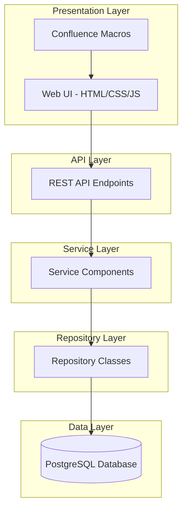
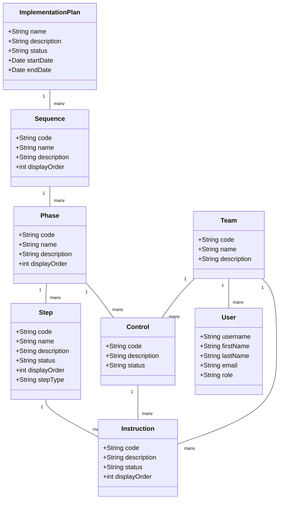

# System Patterns

## System Architecture

The UMIG application follows a layered architecture pattern with clear separation of concerns:



## Key Technical Decisions

1. **Pure ScriptRunner Application Pattern**:
   - All backend code is implemented as Groovy scripts within ScriptRunner.
   - REST endpoints are auto-discovered from the `src/com/umig/api/v2` directory.
   - No formal Confluence plugin structure is used.
   - Backend code is organized in a clean package structure: `src/com/umig/{api,repository,utils}`.
   - Frontend assets are stored in `src/web/{css,js}`.
   - Confluence macros are stored in `src/macros`.

2. **Database Connection Management**:
   - ScriptRunner's Database Resource Pool feature is used for connection management.
   - All database access is done through the type-safe `withSql` pattern.
   - The resource pool name is standardized as `umig_db_pool`.
   - Static analysis warnings are eliminated via `@ClosureParams` and explicit type casting.

3. **Canonical Data Model**:
   - Strict separation between canonical (master) and instance (execution) entities.
   - Single canonical plan template with a fixed, predefined structure.
   - Controls elevated to phase level, with team ownership and direct instruction association.
   - Standardized naming conventions across all tables and columns.

4. **Data Generation Pipeline**:
   - Fully modular system with single-responsibility generator files.
   - Deterministic generation of exactly two instances per iteration (ACTIVE and DRAFT).
   - Reference tables are protected during database resets.
   - Step types are prepopulated with codes, names, descriptions, and colour codes.

5. **Local Development Environment**:
   - Containerized with Podman and Podman Compose.
   - Automated setup with Ansible.
   - Database migrations managed with Liquibase.
   - Improved shell scripts for environment lifecycle management.

## Design Patterns in Use

1. **Repository Pattern**:
   - Each entity type has a dedicated repository class.
   - Repositories encapsulate all database access logic.
   - Clean separation between data access and business logic.
   - Example: `UserRepository.groovy`, `TeamRepository.groovy`, `ImplementationPlanRepository.groovy`.

2. **Service Layer Pattern**:
   - Business logic is encapsulated in service classes.
   - Services orchestrate operations across multiple repositories.
   - Services enforce business rules and validation.

3. **REST API Pattern**:
   - RESTful endpoints follow resource-oriented design.
   - HTTP methods (GET, POST, PUT, DELETE) map to CRUD operations.
   - Responses use standard HTTP status codes.
   - OpenAPI specification documents the API contract.

4. **Data Transfer Object (DTO) Pattern**:
   - DTOs are used to transfer data between layers.
   - DTOs decouple the API contract from the internal data model.
   - DTOs are serialized to/from JSON for API communication.

5. **Dependency Injection Pattern**:
   - Services and repositories are injected into API endpoints.
   - Promotes testability and loose coupling.

## Component Relationships

The system is composed of several key components with well-defined relationships:



## Critical Implementation Paths

1. **Plan Creation and Management**:
   ```mermaid
   sequenceDiagram
       participant UI as Web UI
       participant API as REST API
       participant SVC as Service Layer
       participant REPO as Repository Layer
       participant DB as Database
       
       UI->>API: Create Plan Request
       API->>SVC: Create Plan
       SVC->>REPO: Save Plan
       REPO->>DB: Insert Plan
       DB-->>REPO: Plan ID
       REPO-->>SVC: Plan Entity
       SVC-->>API: Plan DTO
       API-->>UI: Plan Response
   ```

2. **Plan Execution and Tracking**:
   ```mermaid
   sequenceDiagram
       participant UI as Web UI
       participant API as REST API
       participant SVC as Service Layer
       participant REPO as Repository Layer
       participant DB as Database
       
       UI->>API: Update Step Status
       API->>SVC: Process Status Change
       SVC->>REPO: Get Step Dependencies
       REPO->>DB: Query Dependencies
       DB-->>REPO: Dependencies
       SVC->>SVC: Validate Status Change
       SVC->>REPO: Update Step Status
       REPO->>DB: Update Status
       SVC->>SVC: Check for Notifications
       SVC-->>API: Status Update Result
       API-->>UI: Status Update Response
   ```

3. **Data Generation Pipeline**:
   ```mermaid
   flowchart TD
       START[Start Generation] --> CORE[Generate Core Metadata]
       CORE --> TEAMS[Generate Teams & Apps]
       TEAMS --> USERS[Generate Users]
       USERS --> ENV[Generate Environments]
       ENV --> MIGS[Generate Migrations]
       MIGS --> PLANS[Generate Canonical Plans]
       PLANS --> INSTANCES[Generate Plan Instances]
       INSTANCES --> END[Complete]
   ```

4. **Database Access Pattern**:
   ```mermaid
   sequenceDiagram
       participant API as API Endpoint
       participant REPO as Repository
       participant POOL as Connection Pool
       participant DB as Database
       
       API->>REPO: Call Repository Method
       REPO->>POOL: Get Connection
       POOL->>DB: Establish Connection
       DB-->>POOL: Connection
       POOL-->>REPO: Connection
       REPO->>REPO: Execute withSql Pattern
       REPO->>DB: Execute SQL
       DB-->>REPO: Result Set
       REPO->>REPO: Map to Entities
       REPO-->>API: Return Entities
       REPO->>POOL: Release Connection
