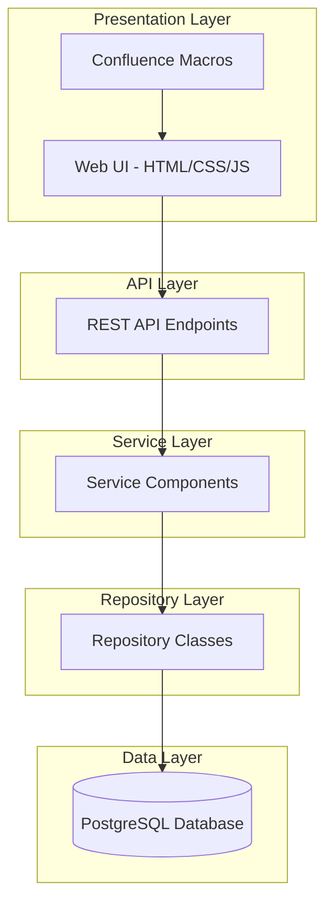

# System Patterns

## SPA + REST Admin UI Pattern (ADR020)

A dynamic SPA (Single Page Application) + REST pattern is now the standard for all administrative entity management interfaces, as formalised in ADR020. This pattern mandates:
- ScriptRunner REST endpoints for all backend CRUD operations, using the repository pattern and robust type handling.
- Dedicated JavaScript SPAs for each entity, dynamically rendering list, detail, and edit views in a single container.
- Dynamic form generation from entity fields, with strict type safety (booleans, numbers, etc.).
- Minimal Confluence macros that only load the relevant JS asset and container.
- Comprehensive documentation and enforcement in all relevant README.md files and ADRs.

This approach ensures maintainability, scalability, and a consistent user experience for all admin UIs.

## System Architecture

The UMIG application follows a layered architecture pattern with clear separation of concerns:

## Key Technical Decisions

1. **SPA + REST Pattern for Admin UIs**:
   - All admin entity management interfaces use the SPA + REST pattern (ADR020).
   - ScriptRunner REST endpoints expose CRUD operations, with defensive type handling.
   - JavaScript SPAs dynamically render forms and tables from entity fields.
   - Type safety is enforced throughout.
   - Pattern is documented and enforced in all relevant files.

2. **Pure ScriptRunner Application Pattern**:
   - All backend code is implemented as Groovy scripts within ScriptRunner.
   - REST endpoints are auto-discovered from the `src/com/umig/api/v2` directory.
   - No formal Confluence plugin structure is used.
   - Backend code is organised in a clean package structure: `src/com/umig/{api,repository,utils}`.
   - Frontend assets are stored in `src/web/{css,js}`.
   - Confluence macros are stored in `src/macros`.

3. **Database Connection Management**:
   - ScriptRunner's Database Resource Pool feature is used for connection management.
   - All database access is done through the type-safe `withSql` pattern.
   - The resource pool name is standardised as `umig_db_pool`.
   - Static analysis warnings are eliminated via `@ClosureParams` and explicit type casting.

4. **Canonical Data Model**:
   - Strict separation between canonical (master) and instance (execution) entities.
   - Single canonical plan template with a fixed, predefined structure.
   - Controls elevated to phase level, with team ownership and direct instruction association.
   - Standardised naming conventions across all tables and columns.

5. **Data Generation Pipeline**:
   - Fully modular system with single-responsibility generator files.
   - Deterministic generation of exactly two instances per iteration (ACTIVE and DRAFT).
   - Reference tables are protected during database resets.
   - Step types are prepopulated with codes, names, descriptions, and colour codes.

6. **Local Development Environment**:
   - Containerised with Podman and Podman Compose.
   - Automated setup with Ansible.
   - Database migrations managed with Liquibase.
   - Improved shell scripts for environment lifecycle management.

## Design Patterns in Use

1. **SPA + REST Admin UI Pattern**:
   - One JS SPA per entity, dynamic rendering, robust type handling.
   - ScriptRunner REST endpoints for backend, using repository pattern.
   - Minimal macros for asset loading.
   - Pattern formalised in ADR020 and enforced in documentation.

2. **Repository Pattern**:
   - Each entity type has a dedicated repository class.
   - Repositories encapsulate all database access logic.
   - Clean separation between data access and business logic.
   - Example: `UserRepository.groovy`, `TeamRepository.groovy`, `ImplementationPlanRepository.groovy`.

3. **Service Layer Pattern**:
   - Business logic is encapsulated in service classes.
   - Services orchestrate operations across multiple repositories.
   - Services enforce business rules and validation.

4. **REST API Pattern**:
   - RESTful endpoints follow resource-oriented design.
   - HTTP methods (GET, POST, PUT, DELETE) map to CRUD operations.
   - Responses use standard HTTP status codes.
   - OpenAPI specification documents the API contract.

5. **Data Transfer Object (DTO) Pattern**:
   - DTOs are used to transfer data between layers.
   - DTOs decouple the API contract from the internal data model.
   - DTOs are serialised to/from JSON for API communication.

6. **Dependency Injection Pattern**:
   - Services and repositories are injected into API endpoints.
   - Promotes testability and loose coupling.

7. **UI Component Pattern**:
   - ScriptRunner macros load JavaScript assets.
   - JavaScript handles UI rendering and API calls.
   - Backend API endpoints process requests and return JSON.
   - Clear separation between presentation and data access.

8. **Integration Testing Pattern**:
   - Tests connect to the live database to validate real integration.
   - Credentials are loaded securely from environment variables.
   - Tests are executed via standardised shell scripts.
   - Validates that repository queries match the actual database schema.
   - Integration testing is now a critical safeguard against schema drift.

## Component Relationships

[...unchanged content from previous version...]

## Critical Implementation Paths

[...unchanged content from previous version...]
