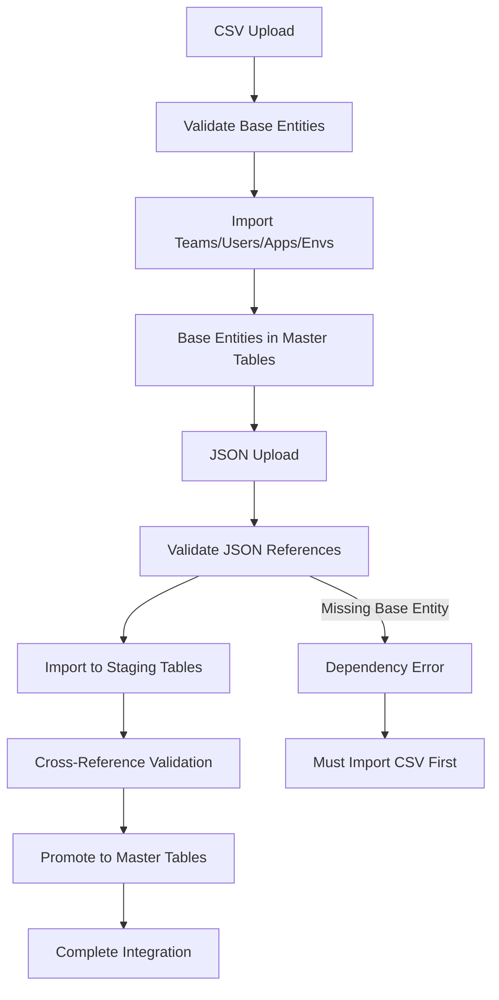

# Complete Data Import System - Architecture & Implementation Guide

## Overview

The UMIG Data Import System is a comprehensive, two-tiered import architecture that supports both **CSV base entity imports** and **JSON hierarchical data imports**. This system enables complete migration data import with proper entity dependencies, validation, and error recovery.

### Import Architecture Philosophy

1. **CSV First**: Base entities (Teams, Users, Applications, Environments) must be imported via CSV before JSON data
2. **Dependency Enforcement**: JSON step data references must exist in base entities imported via CSV
3. **Two-Phase Processing**: Staging → Master table promotion with comprehensive validation
4. **Orchestrated Workflow**: Automated coordination between CSV and JSON import processes

## Complete System Architecture

### 🏗️ Integrated Architecture Overview

The complete data import system consists of **8 interconnected components** supporting both CSV and JSON workflows:

```
┌─────────────────────────────────────────────────────────────────┐
│                        Import API Layer                         │
│   ┌─────────────────────┐      ┌─────────────────────────────┐  │
│   │   ImportApi.groovy  │      │ ImportOrchestrationService  │  │
│   │  (REST endpoints)   │◄────►│   (Workflow Coordinator)    │  │
│   └─────────────────────┘      └─────────────────────────────┘  │
└─────────────────────────────────────────────────────────────────┘
                    │ calls                    │ orchestrates
                    ▼                          ▼
┌─────────────────────────────────────────────────────────────────┐
│                      Service Layer                              │
│  ┌───────────────────┐            ┌─────────────────────────┐   │
│  │CsvImportService   │            │   ImportService.groovy  │   │
│  │(Base Entities)    │            │   (JSON Hierarchical)   │   │
│  │• Teams            │            │   • Steps               │   │
│  │• Users            │            │   • Instructions        │   │
│  │• Applications     │            │   • Staging Promotion   │   │
│  │• Environments     │            │   • Batch Processing    │   │
│  └───────────────────┘            └─────────────────────────┘   │
└─────────────────────────────────────────────────────────────────┘
                    │ uses                     │ uses
                    ▼                          ▼
┌─────────────────────────────────────────────────────────────────┐
│                    Repository Layer                             │
│  ┌─────────────────────────┐    ┌──────────────────────────────┐│
│  │ImportRepository.groovy  │    │StagingImportRepository.groovy││
│  │(Batch tracking & audit) │    │(Staging operations & promo.) ││
│  └─────────────────────────┘    └──────────────────────────────┘│
└─────────────────────────────────────────────────────────────────┘
                                      │
                                      ▼
                              Database Tables
    ┌─────────────────────────────────────────────────────────────┐
    │ Base Entity Tables    │ Staging Tables      │ Master Tables │
    │ • teams_tmt           │ • stg_steps         │ • steps_master│
    │ • users_usr           │ • stg_step_instr.   │ • instructions│
    │ • applications_app    │                     │ • import_batch│
    │ • environments_env    │ Audit Tables        │ • phases_master│
    │                       │ • import_batches    │               │
    └─────────────────────────────────────────────────────────────┘

DEPENDENCY FLOW: CSV Base Entities → JSON Hierarchical Data → Master Tables
```

### 🔄 Import Workflow Integration



## Component Details

### 1. ImportApi.groovy - Unified Import REST API
**Location**: `/src/groovy/umig/api/v2/ImportApi.groovy`  
**Purpose**: Unified REST API endpoints for both CSV and JSON import operations  

#### CSV Import Endpoints:
- `POST /api/v2/import/csv/teams` - Import teams from CSV
- `POST /api/v2/import/csv/users` - Import users from CSV  
- `POST /api/v2/import/csv/applications` - Import applications from CSV
- `POST /api/v2/import/csv/environments` - Import environments from CSV
- `POST /api/v2/import/csv/all` - Import all base entities in proper sequence

#### JSON Import Endpoints:
- `POST /api/v2/import/json` - Import single JSON file
- `POST /api/v2/import/batch` - Import multiple JSON files

#### Management & Monitoring Endpoints:
- `GET /api/v2/import/status/{batchId}` - Check import status
- `GET /api/v2/import/history` - Get import history
- `GET /api/v2/import/statistics` - Get import statistics
- `DELETE /api/v2/import/batch/{batchId}` - Rollback import batch
- `PUT /api/v2/import/batch/{batchId}/status` - Update batch status

### 2. CsvImportService.groovy - Base Entity CSV Import
**Location**: `/src/groovy/umig/service/CsvImportService.groovy`  
**Purpose**: Handles CSV import for base entities with dependency validation  
**Key Functions**:
- `importTeams()` - Import teams with email validation
- `importUsers()` - Import users with team relationship validation  
- `importApplications()` - Import applications with business rules
- `importEnvironments()` - Import environments with type validation
- `importAllBaseEntities()` - Orchestrated import in proper sequence
**Dependency Order**: Teams → Applications → Environments → Users
**Features**: Header validation, duplicate detection, referential integrity checking

### 3. ImportService.groovy - JSON Hierarchical Import
**Location**: `/src/groovy/umig/service/ImportService.groovy`  
**Purpose**: Core business logic for JSON hierarchical data import  
**Key Functions**:
- `importJsonData()` - Import single JSON file to staging
- `importBatch()` - Import multiple JSON files
- `validateStagingData()` - Validate data in staging tables
- `promoteToMaster()` - Promote staging data to master tables
- `clearStagingData()` - Clear staging tables
- `getStagingStatistics()` - Get staging table metrics
**Dependencies**: Requires CSV base entities to exist before JSON import

### 4. ImportOrchestrationService.groovy - Complete Workflow Coordinator
**Location**: `/src/groovy/umig/service/ImportOrchestrationService.groovy`  
**Purpose**: Orchestrates the complete CSV → JSON → Master import pipeline  
**Key Functions**:
- `orchestrateCompleteImport()` - Execute full import workflow
- Progress tracking with persistence across import phases
- Error recovery and resume capabilities at orchestration level
- Rollback support spanning both CSV and JSON imports
**Import Phases**: BASE_ENTITIES → JSON_PROCESSING → MASTER_PROMOTION → VALIDATION → CLEANUP

### 5. ImportRepository.groovy - Batch Tracking & Audit
**Location**: `/src/groovy/umig/repository/ImportRepository.groovy`  
**Purpose**: Manages import batch tracking and comprehensive audit trail  
**Key Functions**:
- `createImportBatch()` - Create new import batch with UUID
- `updateImportBatchStatus()` - Update batch status with statistics
- `getImportBatchStatus()` - Retrieve batch information
- `getImportHistory()` - Get import history with filtering
- `rollbackImportBatch()` - Atomic rollback capabilities
- Maintains audit trail in `import_batches` table for both CSV and JSON imports

### 6. StagingImportRepository.groovy - JSON Staging Operations
**Location**: `/src/groovy/umig/repository/StagingImportRepository.groovy`  
**Purpose**: Manages JSON staging table operations and promotion logic  
**Key Functions**:
- `createStagingStep()` - Insert step into staging with validation
- `createStagingInstructions()` - Insert instructions into staging
- `validateStagingData()` - Check data integrity and base entity references
- `promoteToMasterTables()` - Complex promotion logic with team creation
- `clearStagingTables()` - Clear staging data safely
- `getStagingStatistics()` - Get comprehensive staging metrics

### 7. JsonImportValidator.groovy - Standalone Validation
**Location**: `/src/groovy/umig/tests/validation/JsonImportValidator.groovy`  
**Purpose**: Standalone validation tool for JSON structure  
**Key Functions**:
- Validates JSON file structure and required fields
- Displays import process flow with dependency checking
- Shows staging table structure and validation rules
- No database connection required for offline validation

### 8. CSV Import Utilities - Command-Line Tools
**Location**: `/local-dev-setup/scripts/umig_csv_importer.js`  
**Purpose**: Node.js command-line utility for CSV import operations  
**Features**:
- Interactive CSV import with validation
- Dry-run mode for validation without database changes
- Table reset capabilities with confirmation prompts
- Cross-platform compatibility (Windows/macOS/Linux)

## Complete Import Workflows

### Phase 1: CSV Base Entity Import (PREREQUISITE)
```
1. Validate CSV Structure & Headers
2. Check Entity Dependencies (Teams exist for Users, etc.)
3. Create Import Batch (UUID tracking)
4. Insert into Base Entity Tables:
   a. teams_tmt (independent)
   b. applications_app (independent) 
   c. environments_env (independent)
   d. users_usr (depends on teams_tmt)
5. Validate referential integrity
6. Update batch status to COMPLETED
```

### Phase 2: JSON Hierarchical Import (DEPENDS ON PHASE 1)
```
1. JSON File → Parse & Validate Structure
2. Validate Base Entity References (teams must exist from CSV)
3. Create Import Batch (UUID for tracking)
4. Insert into Staging Tables:
   a. stg_steps table
   b. stg_step_instructions table
5. Cross-reference validation with base entities
6. Automatic staging data integrity checks
```

### Phase 3: Staging to Master Promotion
```
1. Validate staging data integrity & dependencies
2. Verify all teams referenced exist in teams_tmt
3. Create steps in steps_master_spm
4. Create instructions in instructions_master_inm
5. Link steps to phases in phases_master_phm
6. Update batch status to COMPLETED
7. Optional: Clear staging tables
```

### Orchestrated Complete Import
```
1. BASE_ENTITIES Phase: Import CSV base entities
2. JSON_PROCESSING Phase: Import JSON to staging
3. MASTER_PROMOTION Phase: Promote staging to master
4. VALIDATION Phase: Final consistency checks
5. CLEANUP Phase: Optional staging cleanup
```

## Running the Import Scripts

### 1. CSV Import - Command Line (PREREQUISITE)
```bash
# From local-dev-setup/ directory
cd /Users/lucaschallamel/Documents/GitHub/UMIG/local-dev-setup

# Import teams CSV (independent - run first)
node scripts/umig_csv_importer.js \
  --table teams \
  --csv path/to/teams.csv \
  --mapping-file mapping/teams-mapping.json

# Import applications CSV (independent)
node scripts/umig_csv_importer.js \
  --table applications \
  --csv path/to/applications.csv \
  --mapping-file mapping/applications-mapping.json

# Import environments CSV (independent)  
node scripts/umig_csv_importer.js \
  --table environments \
  --csv path/to/environments.csv \
  --mapping-file mapping/environments-mapping.json

# Import users CSV (depends on teams)
node scripts/umig_csv_importer.js \
  --table users \
  --csv path/to/users.csv \
  --mapping-file mapping/users-mapping.json

# Dry run validation (recommended)
node scripts/umig_csv_importer.js \
  --table teams \
  --csv path/to/teams.csv \
  --mapping-file mapping/teams-mapping.json \
  --dry-run
```

### 2. CSV Import - REST API
```bash
# Import teams via API
curl -X POST http://localhost:8090/api/v2/import/csv/teams \
  -H "Content-Type: text/plain" \
  -d @teams.csv \
  -u username:password

# Import all base entities (orchestrated)
curl -X POST http://localhost:8090/api/v2/import/csv/all \
  -H "Content-Type: application/json" \
  -d '{
    "teams": "team_id,team_name,team_email,description\n1,IT,it@company.com,IT Department",
    "users": "user_id,user_code,first_name,last_name,email,is_admin,team_id,role_id\n...",
    "applications": "app_id,app_code,app_name,description\n...",
    "environments": "env_id,env_code,env_name,description\n..."
  }' \
  -u username:password
```

### 3. JSON Import (REQUIRES CSV BASE ENTITIES)
```bash
# Validate JSON structure (offline)
cd /Users/lucaschallamel/Documents/GitHub/UMIG
groovy src/groovy/umig/tests/validation/JsonImportValidator.groovy

# Import single JSON file via API
curl -X POST http://localhost:8090/api/v2/import/json \
  -H "Content-Type: application/json" \
  -d '{
    "source": "sample.json",
    "content": "{ ... json step data ... }"
  }' \
  -u username:password

# Import multiple JSON files (batch)
curl -X POST http://localhost:8090/api/v2/import/batch \
  -H "Content-Type: application/json" \
  -d '{
    "files": [
      {"filename": "step1.json", "content": "..."},
      {"filename": "step2.json", "content": "..."}
    ]
  }' \
  -u username:password
```

### 4. End-to-End Testing & Validation
```bash
# Complete integration test
cd /Users/lucaschallamel/Documents/GitHub/UMIG
groovy src/groovy/umig/tests/e2e/ImportFlowEndToEndTest.groovy

# Import status monitoring
curl http://localhost:8090/api/v2/import/status/{batchId} \
  -u username:password

# Import history and statistics
curl http://localhost:8090/api/v2/import/history \
  -u username:password

curl http://localhost:8090/api/v2/import/statistics \
  -u username:password

# Rollback if needed
curl -X DELETE http://localhost:8090/api/v2/import/batch/{batchId} \
  -H "Content-Type: application/json" \
  -d '{"reason": "Data correction required"}' \
  -u username:password
```

## Complete Database Schema

### Base Entity Tables (CSV Import Targets)
```sql
-- teams_tms (Base entity - no dependencies)
- tms_id (INTEGER, primary key, auto-increment)
- tms_name (VARCHAR(255), unique)
- tms_email (VARCHAR(255))
- tms_description (TEXT)

-- users_usr (Depends on teams_tms)
- usr_id (INTEGER, primary key, auto-increment)
- usr_code (VARCHAR(50))
- usr_first_name (VARCHAR(255))
- usr_last_name (VARCHAR(255))
- usr_email (VARCHAR(255), unique)
- usr_is_admin (BOOLEAN)
- tms_id (INTEGER, foreign key to teams_tms)
- rls_id (INTEGER, foreign key to roles)

-- applications_app (Independent base entity)
- app_id (INTEGER, primary key, auto-increment)
- app_code (VARCHAR(50), unique)
- app_name (VARCHAR(255))
- app_description (TEXT)

-- environments_env (Independent base entity)
- env_id (INTEGER, primary key, auto-increment)  
- env_code (VARCHAR(50), unique)
- env_name (VARCHAR(255))
- env_description (TEXT)
```

### CSV Import Required Headers
```csv
# teams.csv
tms_id,tms_name,tms_email,tms_description

# users.csv  
usr_id,usr_code,usr_first_name,usr_last_name,usr_email,usr_is_admin,tms_id,rls_id

# applications.csv
app_id,app_code,app_name,app_description

# environments.csv
env_id,env_code,env_name,env_description
```

### JSON Staging Tables (Temporary Processing)
```sql
-- stg_steps (temporary holding)
- id (UUID, primary key)
- step_type (VARCHAR(3)) -- 3-character codes
- step_number (INTEGER)
- title (VARCHAR(255))
- predecessor (VARCHAR(50))
- successor (VARCHAR(50))
- primary_team (VARCHAR(255))
- impacted_teams (TEXT)
- import_batch_id (UUID)
- import_source (VARCHAR(255))
- imported_by (VARCHAR(255))
- imported_at (TIMESTAMP)

-- stg_step_instructions (temporary holding)
- id (UUID, primary key)
- step_id (UUID, foreign key)
- instruction_id (VARCHAR(50))
- instruction_title (TEXT)
- instruction_description (TEXT)
- nominated_user (VARCHAR(255))
- instruction_assigned_team (VARCHAR(255))
- associated_controls (TEXT)
- duration_minutes (INTEGER)
```

### Master Tables (Final Destination - Hierarchical Data)
```sql
-- steps_master_spm (Created from JSON import)
- spm_id (UUID, primary key)
- step_id (VARCHAR(50)) -- Format: "TYPE-NUMBER"
- step_type (VARCHAR(3))
- step_number (INTEGER)
- title (VARCHAR(255))
- primary_team_id (INTEGER, foreign key to teams_tms) -- CSV dependency

-- instructions_master_inm (Created from JSON import)
- inm_id (UUID, primary key)
- instruction_id (VARCHAR(50))
- instruction_title (TEXT)
- instruction_description (TEXT)
- step_id (UUID, foreign key to steps_master_spm)
- nominated_user (VARCHAR(255)) -- References users from CSV
- instruction_assigned_team (VARCHAR(255)) -- References teams from CSV

-- import_batches (Audit trail for both CSV and JSON)
- batch_id (UUID, primary key)
- import_type (VARCHAR(20)) -- 'CSV_TEAMS', 'CSV_USERS', 'JSON_STEPS', etc.
- source (VARCHAR(255)) -- File name or source identifier
- status (VARCHAR(20)) -- 'IN_PROGRESS', 'COMPLETED', 'FAILED'
- statistics (JSON) -- Import statistics and metrics
- created_by (VARCHAR(255))
- created_at (TIMESTAMP)
- updated_at (TIMESTAMP)
```

### Import Dependency Matrix
```
CSV Import Order (Base Entities):
1. teams_tms ← Independent
2. applications_app ← Independent  
3. environments_env ← Independent
4. users_usr ← Depends on teams_tms

JSON Import Dependencies (Hierarchical):
1. stg_steps → Validates team references against teams_tms
2. stg_step_instructions → Validates user/team references against CSV entities
3. Promotion to Master → Creates foreign key relationships to CSV entities
```

## JSON File Format

Expected JSON structure from Confluence extraction:
```json
{
  "step_type": "TRT",
  "step_number": 2842,
  "title": "ATLAS - PHASE 6.3 - AFTER EOD*2",
  "predecessor": "TRT-2841",
  "successor": "TRT-2843",
  "primary_team": "ATLAS",
  "impacted_teams": "EXPLOITATION,MONITORING",
  "macro_time_sequence": "G - WEEK-END 2 - P&C",
  "time_sequence": "GQ - ATLAS PHASE 6.2 - STAR 2",
  "task_list": [
    {
      "instruction_id": "TRT-2842-1",
      "instruction_title": "CONTROL-M JOB: 45-PH6.3_FU_LOAX1",
      "instruction_description": "Execute the job",
      "nominated_user": "John Doe",
      "instruction_assigned_team": "ATLAS",
      "associated_controls": "CTL-001,CTL-002",
      "duration_minutes": 30
    }
  ]
}
```

## Key Features

### 1. Integrated Two-Tier Import Architecture
- **CSV First**: Base entities must be imported before JSON hierarchical data
- **Dependency Enforcement**: JSON imports validate against existing CSV entities
- **Orchestrated Workflow**: Automatic coordination between import phases
- **Cross-Reference Validation**: Ensures data consistency across import types

### 2. Comprehensive Import Batch Tracking  
- Every CSV and JSON import gets a unique UUID
- Full audit trail maintained across both import types
- Import type tracking (CSV_TEAMS, JSON_STEPS, etc.)
- Can track status and rollback individual batches or complete workflows

### 3. Enhanced Data Validation
- **CSV Validation**: Header validation, entity-specific business rules, referential integrity
- **JSON Validation**: Step type validation, base entity reference checks, structural validation
- **Cross-Import Validation**: JSON imports validate team/user references from CSV imports
- **Business Rule Enforcement**: Email formats, team codes, user permissions

### 4. Intelligent Entity Management
- **CSV Imports**: Create base entities with duplicate detection
- **JSON Imports**: Reference existing base entities, create hierarchical relationships
- **Automatic Relationship Creation**: Links JSON steps to CSV teams/users
- **Missing Entity Detection**: Clear error messages for dependency violations

### 5. Advanced Error Handling & Recovery
- **Dependency Error Detection**: Clear messaging when CSV entities missing for JSON imports
- **Transaction Rollback**: Safe rollback at individual import or orchestration level
- **Error Recovery**: Resume capabilities for interrupted multi-phase imports
- **Detailed Error Reporting**: Specific error messages with suggested corrections

## Available Step Type Codes

Current 3-character step type codes:
- IGO - Information Gathering Operations
- CHK - Checkpoint/Validation
- DUM - Dummy/Placeholder
- TRT - Treatment/Processing
- BGO - Background Operations
- BUS - Business Process
- GON - Go/No-go Decision
- PRE - Prerequisite
- SYS - System Operation

## Troubleshooting

### Import Dependency Issues

1. **"Base entity not found for JSON import"**
   - **Cause**: JSON step data references teams/users that don't exist
   - **Solution**: Import CSV base entities first using `/import/csv/` endpoints
   - **Check**: Verify teams exist in teams_tms table before JSON import

2. **"Team [TEAM_NAME] not found"**
   - **Cause**: JSON step references a team not imported via CSV
   - **Solution**: Add missing team to teams.csv and reimport, or create team manually
   - **Prevention**: Use `/import/csv/all` for orchestrated base entity import

### CSV Import Issues

3. **"Invalid CSV headers"**
   - **Cause**: CSV file headers don't match expected format
   - **Solution**: Ensure CSV headers match exactly: `tms_id,tms_name,tms_email,tms_description`
   - **Tool**: Use `--dry-run` flag to validate headers without importing

4. **"Row X: Missing/Invalid fields"**
   - **Cause**: CSV row has empty required fields or invalid data (email format, etc.)
   - **Solution**: Validate and clean CSV data, check email formats for users
   - **Prevention**: Use CSV validation tools before import

### JSON Import Issues  

5. **"Step type must be exactly 3 characters"**
   - **Cause**: step_type in JSON is not exactly 3 characters
   - **Solution**: Ensure step_type is exactly 3 characters (IGO, CHK, TRT, etc.)

6. **"Missing required field: step_type"**
   - **Cause**: JSON structure is incomplete
   - **Solution**: JSON must have step_type, step_number, and title fields

### System Issues

7. **"Database connection errors"**
   - **Cause**: PostgreSQL not running or connection misconfigured
   - **Solution**: Check PostgreSQL is running (`npm start`), verify DatabaseUtil settings

8. **"Permission denied for table"**
   - **Cause**: User lacks permissions for import operations
   - **Solution**: Ensure user has `confluence-administrators` role for CSV imports
   - **API Access**: JSON imports require `confluence-users` minimum

9. **"Import batch rollback failed"**
   - **Cause**: Dependent records exist preventing rollback
   - **Solution**: Check for dependent records, use cascading delete or manual cleanup

## Integration Points

### With Admin GUI
- **CSV Import Status**: Monitor base entity import progress via Admin GUI
- **JSON Import Status**: Track staging data and promotion status
- **Unified Batch View**: View both CSV and JSON import batches in single interface
- **Dependency Visualization**: See CSV → JSON import relationships
- **Rollback Interface**: Rollback individual batches or complete import workflows

### With Existing UMIG Systems
- **Repository Pattern**: Both CSV and JSON imports follow established repository patterns
- **Authentication**: Integrated with existing Confluence authentication system
- **DatabaseUtil**: Uses standard UMIG database connection patterns
- **ScriptRunner Compatibility**: Full compatibility with ScriptRunner 9.21.0 environment
- **Audit Integration**: Import activities logged in standard UMIG audit trail

### External System Integration
- **Confluence HTML Extraction**: JSON imports integrate with existing Confluence data extraction
- **Team Management**: CSV team imports integrate with existing team management workflows
- **User Management**: CSV user imports integrate with Confluence user management
- **Application/Environment Management**: CSV imports integrate with existing configuration management

## Performance Considerations

### CSV Import Performance
- **Bulk Processing**: Supports 1000+ records per CSV file
- **Memory Efficiency**: Streaming CSV parser minimizes memory usage
- **Validation Optimization**: Headers validated once, rows processed in batches
- **Indexing**: Database indexes on key fields (email, codes) for duplicate detection

### JSON Import Performance  
- **Batch Processing**: Multiple JSON files processed in single transaction
- **Staging Optimization**: Staging tables indexed for efficient validation
- **Memory Management**: JSON parsed incrementally for large files
- **Cross-Reference Caching**: Base entity lookups cached during import

### Integrated Workflow Performance
- **Orchestration Efficiency**: Import phases executed with minimal overhead
- **Transaction Management**: Optimal transaction boundaries for atomicity vs. performance
- **Progress Tracking**: Lightweight progress updates without impacting import speed
- **Rollback Optimization**: Quick rollback through batch-based tracking

## Security

### Authentication & Authorization
- **CSV Imports**: Require `confluence-administrators` role (elevated privileges)
- **JSON Imports**: Require `confluence-users` minimum role  
- **Batch Management**: Admin-only access to rollback and status updates
- **User Attribution**: All imports tracked with user identity in audit trail

### Data Security
- **Input Validation**: Comprehensive validation prevents SQL injection and data corruption
- **Staging Isolation**: JSON data isolated in staging tables before promotion
- **Transaction Safety**: Atomic transactions ensure data consistency
- **Audit Trail**: Complete audit trail for compliance and security monitoring
- **Rollback Protection**: Secure rollback mechanisms prevent unauthorized data destruction

### Network Security
- **HTTPS Required**: All API endpoints require encrypted connections
- **Authentication Integration**: Leverages existing Confluence authentication
- **Session Management**: Standard Confluence session handling
- **Rate Limiting**: Import operations have built-in rate limiting for DoS protection

## Complete System Status

### Current Capabilities - CSV Import
✅ **Teams Import**: Complete with email validation and duplicate handling  
✅ **Users Import**: Complete with team relationship validation  
✅ **Applications Import**: Complete with business rule enforcement  
✅ **Environments Import**: Complete with type validation  
✅ **Orchestrated Import**: All base entities in proper dependency sequence  
✅ **Command-Line Tools**: Cross-platform Node.js import utilities  
✅ **REST API Integration**: Complete CSV import API endpoints  

### Current Capabilities - JSON Import  
✅ **JSON Import**: From Confluence HTML extraction  
✅ **Staging Validation**: Complete with base entity cross-reference  
✅ **Master Promotion**: Automatic with team/user linking  
✅ **Batch Processing**: Multiple JSON files in single operation  
✅ **Dependency Validation**: Ensures CSV base entities exist  
✅ **Complete Audit Trail**: Full import tracking and history  

### Current Capabilities - Integration  
✅ **Import Orchestration**: Complete CSV → JSON → Master workflow  
✅ **Cross-System Validation**: JSON validates against CSV entities  
✅ **Error Recovery**: Resume and rollback at all levels  
✅ **Performance Optimization**: Efficient processing of 1000+ records  
✅ **Security Compliance**: Enterprise-grade security and audit  
✅ **Admin GUI Integration**: Complete import management interface  

### Architecture Maturity
✅ **Production Ready**: Complete implementation with comprehensive error handling  
✅ **Scalable Design**: Supports enterprise-scale data migration  
✅ **Maintainable Code**: Repository pattern with comprehensive testing  
✅ **Documentation Complete**: Full API documentation and troubleshooting guides  
✅ **Integration Testing**: End-to-end validation of complete import workflows  

---

**Document Version**: 2.0 (Comprehensive CSV Integration)  
**Created**: September 3, 2025  
**Updated**: September 3, 2025  
**Status**: Production Ready - Complete Data Import Architecture  
**Coverage**: CSV Base Entities + JSON Hierarchical Import + Orchestration  
**Contact**: UMIG Development Team