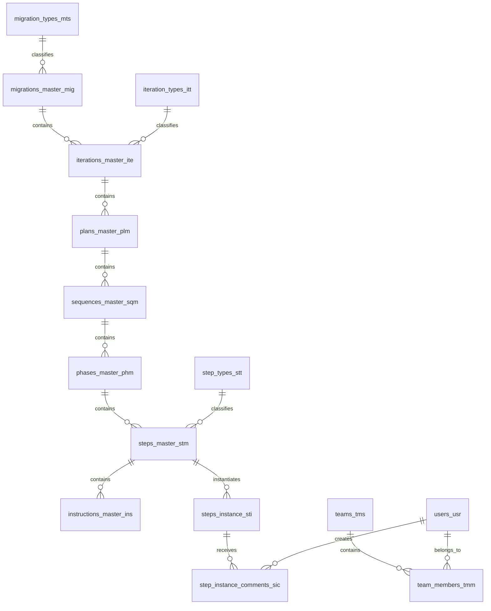
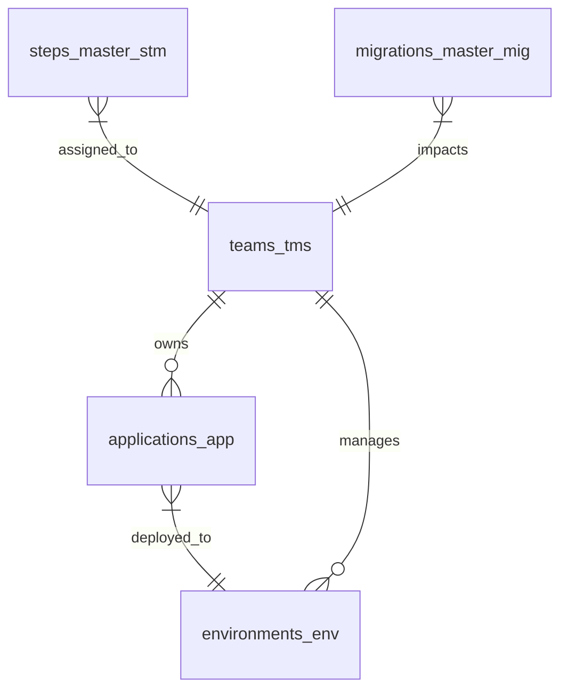

# UMIG Data Dictionary

**Version:** 1.0
**Date:** September 29, 2025
**Status:** Initial Release
**TOGAF Phase:** Phase C - Data Architecture Support
**Part of:** UMIG Enterprise Architecture

## Executive Summary

This document provides a comprehensive data dictionary for the Unified Migration Implementation Guide (UMIG) system, defining all data elements, entities, attributes, relationships, and data domains used throughout the enterprise architecture. This dictionary serves as the authoritative source for data definitions and supports consistency across all UMIG components.

## 1. Data Dictionary Overview

### 1.1 Purpose and Scope

**Purpose**: Establish standardized definitions for all data elements used in UMIG system architecture to ensure consistency, reduce ambiguity, and support effective communication across stakeholders.

**Scope**: Covers all data elements referenced in:

- Business entities and relationships
- Database schema definitions
- API interface specifications
- Component architecture patterns
- Security and audit frameworks

### 1.2 Data Dictionary Standards

| Standard              | Description                                    | Implementation                   |
| --------------------- | ---------------------------------------------- | -------------------------------- |
| **Naming Convention** | snake_case for database, camelCase for APIs    | Consistent across all layers     |
| **Data Types**        | PostgreSQL native types with explicit casting  | Type safety enforced (ADR-043)   |
| **Nullability**       | Explicit null handling with defensive patterns | Null safety enforced             |
| **Relationships**     | Foreign key constraints with cascade rules     | Referential integrity maintained |
| **Audit Pattern**     | Master/Instance separation with audit trails   | Comprehensive audit logging      |

## 2. Core Business Entities

### 2.1 Migration Management Domain

#### 2.1.1 migrations_master_mig

**Definition**: Strategic migration template definitions containing planning parameters and configuration.

| Attribute                    | Data Type    | Null     | Description                              | Business Rules                |
| ---------------------------- | ------------ | -------- | ---------------------------------------- | ----------------------------- |
| `mig_id`                     | UUID         | NOT NULL | Primary key, unique migration identifier | Generated UUID v4             |
| `mig_name`                   | VARCHAR(255) | NOT NULL | Human-readable migration name            | Unique within organization    |
| `mig_description`            | TEXT         | NULL     | Detailed migration purpose and scope     | Markdown supported            |
| `mig_status`                 | VARCHAR(50)  | NOT NULL | Current migration lifecycle status       | See Status Domain             |
| `mig_type_id`                | UUID         | NOT NULL | Foreign key to migration_types_mts       | Must exist in migration_types |
| `mig_start_date`             | TIMESTAMP    | NULL     | Planned migration start date             | Cannot be in past             |
| `mig_end_date`               | TIMESTAMP    | NULL     | Planned migration completion date        | Must be after start_date      |
| `mig_business_justification` | TEXT         | NULL     | Business case and ROI justification      | Required for approval         |
| `mig_technical_approach`     | TEXT         | NULL     | High-level technical strategy            | Required for planning         |
| `mig_risk_assessment`        | JSONB        | NULL     | Risk analysis and mitigation plans       | Structured risk data          |
| `mig_stakeholders`           | JSONB        | NULL     | Key stakeholders and responsibilities    | Contact information           |
| `created_by`                 | VARCHAR(100) | NOT NULL | User who created the migration           | Confluence username           |
| `created_date`               | TIMESTAMP    | NOT NULL | Creation timestamp                       | Server timestamp              |
| `modified_by`                | VARCHAR(100) | NOT NULL | User who last modified                   | Confluence username           |
| `modified_date`              | TIMESTAMP    | NOT NULL | Last modification timestamp              | Auto-updated                  |

**Relationships**:

- **Many-to-One**: migration_types_mts (mig_type_id → mts_id)
- **One-to-Many**: iterations_master_ite (mig_id ← ite_migration_id)
- **Many-to-Many**: migrations_master_mig_x_teams_tms_impacted

#### 2.1.2 iterations_master_ite

**Definition**: Iteration templates within migrations containing phases and execution parameters.

| Attribute                | Data Type    | Null     | Description                              | Business Rules                |
| ------------------------ | ------------ | -------- | ---------------------------------------- | ----------------------------- |
| `ite_id`                 | UUID         | NOT NULL | Primary key, unique iteration identifier | Generated UUID v4             |
| `ite_migration_id`       | UUID         | NOT NULL | Foreign key to migrations_master_mig     | Must exist in migrations      |
| `ite_name`               | VARCHAR(255) | NOT NULL | Iteration name within migration          | Unique within migration       |
| `ite_description`        | TEXT         | NULL     | Iteration purpose and objectives         | Business context              |
| `ite_sequence`           | INTEGER      | NOT NULL | Execution order within migration         | Unique within migration       |
| `ite_type_id`            | UUID         | NOT NULL | Foreign key to iteration_types_itt       | Must exist in iteration_types |
| `ite_status`             | VARCHAR(50)  | NOT NULL | Current iteration status                 | See Status Domain             |
| `ite_estimated_duration` | INTERVAL     | NULL     | Planned iteration duration               | In hours or days              |
| `ite_prerequisites`      | JSONB        | NULL     | Required conditions for execution        | Structured prerequisites      |
| `ite_success_criteria`   | JSONB        | NULL     | Completion validation criteria           | Measurable outcomes           |
| `ite_rollback_plan`      | TEXT         | NULL     | Rollback procedures if needed            | Detailed instructions         |
| `created_by`             | VARCHAR(100) | NOT NULL | User who created the iteration           | Confluence username           |
| `created_date`           | TIMESTAMP    | NOT NULL | Creation timestamp                       | Server timestamp              |
| `modified_by`            | VARCHAR(100) | NOT NULL | User who last modified                   | Confluence username           |
| `modified_date`          | TIMESTAMP    | NOT NULL | Last modification timestamp              | Auto-updated                  |

**Relationships**:

- **Many-to-One**: migrations_master_mig (ite_migration_id → mig_id)
- **Many-to-One**: iteration_types_itt (ite_type_id → itt_id)
- **One-to-Many**: plans_master_plm (ite_id ← plm_iteration_id)

### 2.2 Execution Domain

#### 2.2.1 steps_master_stm

**Definition**: Step templates defining individual work units with instructions and validation criteria.

| Attribute                 | Data Type    | Null     | Description                                  | Business Rules               |
| ------------------------- | ------------ | -------- | -------------------------------------------- | ---------------------------- |
| `stm_id`                  | UUID         | NOT NULL | Primary key, unique step template identifier | Generated UUID v4            |
| `stm_phase_id`            | UUID         | NOT NULL | Foreign key to phases_master_phm             | Must exist in phases         |
| `stm_name`                | VARCHAR(255) | NOT NULL | Step template name                           | Unique within phase          |
| `stm_description`         | TEXT         | NULL     | Step purpose and expected outcomes           | Business context             |
| `stm_sequence`            | INTEGER      | NOT NULL | Execution order within phase                 | Unique within phase          |
| `stm_type`                | VARCHAR(50)  | NOT NULL | Step type classification                     | See Step Types Domain        |
| `stm_estimated_duration`  | INTERVAL     | NULL     | Planned execution time                       | In minutes or hours          |
| `stm_complexity`          | VARCHAR(20)  | NULL     | Complexity level indicator                   | LOW, MEDIUM, HIGH            |
| `stm_automation_level`    | VARCHAR(20)  | NULL     | Automation classification                    | MANUAL, SEMI_AUTO, AUTOMATED |
| `stm_validation_criteria` | JSONB        | NULL     | Success validation requirements              | Structured criteria          |
| `stm_dependencies`        | JSONB        | NULL     | Step dependencies and prerequisites          | Dependency graph             |
| `stm_tools_required`      | JSONB        | NULL     | Required tools and access                    | Tool specifications          |
| `stm_skills_required`     | JSONB        | NULL     | Required skills and certifications           | Skill matrix                 |
| `created_by`              | VARCHAR(100) | NOT NULL | User who created the step                    | Confluence username          |
| `created_date`            | TIMESTAMP    | NOT NULL | Creation timestamp                           | Server timestamp             |
| `modified_by`             | VARCHAR(100) | NOT NULL | User who last modified                       | Confluence username          |
| `modified_date`           | TIMESTAMP    | NOT NULL | Last modification timestamp                  | Auto-updated                 |

**Relationships**:

- **Many-to-One**: phases_master_phm (stm_phase_id → phm_id)
- **One-to-Many**: instructions_master_ins (stm_id ← ins_step_id)
- **One-to-Many**: steps_instance_sti (stm_id ← sti_step_master_id)
- **Many-to-Many**: steps_master_stm_x_teams_tms_impacted

#### 2.2.2 steps_instance_sti

**Definition**: Execution instances of step templates with actual execution data and status tracking.

| Attribute                   | Data Type    | Null                   | Description                                  | Business Rules                    |
| --------------------------- | ------------ | ---------------------- | -------------------------------------------- | --------------------------------- |
| `sti_id`                    | UUID         | NOT NULL               | Primary key, unique step instance identifier | Generated UUID v4                 |
| `sti_step_master_id`        | UUID         | NOT NULL               | Foreign key to steps_master_stm              | Must exist in step templates      |
| `sti_iteration_instance_id` | UUID         | NOT NULL               | Foreign key to iteration execution           | Must exist in iteration instances |
| `sti_status`                | VARCHAR(50)  | NOT NULL               | Current execution status                     | See Status Domain                 |
| `sti_assigned_to`           | VARCHAR(100) | NULL                   | User assigned to execute step                | Confluence username               |
| `sti_started_by`            | VARCHAR(100) | NULL                   | User who started execution                   | Confluence username               |
| `sti_started_date`          | TIMESTAMP    | NULL                   | Actual execution start time                  | Set on status change              |
| `sti_completed_by`          | VARCHAR(100) | NULL                   | User who completed execution                 | Confluence username               |
| `sti_completed_date`        | TIMESTAMP    | NULL                   | Actual completion time                       | Set on completion                 |
| `sti_actual_duration`       | INTERVAL     | NULL                   | Actual execution time                        | Calculated from start/end         |
| `sti_execution_notes`       | TEXT         | NULL                   | Execution notes and observations             | Free text                         |
| `sti_issues_encountered`    | JSONB        | NULL                   | Problems and their resolutions               | Structured issue data             |
| `sti_validation_results`    | JSONB        | NULL                   | Validation check outcomes                    | Structured validation data        |
| `sti_rollback_performed`    | BOOLEAN      | NOT NULL DEFAULT FALSE | Whether rollback was executed                | Audit flag                        |
| `sti_rollback_notes`        | TEXT         | NULL                   | Rollback execution details                   | Required if rollback performed    |
| `created_by`                | VARCHAR(100) | NOT NULL               | User who created the instance                | Confluence username               |
| `created_date`              | TIMESTAMP    | NOT NULL               | Creation timestamp                           | Server timestamp                  |
| `modified_by`               | VARCHAR(100) | NOT NULL               | User who last modified                       | Confluence username               |
| `modified_date`             | TIMESTAMP    | NOT NULL               | Last modification timestamp                  | Auto-updated                      |

**Relationships**:

- **Many-to-One**: steps_master_stm (sti_step_master_id → stm_id)
- **One-to-Many**: step_instance_comments_sic (sti_id ← sic_step_instance_id)

## 3. Core Reference Data

### 3.1 Teams and Users Domain

#### 3.1.1 teams_tms

**Definition**: Organizational teams involved in migration activities with roles and responsibilities.

| Attribute                | Data Type    | Null                  | Description                          | Business Rules             |
| ------------------------ | ------------ | --------------------- | ------------------------------------ | -------------------------- |
| `tms_id`                 | UUID         | NOT NULL              | Primary key, unique team identifier  | Generated UUID v4          |
| `tms_name`               | VARCHAR(255) | NOT NULL              | Team name                            | Unique across organization |
| `tms_description`        | TEXT         | NULL                  | Team purpose and responsibilities    | Business context           |
| `tms_manager`            | VARCHAR(100) | NULL                  | Team manager/lead                    | Confluence username        |
| `tms_contact_email`      | VARCHAR(255) | NULL                  | Primary team contact email           | Valid email format         |
| `tms_business_unit`      | VARCHAR(100) | NULL                  | Business unit association            | Organizational hierarchy   |
| `tms_location`           | VARCHAR(100) | NULL                  | Primary team location                | Geographic location        |
| `tms_timezone`           | VARCHAR(50)  | NULL                  | Team working timezone                | IANA timezone identifier   |
| `tms_skills`             | JSONB        | NULL                  | Team capabilities and expertise      | Structured skills data     |
| `tms_capacity`           | INTEGER      | NULL                  | Team capacity in person-hours        | Resource planning          |
| `tms_availability`       | JSONB        | NULL                  | Availability windows and constraints | Schedule data              |
| `tms_escalation_contact` | VARCHAR(100) | NULL                  | Escalation contact person            | Confluence username        |
| `tms_active`             | BOOLEAN      | NOT NULL DEFAULT TRUE | Whether team is active               | Soft delete flag           |
| `created_by`             | VARCHAR(100) | NOT NULL              | User who created the team            | Confluence username        |
| `created_date`           | TIMESTAMP    | NOT NULL              | Creation timestamp                   | Server timestamp           |
| `modified_by`            | VARCHAR(100) | NOT NULL              | User who last modified               | Confluence username        |
| `modified_date`          | TIMESTAMP    | NOT NULL              | Last modification timestamp          | Auto-updated               |

**Relationships**:

- **One-to-Many**: team_members_tmm (tms_id ← tmm_team_id)
- **Many-to-Many**: steps_master_stm_x_teams_tms_impacted
- **Many-to-Many**: migrations_master_mig_x_teams_tms_impacted

#### 3.1.2 users_usr

**Definition**: Individual users with roles, permissions, and contact information.

| Attribute                 | Data Type    | Null                  | Description                         | Business Rules             |
| ------------------------- | ------------ | --------------------- | ----------------------------------- | -------------------------- |
| `usr_id`                  | UUID         | NOT NULL              | Primary key, unique user identifier | Generated UUID v4          |
| `usr_confluence_username` | VARCHAR(100) | NOT NULL              | Confluence/LDAP username            | Unique, primary identifier |
| `usr_display_name`        | VARCHAR(255) | NOT NULL              | User display name                   | For UI presentation        |
| `usr_email`               | VARCHAR(255) | NOT NULL              | Primary email address               | Valid email format         |
| `usr_role`                | VARCHAR(50)  | NOT NULL              | User role in system                 | See RBAC Domain            |
| `usr_job_title`           | VARCHAR(100) | NULL                  | User's job title                    | Organizational context     |
| `usr_department`          | VARCHAR(100) | NULL                  | Department association              | Organizational hierarchy   |
| `usr_manager`             | VARCHAR(100) | NULL                  | Manager's username                  | Confluence username        |
| `usr_phone`               | VARCHAR(50)  | NULL                  | Primary phone number                | Contact information        |
| `usr_mobile`              | VARCHAR(50)  | NULL                  | Mobile phone number                 | Emergency contact          |
| `usr_location`            | VARCHAR(100) | NULL                  | Primary work location               | Geographic location        |
| `usr_timezone`            | VARCHAR(50)  | NULL                  | User's working timezone             | IANA timezone identifier   |
| `usr_skills`              | JSONB        | NULL                  | User skills and certifications      | Structured skills data     |
| `usr_preferences`         | JSONB        | NULL                  | User interface preferences          | UI configuration           |
| `usr_active`              | BOOLEAN      | NOT NULL DEFAULT TRUE | Whether user is active              | Soft delete flag           |
| `usr_last_login`          | TIMESTAMP    | NULL                  | Last system access time             | Session tracking           |
| `created_by`              | VARCHAR(100) | NOT NULL              | User who created the record         | Confluence username        |
| `created_date`            | TIMESTAMP    | NOT NULL              | Creation timestamp                  | Server timestamp           |
| `modified_by`             | VARCHAR(100) | NOT NULL              | User who last modified              | Confluence username        |
| `modified_date`           | TIMESTAMP    | NOT NULL              | Last modification timestamp         | Auto-updated               |

**Relationships**:

- **One-to-Many**: team_members_tmm (usr_id ← tmm_user_id)
- **One-to-Many**: step_instance_comments_sic (usr_id ← sic_user_id)

### 3.2 Environment and Application Domain

#### 3.2.1 environments_env

**Definition**: Target environments for migration activities with configuration and access details.

| Attribute                 | Data Type    | Null                  | Description                                | Business Rules               |
| ------------------------- | ------------ | --------------------- | ------------------------------------------ | ---------------------------- |
| `env_id`                  | UUID         | NOT NULL              | Primary key, unique environment identifier | Generated UUID v4            |
| `env_name`                | VARCHAR(255) | NOT NULL              | Environment name                           | Unique across organization   |
| `env_description`         | TEXT         | NULL                  | Environment purpose and characteristics    | Business context             |
| `env_type`                | VARCHAR(50)  | NOT NULL              | Environment classification                 | See Environment Types Domain |
| `env_url`                 | VARCHAR(500) | NULL                  | Primary environment URL                    | Valid URL format             |
| `env_database_host`       | VARCHAR(255) | NULL                  | Database server hostname                   | Network accessible           |
| `env_database_name`       | VARCHAR(100) | NULL                  | Database name                              | Database identifier          |
| `env_database_port`       | INTEGER      | NULL                  | Database port number                       | Valid port range             |
| `env_monitoring_url`      | VARCHAR(500) | NULL                  | Monitoring dashboard URL                   | Valid URL format             |
| `env_deployment_method`   | VARCHAR(100) | NULL                  | Deployment approach                        | Deployment strategy          |
| `env_access_requirements` | JSONB        | NULL                  | Access and security requirements           | Structured access data       |
| `env_capacity_limits`     | JSONB        | NULL                  | Resource and performance limits            | Capacity planning            |
| `env_maintenance_windows` | JSONB        | NULL                  | Scheduled maintenance periods              | Schedule data                |
| `env_contact_team`        | UUID         | NULL                  | Responsible team                           | Foreign key to teams_tms     |
| `env_active`              | BOOLEAN      | NOT NULL DEFAULT TRUE | Whether environment is active              | Soft delete flag             |
| `created_by`              | VARCHAR(100) | NOT NULL              | User who created the environment           | Confluence username          |
| `created_date`            | TIMESTAMP    | NOT NULL              | Creation timestamp                         | Server timestamp             |
| `modified_by`             | VARCHAR(100) | NOT NULL              | User who last modified                     | Confluence username          |
| `modified_date`           | TIMESTAMP    | NOT NULL              | Last modification timestamp                | Auto-updated                 |

**Relationships**:

- **Many-to-One**: teams_tms (env_contact_team → tms_id)
- **Many-to-Many**: applications_app_x_environments_env

#### 3.2.2 applications_app

**Definition**: Software applications involved in migrations with configuration and dependency information.

| Attribute                     | Data Type    | Null                  | Description                                | Business Rules               |
| ----------------------------- | ------------ | --------------------- | ------------------------------------------ | ---------------------------- |
| `app_id`                      | UUID         | NOT NULL              | Primary key, unique application identifier | Generated UUID v4            |
| `app_name`                    | VARCHAR(255) | NOT NULL              | Application name                           | Unique across organization   |
| `app_description`             | TEXT         | NULL                  | Application purpose and functionality      | Business context             |
| `app_type`                    | VARCHAR(50)  | NOT NULL              | Application classification                 | See Application Types Domain |
| `app_version`                 | VARCHAR(50)  | NULL                  | Current application version                | Version string               |
| `app_vendor`                  | VARCHAR(100) | NULL                  | Application vendor or manufacturer         | Vendor information           |
| `app_owner_team`              | UUID         | NULL                  | Application owner team                     | Foreign key to teams_tms     |
| `app_business_criticality`    | VARCHAR(20)  | NOT NULL              | Business impact level                      | HIGH, MEDIUM, LOW            |
| `app_technical_stack`         | JSONB        | NULL                  | Technology stack details                   | Structured tech data         |
| `app_dependencies`            | JSONB        | NULL                  | Application dependencies                   | Dependency graph             |
| `app_data_classification`     | VARCHAR(50)  | NULL                  | Data sensitivity level                     | Security classification      |
| `app_compliance_requirements` | JSONB        | NULL                  | Regulatory compliance needs                | Compliance data              |
| `app_backup_requirements`     | JSONB        | NULL                  | Backup and recovery needs                  | Backup specifications        |
| `app_monitoring_requirements` | JSONB        | NULL                  | Monitoring and alerting needs              | Monitoring configuration     |
| `app_active`                  | BOOLEAN      | NOT NULL DEFAULT TRUE | Whether application is active              | Soft delete flag             |
| `created_by`                  | VARCHAR(100) | NOT NULL              | User who created the application           | Confluence username          |
| `created_date`                | TIMESTAMP    | NOT NULL              | Creation timestamp                         | Server timestamp             |
| `modified_by`                 | VARCHAR(100) | NOT NULL              | User who last modified                     | Confluence username          |
| `modified_date`               | TIMESTAMP    | NOT NULL              | Last modification timestamp                | Auto-updated                 |

**Relationships**:

- **Many-to-One**: teams_tms (app_owner_team → tms_id)
- **Many-to-Many**: applications_app_x_environments_env

## 4. Configuration and Type Data

### 4.1 Migration Types Domain

#### 4.1.1 migration_types_mts

**Definition**: Standardized migration type classifications with templates and configuration.

| Attribute                | Data Type    | Null                  | Description                                   | Business Rules         |
| ------------------------ | ------------ | --------------------- | --------------------------------------------- | ---------------------- |
| `mts_id`                 | UUID         | NOT NULL              | Primary key, unique migration type identifier | Generated UUID v4      |
| `mts_name`               | VARCHAR(255) | NOT NULL              | Migration type name                           | Unique across system   |
| `mts_description`        | TEXT         | NULL                  | Migration type characteristics                | Business context       |
| `mts_category`           | VARCHAR(100) | NOT NULL              | High-level classification                     | See Categories Domain  |
| `mts_complexity_level`   | VARCHAR(20)  | NOT NULL              | Typical complexity                            | LOW, MEDIUM, HIGH      |
| `mts_estimated_duration` | INTERVAL     | NULL                  | Typical duration range                        | Planning guidance      |
| `mts_required_skills`    | JSONB        | NULL                  | Required team skills                          | Structured skills data |
| `mts_risk_factors`       | JSONB        | NULL                  | Common risk considerations                    | Risk assessment data   |
| `mts_success_criteria`   | JSONB        | NULL                  | Standard success measures                     | Measurement criteria   |
| `mts_template_phases`    | JSONB        | NULL                  | Standard phase structure                      | Phase template         |
| `mts_checklist_items`    | JSONB        | NULL                  | Standard checklist items                      | Validation checklist   |
| `mts_active`             | BOOLEAN      | NOT NULL DEFAULT TRUE | Whether type is active                        | Soft delete flag       |
| `created_by`             | VARCHAR(100) | NOT NULL              | User who created the type                     | Confluence username    |
| `created_date`           | TIMESTAMP    | NOT NULL              | Creation timestamp                            | Server timestamp       |
| `modified_by`            | VARCHAR(100) | NOT NULL              | User who last modified                        | Confluence username    |
| `modified_date`          | TIMESTAMP    | NOT NULL              | Last modification timestamp                   | Auto-updated           |

**Relationships**:

- **One-to-Many**: migrations_master_mig (mts_id ← mig_type_id)

#### 4.1.2 iteration_types_itt

**Definition**: Standardized iteration type classifications with execution patterns.

| Attribute                   | Data Type    | Null                  | Description                                   | Business Rules         |
| --------------------------- | ------------ | --------------------- | --------------------------------------------- | ---------------------- |
| `itt_id`                    | UUID         | NOT NULL              | Primary key, unique iteration type identifier | Generated UUID v4      |
| `itt_name`                  | VARCHAR(255) | NOT NULL              | Iteration type name                           | Unique across system   |
| `itt_description`           | TEXT         | NULL                  | Iteration type characteristics                | Business context       |
| `itt_execution_pattern`     | VARCHAR(100) | NOT NULL              | Execution approach                            | See Patterns Domain    |
| `itt_typical_duration`      | INTERVAL     | NULL                  | Expected duration range                       | Planning guidance      |
| `itt_resource_requirements` | JSONB        | NULL                  | Typical resource needs                        | Resource planning      |
| `itt_coordination_level`    | VARCHAR(20)  | NOT NULL              | Coordination complexity                       | LOW, MEDIUM, HIGH      |
| `itt_rollback_complexity`   | VARCHAR(20)  | NOT NULL              | Rollback difficulty                           | LOW, MEDIUM, HIGH      |
| `itt_validation_criteria`   | JSONB        | NULL                  | Standard validation checks                    | Validation template    |
| `itt_communication_plan`    | JSONB        | NULL                  | Communication requirements                    | Communication template |
| `itt_active`                | BOOLEAN      | NOT NULL DEFAULT TRUE | Whether type is active                        | Soft delete flag       |
| `created_by`                | VARCHAR(100) | NOT NULL              | User who created the type                     | Confluence username    |
| `created_date`              | TIMESTAMP    | NOT NULL              | Creation timestamp                            | Server timestamp       |
| `modified_by`               | VARCHAR(100) | NOT NULL              | User who last modified                        | Confluence username    |
| `modified_date`             | TIMESTAMP    | NOT NULL              | Last modification timestamp                   | Auto-updated           |

**Relationships**:

- **One-to-Many**: iterations_master_ite (itt_id ← ite_type_id)

### 4.2 Step Types Domain

#### 4.2.1 step_types_stt

**Definition**: Standardized step type classifications with execution characteristics.

| Attribute                        | Data Type    | Null                  | Description                              | Business Rules                |
| -------------------------------- | ------------ | --------------------- | ---------------------------------------- | ----------------------------- |
| `stt_id`                         | UUID         | NOT NULL              | Primary key, unique step type identifier | Generated UUID v4             |
| `stt_name`                       | VARCHAR(255) | NOT NULL              | Step type name                           | Unique across system          |
| `stt_description`                | TEXT         | NULL                  | Step type characteristics                | Business context              |
| `stt_category`                   | VARCHAR(100) | NOT NULL              | High-level classification                | See Categories Domain         |
| `stt_automation_level`           | VARCHAR(20)  | NOT NULL              | Automation capability                    | MANUAL, SEMI_AUTO, AUTOMATED  |
| `stt_skill_requirements`         | JSONB        | NULL                  | Required executor skills                 | Structured skills data        |
| `stt_tool_requirements`          | JSONB        | NULL                  | Required tools and access                | Tool specifications           |
| `stt_validation_methods`         | JSONB        | NULL                  | Standard validation approaches           | Validation patterns           |
| `stt_risk_level`                 | VARCHAR(20)  | NOT NULL              | Inherent risk level                      | LOW, MEDIUM, HIGH             |
| `stt_rollback_capability`        | VARCHAR(20)  | NOT NULL              | Rollback feasibility                     | EASY, MEDIUM, DIFFICULT, NONE |
| `stt_documentation_requirements` | JSONB        | NULL                  | Required documentation                   | Documentation template        |
| `stt_active`                     | BOOLEAN      | NOT NULL DEFAULT TRUE | Whether type is active                   | Soft delete flag              |
| `created_by`                     | VARCHAR(100) | NOT NULL              | User who created the type                | Confluence username           |
| `created_date`                   | TIMESTAMP    | NOT NULL              | Creation timestamp                       | Server timestamp              |
| `modified_by`                    | VARCHAR(100) | NOT NULL              | User who last modified                   | Confluence username           |
| `modified_date`                  | TIMESTAMP    | NOT NULL              | Last modification timestamp              | Auto-updated                  |

## 5. Communication and Audit Domain

### 5.1 Comments and Communication

#### 5.1.1 step_instance_comments_sic

**Definition**: User comments and communication on step execution instances.

| Attribute               | Data Type    | Null                      | Description                            | Business Rules                 |
| ----------------------- | ------------ | ------------------------- | -------------------------------------- | ------------------------------ |
| `sic_id`                | UUID         | NOT NULL                  | Primary key, unique comment identifier | Generated UUID v4              |
| `sic_step_instance_id`  | UUID         | NOT NULL                  | Foreign key to steps_instance_sti      | Must exist in step instances   |
| `sic_user_id`           | UUID         | NOT NULL                  | Foreign key to users_usr               | Must exist in users            |
| `sic_comment_type`      | VARCHAR(50)  | NOT NULL                  | Comment classification                 | See Comment Types Domain       |
| `sic_comment_text`      | TEXT         | NOT NULL                  | Comment content                        | Not empty                      |
| `sic_visibility`        | VARCHAR(20)  | NOT NULL DEFAULT 'TEAM'   | Visibility scope                       | PRIVATE, TEAM, PUBLIC          |
| `sic_priority`          | VARCHAR(20)  | NULL                      | Comment priority/urgency               | LOW, MEDIUM, HIGH, URGENT      |
| `sic_tags`              | JSONB        | NULL                      | Comment tags and labels                | Structured tags                |
| `sic_attachments`       | JSONB        | NULL                      | File attachments metadata              | File references                |
| `sic_parent_comment_id` | UUID         | NULL                      | Foreign key for threaded comments      | Self-referencing               |
| `sic_status`            | VARCHAR(20)  | NOT NULL DEFAULT 'ACTIVE' | Comment status                         | ACTIVE, RESOLVED, ARCHIVED     |
| `sic_resolution_notes`  | TEXT         | NULL                      | Resolution details                     | Required if status is RESOLVED |
| `created_by`            | VARCHAR(100) | NOT NULL                  | User who created the comment           | Confluence username            |
| `created_date`          | TIMESTAMP    | NOT NULL                  | Creation timestamp                     | Server timestamp               |
| `modified_by`           | VARCHAR(100) | NULL                      | User who last modified                 | Confluence username            |
| `modified_date`         | TIMESTAMP    | NULL                      | Last modification timestamp            | Auto-updated if modified       |

**Relationships**:

- **Many-to-One**: steps_instance_sti (sic_step_instance_id → sti_id)
- **Many-to-One**: users_usr (sic_user_id → usr_id)
- **Many-to-One**: step_instance_comments_sic (sic_parent_comment_id → sic_id)

### 5.2 Audit and Logging

#### 5.2.1 audit_log_aud

**Definition**: Comprehensive audit trail for all system modifications and security events.

| Attribute                     | Data Type    | Null                        | Description                                 | Business Rules               |
| ----------------------------- | ------------ | --------------------------- | ------------------------------------------- | ---------------------------- |
| `aud_id`                      | UUID         | NOT NULL                    | Primary key, unique audit record identifier | Generated UUID v4            |
| `aud_timestamp`               | TIMESTAMP    | NOT NULL                    | When the action occurred                    | Server timestamp             |
| `aud_user`                    | VARCHAR(100) | NOT NULL                    | User who performed the action               | Confluence username          |
| `aud_action`                  | VARCHAR(100) | NOT NULL                    | Action performed                            | See Actions Domain           |
| `aud_table_name`              | VARCHAR(100) | NOT NULL                    | Database table affected                     | Table identifier             |
| `aud_record_id`               | UUID         | NULL                        | Primary key of affected record              | Record identifier            |
| `aud_operation`               | VARCHAR(20)  | NOT NULL                    | Database operation                          | INSERT, UPDATE, DELETE       |
| `aud_old_values`              | JSONB        | NULL                        | Before values for updates                   | Structured data              |
| `aud_new_values`              | JSONB        | NULL                        | After values for inserts/updates            | Structured data              |
| `aud_session_id`              | VARCHAR(255) | NULL                        | User session identifier                     | Session tracking             |
| `aud_ip_address`              | INET         | NULL                        | Client IP address                           | Security monitoring          |
| `aud_user_agent`              | TEXT         | NULL                        | Client user agent                           | Security monitoring          |
| `aud_business_context`        | JSONB        | NULL                        | Business context information                | Context data                 |
| `aud_security_classification` | VARCHAR(50)  | NOT NULL DEFAULT 'STANDARD' | Security event classification               | See Security Classifications |
| `aud_compliance_flags`        | JSONB        | NULL                        | Compliance-related metadata                 | Regulatory tracking          |

**Relationships**:

- **No explicit foreign keys** (audit table references any entity)

## 6. Status and Classification Domains

### 6.1 Status Values Domain

**Definition**: Standardized status values used across all lifecycle entities.

| Domain               | Values                                                                            | Description                |
| -------------------- | --------------------------------------------------------------------------------- | -------------------------- |
| **Migration Status** | DRAFT, PLANNING, APPROVED, IN_PROGRESS, PAUSED, COMPLETED, CANCELLED, FAILED      | Migration lifecycle states |
| **Iteration Status** | PENDING, READY, IN_PROGRESS, PAUSED, COMPLETED, CANCELLED, FAILED                 | Iteration execution states |
| **Step Status**      | NOT_STARTED, ASSIGNED, IN_PROGRESS, PAUSED, COMPLETED, FAILED, CANCELLED, SKIPPED | Step execution states      |
| **Comment Status**   | ACTIVE, RESOLVED, ARCHIVED                                                        | Comment lifecycle states   |

### 6.2 Type Classification Domains

**Definition**: Standardized classification values for categorization.

| Domain                   | Values                                                                      | Description                 |
| ------------------------ | --------------------------------------------------------------------------- | --------------------------- |
| **Environment Types**    | DEVELOPMENT, TEST, STAGING, PRODUCTION, SANDBOX, TRAINING                   | Environment classifications |
| **Application Types**    | WEB_APPLICATION, DATABASE, MIDDLEWARE, INFRASTRUCTURE, SECURITY, MONITORING | Application classifications |
| **Migration Categories** | INFRASTRUCTURE, APPLICATION, DATA, SECURITY, PROCESS                        | Migration type groupings    |
| **Step Categories**      | PREPARATION, EXECUTION, VALIDATION, ROLLBACK, CLEANUP, COMMUNICATION        | Step type groupings         |
| **Comment Types**        | GENERAL, QUESTION, ISSUE, SOLUTION, STATUS_UPDATE, ESCALATION               | Comment classifications     |

### 6.3 RBAC Domain

**Definition**: Role-based access control roles and permissions.

| Role            | Description                 | Permissions                                                     |
| --------------- | --------------------------- | --------------------------------------------------------------- |
| **NORMAL**      | Standard team member        | Read assigned steps, add comments, update step status           |
| **PILOT**       | Migration pilot/coordinator | All NORMAL permissions plus assign steps, view team data        |
| **ADMIN**       | System administrator        | All PILOT permissions plus manage users, teams, configurations  |
| **SUPER_ADMIN** | System super administrator  | All permissions including system configuration and audit access |

### 6.4 Security Classifications Domain

**Definition**: Security event and data classification levels.

| Classification   | Description                         | Access Level               |
| ---------------- | ----------------------------------- | -------------------------- |
| **PUBLIC**       | General information, no sensitivity | All users                  |
| **INTERNAL**     | Internal business information       | Team members               |
| **CONFIDENTIAL** | Sensitive business information      | Authorized users only      |
| **RESTRICTED**   | Highly sensitive, regulated data    | Administrative access only |

## 7. Data Relationships and Constraints

### 7.1 Primary Relationships



### 7.2 Cross-Cutting Relationships



### 7.3 Data Integrity Constraints

| Constraint Type           | Implementation                                      | Business Rule                       |
| ------------------------- | --------------------------------------------------- | ----------------------------------- |
| **Referential Integrity** | Foreign key constraints with CASCADE/RESTRICT rules | All references must exist           |
| **Uniqueness**            | Unique constraints on business keys                 | No duplicate business entities      |
| **Check Constraints**     | Domain value validation                             | Status values must be valid         |
| **Temporal Constraints**  | Date validation triggers                            | End dates must be after start dates |
| **Business Rules**        | Application-level validation                        | Complex business logic enforcement  |

## 8. Data Quality and Governance

### 8.1 Data Quality Standards

| Quality Dimension | Measurement                  | Target    |
| ----------------- | ---------------------------- | --------- |
| **Completeness**  | Required fields populated    | 95%       |
| **Accuracy**      | Data validation rules passed | 99%       |
| **Consistency**   | Cross-reference validation   | 99%       |
| **Timeliness**    | Data update frequency        | Real-time |
| **Uniqueness**    | Duplicate detection          | 100%      |

### 8.2 Data Governance Framework

| Governance Area      | Implementation                   | Responsibility       |
| -------------------- | -------------------------------- | -------------------- |
| **Data Ownership**   | Business entity ownership model  | Business teams       |
| **Data Stewardship** | Technical data management        | Development team     |
| **Data Security**    | Access controls and encryption   | Security team        |
| **Data Privacy**     | PII handling and GDPR compliance | Privacy officer      |
| **Data Retention**   | Lifecycle management policies    | Data governance team |

### 8.3 Master Data Management

| Master Data Entity | Source of Truth         | Synchronization  |
| ------------------ | ----------------------- | ---------------- |
| **Users**          | Confluence LDAP         | Real-time lookup |
| **Teams**          | HR systems              | Daily sync       |
| **Applications**   | CMDB                    | Weekly sync      |
| **Environments**   | Infrastructure registry | Real-time        |

## 9. Data Architecture Integration

### 9.1 Integration with TOGAF Phases

| TOGAF Phase                           | Data Dictionary Usage                                |
| ------------------------------------- | ---------------------------------------------------- |
| **Phase A - Architecture Vision**     | Business entity definitions support vision alignment |
| **Phase B - Business Architecture**   | Process and organizational data definitions          |
| **Phase C - Data Architecture**       | Complete data model and relationship definitions     |
| **Phase D - Technology Architecture** | Implementation data types and constraints            |

### 9.2 Alignment with ADRs

| ADR                                   | Data Dictionary Impact                                  |
| ------------------------------------- | ------------------------------------------------------- |
| **ADR-043: Type Safety**              | Explicit data type definitions and casting requirements |
| **ADR-047: Single Enrichment Point**  | Repository pattern data access definitions              |
| **ADR-049: Unified DTO Architecture** | Service layer data transformation patterns              |
| **ADR-059: SQL Schema-First**         | Database-driven data definitions as source of truth     |

## 10. Appendices

### Appendix A: Data Type Mappings

| PostgreSQL Type | Groovy Type | JavaScript Type | API JSON Type                |
| --------------- | ----------- | --------------- | ---------------------------- |
| `UUID`          | `UUID`      | `string`        | `string`                     |
| `VARCHAR(n)`    | `String`    | `string`        | `string`                     |
| `TEXT`          | `String`    | `string`        | `string`                     |
| `INTEGER`       | `Integer`   | `number`        | `number`                     |
| `BOOLEAN`       | `Boolean`   | `boolean`       | `boolean`                    |
| `TIMESTAMP`     | `Timestamp` | `Date`          | `string (ISO 8601)`          |
| `JSONB`         | `Map/List`  | `Object/Array`  | `object/array`               |
| `INTERVAL`      | `String`    | `string`        | `string (ISO 8601 duration)` |

### Appendix B: Sample Data Patterns

```sql
-- Sample Migration Template
INSERT INTO migrations_master_mig (
    mig_id, mig_name, mig_description, mig_status,
    mig_type_id, mig_start_date, mig_end_date,
    created_by, created_date, modified_by, modified_date
) VALUES (
    gen_random_uuid(),
    'Customer Portal Migration',
    'Migration of customer portal from legacy system to cloud platform',
    'PLANNING',
    '550e8400-e29b-41d4-a716-446655440000',
    '2025-10-01 09:00:00',
    '2025-10-15 17:00:00',
    'admin',
    NOW(),
    'admin',
    NOW()
);
```

### Appendix C: References

- **TOGAF 9.2**: Data Architecture Guidelines
- **PostgreSQL 14**: Database Documentation
- **UMIG ADRs**: Architecture Decision Records 001-070
- **Data Governance Standards**: Enterprise Data Management Framework

### Appendix D: Revision History

| Version | Date       | Author            | Description                                                                              |
| ------- | ---------- | ----------------- | ---------------------------------------------------------------------------------------- |
| 1.0     | 2025-09-29 | Architecture Team | Initial comprehensive data dictionary with all UMIG entities, relationships, and domains |

---

_This Data Dictionary serves as the authoritative source for all data definitions within the UMIG Enterprise Architecture and should be maintained as the single source of truth for data semantics and structure._
