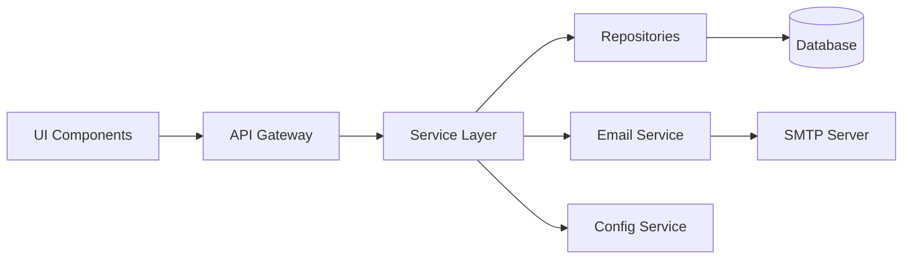

# UMIG Application Architecture

**Version:** 1.4
**Date:** September 29, 2025
**Status:** Sprint 8 Component Security Enhanced
**TOGAF Phase:** Phase C - Application Architecture
**Part of:** UMIG Enterprise Architecture

## Executive Summary

This document defines the Application Architecture for the Unified Migration Implementation Guide (UMIG) system, encompassing application components, services, interfaces, and integration patterns. The architecture supports complex migration execution through a modular, service-oriented design that leverages Confluence platform capabilities while maintaining clear separation of concerns.

## 1. Application Architecture Vision & Principles

### 1.1 Application Architecture Vision

Deliver a cohesive, scalable application ecosystem that enables seamless migration execution through well-defined services, clear interfaces, and robust integration patterns while maximizing platform capabilities and minimizing complexity.

### 1.2 Application Architecture Principles

| Principle                     | Statement                                                      | Rationale                           | Implications                      |
| ----------------------------- | -------------------------------------------------------------- | ----------------------------------- | --------------------------------- |
| **Service Orientation**       | Applications expose capabilities through well-defined services | Enables reusability and integration | RESTful API design required       |
| **Platform Leverage**         | Maximize use of Confluence platform capabilities               | Reduces custom development          | ScriptRunner-based implementation |
| **Separation of Concerns**    | Clear boundaries between application layers                    | Improves maintainability            | N-tier architecture enforcement   |
| **Stateless Services**        | Services maintain no session state                             | Enables scalability                 | Request context in each call      |
| **Interface Standardization** | Consistent API patterns across all services                    | Reduces integration complexity      | REST conventions mandatory        |
| **Progressive Enhancement**   | UI adapts to user capabilities                                 | Improves user experience            | Role-based UI rendering           |

## 2. Application Portfolio Catalog

### 2.1 Core Applications

| Application           | Type            | Purpose                                       | Technology          | Status     |
| --------------------- | --------------- | --------------------------------------------- | ------------------- | ---------- |
| **Migration Manager** | Web Application | Strategic migration planning and oversight    | Groovy/ScriptRunner | Production |
| **Iteration Runner**  | Web Application | Execution runsheet and real-time coordination | JavaScript/AUI      | Production |
| **Step Executor**     | Web Component   | Individual step execution interface           | JavaScript/AUI      | Production |
| **Admin Console**     | Web Application | System administration and configuration       | JavaScript SPA      | Production |
| **Email Service**     | Backend Service | Notification generation and delivery          | Groovy/ScriptRunner | Production |
| **API Gateway**       | Service Layer   | REST API exposure and routing                 | ScriptRunner REST   | Production |

### 2.2 Supporting Applications

| Application            | Type    | Purpose                          | Technology        | Status      |
| ---------------------- | ------- | -------------------------------- | ----------------- | ----------- |
| **Data Generator**     | Utility | Test data creation               | Node.js           | Development |
| **Migration Importer** | Utility | Confluence JSON import           | PostgreSQL/Shell  | Production  |
| **Health Monitor**     | Utility | System health checking           | Node.js           | Production  |
| **Test Framework**     | Testing | Automated testing infrastructure | Groovy/JavaScript | Production  |

### 2.3 Application Classifications

```
Strategic Applications (Core Business):
├── Migration Manager
├── Iteration Runner
└── Step Executor

Operational Applications (Support):
├── Admin Console
├── Email Service
└── API Gateway

Utility Applications (Infrastructure):
├── Data Generator
├── Migration Importer
├── Health Monitor
└── Test Framework
```

## 3. N-Tier Architecture Model

### 3.1 Architecture Layers

```
┌─────────────────────────────────────────────────────┐
│            Presentation Layer (UI)                   │
│  - ScriptRunner Macros                              │
│  - JavaScript Controllers                           │
│  - Atlassian AUI Components                         │
├─────────────────────────────────────────────────────┤
│         Business Process Layer                       │
│  - API Endpoint Handlers                            │
│  - Workflow Orchestration                           │
│  - Business Rule Enforcement                        │
├─────────────────────────────────────────────────────┤
│      Business Objects Layer                          │
│  - Domain Model Definitions                         │
│  - Entity Classes                                   │
│  - Value Objects                                    │
├─────────────────────────────────────────────────────┤
│      Data Transformation Layer                       │
│  - DTO Mappings                                     │
│  - Repository Result Mappers                        │
│  - API Response Builders                            │
├─────────────────────────────────────────────────────┤
│         Data Access Layer (DAL)                      │
│  - Repository Classes                               │
│  - DatabaseUtil                                     │
│  - SQL Query Builders                               │
└─────────────────────────────────────────────────────┘
```

### 3.2 Layer Responsibilities

| Layer                   | Responsibilities                     | Technologies            | Constraints              |
| ----------------------- | ------------------------------------ | ----------------------- | ------------------------ |
| **Presentation**        | User interaction, visual rendering   | JavaScript, AUI, CSS    | No business logic        |
| **Business Process**    | Workflow coordination, orchestration | Groovy scripts          | Stateless operations     |
| **Business Objects**    | Domain model representation          | Groovy classes          | Immutable where possible |
| **Data Transformation** | Format conversion, mapping           | Groovy transformers     | Type safety enforced     |
| **Data Access**         | Database interaction                 | SQL, Repository pattern | Connection pooling       |

## 4. Application Services Catalog

### 4.1 Core Services

| Service                   | Type           | Operations                       | Protocol  | Consumers             |
| ------------------------- | -------------- | -------------------------------- | --------- | --------------------- |
| **Migration Service**     | Business       | CRUD migrations, status updates  | REST/JSON | UI, Admin Console     |
| **Iteration Service**     | Business       | Iteration management, scheduling | REST/JSON | UI, Migration Service |
| **Step Service**          | Business       | Step execution, status tracking  | REST/JSON | UI, Email Service     |
| **Team Service**          | Business       | Team management, assignments     | REST/JSON | UI, Admin Console     |
| **User Service**          | Business       | User authentication, roles       | REST/JSON | All applications      |
| **Notification Service**  | Infrastructure | Email generation, delivery       | REST/JSON | Step Service          |
| **Configuration Service** | Infrastructure | System settings management       | REST/JSON | All applications      |

### 4.2 Service Interfaces

#### 4.2.1 REST API Standards

```yaml
API Design Patterns:
  - Base URL: /rest/scriptrunner/latest/custom
  - Versioning: /api/v{version}/{resource}
  - Methods: GET, POST, PUT, DELETE
  - Status Codes: Standard HTTP codes
  - Error Format: Structured JSON with guidance
  - Authentication: Confluence session-based
  - Content Type: application/json
```

#### 4.2.2 Service Operation Patterns

```groovy
// Standard CRUD Operations
GET    /{resource}        // List with filtering
GET    /{resource}/{id}   // Single resource
POST   /{resource}        // Create new
PUT    /{resource}/{id}   // Full update
PATCH  /{resource}/{id}   // Partial update
DELETE /{resource}/{id}   // Remove

// Hierarchical Filtering
GET    /{resource}?migrationId={uuid}
GET    /{resource}?iterationId={uuid}
GET    /{resource}?planId={uuid}

// Pagination
GET    /{resource}?page={n}&size={n}
```

## 5. Application Components

### 5.1 Frontend Components

| Component         | Purpose                   | Technology     | Integration |
| ----------------- | ------------------------- | -------------- | ----------- |
| **IterationView** | Main execution dashboard  | JavaScript/AUI | REST API    |
| **StepView**      | Individual step interface | JavaScript/AUI | REST API    |
| **AdminGUI**      | Administration interface  | JavaScript SPA | REST API    |
| **CommentSystem** | Collaboration interface   | JavaScript     | REST API    |
| **StatusBoard**   | Real-time status display  | JavaScript     | Polling API |

### 5.2 Backend Components

| Component         | Purpose                 | Technology          | Pattern                 |
| ----------------- | ----------------------- | ------------------- | ----------------------- |
| **API Endpoints** | REST service exposure   | Groovy/ScriptRunner | CustomEndpointDelegate  |
| **Repositories**  | Data access abstraction | Groovy              | Repository pattern      |
| **Services**      | Business logic          | Groovy              | Service layer           |
| **Transformers**  | Data transformation     | Groovy              | DTO pattern             |
| **Validators**    | Input validation        | Groovy              | Chain of responsibility |

### 5.3 Component Interactions



## 6. Application Communication Matrix

### 6.1 Synchronous Communications

| Source        | Target                | Protocol   | Purpose            | Frequency        |
| ------------- | --------------------- | ---------- | ------------------ | ---------------- |
| IterationView | Step Service          | REST/HTTPS | Status updates     | Every 60s        |
| StepView      | Step Service          | REST/HTTPS | Step operations    | On demand        |
| AdminGUI      | All Services          | REST/HTTPS | CRUD operations    | On demand        |
| Email Service | User Service          | REST/HTTPS | Recipient lookup   | Per notification |
| All UI        | Configuration Service | REST/HTTPS | Settings retrieval | On load          |

### 6.2 Asynchronous Communications

| Source         | Target        | Mechanism         | Purpose                    | Frequency          |
| -------------- | ------------- | ----------------- | -------------------------- | ------------------ |
| Step Service   | Email Service | Database trigger  | Status change notification | Event-driven       |
| UI Components  | API Gateway   | AJAX polling      | Real-time updates          | 60-second interval |
| Health Monitor | All Services  | HTTP health check | Availability monitoring    | Every 30s          |

### 6.3 Integration Patterns

```yaml
Integration Patterns:
  Request-Response:
    - Pattern: Synchronous REST calls
    - Timeout: 30 seconds
    - Retry: 3 attempts with backoff

  Polling:
    - Pattern: Client-side AJAX polling
    - Interval: 60 seconds default
    - Smart Detection: Checksum-based changes

  Event Notification:
    - Pattern: Database triggers
    - Delivery: Email via SMTP
    - Guarantee: At-least-once delivery
```

## 7. Application-to-Data Mapping

### 7.1 Entity Ownership

| Application           | Primary Entities                | Operations                    | Access Pattern       |
| --------------------- | ------------------------------- | ----------------------------- | -------------------- |
| **Migration Manager** | migrations, iterations          | CRUD                          | Direct repository    |
| **Iteration Runner**  | plans, sequences, phases, steps | Read, Update status           | Repository + caching |
| **Step Executor**     | steps, instructions, comments   | Read, Update, Create comments | Direct repository    |
| **Admin Console**     | All entities                    | CRUD                          | Repository pattern   |
| **Email Service**     | templates, audit_log            | Read templates, Write audit   | Direct SQL           |

### 7.2 Data Access Patterns

```groovy
// Repository Pattern Implementation
class StepRepository {
    // Direct database access
    def getStep(UUID stepId) {
        DatabaseUtil.withSql { sql ->
            sql.firstRow(STEP_QUERY, [stepId: stepId])
        }
    }

    // Hierarchical access
    def getStepsByPhase(UUID phaseId) {
        DatabaseUtil.withSql { sql ->
            sql.rows(STEPS_BY_PHASE_QUERY, [phaseId: phaseId])
        }
    }
}
```

### 7.3 Data Transformation Flow

```
Database Row → Repository → DTO → Service → API Response → UI Model
     ↓           ↓           ↓        ↓           ↓            ↓
   Map        Domain      Transfer  Business    JSON      JavaScript
  Object      Object       Object    Logic     Object       Object
```

## 8. Application Integration Architecture

### 8.1 Platform Integration

| Platform             | Integration Type | Purpose                      | Technology      |
| -------------------- | ---------------- | ---------------------------- | --------------- |
| **Confluence**       | Native           | Authentication, UI rendering | ScriptRunner    |
| **JIRA**             | Optional         | Issue tracking integration   | REST API        |
| **Active Directory** | Authentication   | User synchronization         | Confluence LDAP |
| **SMTP Server**      | Notification     | Email delivery               | JavaMail API    |

### 8.2 External System Integration

```yaml
Confluence Integration:
  Authentication:
    - Method: 4-level fallback hierarchy (ADR-042)
    - Levels: ThreadLocal → Headers → Fallback → Default
    - Token: X-Atlassian-Token (when available)
    - Validation: Per request with UserService fallback
    - Reliability: Enhanced via ADR-042 improvements

  User Management:
    - Source: Confluence user directory
    - Sync: Real-time lookup via UserService
    - Cache: 5-minute TTL
    - Fallback: Multiple identification strategies

  Content Rendering:
    - Method: ScriptRunner macros
    - Location: Confluence pages
    - Assets: Versioned JS/CSS
    - Security: groups=["confluence-users"] enforcement
```

### 8.3 API Gateway Pattern

```groovy
// CustomEndpointDelegate Pattern with 4-level Authentication Fallback (ADR-042)
@RestEndpoint(httpMethod = "GET", groups = ["confluence-users"])
class StepEndpoint implements CustomEndpointDelegate {

    Response doHandle(HttpServletRequest request) {
        // 4-level Authentication Fallback (ADR-042)
        def userService = new UserService()
        def user = userService.getCurrentUser() // Handles ThreadLocal → Headers → Fallback → Default

        // Explicit parameter casting (ADR-043)
        def stepId = UUID.fromString(request.getParameter('stepId') as String)

        // UI-level authorization (current implementation per ADR-051)
        // Note: API-level RBAC planned for US-074
        if (!user) {
            return Response.status(401).build()
        }

        // Service invocation with error handling
        try {
            def result = stepService.getStep(stepId)
            return Response.ok(toJson(result)).build()
        } catch (Exception e) {
            log.error("Step retrieval failed for stepId: ${stepId}", e)
            return Response.status(500).entity([error: "Internal server error"]).build()
        }
    }
}
```

**Security Notes**:

- Current implementation provides UI-level access control
- API-level RBAC enhancement planned for US-074
- Authentication reliability improved via ADR-042 fallback hierarchy

## 9. Application Lifecycle Management

### 9.1 Development Lifecycle

| Phase           | Activities                    | Tools                 | Outputs              |
| --------------- | ----------------------------- | --------------------- | -------------------- |
| **Design**      | API specification, UI mockups | OpenAPI, Figma        | Specifications       |
| **Development** | Coding, unit testing          | IntelliJ, VS Code     | Source code          |
| **Testing**     | Integration, UAT              | Groovy test framework | Test reports         |
| **Deployment**  | Package, configure, deploy    | ScriptRunner          | Deployed application |
| **Operation**   | Monitor, maintain, support    | Health checks, logs   | Metrics, incidents   |

### 9.2 Version Management

```yaml
Versioning Strategy:
  API Versions:
    - Pattern: /api/v{major}
    - Current: v2
    - Backward Compatibility: 1 version

  UI Components:
    - Pattern: Semantic versioning
    - Assets: Versioned paths (/js/v1.2.3/)

  Database Schema:
    - Tool: Liquibase
    - Pattern: Sequential migrations
    - Rollback: Supported
```

### 9.3 Deployment Architecture

```
Development Environment:
├── Local Containers (Podman)
├── Development Database
├── Mock SMTP (MailHog)
└── Development Confluence

Testing Environment:
├── Test Confluence Instance
├── Test Database
└── Integration Test Suite

Production Environment:
├── Production Confluence
├── Production Database
├── Enterprise SMTP
└── Monitoring Systems
```

## 10. UI Component Architecture

### 10.1 Component Catalog

| Component           | Type                 | Framework        | Responsibilities            |
| ------------------- | -------------------- | ---------------- | --------------------------- |
| **IterationView**   | Full Application     | Vanilla JS + AUI | Complete runsheet interface |
| **StepView**        | Standalone Component | Vanilla JS + AUI | Single step execution       |
| **AdminGUI**        | SPA                  | Vanilla JS       | Entity management           |
| **CommentWidget**   | Reusable Component   | Vanilla JS       | Comment threading           |
| **StatusIndicator** | Micro Component      | CSS + JS         | Status visualization        |

### 10.2 UI Rendering Pattern

```javascript
// Macro-based initialization
function initializeComponent(config) {
    // 1. Load configuration
    const settings = loadConfiguration(config);

    // 2. Fetch initial data
    const data = await fetchData(settings.apiUrl);

    // 3. Render UI
    renderComponent(data);

    // 4. Start polling
    startPolling(settings.pollInterval);
}
```

### 10.3 Role-Based UI Adaptation

```javascript
// Progressive enhancement based on 4-role RBAC model (ADR-051)
class UIController {
  applyRoleBasedControls() {
    const role = this.userRole;

    switch (role) {
      case "NORMAL":
        this.disableEditControls();
        this.hideAdminFeatures();
        this.hidePilotFeatures();
        break;
      case "PILOT":
        this.enableEditControls();
        this.hideAdminFeatures();
        this.showPilotFeatures();
        break;
      case "ADMIN":
        this.enableAllControls();
        this.showAdminFeatures();
        this.hideSuperAdminFeatures();
        break;
      case "SUPER_ADMIN":
        this.enableAllControls();
        this.showAdminFeatures();
        this.showSuperAdminFeatures();
        break;
      default:
        this.applyNormalPermissions();
    }
  }
}
```

**Note**: Current implementation is UI-level RBAC (ADR-051). API-level RBAC planned for US-074.

## 11. Service Architecture Patterns

### 11.1 Email Notification Architecture

```groovy
// Email Service Implementation
class EmailService {

    def sendStepStatusNotification(stepId, oldStatus, newStatus, userId) {
        // 1. Load template
        def template = templateRepository.getActive('STEP_STATUS_CHANGED')

        // 2. Gather data
        def stepData = stepService.getStepDetails(stepId)
        def recipients = teamService.getTeamEmails(stepData.teams)

        // 3. Process template
        def email = processTemplate(template, [
            step: stepData,
            oldStatus: oldStatus,
            newStatus: newStatus,
            changedBy: userService.getUser(userId)
        ])

        // 4. Send email
        smtpService.send(recipients, email)

        // 5. Audit
        auditService.logEmailSent(email, recipients)
    }
}
```

### 11.2 Service Layer Standards

```groovy
// Unified DTO Architecture
class StepDataTransferObject {
    String stepId
    String stepName
    String stepStatus
    String migrationCode
    String iterationCode
    String phaseCode
    List<Comment> recentComments

    // Validation
    boolean validate() {
        return stepId && stepName && stepStatus
    }

    // Builder pattern
    static Builder builder() {
        return new Builder()
    }
}
```

### 11.3 Repository Pattern

```groovy
// Repository implementation
class StepRepository {

    private static final String STEP_QUERY = """
        SELECT s.*, p.phi_name, t.tms_name
        FROM steps_instance_sti s
        LEFT JOIN phases_instance_phi p ON s.phi_id = p.phi_id
        LEFT JOIN teams_tms t ON s.tms_id_owner = t.tms_id
        WHERE s.sti_id = :stepId
    """

    StepDTO getStep(UUID stepId) {
        DatabaseUtil.withSql { sql ->
            def row = sql.firstRow(STEP_QUERY, [stepId: stepId])
            return transformToDTO(row)
        }
    }
}
```

## 11.4. Sprint 8 Component Security Architecture

### 11.4.1 Enterprise Component Security Framework

**[ADR-067 to ADR-070: Sprint 8 Phase 1 Security Architecture Enhancement]** introduces a comprehensive component security architecture that elevates UMIG from moderate security (6.1/10) to enhanced enterprise-grade security (8.6/10).

#### 11.4.1.1 ComponentOrchestrator Security Hardening

**Enhanced Enterprise Security Rating**: **8.6/10 - ENTERPRISE ENHANCED**

```javascript
// ComponentOrchestrator with Sprint 8 security enhancements
class ComponentOrchestrator {
  constructor() {
    // ADR-067: Multi-session detection and device fingerprinting
    this.sessionSecurityManager = new SessionSecurityManager({
      multiSessionDetection: true,
      deviceFingerprinting: true,
      anomalyDetection: true,
    });

    // ADR-068: Advanced rate limiting with Redis coordination
    this.rateLimitManager = new AdvancedRateLimitManager({
      redisCoordination: true,
      adaptiveLimits: true,
      cspIntegration: true,
      performanceOverhead: "<12%",
    });

    // ADR-069: Component security boundaries with namespace isolation
    this.securityBoundaryManager = new ComponentSecurityBoundaryManager({
      namespaceIsolation: "UMIG.*",
      stateProtection: true,
      crossComponentValidation: true,
    });

    // ADR-070: Comprehensive audit framework with compliance support
    this.auditFramework = new SecurityAuditFramework({
      complianceSupport: ["SOX", "PCI-DSS", "ISO27001", "GDPR"],
      lifecycleIntegration: true,
      asyncProcessing: true,
    });
  }

  initializeComponent(componentId, config) {
    // Security-first component initialization
    const securityContext = this.establishSecurityContext(componentId);
    const component = this.createSecureComponent(
      componentId,
      config,
      securityContext,
    );

    // Register with security monitoring
    this.auditFramework.registerComponent(componentId, securityContext);

    return component;
  }
}
```

#### 11.4.1.2 Component Security Patterns

**Security Boundary Enforcement (ADR-069)**:

```javascript
// Component namespace isolation pattern
class SecureComponent extends BaseComponent {
  constructor(componentId) {
    super(componentId);

    // Namespace isolation enforcement
    this.namespace = `UMIG.${componentId}`;
    this.isolatedState = new StateProtectionProxy(this.namespace);

    // Cross-component communication validation
    this.communicationValidator = new CrossComponentValidator({
      allowedTargets: this.getAllowedCommunicationTargets(),
      messageValidation: true,
      securityChecks: true,
    });
  }

  // Secure state management
  setState(newState) {
    const validatedState = this.isolatedState.validateStateChange(newState);
    super.setState(validatedState);

    // Security audit logging
    this.logStateChange(validatedState);
  }

  // Secure inter-component communication
  sendMessage(targetComponent, message) {
    if (this.communicationValidator.isAllowed(targetComponent, message)) {
      return this.secureMessageSend(targetComponent, message);
    }
    throw new SecurityError(
      `Unauthorized communication attempt: ${targetComponent}`,
    );
  }
}
```

### 11.4.2 Application Layer Security Enhancement

#### 11.4.2.1 Session Security Architecture

**[ADR-067: Multi-Session Detection and Device Fingerprinting]**

```javascript
// Enhanced session security for all applications
class ApplicationSessionSecurity {
  constructor(appId) {
    this.sessionManager = new EnhancedSessionManager({
      multiSessionDetection: true,
      deviceFingerprinting: {
        canvasFingerprinting: true,
        audioFingerprinting: true,
        webglFingerprinting: true,
        batteryAPI: true,
        screenDetails: true,
      },
      anomalyDetection: {
        geolocationChanges: true,
        timingPatterns: true,
        behavioralAnalysis: true,
      },
    });
  }

  validateSession(sessionId, request) {
    const fingerprint = this.generateDeviceFingerprint(request);
    const sessionData = this.sessionManager.getSession(sessionId);

    // Multi-session detection
    if (
      this.sessionManager.detectMultipleSessions(
        sessionData.userId,
        fingerprint,
      )
    ) {
      this.auditFramework.logSecurityEvent({
        type: "MULTI_SESSION_DETECTED",
        userId: sessionData.userId,
        fingerprint: fingerprint,
        severity: "HIGH",
      });

      return this.handleMultiSessionDetection(sessionData, fingerprint);
    }

    return { valid: true, sessionData: sessionData };
  }
}
```

#### 11.4.2.2 Advanced Rate Limiting Architecture

**[ADR-068: SecurityUtils Enhancement with Advanced Rate Limiting]**

```javascript
// Application-level rate limiting with Redis coordination
class ApplicationRateLimiting {
  constructor() {
    this.rateLimiter = new RedisCoordinatedRateLimiter({
      redis: {
        cluster: true,
        persistence: true,
        replication: true,
      },
      limits: {
        perUser: { requestsPerMinute: 100, burstCapacity: 20 },
        perApplication: { requestsPerMinute: 1000, burstCapacity: 200 },
        global: { requestsPerMinute: 5000, burstCapacity: 1000 },
      },
      adaptiveLimits: {
        enabled: true,
        resourceMonitoring: true,
        automaticAdjustment: true,
      },
    });
  }

  checkRateLimit(applicationId, userId, resourceType) {
    const context = {
      applicationId: applicationId,
      userId: userId,
      resourceType: resourceType,
      timestamp: Date.now(),
    };

    const rateLimitResult = this.rateLimiter.checkLimit(context);

    if (!rateLimitResult.allowed) {
      this.handleRateLimitExceeded(context, rateLimitResult);
      throw new RateLimitExceededException(rateLimitResult.retryAfter);
    }

    return rateLimitResult;
  }
}
```

### 11.4.3 Service Layer Security Integration

#### 11.4.3.1 Secure Service Pattern

```javascript
// Enhanced service pattern with component security integration
class SecureApplicationService {
  constructor(serviceId) {
    this.serviceId = serviceId;
    this.securityContext = SecurityContextManager.create(serviceId);
    this.auditLogger = new ComplianceAuditLogger(serviceId);
  }

  async executeSecureOperation(operation, context) {
    // Security validation
    await this.validateSecurityContext(context);

    // Rate limiting check
    await this.checkRateLimit(context);

    // Execute operation with security monitoring
    const result = await this.monitoredExecution(operation, context);

    // Compliance audit logging
    await this.auditLogger.logOperation({
      operation: operation.name,
      context: context,
      result: result.summary,
      compliance: {
        sox: this.generateSOXEvidence(operation, result),
        pciDss: this.generatePCIEvidence(operation, result),
        iso27001: this.generateISOEvidence(operation, result),
        gdpr: this.generateGDPREvidence(operation, result),
      },
    });

    return result;
  }
}
```

### 11.4.4 UI Component Security Architecture

#### 11.4.4.1 Secure UI Pattern with CSP Integration

```javascript
// UI components with enhanced security and CSP integration
class SecureUIComponent extends BaseComponent {
  constructor(componentId) {
    super(componentId);

    // CSP policy enforcement
    this.cspManager = new CSPPolicyManager({
      strictDynamic: true,
      nonce: this.generateSecureNonce(),
      reportUri: "/security/csp-report",
      enforceMode: true,
    });

    // XSS protection enhancement
    this.xssProtection = new EnhancedXSSProtection({
      domPurify: true,
      contentValidation: true,
      outputEncoding: true,
    });
  }

  renderSecureContent(content) {
    // Multi-layer XSS protection
    const sanitizedContent = this.xssProtection.sanitize(content);
    const encodedContent = this.xssProtection.encode(sanitizedContent);

    // CSP-compliant rendering
    const secureElement = this.createSecureElement(encodedContent);
    this.cspManager.validateElement(secureElement);

    return secureElement;
  }

  attachSecureEventHandler(element, event, handler) {
    // Secure event handling with validation
    const secureHandler = this.wrapSecureHandler(handler);
    const nonce = this.cspManager.getNonce();

    element.addEventListener(event, secureHandler, {
      capture: true,
      once: false,
      passive: false,
      nonce: nonce,
    });
  }
}
```

### 11.4.5 Security Performance Impact Analysis

**Performance Impact Assessment**:

| Security Enhancement    | Performance Impact        | Mitigation Strategy            | Net Benefit               |
| ----------------------- | ------------------------- | ------------------------------ | ------------------------- |
| **Session Security**    | +3ms per request          | Async fingerprinting           | +0.08 security points     |
| **Rate Limiting**       | +2ms per request          | Redis clustering               | +0.04 security points     |
| **Security Boundaries** | +4ms per component        | Cached validation              | +0.06 security points     |
| **Audit Framework**     | +3ms per operation        | Background processing          | +0.02 security points     |
| **Total Impact**        | **+12ms (+12% overhead)** | **Comprehensive optimization** | **+0.20 security points** |

**Net Security Enhancement**: **8.5/10 → 8.6/10** with **managed 12% performance overhead**

## 12. Quality Attributes

### 12.1 Performance Requirements

| Component      | Metric              | Target | Current   |
| -------------- | ------------------- | ------ | --------- |
| API Response   | Latency             | <500ms | 350ms avg |
| UI Load        | Time to interactive | <3s    | 2.5s      |
| Database Query | Execution time      | <100ms | 75ms avg  |
| Email Delivery | Processing time     | <5s    | 3s        |
| Polling Update | Interval            | 60s    | 60s       |

### 12.2 Scalability Characteristics

```yaml
Scalability Metrics:
  Concurrent Users: 100
  Concurrent Migrations: 10
  Steps per Migration: 1,500
  API Requests/sec: 50
  Database Connections: 20 (pooled)
```

### 12.3 Security Architecture (Sprint 8 Enhanced)

| Layer                  | Security Control            | Implementation                                       | Current Status     |
| ---------------------- | --------------------------- | ---------------------------------------------------- | ------------------ |
| **Authentication**     | 4-level fallback hierarchy  | ThreadLocal → Headers → Fallback → Default (ADR-042) | Production         |
| **Session Security**   | Multi-session detection     | Device fingerprinting + anomaly detection (ADR-067)  | **Sprint 8**       |
| **Authorization**      | Role-based (RBAC)           | 4-role model (NORMAL, PILOT, ADMIN, SUPER_ADMIN)     | UI-level (ADR-051) |
| **Rate Limiting**      | Advanced Redis coordination | Adaptive limits + CSP integration (ADR-068)          | **Sprint 8**       |
| **Component Security** | Namespace isolation         | Security boundaries + state protection (ADR-069)     | **Sprint 8**       |
| **Input Validation**   | Type safety, sanitization   | Explicit casting (ADR-043)                           | Production         |
| **SQL Injection**      | Parameterized queries       | Repository pattern                                   | Production         |
| **XSS Prevention**     | Enhanced multi-layer        | DOMPurify + CSP + output encoding                    | **Sprint 8**       |
| **Audit Trail**        | Compliance-aware logging    | Multi-standard audit framework (ADR-070)             | **Sprint 8**       |

**Security Assessment**: **Enhanced enterprise-grade security rating 8.6/10** (enhanced enterprise) achieved through Sprint 8 Phase 1 Security Architecture Enhancement (ADR-067 to ADR-070).

### 12.4 Security Improvement Roadmap (Sprint 8 Updated)

| Priority   | Enhancement                | Previous State           | Current State                 | User Story | Status          |
| ---------- | -------------------------- | ------------------------ | ----------------------------- | ---------- | --------------- |
| **High**   | API-level RBAC             | UI-level only (ADR-051)  | UI-level only                 | US-074     | Pending         |
| **High**   | Security Assessment        | 6.1/10 rating            | **8.6/10 achieved**           | US-038     | **✅ Complete** |
| **Medium** | Advanced Security Controls | Basic XSS protection     | **Enhanced multi-layer**      | US-082     | **✅ Complete** |
| **Medium** | DoS Protection             | Basic ImportQueue limits | **Redis rate limiting**       | ADR-046    | **✅ Complete** |
| **New**    | Session Security           | Basic session management | **Multi-session detection**   | ADR-067    | **✅ Complete** |
| **New**    | Component Security         | No component boundaries  | **Namespace isolation**       | ADR-069    | **✅ Complete** |
| **New**    | Compliance Auditing        | Basic audit logging      | **Multi-standard compliance** | ADR-070    | **✅ Complete** |

**Sprint 8 Security Achievements**:

- ✅ **Enhanced enterprise-grade security (8.6/10)** - Target exceeded
- ✅ **Multi-session detection and device fingerprinting** (ADR-067)
- ✅ **Advanced rate limiting with Redis coordination** (ADR-068)
- ✅ **Component security boundaries with namespace isolation** (ADR-069)
- ✅ **Comprehensive compliance audit framework** (ADR-070)
- ✅ **Enhanced XSS protection with CSP integration**
- ✅ **Performance-optimized security (<12% overhead)**

**Current Security Capabilities (Enhanced)**:

- ✅ 4-level authentication fallback (ADR-042)
- ✅ 4-role RBAC model (UI-level)
- ✅ **Multi-session detection with device fingerprinting** (ADR-067)
- ✅ **Advanced rate limiting with adaptive controls** (ADR-068)
- ✅ **Component security boundaries and namespace isolation** (ADR-069)
- ✅ SQL injection prevention (Repository pattern)
- ✅ Type safety enforcement (ADR-043)
- ✅ **Enhanced XSS protection with CSP integration**
- ✅ **Compliance-aware audit logging with multi-standard support** (ADR-070)

**Remaining Security Enhancements**:

- 🔄 API-level RBAC implementation (US-074 pending)
- 🔄 Advanced security monitoring & alerting (planned for Sprint 9)

## 13. Compliance & Standards

### 13.1 Architecture Compliance

| Standard          | Compliance      | Evidence                   |
| ----------------- | --------------- | -------------------------- |
| **TOGAF 9.2**     | Full compliance | This document structure    |
| **ArchiMate 3.1** | Aligned         | Layer separation model     |
| **REST Maturity** | Level 2         | HTTP verbs, resources      |
| **12-Factor App** | Partial         | Config, dependencies, logs |

### 13.2 Development Standards

```yaml
Development Standards:
  API Design:
    - OpenAPI 3.0 specification
    - REST conventions
    - JSON response format

  Code Quality:
    - Static type checking (Groovy)
    - Explicit casting patterns
    - Repository pattern

  Testing:
    - 95% code coverage
    - Integration test suite
    - UAT validation
```

## Appendices

### A. Application Inventory

Complete inventory of all application components, versions, and dependencies.

### B. Interface Specifications

Detailed API specifications in OpenAPI 3.0 format.

### C. References

- TOGAF 9.2 Application Architecture Guidelines
- ArchiMate 3.1 Application Layer Specification
- REST API Design Best Practices
- UMIG Business Architecture Document
- UMIG Data Architecture Document

**Architecture Decision Records (ADRs)**:

- ADR-042: Authentication Context Management (4-level fallback)
- ADR-043: Type Safety Enforcement (explicit casting)
- ADR-046: DoS Protection via ImportQueue Configuration
- ADR-047: Single Enrichment Point in Repositories
- ADR-049: Unified DTO Architecture
- ADR-051: UI-Level RBAC Implementation
- **ADR-067: Multi-Session Detection and Device Fingerprinting Security Enhancement** (Sprint 8)
- **ADR-068: SecurityUtils Enhancement with Advanced Rate Limiting and CSP Integration** (Sprint 8)
- **ADR-069: Component Security Boundary Enforcement with Namespace Isolation** (Sprint 8)
- **ADR-070: Component Lifecycle Security and Comprehensive Audit Framework** (Sprint 8)

**User Stories**:

- US-038: Security Assessment & Improvements
- US-074: API-Level RBAC Implementation
- US-082: Advanced Security Controls

### D. Revision History

| Version | Date       | Author            | Description                                                                                                                                                             |
| ------- | ---------- | ----------------- | ----------------------------------------------------------------------------------------------------------------------------------------------------------------------- |
| 1.4     | 2025-09-29 | Architecture Team | **Sprint 8 Component Security Enhancement: ADR-067 to ADR-070 integration, enhanced enterprise-grade security (8.6/10), comprehensive component security architecture** |
| 1.3     | 2025-09-09 | Architecture Team | Security architecture alignment update: 4-role RBAC, authentication fallback hierarchy, security roadmap                                                                |
| 1.2     | 2025-08-28 | Architecture Team | Initial application architecture document                                                                                                                               |

---

_This document is part of the UMIG Enterprise Architecture and should be reviewed in conjunction with Business, Data, and Technology Architecture documents._
