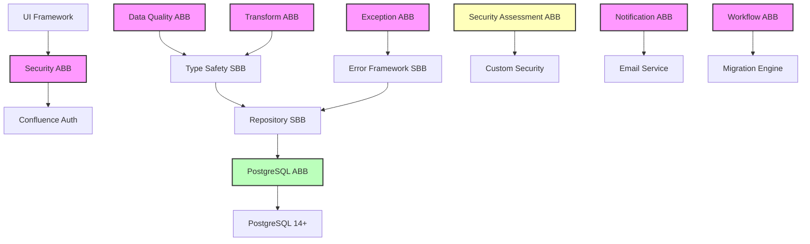

# UMIG Architecture Building Blocks Catalog

**Document ID:** UMIG-TOGAF-D-ABB-001  
**Version:** 1.1  
**Date:** September 09, 2025  
**Status:** Security Architecture Aligned  
**TOGAF Phase:** D (Technology Architecture)  
**Classification:** Architecture Repository Asset

## Document Control

| Version | Date       | Author            | Description                                                            |
| ------- | ---------- | ----------------- | ---------------------------------------------------------------------- |
| 1.1     | 2025-09-09 | Architecture Team | Security building blocks alignment, 4-role RBAC, PostgreSQL components |
| 1.0     | 2025-08-28 | Architecture Team | Initial ABB Catalog from 49 ADRs                                       |

## Table of Contents

1. [Introduction](#1-introduction)
2. [Solution Building Blocks (SBBs)](#2-solution-building-blocks-sbbs)
3. [Architecture Building Blocks (ABBs)](#3-architecture-building-blocks-abbs)
4. [Building Block Relationships](#4-building-block-relationships)
5. [Implementation Standards](#5-implementation-standards)
6. [Governance & Compliance](#6-governance--compliance)

---

## 1. Introduction

### 1.1 Purpose

This catalog defines the standardized, reusable building blocks that constitute the UMIG technology architecture. Per TOGAF standards, building blocks are categorized as:

- **Architecture Building Blocks (ABBs):** Technology-agnostic specifications defining required capabilities
- **Solution Building Blocks (SBBs):** Concrete implementations of ABBs using specific technologies

### 1.2 Scope

This catalog encompasses all technology building blocks derived from 49 architectural decisions, providing:

- Reusable component specifications
- Implementation patterns and standards
- Integration interfaces and contracts
- Quality attribute requirements

### 1.3 Building Block Principles

| Principle           | Description                                      | Rationale                                 |
| ------------------- | ------------------------------------------------ | ----------------------------------------- |
| **Reusability**     | Each block must be usable in multiple contexts   | Maximize ROI, reduce redundancy           |
| **Composability**   | Blocks must combine to form complete solutions   | Enable flexible architecture              |
| **Encapsulation**   | Internal implementation hidden behind interfaces | Reduce coupling, increase maintainability |
| **Standardization** | Consistent patterns across all blocks            | Reduce complexity, improve quality        |

---

## 2. Solution Building Blocks (SBBs)

### 2.1 Type Safety Pattern (SBB-TSP-001)

**Classification:** Core Pattern  
**Technology Stack:** Groovy 3.0.15, ScriptRunner 9.21.0  
**Implements ABB:** ABB-DQA-001 (Data Quality Assurance)

#### Specification

| Attribute        | Value                                        |
| ---------------- | -------------------------------------------- |
| **Purpose**      | Enforce compile-time and runtime type safety |
| **Scope**        | All data operations across system            |
| **Dependencies** | Groovy static compilation                    |
| **Performance**  | <1ms overhead per operation                  |

#### Technical Implementation

```groovy
@CompileStatic
class TypeSafetyFramework {

    // Core conversion registry
    private static final Map<Class, Closure> CONVERTERS = [
        UUID: { value -> UUID.fromString(value as String) },
        Integer: { value -> Integer.parseInt(value as String) },
        Date: { value -> new java.sql.Timestamp(Date.parse('yyyy-MM-dd', value as String).time) },
        Boolean: { value -> Boolean.parseBoolean(value as String) }
    ]

    // PostgreSQL-specific type mapping (ADR-043)
    static Map<String, Object> convertToPostgreSQLTypes(Map<String, Object> data) {
        def result = [:]
        data.each { key, value ->
            result[key] = convertForDatabase(key, value)
        }
        return result
    }

    private static Object convertForDatabase(String key, Object value) {
        if (value == null) return null

        // Apply field-specific rules
        if (key.endsWith('_date')) {
            return value instanceof java.util.Date ?
                new java.sql.Timestamp(value.time) :
                java.sql.Date.valueOf(value as String)
        }
        if (key.endsWith('_id')) {
            return value instanceof UUID ? value : UUID.fromString(value as String)
        }

        return value
    }
}
```

#### Interfaces

- `convert(Object value, Class targetType)`: Type-safe conversion
- `validate(Object value, Class expectedType)`: Type validation
- `convertToPostgreSQLTypes(Map data)`: Database-specific conversion

#### Quality Requirements

- **Reliability:** Zero runtime type errors
- **Performance:** <1ms conversion time
- **Maintainability:** Single conversion registry

---

### 2.2 Error Response Framework (SBB-ERF-001)

**Classification:** Core Pattern  
**Technology Stack:** Groovy, REST  
**Implements ABB:** ABB-EXM-001 (Exception Management)

#### Specification

| Attribute         | Value                                    |
| ----------------- | ---------------------------------------- |
| **Purpose**       | Standardized, actionable error responses |
| **Scope**         | All API endpoints and services           |
| **Dependencies**  | SBB-TSP-001                              |
| **Response Time** | <10ms error generation                   |

#### Technical Implementation

```groovy
class ErrorResponseFramework {

    @Immutable
    static class ErrorContext {
        String endpoint
        String operation
        Map<String, Object> parameters
        Date timestamp
    }

    static Map<String, Object> buildErrorResponse(
        Exception exception,
        ErrorContext context
    ) {
        return [
            error: classifyError(exception),
            status: mapToHttpStatus(exception),
            endpoint: context.endpoint,
            details: [
                message: getUserMessage(exception),
                technicalDetails: getTechnicalDetails(exception),
                suggestions: generateSuggestions(exception, context),
                documentation: getDocumentationLink(exception),
                timestamp: context.timestamp,
                traceId: generateTraceId()
            ]
        ]
    }

    private static List<String> generateSuggestions(Exception e, ErrorContext ctx) {
        if (e instanceof SQLException) {
            switch (e.SQLState) {
                case '23503':
                    return [
                        "Verify the referenced entity exists",
                        "Check relationship dependencies",
                        "Use GET ${ctx.endpoint}/validate to check references"
                    ]
                case '23505':
                    return [
                        "A record with these values already exists",
                        "Use PUT for updates instead of POST",
                        "Query existing records with GET ${ctx.endpoint}"
                    ]
                default:
                    return ["Contact support with trace ID: ${generateTraceId()}"]
            }
        }
        return []
    }
}
```

#### Quality Requirements

- **Usability:** Actionable guidance in 100% of errors
- **Consistency:** Uniform error structure
- **Traceability:** Unique trace ID for every error

---

### 2.3 Repository Access Pattern (SBB-RAP-001)

**Classification:** Data Access Pattern  
**Technology Stack:** Groovy, ScriptRunner, PostgreSQL  
**Implements ABB:** ABB-DAL-001 (Data Access Layer)

#### Specification

| Attribute               | Value                                      |
| ----------------------- | ------------------------------------------ |
| **Purpose**             | ScriptRunner-compatible repository pattern |
| **Scope**               | All database operations                    |
| **Dependencies**        | SBB-TSP-001, DatabaseUtil                  |
| **Transaction Support** | Full ACID compliance                       |

#### Technical Implementation

```groovy
// ADR-044: Closure-based repository access for ScriptRunner
abstract class BaseRepository {

    // Mandatory closure pattern for ScriptRunner compatibility
    protected getConnection = { ->
        return DatabaseUtil.getConnection()
    }

    protected <T> T withTransaction(Closure<T> operation) {
        def connection = getConnection()
        connection.setAutoCommit(false)

        try {
            def result = operation(connection)
            connection.commit()
            return result
        } catch (Exception e) {
            connection.rollback()
            throw new RepositoryException("Transaction failed", e)
        } finally {
            connection.close()
        }
    }

    // Template method for type-safe queries
    protected <T> List<T> executeQuery(
        String sql,
        Map<String, Object> params,
        Closure<T> rowMapper
    ) {
        return DatabaseUtil.withSql { db ->
            def convertedParams = TypeSafetyFramework.convertToPostgreSQLTypes(params)
            def rows = db.rows(sql, convertedParams)
            return rows.collect { row -> rowMapper(row) }
        }
    }
}
```

#### Quality Requirements

- **Performance:** Connection pooling with <5ms acquisition
- **Reliability:** Automatic transaction rollback
- **Scalability:** Support 100+ concurrent operations

---

### 2.4 UI Component Framework (SBB-UCF-001)

**Classification:** Presentation Pattern  
**Technology Stack:** Vanilla JavaScript, Atlassian AUI  
**Implements ABB:** ABB-PRS-001 (Presentation Services)

#### Specification

| Attribute        | Value                                  |
| ---------------- | -------------------------------------- |
| **Purpose**      | Standardized UI component architecture |
| **Scope**        | All frontend components                |
| **Dependencies** | None (standalone)                      |
| **Load Time**    | <3s initial render                     |

#### Technical Implementation

```javascript
// Base component class with RBAC and polling
class UIComponent {
  constructor(config) {
    this.config = {
      endpoint: config.endpoint,
      pollInterval: config.pollInterval || 30000,
      role: config.userRole || "NORMAL",
      container: config.container,
    };
    this.state = {};
    this.checksum = null;
  }

  // Smart polling with change detection
  async startPolling() {
    const poll = async () => {
      try {
        const response = await this.fetch(
          `${this.config.endpoint}?checksum=true`,
        );
        const newChecksum = response.headers.get("X-Content-Checksum");

        if (newChecksum !== this.checksum) {
          this.checksum = newChecksum;
          await this.handleDataChange(response);
        }
      } catch (error) {
        this.handleError(error);
      }
    };

    setInterval(poll, this.config.pollInterval);
    poll(); // Initial load
  }

  // RBAC-aware rendering
  render(data) {
    const permissions = this.getPermissions(this.config.role);
    const html = this.template(data, permissions);
    this.config.container.innerHTML = html;
    this.attachEventHandlers(permissions);
  }

  getPermissions(role) {
    const matrix = {
      NORMAL: ["view"],
      PILOT: ["view", "edit", "comment"],
      ADMIN: ["view", "edit", "comment", "admin", "configure"],
      SUPER_ADMIN: [
        "view",
        "edit",
        "comment",
        "admin",
        "configure",
        "system",
        "security",
      ],
    };
    return matrix[role] || matrix["NORMAL"];
  }
}
```

#### Quality Requirements

- **Performance:** <100ms incremental updates
- **Accessibility:** WCAG 2.1 Level AA
- **Browser Support:** Chrome 90+, Firefox 88+, Safari 14+, Edge 90+

---

## 3. Architecture Building Blocks (ABBs)

### 3.1 Data Quality Assurance (ABB-DQA-001)

**Classification:** Data Management  
**Category:** Technology-Agnostic Specification

#### Capability Definition

| Capability                 | Description                     | Quality Attributes                |
| -------------------------- | ------------------------------- | --------------------------------- |
| **Type Validation**        | Ensure data type correctness    | Reliability: 100% type safety     |
| **Constraint Enforcement** | Apply business rules            | Integrity: Zero invalid states    |
| **Transformation**         | Convert between representations | Accuracy: Lossless conversion     |
| **Validation**             | Verify data completeness        | Completeness: All required fields |

#### Required Interfaces

```text
DataQualityAssurance {
    + validate(data: Object, schema: Schema): ValidationResult
    + transform(source: Object, target: Format): Object
    + enforceConstraints(data: Object, rules: Rules): Object
    + audit(operation: String, data: Object): AuditRecord
}
```

#### Implementation Requirements

- Must support multiple data formats (JSON, XML, Map, DTO)
- Must provide detailed validation error messages
- Must maintain audit trail of all operations
- Must support batch operations

**Implemented By:** SBB-TSP-001 (Type Safety Pattern)

---

### 3.2 Exception Management (ABB-EXM-001)

**Classification:** Error Handling  
**Category:** Technology-Agnostic Specification

#### Capability Definition

| Capability          | Description                 | Quality Attributes                |
| ------------------- | --------------------------- | --------------------------------- |
| **Classification**  | Categorize exceptions       | Accuracy: 100% classification     |
| **Context Capture** | Record error context        | Completeness: Full stack trace    |
| **User Guidance**   | Provide actionable advice   | Usability: Clear instructions     |
| **Recovery**        | Enable graceful degradation | Availability: Continued operation |

#### Required Interfaces

```text
ExceptionManagement {
    + handleException(exception: Exception, context: Context): Response
    + classifyError(exception: Exception): ErrorCategory
    + generateGuidance(category: ErrorCategory): List<Suggestion>
    + logError(exception: Exception, response: Response): LogEntry
}
```

**Implemented By:** SBB-ERF-001 (Error Response Framework)

---

### 3.3 Authentication & Authorization (ABB-SEC-001)

**Classification:** Security Services  
**Category:** Technology-Agnostic Specification

#### Capability Definition

| Capability                | Description             | Quality Attributes             |
| ------------------------- | ----------------------- | ------------------------------ |
| **Identity Verification** | Authenticate users      | Security: Multi-factor capable |
| **Permission Management** | Control resource access | Granularity: Resource-level    |
| **Session Management**    | Maintain user context   | Performance: <100ms lookup     |
| **Audit Logging**         | Track all access        | Compliance: 100% coverage      |

#### Required Interfaces

```text
SecurityServices {
    + authenticate(credentials: Credentials): AuthToken
    + authorize(token: AuthToken, resource: Resource, action: Action): Boolean
    + createSession(token: AuthToken): Session
    + audit(token: AuthToken, action: Action, result: Result): AuditLog
}
```

#### Fallback Hierarchy (ADR-042)

1. **ThreadLocal Context** - Primary authentication from current thread
2. **HTTP Headers** - Secondary authentication from request headers
3. **Fallback Context** - Cached authentication context
4. **Default User** - Anonymous user with minimal permissions

**Current Implementation**: UserService.getCurrentUser() handles all fallback scenarios automatically

**Implemented By:** Confluence platform + custom extensions

---

### 3.4 Notification Services (ABB-NOT-001)

**Classification:** Communication Services  
**Category:** Technology-Agnostic Specification

#### Capability Definition

| Capability                 | Description                   | Quality Attributes               |
| -------------------------- | ----------------------------- | -------------------------------- |
| **Template Management**    | Manage notification templates | Flexibility: Multi-format        |
| **Multi-Channel Delivery** | Support various channels      | Reliability: Guaranteed delivery |
| **Personalization**        | Customize per recipient       | Relevance: Context-aware         |
| **Tracking**               | Monitor delivery status       | Observability: Full tracking     |

#### Required Interfaces

```text
NotificationServices {
    + sendNotification(request: NotificationRequest): NotificationResult
    + manageTemplate(template: Template): TemplateResult
    + trackDelivery(notificationId: String): DeliveryStatus
    + configureChannel(channel: Channel, config: Configuration): ConfigResult
}
```

**Implemented By:** Email service, future: SMS, Slack integration

---

### 3.5 Workflow Orchestration (ABB-WFL-001)

**Classification:** Process Management  
**Category:** Technology-Agnostic Specification

#### Capability Definition

| Capability             | Description                 | Quality Attributes              |
| ---------------------- | --------------------------- | ------------------------------- |
| **Process Definition** | Define multi-step workflows | Flexibility: Visual design      |
| **State Management**   | Track execution state       | Reliability: Persistent state   |
| **Error Handling**     | Manage failures             | Resilience: Automatic retry     |
| **Monitoring**         | Track progress              | Observability: Real-time status |

#### Required Interfaces

```text
WorkflowOrchestration {
    + defineWorkflow(definition: WorkflowDef): Workflow
    + executeWorkflow(workflow: Workflow, context: Context): Execution
    + pauseExecution(executionId: String): Result
    + resumeExecution(executionId: String): Result
    + getStatus(executionId: String): ExecutionStatus
}
```

**Implemented By:** Migration execution engine

---

### 3.6 Data Transformation Services (ABB-DTS-001)

**Classification:** Data Services  
**Category:** Technology-Agnostic Specification

#### Capability Definition

| Capability            | Description               | Quality Attributes       |
| --------------------- | ------------------------- | ------------------------ |
| **Format Conversion** | Transform between formats | Accuracy: Lossless       |
| **Schema Mapping**    | Map between schemas       | Completeness: All fields |
| **Validation**        | Verify transformations    | Integrity: 100% valid    |
| **Batch Processing**  | Handle large volumes      | Performance: >1000/sec   |

#### Required Interfaces

```text
DataTransformation {
    + transform(source: Data, targetFormat: Format): Data
    + mapSchema(source: Schema, target: Schema): MappingRules
    + validateTransformation(result: Data, expectedSchema: Schema): ValidationResult
    + processBatch(items: List<Data>, transformation: Transformation): BatchResult
}
```

**Implemented By:** SBB-TSP-001 + transformation service

---

### 3.7 Security Assessment & Controls (ABB-SEC-002)

**Classification:** Security Services  
**Category:** Technology-Agnostic Specification
**Current Rating:** 6.1/10 (Moderate Risk)

#### Capability Definition

| Capability              | Description                | Current Status | Target Status |
| ----------------------- | -------------------------- | -------------- | ------------- |
| **Authentication**      | 4-level fallback hierarchy | ✅ Production  | ✅ Complete   |
| **Authorization (UI)**  | Role-based access control  | ✅ Production  | ✅ Complete   |
| **Authorization (API)** | API-level RBAC             | 🔄 Planned     | 🎯 US-074     |
| **Input Validation**    | Type safety & sanitization | ✅ Production  | ✅ Complete   |
| **XSS Protection**      | Advanced XSS prevention    | ⚠️ Basic       | 🎯 US-082     |
| **Audit Logging**       | Comprehensive audit trail  | ✅ Production  | ✅ Complete   |
| **DoS Protection**      | Rate limiting & throttling | ⚠️ Basic       | 🎯 ADR-046    |

#### Required Interfaces

```text
SecurityAssessment {
    + assessSecurityPosture(): SecurityReport
    + identifyVulnerabilities(): List<Vulnerability>
    + generateComplianceReport(): ComplianceReport
    + trackSecurityMetrics(): SecurityMetrics
    + implementControls(controls: List<SecurityControl>): Result
}
```

#### Current Security Architecture

**Strengths (6.1/10 factors)**:

- ✅ 4-level authentication fallback (ADR-042)
- ✅ 4-role RBAC model (NORMAL/PILOT/ADMIN/SUPER_ADMIN)
- ✅ SQL injection prevention via Repository pattern
- ✅ Type safety enforcement (ADR-043)
- ✅ Comprehensive audit logging (audit_log_aud)
- ✅ Input validation and URL sanitization

**Areas for Improvement**:

- 🔄 API-level RBAC (currently UI-level only)
- 🔄 Advanced XSS protection beyond basic template escaping
- 🔄 Enhanced DoS protection with enterprise-grade limits
- 🔄 Security monitoring & alerting
- 🔄 Automated vulnerability scanning

#### Improvement Roadmap

| Priority | Enhancement                | User Story | Timeline |
| -------- | -------------------------- | ---------- | -------- |
| High     | API-level RBAC             | US-074     | Sprint 7 |
| High     | Security Assessment        | US-038     | Sprint 7 |
| Medium   | Advanced Security Controls | US-082     | Sprint 8 |
| Medium   | DoS Protection             | ADR-046    | Sprint 8 |

**Implemented By:** Mixed platform + custom security frameworks

---

### 3.8 PostgreSQL Database Services (ABB-PG-001)

**Classification:** Data Services  
**Category:** Technology-Agnostic Specification
**Version:** PostgreSQL 14+

#### Capability Definition

| Capability                 | Description                    | Quality Attributes              |
| -------------------------- | ------------------------------ | ------------------------------- |
| **Connection Management**  | Connection pooling & lifecycle | Performance: <5ms acquisition   |
| **Transaction Management** | ACID compliance & rollback     | Reliability: 100% consistency   |
| **Query Optimization**     | Performance tuning & indexing  | Performance: <51ms avg response |
| **Security & Compliance**  | Encryption & audit logging     | Security: SSL/TLS + RLS         |

#### Required Interfaces

```text
PostgreSQLServices {
    + getConnection(timeout: Duration): Connection
    + executeQuery(sql: String, params: Map): ResultSet
    + executeTransaction(operations: List<Operation>): TransactionResult
    + createIndex(table: String, columns: List<String>): IndexResult
    + auditOperation(operation: String, user: String, data: Object): AuditRecord
}
```

#### Technical Implementation

**Core Features**:

- Database: umig_app_db
- Connection pooling via DatabaseUtil.withSql
- Audit logging via audit_log_aud table
- Row Level Security (RLS) where applicable
- SSL/TLS encryption for production

**Performance Characteristics**:

- Query response: <51ms average (US-056 target)
- Connection time: <45ms average
- Concurrent users: 85 current, 100 target
- Database size: 4.2GB current, <10GB target

**Security Features**:

- Role-based database access (umig_app, umig_read users)
- Comprehensive audit trail via triggers
- SSL certificate validation in production
- Data encryption at rest (planned)

**High Availability**:

- Streaming replication for production
- Automated failover capability
- Point-in-time recovery (PITR)
- Enterprise backup integration

**Implemented By:** PostgreSQL 14+ with custom extensions

---

## 4. Building Block Relationships

### 4.1 Dependency Graph



### 4.2 Composition Matrix

| Use Case                | Required ABBs                                                  | Required SBBs                         |
| ----------------------- | -------------------------------------------------------------- | ------------------------------------- |
| **REST API Endpoint**   | ABB-SEC-001, ABB-SEC-002, ABB-DQA-001, ABB-EXM-001, ABB-PG-001 | SBB-TSP-001, SBB-ERF-001, SBB-RAP-001 |
| **UI Component**        | ABB-SEC-001, ABB-PRS-001                                       | SBB-UCF-001                           |
| **Business Process**    | ABB-WFL-001, ABB-NOT-001                                       | Migration engine                      |
| **Data Operation**      | ABB-DQA-001, ABB-DTS-001, ABB-PG-001                           | SBB-TSP-001, SBB-RAP-001              |
| **Security Assessment** | ABB-SEC-002                                                    | Security framework                    |
| **Database Operation**  | ABB-PG-001, ABB-DQA-001                                        | SBB-RAP-001, DatabaseUtil             |

---

## 5. Implementation Standards

### 5.1 Mandatory Standards

**All Implementations Must:**

1. **Type Safety** (SBB-TSP-001)
   - Explicit type casting for all parameters
   - PostgreSQL type conversion for database operations
   - Validation before processing

2. **Error Handling** (SBB-ERF-001)
   - Structured error responses
   - Actionable user guidance
   - Complete audit logging

3. **Security** (ABB-SEC-001)
   - Authentication on all endpoints
   - Role-based access control
   - Audit trail for all operations

### 5.2 Quality Gates

| Gate               | Requirement                        | Validation         |
| ------------------ | ---------------------------------- | ------------------ |
| **Code Review**    | All building blocks used correctly | Checklist review   |
| **Type Safety**    | Zero type casting errors           | Static analysis    |
| **Error Coverage** | 100% exception handling            | Test coverage      |
| **Performance**    | Meet response time targets         | Load testing       |
| **Security**       | Pass security scan                 | Vulnerability scan |

### 5.3 Testing Requirements

**Unit Testing:**

- Each SBB must have >95% test coverage
- Mock external dependencies
- Test error conditions

**Integration Testing:**

- Test ABB compositions
- Validate interfaces
- End-to-end scenarios

---

## 6. Governance & Compliance

### 6.1 Building Block Lifecycle

| Phase         | Activities                         | Approval          |
| ------------- | ---------------------------------- | ----------------- |
| **Propose**   | Identify need, draft specification | Architecture team |
| **Design**    | Create interfaces, define quality  | Technical lead    |
| **Implement** | Build SBB, validate against ABB    | Development team  |
| **Validate**  | Test, security scan, performance   | QA team           |
| **Deploy**    | Release, document, train           | Operations        |
| **Maintain**  | Monitor, update, deprecate         | Architecture team |

### 6.2 Compliance Requirements

**Mandatory Compliance:**

- TOGAF 9.2 building block standards
- ADR-031: Type safety enforcement
- ADR-039: Enhanced error handling
- ADR-042: Authentication context management (4-level fallback)
- ADR-043: Type safety enforcement (explicit casting)
- ADR-046: DoS protection via ImportQueue configuration
- ADR-051: UI-level RBAC implementation (current)

**Security Enhancement References:**

- US-038: Security assessment & improvements
- US-074: API-level RBAC implementation (planned)
- US-082: Advanced security controls (planned)

**Audit Requirements:**

- All building block usage tracked
- Quarterly compliance review
- Exception approval process

### 6.3 Exception Process

**When Deviations Allowed:**

1. Performance critical path (with measurement)
2. Platform limitations (documented)
3. Security requirements (approved by security team)

**Approval Process:**

1. Document justification
2. Architecture review
3. Risk assessment
4. Mitigation plan
5. Formal approval

## Appendices

### Appendix A: Building Block Checklist

- [ ] ABB specification complete
- [ ] SBB implementation validated
- [ ] Interfaces documented
- [ ] Dependencies identified
- [ ] Quality attributes verified
- [ ] Test coverage achieved
- [ ] Security validated
- [ ] Performance benchmarked
- [ ] Documentation complete
- [ ] Training materials created

### Appendix B: Reference Architecture

Complete reference implementations available at:

- `/src/groovy/umig/blocks/`: Building block implementations
- `/docs/architecture/blocks/`: Detailed specifications
- `/tests/blocks/`: Validation test suites

### Appendix C: Version Control

| Building Block | Version | Status     | Last Updated |
| -------------- | ------- | ---------- | ------------ |
| SBB-TSP-001    | 1.0     | Production | 2025-08-15   |
| SBB-ERF-001    | 1.0     | Production | 2025-08-14   |
| SBB-RAP-001    | 1.0     | Production | 2025-08-16   |
| SBB-UCF-001    | 1.1     | Production | 2025-09-09   |
| ABB-SEC-001    | 1.1     | Production | 2025-09-09   |
| ABB-SEC-002    | 1.0     | Assessment | 2025-09-09   |
| ABB-PG-001     | 1.0     | Production | 2025-09-09   |
| Other ABBs     | 1.0     | Approved   | 2025-08-28   |

---

_This Architecture Building Blocks Catalog is maintained by the UMIG Architecture Team and updated quarterly or as significant changes occur._
