# UMIG Data Model - Schema Specification

> **⚠️ SCHEMA ALIGNMENT**: This documentation is aligned with `/docs/dataModel/umig_app_db.sql` as the SOURCE OF TRUTH

This document provides the pure schema specification for the Unified Migration (UMIG) data model, including table definitions, relationships, constraints, and basic structural information. For implementation patterns, query optimization, and best practices, see:

- **Data Architecture**: [UMIG - TOGAF Phase C - Data Architecture.md](../architecture/UMIG%20-%20TOGAF%20Phase%20C%20-%20Data%20Architecture.md) - Enhanced architectural validation with database evidence
- **Data Operations**: [UMIG - Data Operations Guide.md](../architecture/UMIG%20-%20Data%20Operations%20Guide.md) - Operational procedures, troubleshooting, and performance optimization

**Document Status**: ✅ Production Ready | **Last Updated**: December 2025 | **Version**: 2.4 - Status Normalization Enhanced
**Consolidated Sources**: umig_app_db.sql (Primary), System Configuration Schema, Instructions Schema Documentation, Database Migrations 001-029, TD-003 Status Normalization

**Related Documentation**:

- [UMIG - TOGAF Phase C - Data Architecture.md](../architecture/UMIG%20-%20TOGAF%20Phase%20C%20-%20Data%20Architecture.md) - Enhanced architectural validation with database evidence
- [UMIG - Data Operations Guide.md](../architecture/UMIG%20-%20Data%20Operations%20Guide.md) - Operational procedures, troubleshooting, and performance optimization
- [UMIG - TOGAF Phases A-D - Architecture Requirements Specification.md](../architecture/UMIG%20-%20TOGAF%20Phases%20A-D%20-%20Architecture%20Requirements%20Specification.md) - Overall system architecture and design decisions

---

## 1. Database Statistics

### 1.1. Executive Summary Statistics

**Schema Metrics** _(Calculated: December 9, 2025)_

- **Total Tables**: 55 (52 regular + 3 staging)
- **Total Fields**: 562 total columns
- **Total Primary Keys**: 54
- **Total Foreign Keys**: 85 relationships
- **Total Indexes**: 140 (comprehensive optimization)

### 1.2. Field Distribution by Data Type

| Data Type     | Count      | Percentage | Usage Pattern                  |
| ------------- | ---------- | ---------- | ------------------------------ |
| **VARCHAR**   | 195 fields | 34.7%      | Names, codes, descriptions     |
| **TIMESTAMP** | 135 fields | 24.0%      | Audit trails, execution timing |
| **INTEGER**   | 98 fields  | 17.4%      | IDs, counts, durations         |
| **UUID**      | 76 fields  | 13.5%      | Business entity identifiers    |
| **TEXT**      | 43 fields  | 7.7%       | Long descriptions, content     |
| **BOOLEAN**   | 11 fields  | 2.0%       | Flags, status indicators       |
| **Other**     | 4 fields   | 0.7%       | Specialized types              |

### 1.3. Key Database Metrics

- **Average fields per table**: 10.2 fields
- **Tables with most fields**:
  1. `instructions_instance_ini` (19 fields)
  2. `steps_instance_sti` (17 fields)
  3. `controls_instance_cti` (17 fields)
- **Most referenced tables (FK targets)**:
  1. `users_usr` (11 references)
  2. `steps_master_stm` (8 references)
  3. `status_sts` (8 references)
- **Index coverage**: 100% of tables have indexes
- **Constraint density**: 164 DEFAULT + 150 NOT NULL constraints

### 1.4. Architecture Pattern Analysis

- **Master/Instance pattern**: 50% of tables follow canonical design
- **Junction table ratio**: 19% of tables are many-to-many junction tables
- **Audit trail pattern**: 100% coverage with created/updated tracking
- **Status workflow pattern**: Centralized status management across 8 entities

---

## 2. Data Model Overview

### 2.1. Architecture Pattern

UMIG follows a **Canonical (Master) vs. Instance (Execution)** entity pattern:

- **Masters**: Define reusable templates and playbooks (e.g., `steps_master_stm`)
- **Instances**: Track real-world executions (e.g., `steps_instance_sti`)
- **Associations**: Many-to-many relationships via join tables

### 2.2. Data Hierarchy

**Strategic**: Migrations → Iterations → Teams → Users → Environments → Applications  
**Canonical**: Plans → Sequences → Phases → Steps → Instructions → Controls  
**Instance**: Plan Instances → Sequence Instances → Phase Instances → Step Instances → Instruction Instances → Control Instances  
**Support**: Labels, Comments, Audit Logs, System Configuration

### 2.3. Key Design Principles

- Normalized schema with explicit foreign key relationships
- Standardized audit fields across all tables (migrations 016 & 017)
- Environment-aware configuration management
- Centralized status management with color coding
- UUID primary keys for business entities, INT for reference data

---

## 3. Strategic Layer

**Purpose:** Models the high-level structure and actors involved in a migration program.

### 3.1. Migrations (`migrations_mig`)

- **mig_id** (UUID, PK): Unique migration identifier
- **usr_id_owner** (INT, FK → users_usr): Owner
- **mig_name** (VARCHAR): Migration name
- **mig_description** (TEXT): Description
- **mig_type** (VARCHAR(50), NOT NULL): Migration type classification (References migration_types_mit.mit_code)
- **mig_status** (INTEGER, FK → status_sts.sts_id): Status from centralized status_sts table where sts_type='Migration' (TD-003 normalization)
- **mig_start_date**, **mig_end_date**, **mig_business_cutover_date** (DATE): Key dates

**Migration Types Integration**: The mig_type field references the dynamic migration_types_mit table implemented in Migration 029, providing centralized type management with visual differentiation and administrative control.

### 3.2. Iterations (`iterations_ite`)

- **ite_id** (UUID, PK)
- **mig_id** (UUID, FK → migrations_mig)
- **plm_id** (UUID, FK → plans_master_plm): The master plan for this iteration
- **itt_code** (VARCHAR, FK → iteration_types_itt): Iteration type
- **ite_name**, **ite_description** (VARCHAR, TEXT)
- **ite_status** (INTEGER, FK → status_sts.sts_id): Status from centralized status_sts table where sts_type='Iteration' (TD-003 normalization)
- **ite_static_cutover_date**, **ite_dynamic_cutover_date** (TIMESTAMPTZ): Cutover dates

### 3.3. Teams (`teams_tms`)

- **tms_id** (INT, PK)
- **tms_name** (VARCHAR)
- **tms_email** (VARCHAR, unique)
- **tms_description** (TEXT)
- **Membership:** All user-team assignments are managed via the join table `teams_tms_x_users_usr`.

### 3.4. Users (`users_usr`)

- **usr_id** (INT, PK)
- **usr_code** (VARCHAR, unique): 3-character user code
- **usr_first_name**, **usr_last_name** (VARCHAR)
- **usr_email** (VARCHAR, unique)
- **usr_is_admin** (BOOLEAN): Administrative privileges flag
- **usr_active** (BOOLEAN, NOT NULL, DEFAULT TRUE): Active/inactive status - Added in migration 011
- **usr_confluence_user_id** (VARCHAR(255)): Confluence user identifier
- **rls_id** (INT, FK → roles_rls): Role
- **created_at**, **updated_at** (TIMESTAMPTZ): Audit timestamps - Added in migration 012
- **Team membership**: Managed exclusively via the many-to-many join table `teams_tms_x_users_usr` (see below; no direct FK in `users_usr`).
- **Business rule:** Each user currently belongs to exactly one team; all `ADMIN` and `PILOT` users are assigned to `IT_CUTOVER`. See [ADR-022](../adr/ADR-022-user-team-nn-relationship.md) for rationale.

### 3.5. Roles (`roles_rls`)

- **rls_id** (INT, PK)
- **rls_code** (VARCHAR, unique)
- **rls_description** (TEXT)

### 3.6. Environments (`environments_env`)

- **env_id** (INT, PK)
- **env_code** (VARCHAR, unique)
- **env_name** (VARCHAR)
- **env_description** (TEXT)

### 3.7. Applications (`applications_app`)

- **app_id** (INT, PK)
- **app_code** (VARCHAR, unique)
- **app_name** (VARCHAR)
- **app_description** (TEXT)

### 3.8. System Configuration (`system_configuration_scf`)

**Purpose**: Centralized configuration management for runtime settings, Confluence macro locations, and environment-specific parameters.

- **scf_id** (UUID, PK): Unique configuration identifier
- **env_id** (INT, FK → environments_env): Environment association
- **scf_key** (VARCHAR, unique per environment): Configuration key
- **scf_category** (VARCHAR): MACRO_LOCATION, API_CONFIG, SYSTEM_SETTING
- **scf_value** (TEXT): Configuration value (supports all data types)
- **scf_description** (TEXT): Human-readable description
- **scf_is_active** (BOOLEAN, DEFAULT TRUE): Enable/disable configuration
- **scf_is_system_managed** (BOOLEAN, DEFAULT FALSE): System vs user managed
- **scf_data_type** (VARCHAR, DEFAULT 'STRING'): STRING, INTEGER, BOOLEAN, JSON, URL
- **scf_validation_pattern** (VARCHAR): Regex validation pattern
- **created_by**, **created_at**, **updated_by**, **updated_at**: Standard audit fields

**Constraints**:

- Unique constraint on (env_id, scf_key)
- Foreign key to environments_env

**Key Configuration Categories**:

- **MACRO_LOCATION**: Confluence deployment settings (space keys, page IDs, base URLs)
- **API_CONFIG**: Runtime settings (rate limiting, timeouts, retry configuration)
- **SYSTEM_SETTING**: General system configuration (debug mode, maintenance status, cache settings)

### 3.9. Staging Tables

**Purpose**: Temporary tables for data import and transformation processes, including US-034 Enhanced Data Import Architecture.

#### Staging Steps (`stg_steps`)

- **id** (VARCHAR(255), PK): Staging step identifier
- **step_type** (stg_step_type ENUM): Step type enumeration
- **step_number** (INTEGER): Step sequence number
- **step_title** (TEXT): Step title/name
- **step_predecessor** (VARCHAR(255)): Previous step reference
- **step_successor** (VARCHAR(255)): Next step reference
- **step_assigned_team** (VARCHAR(255)): Team assignment
- **step_impacted_teams** (VARCHAR(255)): Impacted teams list
- **step_macro_time_sequence** (TEXT): Macro timing sequence
- **step_time_sequence** (TEXT): Detailed timing sequence

#### Staging Step Instructions (`stg_step_instructions`)

- **id** (INTEGER, PK): Staging instruction identifier
- **step_id** (VARCHAR(255), NOT NULL): Parent staging step reference
- **instruction_id** (TEXT, NOT NULL): Instruction identifier
- **instruction_text** (TEXT): Instruction content
- **instruction_assignee** (VARCHAR(255)): Assigned user/team
- **created_at**, **updated_at** (TIMESTAMPTZ): Audit timestamps

---

## 4. US-034 Enhanced Data Import Architecture

**Purpose**: Advanced data import processing system with concurrent queue management, resource coordination, and scheduling capabilities.

**Implementation Status**: ✅ COMPLETE - Production Ready (Migration 026)  
**Repository Classes**: 3 comprehensive repositories with DatabaseUtil.withSql patterns  
**Integration**: Full API integration with CustomEndpointDelegate pattern

### 4.1. Import Queue Management (`stg_import_queue_management_iqm`)

**Purpose**: Manages concurrent import request queuing and coordination with priority-based processing.

- **iqm_id** (UUID, PK): Unique queue entry identifier
- **iqm_request_id** (UUID, NOT NULL, UNIQUE): Business request identifier
- **iqm_priority** (INTEGER, DEFAULT 5): Priority level (1-20, where 1 is highest)
- **iqm_status** (VARCHAR(20), DEFAULT 'QUEUED'): Current status
- **iqm_import_type** (VARCHAR(50), NOT NULL): Type of import operation
- **iqm_requested_by** (VARCHAR(100), NOT NULL): User requesting the import
- **iqm_requested_at** (TIMESTAMPTZ, DEFAULT NOW()): Request timestamp
- **iqm_started_at** (TIMESTAMPTZ, NULL): Processing start time
- **iqm_estimated_duration** (INTEGER, NULL): Estimated duration in minutes
- **iqm_resource_requirements** (JSONB, NULL): Resource requirements specification
- **iqm_configuration** (JSONB, NOT NULL): Import configuration parameters
- **iqm_queue_position** (INTEGER, NULL): Current queue position
- **iqm_assigned_worker** (VARCHAR(50), NULL): Worker processing the request
- **iqm_created_date**, **iqm_last_modified_date** (TIMESTAMPTZ): Audit timestamps
- **iqm_is_active** (BOOLEAN, DEFAULT TRUE): Active status flag

**Constraints**:

- Status values: QUEUED, PROCESSING, COMPLETED, FAILED, CANCELLED
- Priority range: 1-20 (1 = highest priority)

**Indexes**:

- `idx_iqm_status_priority`: Optimized for queue processing
- `idx_iqm_worker_status`: Worker assignment tracking

**Repository**: `ImportQueueManagementRepository.groovy`

### 4.2. Resource Lock Management (`stg_import_resource_locks_irl`)

**Purpose**: Prevents resource conflicts between concurrent import operations through granular locking.

- **irl_id** (SERIAL, PK): Lock entry identifier
- **irl_resource_type** (VARCHAR(50), NOT NULL): Type of resource being locked
- **irl_resource_id** (VARCHAR(100), NOT NULL): Specific resource identifier
- **irl_lock_type** (VARCHAR(20), NOT NULL): EXCLUSIVE or SHARED lock
- **irl_locked_by_request** (UUID, FK → stg_import_queue_management_iqm.iqm_request_id): Locking request
- **irl_locked_at** (TIMESTAMPTZ, DEFAULT NOW()): Lock acquisition time
- **irl_expires_at** (TIMESTAMPTZ, NOT NULL): Lock expiration time
- **irl_created_date** (TIMESTAMPTZ): Creation timestamp
- **irl_is_active** (BOOLEAN, DEFAULT TRUE): Active status flag

**Constraints**:

- Unique constraint: (resource_type, resource_id, locked_by_request)
- Lock types: EXCLUSIVE, SHARED
- Expiration must be future date

**Index**: `idx_irl_resource_expires` for lock cleanup and conflict detection

**Repository**: `ImportResourceLockRepository.groovy`

### 4.3. Scheduled Import Schedules (`stg_scheduled_import_schedules_sis`)

**Purpose**: Manages scheduled and recurring import operations with cron-like capabilities.

- **sis_id** (SERIAL, PK): Schedule entry identifier
- **sis_schedule_id** (UUID, UNIQUE): Business schedule identifier
- **sis_schedule_name** (VARCHAR(255), NOT NULL): Human-readable schedule name
- **sis_import_type** (VARCHAR(50), NOT NULL): Type of import to schedule
- **sis_schedule_expression** (VARCHAR(100), NOT NULL): Cron expression or ISO datetime
- **sis_recurring** (BOOLEAN, DEFAULT FALSE): Recurring schedule flag
- **sis_priority** (INTEGER, DEFAULT 5): Scheduling priority (1-20)
- **sis_created_by** (VARCHAR(100), NOT NULL): User who created the schedule
- **sis_status** (VARCHAR(20), DEFAULT 'SCHEDULED'): Current schedule status
- **sis_next_execution** (TIMESTAMPTZ, NOT NULL): Next scheduled execution
- **sis_last_execution** (TIMESTAMPTZ, NULL): Previous execution timestamp
- **sis_execution_count**, **sis_success_count**, **sis_failure_count** (INTEGER): Statistics
- **sis_import_configuration** (JSONB, NOT NULL): Import parameters
- **sis_notification_settings** (JSONB, NULL): Notification configuration
- **sis_max_retries** (INTEGER, DEFAULT 3): Maximum retry attempts
- **sis_retry_delay_minutes** (INTEGER, DEFAULT 15): Retry delay
- **sis_timeout_minutes** (INTEGER, DEFAULT 60): Execution timeout
- **sis_created_date**, **sis_last_modified_date** (TIMESTAMPTZ): Audit timestamps
- **sis_is_active** (BOOLEAN, DEFAULT TRUE): Active status flag

**Constraints**:

- Status values: SCHEDULED, EXECUTING, COMPLETED, FAILED, CANCELLED, PAUSED
- Next execution must be future date
- Execution counts must be consistent

**Indexes**:

- `idx_sis_next_execution`: Execution scheduling
- `idx_sis_created_by_status`: User schedule tracking
- `idx_sis_recurring_active`: Recurring schedule management

**Repository**: `ScheduledImportRepository.groovy`

### 4.4. Schedule Execution History (`stg_schedule_execution_history_seh`)

**Purpose**: Audit trail for scheduled import executions with detailed tracking.

- **seh_id** (SERIAL, PK): Execution history identifier
- **sis_id** (INTEGER, FK → stg_scheduled_import_schedules_sis): Parent schedule
- **seh_execution_id** (UUID, NOT NULL): Unique execution identifier
- **seh_started_at** (TIMESTAMPTZ, NOT NULL): Execution start time
- **seh_completed_at** (TIMESTAMPTZ, NULL): Execution completion time
- **seh_status** (VARCHAR(20), NOT NULL): Execution status
- **seh_records_processed** (INTEGER, DEFAULT 0): Number of records processed
- **seh_error_message** (TEXT, NULL): Error details for failed executions
- **seh_execution_details** (JSONB, NULL): Detailed execution information
- **seh_created_date** (TIMESTAMPTZ): Creation timestamp

**Constraints**:

- Status values: STARTED, IN_PROGRESS, COMPLETED, FAILED, CANCELLED
- Foreign key cascade delete with parent schedule

**Indexes**:

- `idx_seh_sis_started`: Schedule execution lookup
- `idx_seh_execution_id`: Individual execution tracking

### 4.5. Schedule Resource Reservations (`stg_schedule_resource_reservations_srr`)

**Purpose**: Resource reservations for scheduled imports to prevent conflicts.

- **srr_id** (SERIAL, PK): Reservation identifier
- **sis_id** (INTEGER, FK → stg_scheduled_import_schedules_sis): Parent schedule
- **srr_resource_type** (VARCHAR(50), NOT NULL): Type of resource reserved
- **srr_resource_amount** (INTEGER, NOT NULL): Amount of resource reserved
- **srr_reserved_from**, **srr_reserved_until** (TIMESTAMPTZ): Reservation time window
- **srr_status** (VARCHAR(20), DEFAULT 'RESERVED'): Reservation status
- **srr_created_date** (TIMESTAMPTZ): Creation timestamp

**Constraints**:

- Status values: RESERVED, ACTIVE, RELEASED, EXPIRED
- Resource amount must be positive
- Reservation period must be valid

**Index**: `idx_srr_resource_time` for resource allocation management

### 4.6. Tenant Resource Limits (`stg_tenant_resource_limits_trl`)

**Purpose**: Multi-tenant resource limit enforcement with configurable boundaries.

- **trl_id** (SERIAL, PK): Limit entry identifier
- **trl_tenant_id** (VARCHAR(50), NOT NULL): Tenant identifier
- **trl_resource_type** (VARCHAR(50), NOT NULL): Type of resource being limited
- **trl_resource_limit** (INTEGER, NOT NULL): Resource limit value
- **trl_resource_unit** (VARCHAR(20), NOT NULL): Unit of measurement
- **trl_enforcement_level** (VARCHAR(20), DEFAULT 'HARD'): Enforcement strictness
- **trl_created_date**, **trl_last_modified_date** (TIMESTAMPTZ): Audit timestamps
- **trl_is_active** (BOOLEAN, DEFAULT TRUE): Active status flag

**Constraints**:

- Unique constraint: (tenant_id, resource_type)
- Resource limit must be positive
- Enforcement levels: HARD, SOFT, ADVISORY
- Resource units: MB, COUNT, PERCENTAGE, GB, SECONDS

**Pre-populated default limits**:

- cpu_slots: 2 COUNT
- memory: 1024 MB
- db_connections: 3 COUNT
- concurrent_imports: 2 COUNT

### 4.7. Orchestration Dependencies (`stg_orchestration_dependencies_od`)

**Purpose**: Manages dependencies between import orchestrations for complex workflows.

- **od_id** (SERIAL, PK): Dependency identifier
- **od_orchestration_id** (UUID, NOT NULL): Source orchestration
- **od_depends_on_orchestration** (UUID, NOT NULL): Dependency orchestration
- **od_dependency_type** (VARCHAR(30), NOT NULL): Type of dependency
- **od_created_date** (TIMESTAMPTZ): Creation timestamp

**Constraints**:

- Unique constraint: (orchestration_id, depends_on_orchestration)
- Dependency types: SEQUENTIAL, RESOURCE, DATA
- Foreign key constraints to orchestration table (when available)

**Indexes**:

- `idx_od_orchestration`: Source orchestration lookup
- `idx_od_depends_on`: Dependency resolution

### 4.8. Repository Implementation Patterns

All US-034 repositories follow the standard UMIG DatabaseUtil.withSql pattern:

```groovy
DatabaseUtil.withSql { Sql sql ->
    // Database operations using prepared statements
    String query = "SELECT * FROM table_name WHERE condition = ?"
    def result = sql.firstRow(query, [parameter])
    return processResult(result)
}
```

**Repository Classes**:

- **ImportQueueManagementRepository.groovy**: Queue operations, priority management, statistics
- **ImportResourceLockRepository.groovy**: Resource locking, conflict detection, cleanup
- **ScheduledImportRepository.groovy**: Schedule management, execution tracking, recurring tasks

**Key Features**:

- Comprehensive error handling and logging
- JSON configuration support via Groovy JsonBuilder/JsonSlurper
- Optimized database queries with proper indexing
- Thread-safe operations for concurrent access
- Complete audit trail support

---

## 5. Canonical (Master) Layer

**Purpose:** Defines the reusable playbook for migrations.

### 5.1. Plans (`plans_master_plm`)

- **plm_id** (UUID, PK)
- **tms_id** (INT, FK → teams_tms): Owning team
- **plm_name**, **plm_description** (VARCHAR, TEXT)
- **plm_status** (INTEGER, FK → status_sts.sts_id): Status from centralized status_sts table where sts_type='Plan' (TD-003 normalization)

### 5.2. Sequences (`sequences_master_sqm`)

- **sqm_id** (UUID, PK)
- **plm_id** (UUID, FK → plans_master_plm)
- **sqm_order** (INT)
- **sqm_name**, **sqm_description** (VARCHAR, TEXT)
- **predecessor_sqm_id** (UUID, FK → sequences_master_sqm, nullable)

### 5.3. Phases (`phases_master_phm`)

- **phm_id** (UUID, PK)
- **sqm_id** (UUID, FK → sequences_master_sqm)
- **phm_order** (INT)
- **phm_name**, **phm_description** (VARCHAR, TEXT)
- **predecessor_phm_id** (UUID, FK → phases_master_phm, nullable)

### 5.4. Steps (`steps_master_stm`)

- **stm_id** (UUID, PK)
- **phm_id** (UUID, FK → phases_master_phm)
- **tms_id_owner** (INT, FK → teams_tms): Owning team
- **stt_code** (VARCHAR, FK → step_types_stt): Step type
- **stm_number** (INT)
- **stm_name** (VARCHAR)
- **stm_description** (TEXT): Step description
- **stm_duration_minutes** (INTEGER): Expected duration
- **stm_id_predecessor** (UUID, FK → steps_master_stm, nullable)
- **enr_id** (INT, FK → environment_roles_enr, nullable): Environment role association - Added in migration 014 (replaced deprecated enr_id_target field for consistency)

### 5.5. Controls (`controls_master_ctm`)

- **ctm_id** (UUID, PK)
- **phm_id** (UUID, FK → phases_master_phm)
- **ctm_code** (VARCHAR, unique): Unique business key (e.g., C0001, K0001) - Added in migration 007
- **ctm_order** (INT)
- **ctm_name**, **ctm_description** (VARCHAR, TEXT)
- **ctm_type** (VARCHAR)
- **ctm_is_critical** (BOOLEAN)

### 5.6. Instructions (`instructions_master_inm`)

**Purpose**: Master instruction templates that define procedural steps within migration phases. Instructions represent the granular, actionable tasks that must be completed within each step of a migration sequence.

- **inm_id** (UUID, PK): Unique instruction identifier
- **stm_id** (UUID, FK → steps_master_stm): Parent step master (REQUIRED)
- **tms_id** (INT, FK → teams_tms, nullable): Responsible team (OPTIONAL)
- **ctm_id** (UUID, FK → controls_master_ctm, nullable): Associated control point (OPTIONAL)
- **inm_order** (INT): Order/sequence within the step (REQUIRED)
- **inm_body** (TEXT): Detailed instruction content/steps (supports markdown formatting)
- **inm_duration_minutes** (INT, nullable): Estimated duration in minutes
- **created_at** (TIMESTAMPTZ): Creation timestamp - Added in migration 016
- **created_by** (VARCHAR(255)): User trigram or system identifier - Added in migration 016
- **updated_at** (TIMESTAMPTZ, nullable): Last update timestamp - Added in migration 016
- **updated_by** (VARCHAR(255), nullable): User trigram who last updated - Added in migration 016

**Schema Constraints**:

```sql
CREATE TABLE instructions_master_inm (
    inm_id UUID PRIMARY KEY DEFAULT gen_random_uuid(),
    stm_id UUID NOT NULL,
    tms_id INTEGER,
    ctm_id UUID,
    inm_order INTEGER NOT NULL,
    inm_body TEXT,
    inm_duration_minutes INTEGER,
    CONSTRAINT fk_inm_stm_stm_id FOREIGN KEY (stm_id) REFERENCES steps_master_stm(stm_id),
    CONSTRAINT fk_inm_tms_tms_id FOREIGN KEY (tms_id) REFERENCES teams_tms(tms_id),
    CONSTRAINT fk_inm_ctm_ctm_id FOREIGN KEY (ctm_id) REFERENCES controls_master_ctm(ctm_id)
);
```

**Data Characteristics**:

- **Volume**: ~14,430 instructions across all steps
- **Pattern**: Canonical master/instance separation following UMIG standards
- **Integration**: Full integration with team assignment and control point validation

**Relationships**:

- Many instructions can belong to one step master
- Instructions can optionally be assigned to a team
- Instructions can optionally reference a control point for validation
- Order values should be unique within step scope for proper sequencing

### 5.7. Labels (`labels_lbl`)

- **lbl_id** (INT, PK)
- **mig_id** (UUID, FK → migrations_mig)
- **lbl_name** (TEXT)
- **lbl_description** (TEXT)
- **lbl_color** (VARCHAR)
- **created_at** (TIMESTAMPTZ)
- **created_by** (INT, FK → users_usr)
- **Unique:** (mig_id, lbl_name)

---

## 6. Instance (Execution) Layer

**Purpose:** Tracks real-world executions of the canonical playbook.

### 6.1. Plan Instance (`plans_instance_pli`)

- **pli_id** (UUID, PK)
- **plm_id** (UUID, FK → plans_master_plm)
- **ite_id** (UUID, FK → iterations_ite)
- **pli_name** (VARCHAR)
- **pli_status** (INTEGER, FK → status_sts.sts_id): Status from centralized status_sts table where sts_type='Plan' (TD-003 normalization)
- **usr_id_owner** (INT, FK → users_usr): Plan instance owner

### 6.2. Sequence Instance (`sequences_instance_sqi`)

- **sqi_id** (UUID, PK)
- **pli_id** (UUID, FK → plans_instance_pli)
- **sqm_id** (UUID, FK → sequences_master_sqm)
- **sqi_status** (INTEGER, FK → status_sts.sts_id): Status from centralized status_sts table where sts_type='Sequence' (TD-003 normalization)
- **sqi_name** (VARCHAR): Override name for the sequence instance - Added in migration 010
- **sqi_description** (TEXT): Override description for the sequence instance - Added in migration 010
- **sqi_order** (INTEGER): Override order for the sequence instance - Added in migration 010
- **predecessor_sqi_id** (UUID): Override predecessor sequence instance - Added in migration 010

### 6.3. Phase Instance (`phases_instance_phi`)

- **phi_id** (UUID, PK)
- **sqi_id** (UUID, FK → sequences_instance_sqi)
- **phm_id** (UUID, FK → phases_master_phm)
- **phi_status** (INTEGER, FK → status_sts.sts_id): Status from centralized status_sts table where sts_type='Phase' (TD-003 normalization)
- **phi_order** (INTEGER): Override order for the phase instance - Added in migration 010
- **phi_name** (VARCHAR): Override name for the phase instance - Added in migration 010
- **phi_description** (TEXT): Override description for the phase instance - Added in migration 010
- **predecessor_phi_id** (UUID): Override predecessor phase instance - Added in migration 010

### 6.4. Step Instance (`steps_instance_sti`)

- **sti_id** (UUID, PK)
- **phi_id** (UUID, FK → phases_instance_phi)
- **stm_id** (UUID, FK → steps_master_stm)
- **sti_start_time** (TIMESTAMPTZ): Step execution start timestamp
- **sti_end_time** (TIMESTAMPTZ): Step execution end timestamp
- **sti_status** (INTEGER, FK → status_sts.sts_id): Execution status from centralized status_sts table where sts_type='Step' (TD-003 status normalization, migration 015)
- **sti_name** (VARCHAR): Override name for the step instance - Added in migration 010
- **sti_description** (TEXT): Override description for the step instance - Added in migration 010
- **sti_duration_minutes** (INTEGER): Override duration for the step instance - Added in migration 010
- **sti_id_predecessor** (UUID): Override predecessor step master ID - Added in migration 010
- **enr_id** (INT, FK → environment_roles_enr, nullable): Inherited environment role from master - Added in migration 014
- **Removed fields in migration 015:**
  - ~~usr_id_owner~~ (Owner is at master level only)
  - ~~usr_id_assignee~~ (Assignee is at master level only)
  - ~~enr_id_target~~ (Deprecated field replaced with standardized enr_id for consistent foreign key naming)

### 6.5. Instruction Instance (`instructions_instance_ini`)

**Purpose**: Execution instances of instruction templates created when step instances are instantiated. Runtime instances with completion tracking and audit trail.

- **ini_id** (UUID, PK): Unique instruction instance identifier
- **sti_id** (UUID, FK → steps_instance_sti): Parent step instance (REQUIRED)
- **inm_id** (UUID, FK → instructions_master_inm): Source master instruction (REQUIRED)
- **tms_id** (INT, nullable): Assigned team (copied from master) - Added in migration 010
- **cti_id** (UUID, nullable): Associated control instance - Added in migration 010
- **ini_order** (INT): Instance order (copied from master) - Added in migration 010
- **ini_body** (TEXT): Instance content (copied from master) - Added in migration 010
- **ini_duration_minutes** (INT, nullable): Instance estimated duration (copied from master) - Added in migration 010
- **ini_is_completed** (BOOLEAN, default false): Completion status (simplified model)
- **ini_completed_at** (TIMESTAMPTZ, nullable): When instruction was completed
- **usr_id_completed_by** (INT, FK → users_usr, nullable): User who completed the instruction
- **created_at** (TIMESTAMPTZ): Creation timestamp - Added in migration 016
- **created_by** (VARCHAR(255)): User trigram who created the instance - Added in migration 016
- **updated_at** (TIMESTAMPTZ, nullable): Last update timestamp - Added in migration 016
- **updated_by** (VARCHAR(255), nullable): User trigram who last updated - Added in migration 016

**Schema Constraints**:

```sql
CREATE TABLE instructions_instance_ini (
    ini_id UUID PRIMARY KEY DEFAULT gen_random_uuid(),
    sti_id UUID NOT NULL,
    inm_id UUID NOT NULL,
    ini_is_completed BOOLEAN DEFAULT FALSE,
    ini_completed_at TIMESTAMPTZ,
    usr_id_completed_by INTEGER,
    CONSTRAINT fk_ini_sti_sti_id FOREIGN KEY (sti_id) REFERENCES steps_instance_sti(sti_id),
    CONSTRAINT fk_ini_inm_inm_id FOREIGN KEY (inm_id) REFERENCES instructions_master_inm(inm_id),
    CONSTRAINT fk_ini_usr_usr_id_completed_by FOREIGN KEY (usr_id_completed_by) REFERENCES users_usr(usr_id)
);
```

**Full Attribute Instantiation Pattern (Migration 010)**:
All master instruction attributes are copied to instances during creation to preserve historical accuracy and allow for instance-specific overrides without affecting the master template. This follows ADR-029 pattern.

**Simplified Status Model**:
Uses boolean `ini_is_completed` instead of complex status enumeration for clear binary state management - instruction is either completed or not completed. This avoids the complexity of state machines while providing clear completion tracking.

**Data Characteristics**:

- **Volume**: ~14,430 instruction instances (1:1 with masters for active migrations)
- **Query Pattern**: Primarily hierarchical lookups by step instance
- **Expected Load**: Read-heavy with periodic completion updates
- **Completion Tracking**: Timestamp and user ID for audit trail

**Relationships**:

- Each instruction instance belongs to exactly one step instance
- Each instruction instance is created from exactly one master instruction
- Multiple instances can be created from the same master instruction (for different iterations)
- Completion user tracking for accountability

### 6.6. Control Instance (`controls_instance_cti`)

- **cti_id** (UUID, PK)
- **sti_id** (UUID, FK → steps_instance_sti)
- **ctm_id** (UUID, FK → controls_master_ctm)
- **cti_status** (INTEGER, FK → status_sts.sts_id): Status from centralized status_sts table where sts_type='Control' (TD-003 normalization)
- **cti_order** (INTEGER): Override order for the control instance
- **cti_name** (VARCHAR): Override name for the control instance
- **cti_description** (TEXT): Override description for the control instance
- **cti_type** (VARCHAR): Override type for the control instance
- **cti_is_critical** (BOOLEAN): Override criticality for the control instance
- **cti_code** (TEXT): Override code for the control instance

### 6.7. Comments (`step_instance_comments_sic`, `step_pilot_comments_spc`)

- **step_instance_comments_sic**: Comments on step executions (FKs: sti_id, created_by, updated_by)
- **step_pilot_comments_spc**: Pilot/release manager wisdom for canonical steps (FK: stm_id)

---

## 7. Association/Join Tables

**Purpose:** Implements all many-to-many and label relationships in a normalized way.

### 7.1. User-Team Membership (`teams_tms_x_users_usr`)

- **tms_x_usr_id** (SERIAL, PK)
- **tms_id** (INT, FK → teams_tms)
- **usr_id** (INT, FK → users_usr)
- **created_at** (TIMESTAMPTZ): When the user was added to the team
- **created_by** (VARCHAR(255)): User trigram (usr_code) of who added the user to the team
- **Unique:** (`tms_id`, `usr_id`)
- **Audit Strategy:** Tier 1 - Critical association requiring full audit tracking
- **Note:** All user-team relationships and audit trails are managed here. See [ADR-022](../adr/ADR-022-user-team-nn-relationship.md) for migration rationale and business logic.

### 7.2. Team-Application (`teams_tms_x_applications_app`)

- **tms_id** (INT, FK → teams_tms)
- **app_id** (INT, FK → applications_app)
- **created_at** (TIMESTAMPTZ): When the application was linked to the team
- **PK:** (tms_id, app_id)
- **Audit Strategy:** Tier 2 - Standard association with minimal audit (created_at only)

### 7.3. Environment-Application (`environments_env_x_applications_app`)

- **env_id** (INT, FK → environments_env)
- **app_id** (INT, FK → applications_app)
- **PK:** (env_id, app_id)

### 7.4. Environment-Iteration (`environments_env_x_iterations_ite`)

- **env_id** (INT, FK → environments_env)
- **ite_id** (UUID, FK → iterations_ite)
- **enr_id** (INT, FK → environment_roles_enr)
- **PK:** (env_id, ite_id)

### 7.5. Steps-Iteration Types (`steps_master_stm_x_iteration_types_itt`)

- **stm_id** (UUID, FK → steps_master_stm)
- **itt_code** (VARCHAR, FK → iteration_types_itt)
- **PK:** (stm_id, itt_code)

### 7.6. Steps-Impacted Teams (`steps_master_stm_x_teams_tms_impacted`)

- **stm_id** (UUID, FK → steps_master_stm)
- **tms_id** (INT, FK → teams_tms)
- **PK:** (stm_id, tms_id)

### 7.7. Labels-Steps (`labels_lbl_x_steps_master_stm`)

- **lbl_x_stm_id** (SERIAL, PK)
- **lbl_id** (INT, FK → labels_lbl)
- **stm_id** (UUID, FK → steps_master_stm)
- **created_at** (TIMESTAMPTZ): When the label was applied to the step
- **created_by** (VARCHAR(255)): User trigram (usr_code) of who applied the label
- **Unique:** (lbl_id, stm_id)
- **Audit Strategy:** Tier 2 - Standard association with minimal audit

### 7.8. Labels-Applications (`labels_lbl_x_applications_app`)

- **lbl_x_app_id** (SERIAL, PK)
- **lbl_id** (INT, FK → labels_lbl)
- **app_id** (INT, FK → applications_app)
- **created_at** (TIMESTAMPTZ): When the label was applied to the application
- **created_by** (VARCHAR(255)): User trigram (usr_code) of who applied the label
- **Unique:** (lbl_id, app_id)
- **Audit Strategy:** Tier 2 - Standard association with minimal audit

### 7.9. Labels-Controls (`labels_lbl_x_controls_master_ctm`)

- **lbl_x_ctm_id** (SERIAL, PK)
- **lbl_id** (INT, FK → labels_lbl)
- **ctm_id** (UUID, FK → controls_master_ctm)
- **created_at** (TIMESTAMPTZ): When the label was applied to the control
- **created_by** (VARCHAR(255)): User trigram (usr_code) of who applied the label
- **Unique:** (lbl_id, ctm_id)
- **Purpose:** Associates labels with control checkpoints for categorization and filtering
- **Audit Strategy:** Tier 2 - Standard association with minimal audit

---

## 8. Lookup/Reference Tables

**Purpose:** Provides controlled values and reference data for system-wide consistency.

### 8.1. Status Management (`status_sts`)

- **sts_id** (SERIAL, PK)
- **sts_name** (VARCHAR(50), NOT NULL): Status name (e.g., PENDING, IN_PROGRESS, COMPLETED)
- **sts_color** (VARCHAR(7), NOT NULL): Hex color code format (#RRGGBB)
- **sts_type** (VARCHAR(20), NOT NULL): Entity type (Migration, Iteration, Plan, Sequence, Phase, Step, Control)
- **created_at** (TIMESTAMPTZ, DEFAULT CURRENT_TIMESTAMP)
- **created_by** (VARCHAR(255))
- **Unique:** (sts_name, sts_type)
- **Purpose:** Centralizes all status values with color coding for UI consistency (TD-003 status normalization, migration 015)
- **Pre-populated values:** 31 statuses across 7 entity types with complete hardcoded value elimination
- **Integration:** StatusService provides 5-minute caching and dynamic status management

### 8.2. Environment Roles (`environment_roles_enr`)

- **enr_id** (INT, PK)
- **enr_code** (VARCHAR, unique): Role code (e.g., DEV, TEST, PROD)
- **enr_name** (VARCHAR): Display name
- **enr_description** (TEXT): Description

### 8.3. Step Types (`step_types_stt`)

- **stt_code** (VARCHAR(10), PK): Type code
- **stt_name** (VARCHAR): Display name
- **stt_description** (TEXT): Description

### 8.4. Iteration Types (`iteration_types_itt`)

**Enhanced in Migration 028**: Comprehensive management capabilities with visual differentiation, ordering support, and complete CRUD operations via Admin GUI.

- **itt_code** (VARCHAR(10), PK): Type code (e.g., RUN, DR, CUTOVER)
- **itt_name** (VARCHAR): Display name
- **itt_description** (TEXT): Description (Enhanced in Migration 028)
- **itt_color** (VARCHAR(7)): Hex color code for visual differentiation (Added in Migration 028)
- **itt_icon** (VARCHAR(50)): Icon identifier for UI representation (Added in Migration 028)
- **itt_display_order** (INTEGER): Sort order for consistent presentation (Added in Migration 028)
- **itt_active** (BOOLEAN, DEFAULT TRUE): Active status flag (Added in Migration 028)
- **created_at**, **updated_at** (TIMESTAMPTZ): Standard audit timestamps (Added in Migration 028)
- **created_by**, **updated_by** (VARCHAR(255)): Standard audit users (Added in Migration 028)

**Management Features**:

- Visual differentiation with customizable colors and icons
- Configurable display ordering for consistent UI presentation
- Active/inactive status management
- Full audit trail support

**US-043 Integration**: Enhanced readonly implementation with visual cues and administrative control.

### 8.5. Email Templates (`email_templates_emt`)

- **emt_id** (UUID, PK)
- **emt_type** (VARCHAR(50)): Template type (STEP_OPENED, INSTRUCTION_COMPLETED, STEP_STATUS_CHANGED, CUSTOM)
- **emt_name** (VARCHAR(255)): Template name
- **emt_subject** (TEXT): Email subject template
- **emt_body_html** (TEXT): HTML body template
- **emt_body_text** (TEXT, nullable): Plain text body template
- **emt_is_active** (BOOLEAN, DEFAULT true): Active status
- **emt_created_date**, **emt_updated_date** (TIMESTAMPTZ): Legacy audit timestamps
- **emt_created_by**, **emt_updated_by** (VARCHAR(255)): Legacy audit users
- **created_at**, **updated_at** (TIMESTAMPTZ): Standard audit timestamps
- **created_by**, **updated_by** (VARCHAR(255)): Standard audit users

### 8.5. Migration Types (`migration_types_mit`)

**Added in Migration 029**: Centralized migration type management system supporting US-042 dynamic CRUD operations with complete Admin GUI integration and visual differentiation.

- **mit_id** (SERIAL, PK): Auto-incrementing primary key
- **mit_code** (VARCHAR(20), UNIQUE, NOT NULL): Migration type code (e.g., INFRASTRUCTURE, APPLICATION, DATABASE)
- **mit_name** (VARCHAR(100), NOT NULL): Display name for the migration type
- **mit_description** (TEXT): Detailed description of the migration type
- **mit_color** (VARCHAR(10), DEFAULT '#6B73FF'): Hex color code for visual identification
- **mit_icon** (VARCHAR(50), DEFAULT 'layers'): Icon identifier for UI representation
- **mit_display_order** (INTEGER, DEFAULT 0): Sort order for consistent presentation
- **mit_active** (BOOLEAN, DEFAULT TRUE): Whether this migration type is available for selection

**Predefined Migration Types (8 total)**:

1. INFRASTRUCTURE - Infrastructure Release (#E65100, server icon)
2. APPLICATION - Application Release (#1976D2, desktop icon)
3. DATABASE - Database Release (#388E3C, database icon)
4. NETWORK - Network Release (#7B1FA2, globe icon)
5. SECURITY - Security Release (#D32F2F, shield icon)
6. INTEGRATION - Integration Release (#F57C00, link icon)
7. ACQUISITION - Acquisition Data Migration (#5D4037, life-ring icon)
8. DECOMMISSION - System Decommission (#616161, trash icon)

**Key Features**:

- Dynamic CRUD operations via Admin GUI
- Visual differentiation with colors and icons
- Configurable display ordering
- Active/inactive status management
- Full audit trail support
- Integration with migrations table via mig_type field

**US-042 Integration**: Complete Admin GUI integration with creation, editing, and management capabilities.

### 8.6. Audit Log (`audit_log_aud`)

- **aud_id** (UUID, PK)
- **aud_user_id** (INT, FK → users_usr): User performing the action
- **aud_action** (VARCHAR(100)): Action type (EMAIL_SENT, EMAIL_FAILED, STATUS_CHANGED, etc.)
- **aud_entity_type** (VARCHAR(100)): Entity type affected
- **aud_entity_id** (VARCHAR(255)): Entity ID affected
- **aud_details** (JSONB): Detailed action information
- **aud_timestamp** (TIMESTAMPTZ, DEFAULT CURRENT_TIMESTAMP): When action occurred
- **aud_ip_address** (VARCHAR(45), nullable): User's IP address
- **aud_user_agent** (TEXT, nullable): User's browser/client info

---

## 10. Entity Relationship Diagram (ERD)

```mermaid
erDiagram
    %% Lookup/Reference Tables
    status_sts {
        SERIAL sts_id PK
        VARCHAR sts_name
        VARCHAR sts_color
        VARCHAR sts_type
        TIMESTAMPTZ created_at
        VARCHAR created_by
    }
    environment_roles_enr {
        INT enr_id PK
        VARCHAR enr_code
        VARCHAR enr_name
        TEXT enr_description
    }
    step_types_stt {
        VARCHAR stt_code PK
        VARCHAR stt_name
        TEXT stt_description
    }
    iteration_types_itt {
        VARCHAR itt_code PK
        VARCHAR itt_name
        TEXT itt_description
        VARCHAR itt_color
        VARCHAR itt_icon
        INTEGER itt_display_order
        BOOLEAN itt_active
        TIMESTAMPTZ created_at
        TIMESTAMPTZ updated_at
        VARCHAR created_by
        VARCHAR updated_by
    }
    migration_types_mit {
        SERIAL mit_id PK
        VARCHAR mit_code
        VARCHAR mit_name
        TEXT mit_description
        VARCHAR mit_color
        VARCHAR mit_icon
        INTEGER mit_display_order
        BOOLEAN mit_active
        TIMESTAMPTZ created_at
        VARCHAR created_by
        TIMESTAMPTZ updated_at
        VARCHAR updated_by
    }
    %% Strategic Layer
    migrations_mig {
        UUID mig_id PK
        INT usr_id_owner FK
        VARCHAR mig_name
        TEXT mig_description
        VARCHAR mig_type
        DATE mig_start_date
        DATE mig_end_date
        DATE mig_business_cutover_date
        INT mig_status
    }
    iterations_ite {
        UUID ite_id PK
        UUID mig_id FK
        UUID plm_id FK
        VARCHAR itt_code FK
        VARCHAR ite_name
        TEXT ite_description
        INT ite_status
        TIMESTAMPTZ ite_static_cutover_date
        TIMESTAMPTZ ite_dynamic_cutover_date
    }
    teams_tms {
        INT tms_id PK
        VARCHAR tms_name
        VARCHAR tms_email
        TEXT tms_description
    }
    users_usr {
        INT usr_id PK
        VARCHAR usr_code
        VARCHAR usr_first_name
        VARCHAR usr_last_name
        VARCHAR usr_email
        BOOLEAN usr_is_admin
        BOOLEAN usr_active
        VARCHAR usr_confluence_user_id
        INT rls_id FK
        TIMESTAMPTZ created_at
        TIMESTAMPTZ updated_at
    }
    roles_rls {
        INT rls_id PK
        VARCHAR rls_code
        TEXT rls_description
    }
    environments_env {
        INT env_id PK
        VARCHAR env_code
        VARCHAR env_name
        TEXT env_description
    }
    applications_app {
        INT app_id PK
        VARCHAR app_code
        VARCHAR app_name
        TEXT app_description
    }
    %% Canonical Layer
    plans_master_plm {
        UUID plm_id PK
        INT tms_id FK
        VARCHAR plm_name
        TEXT plm_description
        INT plm_status
    }
    sequences_master_sqm {
        UUID sqm_id PK
        UUID plm_id FK
        INT sqm_order
        VARCHAR sqm_name
        TEXT sqm_description
        UUID predecessor_sqm_id FK
    }
    phases_master_phm {
        UUID phm_id PK
        UUID sqm_id FK
        INT phm_order
        VARCHAR phm_name
        TEXT phm_description
        UUID predecessor_phm_id FK
    }
    steps_master_stm {
        UUID stm_id PK
        UUID phm_id FK
        INT tms_id_owner FK
        VARCHAR stt_code FK
        INT stm_number
        VARCHAR stm_name
        TEXT stm_description
        INTEGER stm_duration_minutes
        UUID stm_id_predecessor FK
        INT enr_id FK
    }
    controls_master_ctm {
        UUID ctm_id PK
        UUID phm_id FK
        VARCHAR ctm_code
        INT ctm_order
        VARCHAR ctm_name
        TEXT ctm_description
        VARCHAR ctm_type
        BOOLEAN ctm_is_critical
    }
    instructions_master_inm {
        UUID inm_id PK
        UUID stm_id FK
        INT tms_id FK
        UUID ctm_id FK
        INT inm_order
        TEXT inm_body
    }
    labels_lbl {
        INT lbl_id PK
        UUID mig_id FK
        TEXT lbl_name
        TEXT lbl_description
        VARCHAR lbl_color
        TIMESTAMPTZ created_at
        INT created_by FK
    }
    %% Instance Layer
    plans_instance_pli {
        UUID pli_id PK
        UUID plm_id FK
        UUID ite_id FK
        VARCHAR pli_name
        INT pli_status
    }
    sequences_instance_sqi {
        UUID sqi_id PK
        UUID pli_id FK
        UUID sqm_id FK
        INT sqi_status
        VARCHAR sqi_name
        TEXT sqi_description
        INTEGER sqi_order
        UUID predecessor_sqi_id
    }
    phases_instance_phi {
        UUID phi_id PK
        UUID sqi_id FK
        UUID phm_id FK
        INT phi_status
        INTEGER phi_order
        VARCHAR phi_name
        TEXT phi_description
        UUID predecessor_phi_id
    }
    steps_instance_sti {
        UUID sti_id PK
        UUID phi_id FK
        UUID stm_id FK
        TIMESTAMPTZ sti_start_time
        TIMESTAMPTZ sti_end_time
        INT sti_status
        VARCHAR sti_name
        TEXT sti_description
        INTEGER sti_duration_minutes
        UUID sti_id_predecessor
        INT enr_id FK
    }
    instructions_instance_ini {
        UUID ini_id PK
        UUID sti_id FK
        UUID inm_id FK
        UUID tms_id
        UUID cti_id
        INTEGER ini_order
        TEXT ini_body
        INTEGER ini_duration_minutes
    }
    controls_instance_cti {
        UUID cti_id PK
        UUID sti_id FK
        UUID ctm_id FK
        INTEGER cti_order
        INT cti_status
        VARCHAR cti_name
        TEXT cti_description
        VARCHAR cti_type
        BOOLEAN cti_is_critical
        TEXT cti_code
    }
    step_instance_comments_sic {
        INT sic_id PK
        UUID sti_id FK
        TEXT comment_body
        INT created_by FK
        TIMESTAMPTZ created_at
        INT updated_by FK
        TIMESTAMPTZ updated_at
    }
    step_pilot_comments_spc {
        INT spc_id PK
        UUID stm_id FK
        TEXT comment_body
        VARCHAR author
        TIMESTAMPTZ created_at
        VARCHAR visibility
    }
    %% Association/Join Tables
    teams_tms_x_users_usr {
        INT tms_x_usr_id PK
        INT tms_id FK
        INT usr_id FK
        TIMESTAMPTZ created_at
        VARCHAR created_by
    }
    teams_tms_x_applications_app {
        INT tms_id FK
        INT app_id FK
        TIMESTAMPTZ created_at
    }
    environments_env_x_applications_app {
        INT env_id FK
        INT app_id FK
    }
    environments_env_x_iterations_ite {
        INT env_id FK
        UUID ite_id FK
        INT enr_id FK
    }
    steps_master_stm_x_iteration_types_itt {
        UUID stm_id FK
        VARCHAR itt_code FK
    }
    steps_master_stm_x_teams_tms_impacted {
        UUID stm_id FK
        INT tms_id FK
    }
    labels_lbl_x_steps_master_stm {
        INT lbl_x_stm_id PK
        INT lbl_id FK
        UUID stm_id FK
        TIMESTAMPTZ created_at
        VARCHAR created_by
    }
    labels_lbl_x_applications_app {
        INT lbl_x_app_id PK
        INT lbl_id FK
        INT app_id FK
        TIMESTAMPTZ created_at
        VARCHAR created_by
    }
    labels_lbl_x_controls_master_ctm {
        INT lbl_x_ctm_id PK
        INT lbl_id FK
        UUID ctm_id FK
        TIMESTAMPTZ created_at
        VARCHAR created_by
    }
    %% Relationships
    migrations_mig }o--|| users_usr : "owned by"
    migrations_mig }o--|| migration_types_mit : "is of type"
    iterations_ite }o--|| migrations_mig : "belongs to"
    plans_master_plm }o--|| teams_tms : "owned by"
    sequences_master_sqm }o--|| plans_master_plm : "belongs to"
    phases_master_phm }o--|| sequences_master_sqm : "belongs to"
    steps_master_stm }o--|| phases_master_phm : "belongs to"
    steps_master_stm }o--|| teams_tms : "owned by"
    steps_master_stm }o--|| step_types_stt : "is of type"
    steps_master_stm }o--|| environment_roles_enr : "targets environment"
    controls_master_ctm }o--|| phases_master_phm : "validates"
    instructions_master_inm }o--|| steps_master_stm : "details"
    instructions_master_inm }o--|| teams_tea : "assigned to"
    instructions_master_inm }o--|| controls_master_ctm : "can satisfy"
    plans_instance_pli }o--|| plans_master_plm : "instantiates"
    plans_instance_pli }o--|| iterations_ite : "executes for"
    sequences_instance_sqi }o--|| plans_instance_pli : "part of"
    sequences_instance_sqi }o--|| sequences_master_sqm : "instantiates"
    phases_instance_phi }o--|| sequences_instance_sqi : "part of"
    phases_instance_phi }o--|| phases_master_phm : "instantiates"
    steps_instance_sti }o--|| phases_instance_phi : "part of"
    steps_instance_sti }o--|| steps_master_stm : "instantiates"
    steps_instance_sti }o--|| environment_roles_enr : "targets environment"
    instructions_instance_ini }o--|| steps_instance_sti : "part of"
    instructions_instance_ini }o--|| instructions_master_inm : "instantiates"
    controls_instance_cti }o--|| steps_instance_sti : "validates"
    controls_instance_cti }o--|| controls_master_ctm : "instantiates"
    step_instance_comments_sic }o--|| steps_instance_sti : "comments on"
    step_instance_comments_sic }o--|| users_usr : "authored by"
    step_pilot_comments_spc }o--|| steps_master_stm : "comments on"
    teams_tms_x_users_usr }o--|| teams_tms : "team"
    teams_tms_x_users_usr }o--|| users_usr : "user"
    teams_tms_x_applications_app }o--|| teams_tms : "team"
    teams_tms_x_applications_app }o--|| applications_app : "application"
    environments_env_x_applications_app }o--|| environments_env : "environment"
    environments_env_x_applications_app }o--|| applications_app : "application"
    environments_env_x_iterations_ite }o--|| environments_env : "environment"
    environments_env_x_iterations_ite }o--|| iterations_ite : "iteration"
    environments_env_x_iterations_ite }o--|| environment_roles_enr : "role"
    steps_master_stm_x_iteration_types_itt }o--|| steps_master_stm : "step"
    steps_master_stm_x_iteration_types_itt }o--|| iteration_types_itt : "type"
    steps_master_stm_x_teams_tms_impacted }o--|| steps_master_stm : "step"
    steps_master_stm_x_teams_tms_impacted }o--|| teams_tms : "impacted team"
    labels_lbl_x_steps_master_stm }o--|| labels_lbl : "label"
    labels_lbl_x_steps_master_stm }o--|| steps_master_stm : "step"
    labels_lbl_x_applications_app }o--|| labels_lbl : "label"
    labels_lbl_x_applications_app }o--|| applications_app : "application"
    labels_lbl_x_controls_master_ctm }o--|| labels_lbl : "label"
    labels_lbl_x_controls_master_ctm }o--|| controls_master_ctm : "control"
```



---

## 11. Migration References

**Data Characteristics**:

- **Volume**: ~14,430 instruction instances (1:1 with masters for active migrations)
- **Scale**: 5 migrations, 30 iterations, 5 plans → 13 sequences → 43 phases → 1,443+ step instances
- **Pattern**: Canonical (master) vs Instance (execution) entity separation

**Key Migration Points**:

- **Migration 010**: Full attribute replication to instance tables (ADR-029)
- **Migration 015**: Centralized status management with color coding
- **Migration 016**: Standardized audit fields across all tables
- **Migration 017**: Tiered audit strategy for association tables
- **Migration 028**: Enhanced iteration_types_itt with management fields (US-043) - Added visual management columns
- **Migration 029**: Added migration_types_mit with 8 predefined types (US-042) - Centralized migration type management

For query patterns, performance optimization, and implementation guidance, see:

- **Data Architecture**: [UMIG - TOGAF Phase C - Data Architecture.md](../architecture/UMIG%20-%20TOGAF%20Phase%20C%20-%20Data%20Architecture.md) - Enhanced architectural validation with database evidence
- **Data Operations**: [UMIG - Data Operations Guide.md](../architecture/UMIG%20-%20Data%20Operations%20Guide.md) - Operational procedures, troubleshooting, and performance optimization
- **Best Practices**: [UMIG_DB_Best_Practices.md](./UMIG_DB_Best_Practices.md) - Implementation patterns, field naming consistency, and TD-003 status normalization guidelines

---

## 12. Audit Fields Standardization

All tables in the UMIG database follow a standardized audit fields pattern (migrations 016 & 017):

### Core Audit Fields

- **created_by** (VARCHAR(255)): User trigram (usr_code), 'system', 'generator', or 'migration'
- **created_at** (TIMESTAMPTZ): Timestamp when the record was created
- **updated_by** (VARCHAR(255)): User trigram (usr_code), 'system', 'generator', or 'migration'
- **updated_at** (TIMESTAMPTZ): Timestamp when the record was last updated (auto-updated via trigger)

### Tables with Audit Fields

**Master Tables**: sequences_master_sqm, phases_master_phm, steps_master_stm, controls_master_ctm, instructions_master_inm

**Instance Tables**: sequences_instance_sqi, phases_instance_phi, steps_instance_sti, controls_instance_cti, instructions_instance_ini

**Reference Tables**: teams_tms, applications_app, environments_env, roles_rls, environment_roles_enr, step_types_stt, iteration_types_itt, migration_types_mit, status_sts, email_templates_emt

**Association Tables**: Tiered audit strategy (Tier 1: Full audit, Tier 2: Minimal audit, Tier 3: No audit)

### Automatic Triggers

All tables have PostgreSQL triggers that automatically update `updated_at` on any UPDATE operation.

For detailed audit field implementation patterns and usage guidance, see [UMIG - Data Operations Guide.md](../architecture/UMIG%20-%20Data%20Operations%20Guide.md).

---

## 13. References & Further Reading

### Related Documentation

- **[UMIG - TOGAF Phase C - Data Architecture.md](../architecture/UMIG%20-%20TOGAF%20Phase%20C%20-%20Data%20Architecture.md)** - Enhanced architectural validation with database evidence
- **[UMIG - Data Operations Guide.md](../architecture/UMIG%20-%20Data%20Operations%20Guide.md)** - Complete implementation patterns, query optimization, performance guidelines, and best practices (consolidated)
- [ADR-029: Full Attribute Instantiation Instance Tables](../adr/ADR-029-full-attribute-instantiation-instance-tables.md) - Design rationale for instance table denormalization
- [ADR-031: Groovy Type Safety and Filtering Patterns](../adr/ADR-031-groovy-type-safety-and-filtering-patterns.md) - Type safety implementation standards
- [ADR-022: User-Team N-N Relationship](../adr/ADR-022-user-team-nn-relationship.md) - Team membership architecture decisions
- [UMIG - TOGAF Phases A-D - Architecture Requirements Specification](../architecture/UMIG%20-%20TOGAF%20Phases%20A-D%20-%20Architecture%20Requirements%20Specification.md) - Overall system architecture and 49 consolidated ADRs

### Schema-Specific Documentation

- [System Configuration Schema](../database/system-configuration-schema.md) - Detailed configuration management implementation
- [Instructions Schema Documentation](./instructions-schema-documentation.md) - Production-ready instructions implementation

### API Documentation & Testing

- [OpenAPI Specification](../api/openapi.yaml) - Complete API documentation
- [SystemConfigurationApi Reference](../../src/groovy/umig/api/v2/SystemConfigurationApi.groovy)
- [SystemConfigurationRepository](../../src/groovy/umig/repository/SystemConfigurationRepository.groovy)
- [Database Quality Validation](../testing/QUALITY_CHECK_PROCEDURES.md)
- [Testing Framework Documentation](../testing/README.md)
