# UMIG Data Model - Schema Specification

This document provides the pure schema specification for the Unified Migration (UMIG) data model, including table definitions, relationships, constraints, and basic structural information. For implementation patterns, query optimization, and best practices, see [UMIG_DB_Best_Practices.md](./UMIG_DB_Best_Practices.md).

**Document Status**: ✅ Production Ready | **Last Updated**: August 2025 | **Version**: 2.1  
**Consolidated Sources**: System Configuration Schema, Instructions Schema Documentation, Database Migrations

**Related Documentation**:

- [UMIG_DB_Best_Practices.md](./UMIG_DB_Best_Practices.md) - Implementation patterns, performance optimization, and best practices
- [System Configuration Schema](../database/system-configuration-schema.md) - Detailed configuration management schema
- [Solution Architecture](../solution-architecture.md) - Overall system architecture and design decisions

---

## 1. Data Model Overview

### 1.1. Architecture Pattern

UMIG follows a **Canonical (Master) vs. Instance (Execution)** entity pattern:

- **Masters**: Define reusable templates and playbooks (e.g., `steps_master_stm`)
- **Instances**: Track real-world executions (e.g., `steps_instance_sti`)
- **Associations**: Many-to-many relationships via join tables

### 1.2. Data Hierarchy

**Strategic**: Migrations → Iterations → Teams → Users → Environments → Applications  
**Canonical**: Plans → Sequences → Phases → Steps → Instructions → Controls  
**Instance**: Plan Instances → Sequence Instances → Phase Instances → Step Instances → Instruction Instances → Control Instances  
**Support**: Labels, Comments, Audit Logs, System Configuration

### 1.3. Key Design Principles

- Normalized schema with explicit foreign key relationships
- Standardized audit fields across all tables (migrations 016 & 017)
- Environment-aware configuration management
- Centralized status management with color coding
- UUID primary keys for business entities, INT for reference data

---

## 2. Strategic Layer

**Purpose:** Models the high-level structure and actors involved in a migration program.

### 2.1. Migrations (`migrations_mig`)

- **mig_id** (UUID, PK): Unique migration identifier
- **usr_id_owner** (INT, FK → users_usr): Owner
- **mig_name** (VARCHAR): Migration name
- **mig_description** (TEXT): Description
- **mig_status** (VARCHAR, FK → status_sts.sts_name): Status from status_sts where sts_type='Migration'
- **mig_start_date**, **mig_end_date**, **mig_business_cutover_date** (DATE): Key dates

### 2.2. Iterations (`iterations_ite`)

- **ite_id** (UUID, PK)
- **mig_id** (UUID, FK → migrations_mig)
- **plm_id** (UUID, FK → plans_master_plm): The master plan for this iteration
- **itt_code** (VARCHAR, FK → iteration_types_itt): Iteration type
- **ite_name**, **ite_description** (VARCHAR, TEXT)
- **ite_status** (VARCHAR, FK → status_sts.sts_name): Status from status_sts where sts_type='Iteration'
- **ite_static_cutover_date**, **ite_dynamic_cutover_date** (TIMESTAMPTZ): Cutover dates

### 2.3. Teams (`teams_tms`)

- **tms_id** (INT, PK)
- **tms_name** (VARCHAR)
- **tms_email** (VARCHAR, unique)
- **tms_description** (TEXT)
- **Membership:** All user-team assignments are managed via the join table `teams_tms_x_users_usr`.

### 2.4. Users (`users_usr`)

- **usr_id** (INT, PK)
- **usr_code** (VARCHAR, unique): 3-character user code
- **usr_first_name**, **usr_last_name** (VARCHAR)
- **usr_email** (VARCHAR, unique)
- **usr_is_admin** (BOOLEAN): Administrative privileges flag
- **usr_active** (BOOLEAN, NOT NULL, DEFAULT TRUE): Active/inactive status - Added in migration 011
- **rls_id** (INT, FK → roles_rls): Role
- **created_at**, **updated_at** (TIMESTAMPTZ): Audit timestamps - Added in migration 012
- **Team membership**: Managed exclusively via the many-to-many join table `teams_tms_x_users_usr` (see below; no direct FK in `users_usr`).
- **Business rule:** Each user currently belongs to exactly one team; all `ADMIN` and `PILOT` users are assigned to `IT_CUTOVER`. See [ADR-022](../adr/ADR-022-user-team-nn-relationship.md) for rationale.

### 2.5. Roles (`roles_rls`)

- **rls_id** (INT, PK)
- **rls_code** (VARCHAR, unique)
- **rls_description** (TEXT)

### 2.6. Environments (`environments_env`)

- **env_id** (INT, PK)
- **env_code** (VARCHAR, unique)
- **env_name** (VARCHAR)
- **env_description** (TEXT)

### 2.7. Applications (`applications_app`)

- **app_id** (INT, PK)
- **app_code** (VARCHAR, unique)
- **app_name** (VARCHAR)
- **app_description** (TEXT)

### 2.8. System Configuration (`system_configuration_scf`)

**Purpose**: Centralized configuration management for runtime settings, Confluence macro locations, and environment-specific parameters.

- **scf_id** (UUID, PK): Unique configuration identifier
- **env_id** (INT, FK → environments_env): Environment association
- **scf_key** (VARCHAR, unique per environment): Configuration key
- **scf_category** (VARCHAR): MACRO_LOCATION, API_CONFIG, SYSTEM_SETTING
- **scf_value** (TEXT): Configuration value (supports all data types)
- **scf_description** (TEXT): Human-readable description
- **scf_is_active** (BOOLEAN, DEFAULT TRUE): Enable/disable configuration
- **scf_is_system_managed** (BOOLEAN, DEFAULT FALSE): System vs user managed
- **scf_data_type** (VARCHAR, DEFAULT 'STRING'): STRING, INTEGER, BOOLEAN, JSON, URL
- **scf_validation_pattern** (VARCHAR): Regex validation pattern
- **created_by**, **created_at**, **updated_by**, **updated_at**: Standard audit fields

**Constraints**:

- Unique constraint on (env_id, scf_key)
- Foreign key to environments_env

**Key Configuration Categories**:

- **MACRO_LOCATION**: Confluence deployment settings (space keys, page IDs, base URLs)
- **API_CONFIG**: Runtime settings (rate limiting, timeouts, retry configuration)
- **SYSTEM_SETTING**: General system configuration (debug mode, maintenance status, cache settings)

### 2.9. System Configuration History (`system_configuration_history_sch`)

**Purpose**: Audit trail for all configuration changes with comprehensive change tracking.

- **sch_id** (UUID, PK): History record identifier
- **scf_id** (UUID, FK → system_configuration_scf): Configuration reference
- **sch_old_value** (TEXT): Previous value (NULL for CREATE)
- **sch_new_value** (TEXT): New value
- **sch_change_reason** (VARCHAR): Human-readable reason
- **sch_change_type** (VARCHAR): CREATE, UPDATE, DELETE, ACTIVATE, DEACTIVATE
- **created_by**, **created_at**: Standard audit fields

---

## 3. Canonical (Master) Layer

**Purpose:** Defines the reusable playbook for migrations.

### 3.1. Plans (`plans_master_plm`)

- **plm_id** (UUID, PK)
- **tms_id** (INT, FK → teams_tms): Owning team
- **plm_name**, **plm_description** (VARCHAR, TEXT)
- **plm_status** (VARCHAR)

### 3.2. Sequences (`sequences_master_sqm`)

- **sqm_id** (UUID, PK)
- **plm_id** (UUID, FK → plans_master_plm)
- **sqm_order** (INT)
- **sqm_name**, **sqm_description** (VARCHAR, TEXT)
- **predecessor_sqm_id** (UUID, FK → sequences_master_sqm, nullable)

### 3.3. Phases (`phases_master_phm`)

- **phm_id** (UUID, PK)
- **sqm_id** (UUID, FK → sequences_master_sqm)
- **phm_order** (INT)
- **phm_name**, **phm_description** (VARCHAR, TEXT)
- **predecessor_phm_id** (UUID, FK → phases_master_phm, nullable)

### 3.4. Steps (`steps_master_stm`)

- **stm_id** (UUID, PK)
- **phm_id** (UUID, FK → phases_master_phm)
- **tms_id_owner** (INT, FK → teams_tms): Owning team
- **stt_code** (VARCHAR, FK → step_types_stt): Step type
- **stm_number** (INT)
- **stm_name** (VARCHAR)
- **stm_description** (TEXT): Step description
- **stm_duration_minutes** (INTEGER): Expected duration
- **stm_id_predecessor** (UUID, FK → steps_master_stm, nullable)
- **enr_id** (INT, FK → environment_roles_enr, nullable): Environment role association - Added in migration 014 (replaced enr_id_target)

### 3.5. Controls (`controls_master_ctm`)

- **ctm_id** (UUID, PK)
- **phm_id** (UUID, FK → phases_master_phm)
- **ctm_code** (VARCHAR, unique): Unique business key (e.g., C0001, K0001) - Added in migration 007
- **ctm_order** (INT)
- **ctm_name**, **ctm_description** (VARCHAR, TEXT)
- **ctm_type** (VARCHAR)
- **ctm_is_critical** (BOOLEAN)

### 3.6. Instructions (`instructions_master_inm`)

**Purpose**: Master instruction templates that define procedural steps within migration phases. Instructions represent the granular, actionable tasks that must be completed within each step of a migration sequence.

- **inm_id** (UUID, PK): Unique instruction identifier
- **stm_id** (UUID, FK → steps_master_stm): Parent step master (REQUIRED)
- **tms_id** (INT, FK → teams_tms, nullable): Responsible team (OPTIONAL)
- **ctm_id** (UUID, FK → controls_master_ctm, nullable): Associated control point (OPTIONAL)
- **inm_order** (INT): Order/sequence within the step (REQUIRED)
- **inm_body** (TEXT): Detailed instruction content/steps (supports markdown formatting)
- **inm_duration_minutes** (INT, nullable): Estimated duration in minutes
- **created_at** (TIMESTAMPTZ): Creation timestamp - Added in migration 016
- **created_by** (VARCHAR(255)): User trigram or system identifier - Added in migration 016
- **updated_at** (TIMESTAMPTZ, nullable): Last update timestamp - Added in migration 016
- **updated_by** (VARCHAR(255), nullable): User trigram who last updated - Added in migration 016

**Schema Constraints**:

```sql
CREATE TABLE instructions_master_inm (
    inm_id UUID PRIMARY KEY DEFAULT gen_random_uuid(),
    stm_id UUID NOT NULL,
    tms_id INTEGER,
    ctm_id UUID,
    inm_order INTEGER NOT NULL,
    inm_body TEXT,
    inm_duration_minutes INTEGER,
    CONSTRAINT fk_inm_stm_stm_id FOREIGN KEY (stm_id) REFERENCES steps_master_stm(stm_id),
    CONSTRAINT fk_inm_tms_tms_id FOREIGN KEY (tms_id) REFERENCES teams_tms(tms_id),
    CONSTRAINT fk_inm_ctm_ctm_id FOREIGN KEY (ctm_id) REFERENCES controls_master_ctm(ctm_id)
);
```

**Data Characteristics**:

- **Volume**: ~14,430 instructions across all steps
- **Pattern**: Canonical master/instance separation following UMIG standards
- **Integration**: Full integration with team assignment and control point validation

**Relationships**:

- Many instructions can belong to one step master
- Instructions can optionally be assigned to a team
- Instructions can optionally reference a control point for validation
- Order values should be unique within step scope for proper sequencing

### 3.7. Labels (`labels_lbl`)

- **lbl_id** (INT, PK)
- **mig_id** (UUID, FK → migrations_mig)
- **lbl_name** (TEXT)
- **lbl_description** (TEXT)
- **lbl_color** (VARCHAR)
- **created_at** (TIMESTAMPTZ)
- **created_by** (INT, FK → users_usr)
- **Unique:** (mig_id, lbl_name)

---

## 4. Instance (Execution) Layer

**Purpose:** Tracks real-world executions of the canonical playbook.

### 4.1. Plan Instance (`plans_instance_pli`)

- **pli_id** (UUID, PK)
- **plm_id** (UUID, FK → plans_master_plm)
- **ite_id** (UUID, FK → iterations_ite)
- **pli_name** (VARCHAR)
- **pli_status** (VARCHAR, FK → status_sts.sts_name): Status from status_sts where sts_type='Plan'
- **usr_id_owner** (INT, FK → users_usr): Plan instance owner

### 4.2. Sequence Instance (`sequences_instance_sqi`)

- **sqi_id** (UUID, PK)
- **pli_id** (UUID, FK → plans_instance_pli)
- **sqm_id** (UUID, FK → sequences_master_sqm)
- **sqi_status** (VARCHAR, FK → status_sts.sts_name): Status from status_sts where sts_type='Sequence'
- **sqi_name** (VARCHAR): Override name for the sequence instance - Added in migration 010
- **sqi_description** (TEXT): Override description for the sequence instance - Added in migration 010
- **sqi_order** (INTEGER): Override order for the sequence instance - Added in migration 010
- **predecessor_sqi_id** (UUID): Override predecessor sequence instance - Added in migration 010

### 4.3. Phase Instance (`phases_instance_phi`)

- **phi_id** (UUID, PK)
- **sqi_id** (UUID, FK → sequences_instance_sqi)
- **phm_id** (UUID, FK → phases_master_phm)
- **phi_status** (VARCHAR, FK → status_sts.sts_name): Status from status_sts where sts_type='Phase'
- **phi_order** (INTEGER): Override order for the phase instance - Added in migration 010
- **phi_name** (VARCHAR): Override name for the phase instance - Added in migration 010
- **phi_description** (TEXT): Override description for the phase instance - Added in migration 010
- **predecessor_phi_id** (UUID): Override predecessor phase instance - Added in migration 010

### 4.4. Step Instance (`steps_instance_sti`)

- **sti_id** (UUID, PK)
- **phi_id** (UUID, FK → phases_instance_phi)
- **stm_id** (UUID, FK → steps_master_stm)
- **sti_status** (VARCHAR, FK → status_sts.sts_name): Execution status from status_sts where sts_type='Step' - Refactored in migration 015
- **sti_name** (VARCHAR): Override name for the step instance - Added in migration 010
- **sti_description** (TEXT): Override description for the step instance - Added in migration 010
- **sti_duration_minutes** (INTEGER): Override duration for the step instance - Added in migration 010
- **sti_id_predecessor** (UUID): Override predecessor step master ID - Added in migration 010
- **enr_id** (INT, FK → environment_roles_enr, nullable): Inherited environment role from master - Added in migration 014
- **Removed fields in migration 015:**
  - ~~usr_id_owner~~ (Owner is at master level only)
  - ~~usr_id_assignee~~ (Assignee is at master level only)
  - ~~enr_id_target~~ (Replaced with proper enr_id field)

### 4.5. Instruction Instance (`instructions_instance_ini`)

**Purpose**: Execution instances of instruction templates created when step instances are instantiated. Runtime instances with completion tracking and audit trail.

- **ini_id** (UUID, PK): Unique instruction instance identifier
- **sti_id** (UUID, FK → steps_instance_sti): Parent step instance (REQUIRED)
- **inm_id** (UUID, FK → instructions_master_inm): Source master instruction (REQUIRED)
- **tms_id** (INT, nullable): Assigned team (copied from master) - Added in migration 010
- **cti_id** (UUID, nullable): Associated control instance - Added in migration 010
- **ini_order** (INT): Instance order (copied from master) - Added in migration 010
- **ini_body** (TEXT): Instance content (copied from master) - Added in migration 010
- **ini_duration_minutes** (INT, nullable): Instance estimated duration (copied from master) - Added in migration 010
- **ini_is_completed** (BOOLEAN, default false): Completion status (simplified model)
- **ini_completed_at** (TIMESTAMPTZ, nullable): When instruction was completed
- **usr_id_completed_by** (INT, FK → users_usr, nullable): User who completed the instruction
- **created_at** (TIMESTAMPTZ): Creation timestamp - Added in migration 016
- **created_by** (VARCHAR(255)): User trigram who created the instance - Added in migration 016
- **updated_at** (TIMESTAMPTZ, nullable): Last update timestamp - Added in migration 016
- **updated_by** (VARCHAR(255), nullable): User trigram who last updated - Added in migration 016

**Schema Constraints**:

```sql
CREATE TABLE instructions_instance_ini (
    ini_id UUID PRIMARY KEY DEFAULT gen_random_uuid(),
    sti_id UUID NOT NULL,
    inm_id UUID NOT NULL,
    ini_is_completed BOOLEAN DEFAULT FALSE,
    ini_completed_at TIMESTAMPTZ,
    usr_id_completed_by INTEGER,
    CONSTRAINT fk_ini_sti_sti_id FOREIGN KEY (sti_id) REFERENCES steps_instance_sti(sti_id),
    CONSTRAINT fk_ini_inm_inm_id FOREIGN KEY (inm_id) REFERENCES instructions_master_inm(inm_id),
    CONSTRAINT fk_ini_usr_usr_id_completed_by FOREIGN KEY (usr_id_completed_by) REFERENCES users_usr(usr_id)
);
```

**Full Attribute Instantiation Pattern (Migration 010)**:
All master instruction attributes are copied to instances during creation to preserve historical accuracy and allow for instance-specific overrides without affecting the master template. This follows ADR-029 pattern.

**Simplified Status Model**:
Uses boolean `ini_is_completed` instead of complex status enumeration for clear binary state management - instruction is either completed or not completed. This avoids the complexity of state machines while providing clear completion tracking.

**Data Characteristics**:

- **Volume**: ~14,430 instruction instances (1:1 with masters for active migrations)
- **Query Pattern**: Primarily hierarchical lookups by step instance
- **Expected Load**: Read-heavy with periodic completion updates
- **Completion Tracking**: Timestamp and user ID for audit trail

**Relationships**:

- Each instruction instance belongs to exactly one step instance
- Each instruction instance is created from exactly one master instruction
- Multiple instances can be created from the same master instruction (for different iterations)
- Completion user tracking for accountability

### 4.6. Control Instance (`controls_instance_cti`)

- **cti_id** (UUID, PK)
- **sti_id** (UUID, FK → steps_instance_sti)
- **ctm_id** (UUID, FK → controls_master_ctm)
- **cti_status** (VARCHAR, FK → status_sts.sts_name): Status from status_sts where sts_type='Control'
- **cti_order** (INTEGER): Override order for the control instance
- **cti_name** (VARCHAR): Override name for the control instance
- **cti_description** (TEXT): Override description for the control instance
- **cti_type** (VARCHAR): Override type for the control instance
- **cti_is_critical** (BOOLEAN): Override criticality for the control instance
- **cti_code** (TEXT): Override code for the control instance

### 4.7. Comments (`step_instance_comments_sic`, `step_pilot_comments_spc`)

- **step_instance_comments_sic**: Comments on step executions (FKs: sti_id, created_by, updated_by)
- **step_pilot_comments_spc**: Pilot/release manager wisdom for canonical steps (FK: stm_id)

---

## 5. Association/Join Tables

**Purpose:** Implements all many-to-many and label relationships in a normalized way.

### 5.1. User-Team Membership (`teams_tms_x_users_usr`)

- **tms_x_usr_id** (SERIAL, PK)
- **tms_id** (INT, FK → teams_tms)
- **usr_id** (INT, FK → users_usr)
- **created_at** (TIMESTAMPTZ): When the user was added to the team
- **created_by** (VARCHAR(255)): User trigram (usr_code) of who added the user to the team
- **Unique:** (`tms_id`, `usr_id`)
- **Audit Strategy:** Tier 1 - Critical association requiring full audit tracking
- **Note:** All user-team relationships and audit trails are managed here. See [ADR-022](../adr/ADR-022-user-team-nn-relationship.md) for migration rationale and business logic.

### 5.2. Team-Application (`teams_tms_x_applications_app`)

- **tms_id** (INT, FK → teams_tms)
- **app_id** (INT, FK → applications_app)
- **created_at** (TIMESTAMPTZ): When the application was linked to the team
- **PK:** (tms_id, app_id)
- **Audit Strategy:** Tier 2 - Standard association with minimal audit (created_at only)

### 5.3. Environment-Application (`environments_env_x_applications_app`)

- **env_id** (INT, FK → environments_env)
- **app_id** (INT, FK → applications_app)
- **PK:** (env_id, app_id)

### 5.4. Environment-Iteration (`environments_env_x_iterations_ite`)

- **env_id** (INT, FK → environments_env)
- **ite_id** (UUID, FK → iterations_ite)
- **enr_id** (INT, FK → environment_roles_enr)
- **PK:** (env_id, ite_id)

### 5.5. Steps-Iteration Types (`steps_master_stm_x_iteration_types_itt`)

- **stm_id** (UUID, FK → steps_master_stm)
- **itt_code** (VARCHAR, FK → iteration_types_itt)
- **PK:** (stm_id, itt_code)

### 5.6. Steps-Impacted Teams (`steps_master_stm_x_teams_tms_impacted`)

- **stm_id** (UUID, FK → steps_master_stm)
- **tms_id** (INT, FK → teams_tms)
- **PK:** (stm_id, tms_id)

### 5.7. Labels-Steps (`labels_lbl_x_steps_master_stm`)

- **lbl_x_stm_id** (SERIAL, PK)
- **lbl_id** (INT, FK → labels_lbl)
- **stm_id** (UUID, FK → steps_master_stm)
- **created_at** (TIMESTAMPTZ): When the label was applied to the step
- **created_by** (VARCHAR(255)): User trigram (usr_code) of who applied the label
- **Unique:** (lbl_id, stm_id)
- **Audit Strategy:** Tier 2 - Standard association with minimal audit

### 5.8. Labels-Applications (`labels_lbl_x_applications_app`)

- **lbl_x_app_id** (SERIAL, PK)
- **lbl_id** (INT, FK → labels_lbl)
- **app_id** (INT, FK → applications_app)
- **created_at** (TIMESTAMPTZ): When the label was applied to the application
- **created_by** (VARCHAR(255)): User trigram (usr_code) of who applied the label
- **Unique:** (lbl_id, app_id)
- **Audit Strategy:** Tier 2 - Standard association with minimal audit

### 5.9. Labels-Controls (`labels_lbl_x_controls_master_ctm`)

- **lbl_x_ctm_id** (SERIAL, PK)
- **lbl_id** (INT, FK → labels_lbl)
- **ctm_id** (UUID, FK → controls_master_ctm)
- **created_at** (TIMESTAMPTZ): When the label was applied to the control
- **created_by** (VARCHAR(255)): User trigram (usr_code) of who applied the label
- **Unique:** (lbl_id, ctm_id)
- **Purpose:** Associates labels with control checkpoints for categorization and filtering
- **Audit Strategy:** Tier 2 - Standard association with minimal audit

---

## 6. Lookup/Reference Tables

**Purpose:** Provides controlled values and reference data for system-wide consistency.

### 6.1. Status Management (`status_sts`)

- **sts_id** (SERIAL, PK)
- **sts_name** (VARCHAR(50), NOT NULL): Status name (e.g., PENDING, IN_PROGRESS, COMPLETED)
- **sts_color** (VARCHAR(7), NOT NULL): Hex color code format (#RRGGBB)
- **sts_type** (VARCHAR(20), NOT NULL): Entity type (Migration, Iteration, Plan, Sequence, Phase, Step, Control)
- **created_at** (TIMESTAMPTZ, DEFAULT CURRENT_TIMESTAMP)
- **created_by** (VARCHAR(255))
- **Unique:** (sts_name, sts_type)
- **Purpose:** Centralizes all status values with color coding for UI consistency - Added in migration 015
- **Pre-populated values:** 31 statuses across 7 entity types

### 6.2. Environment Roles (`environment_roles_enr`)

- **enr_id** (INT, PK)
- **enr_code** (VARCHAR, unique): Role code (e.g., DEV, TEST, PROD)
- **enr_name** (VARCHAR): Display name
- **enr_description** (TEXT): Description

### 6.3. Step Types (`step_types_stt`)

- **stt_code** (VARCHAR(10), PK): Type code
- **stt_name** (VARCHAR): Display name
- **stt_description** (TEXT): Description

### 6.4. Iteration Types (`iteration_types_itt`)

- **itt_code** (VARCHAR(10), PK): Type code (e.g., RUN, DR, CUTOVER)
- **itt_name** (VARCHAR): Display name
- **itt_description** (TEXT): Description

### 6.5. Email Templates (`email_templates_emt`)

- **emt_id** (UUID, PK)
- **emt_type** (VARCHAR(50)): Template type (STEP_OPENED, INSTRUCTION_COMPLETED, STEP_STATUS_CHANGED, CUSTOM)
- **emt_name** (VARCHAR(255)): Template name
- **emt_subject** (TEXT): Email subject template
- **emt_body_html** (TEXT): HTML body template
- **emt_body_text** (TEXT, nullable): Plain text body template
- **emt_active** (BOOLEAN, DEFAULT true): Active status
- **created_at**, **updated_at** (TIMESTAMPTZ): Audit timestamps
- **created_by**, **updated_by** (VARCHAR(255)): Audit users

### 6.6. Audit Log (`audit_log_aud`)

- **aud_id** (UUID, PK)
- **aud_user_id** (INT, FK → users_usr): User performing the action
- **aud_action** (VARCHAR(100)): Action type (EMAIL_SENT, EMAIL_FAILED, STATUS_CHANGED, etc.)
- **aud_entity_type** (VARCHAR(100)): Entity type affected
- **aud_entity_id** (VARCHAR(255)): Entity ID affected
- **aud_details** (JSONB): Detailed action information
- **aud_timestamp** (TIMESTAMPTZ, DEFAULT CURRENT_TIMESTAMP): When action occurred
- **aud_ip_address** (VARCHAR(45), nullable): User's IP address
- **aud_user_agent** (TEXT, nullable): User's browser/client info

---

## 7. Entity Relationship Diagram (ERD)

```mermaid
erDiagram
    %% Lookup/Reference Tables
    status_sts {
        SERIAL sts_id PK
        VARCHAR sts_name
        VARCHAR sts_color
        VARCHAR sts_type
        TIMESTAMPTZ created_at
        VARCHAR created_by
    }
    environment_roles_enr {
        INT enr_id PK
        VARCHAR enr_code
        VARCHAR enr_name
        TEXT enr_description
    }
    step_types_stt {
        VARCHAR stt_code PK
        VARCHAR stt_name
        TEXT stt_description
    }
    iteration_types_itt {
        VARCHAR itt_code PK
        VARCHAR itt_name
        TEXT itt_description
    }
    %% Strategic Layer
    migrations_mig {
        UUID mig_id PK
        INT usr_id_owner FK
        VARCHAR mig_name
        TEXT mig_description
        DATE mig_start_date
        DATE mig_end_date
        DATE mig_business_cutover_date
    }
    iterations_ite {
        UUID ite_id PK
        UUID mig_id FK
        UUID plm_id FK
        VARCHAR itt_code FK
        VARCHAR ite_name
        TEXT ite_description
        TIMESTAMPTZ ite_static_cutover_date
        TIMESTAMPTZ ite_dynamic_cutover_date
    }
    teams_tms {
        INT tms_id PK
        VARCHAR tms_name
        VARCHAR tms_email
        TEXT tms_description
    }
    users_usr {
        INT usr_id PK
        VARCHAR usr_code
        VARCHAR usr_first_name
        VARCHAR usr_last_name
        VARCHAR usr_email
        BOOLEAN usr_is_admin
        BOOLEAN usr_active
        INT rls_id FK
        TIMESTAMPTZ created_at
        TIMESTAMPTZ updated_at
    }
    roles_rls {
        INT rls_id PK
        VARCHAR rls_code
        TEXT rls_description
    }
    environments_env {
        INT env_id PK
        VARCHAR env_code
        VARCHAR env_name
        TEXT env_description
    }
    applications_app {
        INT app_id PK
        VARCHAR app_code
        VARCHAR app_name
        TEXT app_description
    }
    %% Canonical Layer
    plans_master_plm {
        UUID plm_id PK
        INT tms_id FK
        VARCHAR plm_name
        TEXT plm_description
        VARCHAR plm_status
    }
    sequences_master_sqm {
        UUID sqm_id PK
        UUID plm_id FK
        INT sqm_order
        VARCHAR sqm_name
        TEXT sqm_description
        UUID predecessor_sqm_id FK
    }
    phases_master_phm {
        UUID phm_id PK
        UUID sqm_id FK
        INT phm_order
        VARCHAR phm_name
        TEXT phm_description
        UUID predecessor_phm_id FK
    }
    steps_master_stm {
        UUID stm_id PK
        UUID phm_id FK
        INT tms_id_owner FK
        VARCHAR stt_code FK
        INT stm_number
        VARCHAR stm_name
        TEXT stm_description
        INTEGER stm_duration_minutes
        UUID stm_id_predecessor FK
        INT enr_id FK
    }
    controls_master_ctm {
        UUID ctm_id PK
        UUID phm_id FK
        VARCHAR ctm_code
        INT ctm_order
        VARCHAR ctm_name
        TEXT ctm_description
        VARCHAR ctm_type
        BOOLEAN ctm_is_critical
    }
    instructions_master_inm {
        UUID inm_id PK
        UUID stm_id FK
        INT tms_id FK
        UUID ctm_id FK
        INT inm_order
        TEXT inm_body
    }
    labels_lbl {
        INT lbl_id PK
        UUID mig_id FK
        TEXT lbl_name
        TEXT lbl_description
        VARCHAR lbl_color
        TIMESTAMPTZ created_at
        INT created_by FK
    }
    %% Instance Layer
    plans_instance_pli {
        UUID pli_id PK
        UUID plm_id FK
        UUID ite_id FK
        VARCHAR pli_name
    }
    sequences_instance_sqi {
        UUID sqi_id PK
        UUID pli_id FK
        UUID sqm_id FK
        VARCHAR sqi_status
        VARCHAR sqi_name
        TEXT sqi_description
        INTEGER sqi_order
        UUID predecessor_sqi_id
    }
    phases_instance_phi {
        UUID phi_id PK
        UUID sqi_id FK
        UUID phm_id FK
        INTEGER phi_order
        VARCHAR phi_name
        TEXT phi_description
        UUID predecessor_phi_id
    }
    steps_instance_sti {
        UUID sti_id PK
        UUID phi_id FK
        UUID stm_id FK
        VARCHAR sti_status FK
        VARCHAR sti_name
        TEXT sti_description
        INTEGER sti_duration_minutes
        UUID sti_id_predecessor
        INT enr_id FK
    }
    instructions_instance_ini {
        UUID ini_id PK
        UUID sti_id FK
        UUID inm_id FK
        UUID tms_id
        UUID cti_id
        INTEGER ini_order
        TEXT ini_body
        INTEGER ini_duration_minutes
    }
    controls_instance_cti {
        UUID cti_id PK
        UUID sti_id FK
        UUID ctm_id FK
        INTEGER cti_order
        VARCHAR cti_name
        TEXT cti_description
        VARCHAR cti_type
        BOOLEAN cti_is_critical
        TEXT cti_code
    }
    step_instance_comments_sic {
        INT sic_id PK
        UUID sti_id FK
        TEXT comment_body
        INT created_by FK
        TIMESTAMPTZ created_at
        INT updated_by FK
        TIMESTAMPTZ updated_at
    }
    step_pilot_comments_spc {
        INT spc_id PK
        UUID stm_id FK
        TEXT comment_body
        VARCHAR author
        TIMESTAMPTZ created_at
        VARCHAR visibility
    }
    %% Association/Join Tables
    teams_tms_x_users_usr {
        INT tms_x_usr_id PK
        INT tms_id FK
        INT usr_id FK
        TIMESTAMPTZ created_at
        VARCHAR created_by
    }
    teams_tms_x_applications_app {
        INT tms_id FK
        INT app_id FK
        TIMESTAMPTZ created_at
    }
    environments_env_x_applications_app {
        INT env_id FK
        INT app_id FK
    }
    environments_env_x_iterations_ite {
        INT env_id FK
        UUID ite_id FK
        INT enr_id FK
    }
    steps_master_stm_x_iteration_types_itt {
        UUID stm_id FK
        VARCHAR itt_code FK
    }
    steps_master_stm_x_teams_tms_impacted {
        UUID stm_id FK
        INT tms_id FK
    }
    labels_lbl_x_steps_master_stm {
        INT lbl_x_stm_id PK
        INT lbl_id FK
        UUID stm_id FK
        TIMESTAMPTZ created_at
        VARCHAR created_by
    }
    labels_lbl_x_applications_app {
        INT lbl_x_app_id PK
        INT lbl_id FK
        INT app_id FK
        TIMESTAMPTZ created_at
        VARCHAR created_by
    }
    labels_lbl_x_controls_master_ctm {
        INT lbl_x_ctm_id PK
        INT lbl_id FK
        UUID ctm_id FK
        TIMESTAMPTZ created_at
        VARCHAR created_by
    }
    %% Relationships
    migrations_mig }o--|| users_usr : "owned by"
    iterations_ite }o--|| migrations_mig : "belongs to"
    plans_master_plm }o--|| teams_tms : "owned by"
    sequences_master_sqm }o--|| plans_master_plm : "belongs to"
    phases_master_phm }o--|| sequences_master_sqm : "belongs to"
    steps_master_stm }o--|| phases_master_phm : "belongs to"
    steps_master_stm }o--|| teams_tms : "owned by"
    steps_master_stm }o--|| step_types_stt : "is of type"
    steps_master_stm }o--|| environment_roles_enr : "targets environment"
    controls_master_ctm }o--|| phases_master_phm : "validates"
    instructions_master_inm }o--|| steps_master_stm : "details"
    instructions_master_inm }o--|| teams_tea : "assigned to"
    instructions_master_inm }o--|| controls_master_ctm : "can satisfy"
    plans_instance_pli }o--|| plans_master_plm : "instantiates"
    plans_instance_pli }o--|| iterations_ite : "executes for"
    sequences_instance_sqi }o--|| plans_instance_pli : "part of"
    sequences_instance_sqi }o--|| sequences_master_sqm : "instantiates"
    phases_instance_phi }o--|| sequences_instance_sqi : "part of"
    phases_instance_phi }o--|| phases_master_phm : "instantiates"
    steps_instance_sti }o--|| phases_instance_phi : "part of"
    steps_instance_sti }o--|| steps_master_stm : "instantiates"
    steps_instance_sti }o--|| environment_roles_enr : "targets environment"
    instructions_instance_ini }o--|| steps_instance_sti : "part of"
    instructions_instance_ini }o--|| instructions_master_inm : "instantiates"
    controls_instance_cti }o--|| steps_instance_sti : "validates"
    controls_instance_cti }o--|| controls_master_ctm : "instantiates"
    step_instance_comments_sic }o--|| steps_instance_sti : "comments on"
    step_instance_comments_sic }o--|| users_usr : "authored by"
    step_pilot_comments_spc }o--|| steps_master_stm : "comments on"
    teams_tms_x_users_usr }o--|| teams_tms : "team"
    teams_tms_x_users_usr }o--|| users_usr : "user"
    teams_tms_x_applications_app }o--|| teams_tms : "team"
    teams_tms_x_applications_app }o--|| applications_app : "application"
    environments_env_x_applications_app }o--|| environments_env : "environment"
    environments_env_x_applications_app }o--|| applications_app : "application"
    environments_env_x_iterations_ite }o--|| environments_env : "environment"
    environments_env_x_iterations_ite }o--|| iterations_ite : "iteration"
    environments_env_x_iterations_ite }o--|| environment_roles_enr : "role"
    steps_master_stm_x_iteration_types_itt }o--|| steps_master_stm : "step"
    steps_master_stm_x_iteration_types_itt }o--|| iteration_types_itt : "type"
    steps_master_stm_x_teams_tms_impacted }o--|| steps_master_stm : "step"
    steps_master_stm_x_teams_tms_impacted }o--|| teams_tms : "impacted team"
    labels_lbl_x_steps_master_stm }o--|| labels_lbl : "label"
    labels_lbl_x_steps_master_stm }o--|| steps_master_stm : "step"
    labels_lbl_x_applications_app }o--|| labels_lbl : "label"
    labels_lbl_x_applications_app }o--|| applications_app : "application"
    labels_lbl_x_controls_master_ctm }o--|| labels_lbl : "label"
    labels_lbl_x_controls_master_ctm }o--|| controls_master_ctm : "control"
```



---

## 8. Migration References

**Data Characteristics**:

- **Volume**: ~14,430 instruction instances (1:1 with masters for active migrations)
- **Scale**: 5 migrations, 30 iterations, 5 plans → 13 sequences → 43 phases → 1,443+ step instances
- **Pattern**: Canonical (master) vs Instance (execution) entity separation

**Key Migration Points**:

- **Migration 010**: Full attribute replication to instance tables (ADR-029)
- **Migration 015**: Centralized status management with color coding
- **Migration 016**: Standardized audit fields across all tables
- **Migration 017**: Tiered audit strategy for association tables

For query patterns, performance optimization, and implementation guidance, see [UMIG_DB_Best_Practices.md](./UMIG_DB_Best_Practices.md).

---

## 9. Audit Fields Standardization

All tables in the UMIG database follow a standardized audit fields pattern (migrations 016 & 017):

### Core Audit Fields

- **created_by** (VARCHAR(255)): User trigram (usr_code), 'system', 'generator', or 'migration'
- **created_at** (TIMESTAMPTZ): Timestamp when the record was created
- **updated_by** (VARCHAR(255)): User trigram (usr_code), 'system', 'generator', or 'migration'
- **updated_at** (TIMESTAMPTZ): Timestamp when the record was last updated (auto-updated via trigger)

### Tables with Audit Fields

**Master Tables**: sequences_master_sqm, phases_master_phm, steps_master_stm, controls_master_ctm, instructions_master_inm

**Instance Tables**: sequences_instance_sqi, phases_instance_phi, steps_instance_sti, controls_instance_cti, instructions_instance_ini

**Reference Tables**: teams_tms, applications_app, environments_env, roles_rls, environment_roles_enr, step_types_stt, iteration_types_itt, status_sts, email_templates_emt

**Association Tables**: Tiered audit strategy (Tier 1: Full audit, Tier 2: Minimal audit, Tier 3: No audit)

### Automatic Triggers

All tables have PostgreSQL triggers that automatically update `updated_at` on any UPDATE operation.

For detailed audit field implementation patterns and usage guidance, see [UMIG_DB_Best_Practices.md](./UMIG_DB_Best_Practices.md).

---

## 10. References & Further Reading

### Related Documentation

- **[UMIG_DB_Best_Practices.md](./UMIG_DB_Best_Practices.md)** - Complete implementation patterns, query optimization, performance guidelines, and best practices
- [ADR-029: Full Attribute Instantiation Instance Tables](../adr/ADR-029-full-attribute-instantiation-instance-tables.md) - Design rationale for instance table denormalization
- [ADR-031: Groovy Type Safety and Filtering Patterns](../adr/ADR-031-groovy-type-safety-and-filtering-patterns.md) - Type safety implementation standards
- [ADR-022: User-Team N-N Relationship](../adr/ADR-022-user-team-nn-relationship.md) - Team membership architecture decisions
- [Solution Architecture Documentation](../solution-architecture.md) - Overall system architecture and 40+ consolidated ADRs

### Schema-Specific Documentation

- [System Configuration Schema](../database/system-configuration-schema.md) - Detailed configuration management implementation
- [Instructions Schema Documentation](./instructions-schema-documentation.md) - Production-ready instructions implementation

### API Documentation & Testing

- [OpenAPI Specification](../api/openapi.yaml) - Complete API documentation
- [SystemConfigurationApi Reference](../../src/groovy/umig/api/v2/SystemConfigurationApi.groovy)
- [SystemConfigurationRepository](../../src/groovy/umig/repository/SystemConfigurationRepository.groovy)
- [Database Quality Validation](../testing/QUALITY_CHECK_PROCEDURES.md)
- [Testing Framework Documentation](../testing/README.md)
