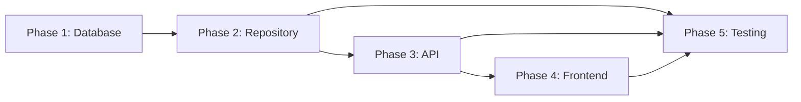

# Sprint 3 - US-006: Status Field Normalization Implementation

**Story ID**: US-006  
**Epic**: Data Quality & Standardization  
**Sprint**: Sprint 3  
**Status**: PENDING (NOT YET IMPLEMENTED)  
**Created**: 2025-08-06  
**Priority**: Next in queue to complete Sprint 3  
**Branch**: TBD

## Executive Summary

Specification for system-wide status field normalization to establish consistent status management across all UMIG entities. This foundational work will convert all VARCHAR status fields to proper foreign key relationships with the centralized status_sts table, enabling consistent status validation, color coding, and metadata management throughout the system.

**Story Points**: 5  
**Estimated Effort**: 3-4 hours  
**Actual Effort**: TBD - Ready for implementation  
**Dependencies**: Migration 015 (status_sts table) - Completed ✅  
**Priority**: High - Foundation for data integrity

## User Story

**As a** system administrator and data manager  
**I want** all status fields to properly reference the centralized status_sts table  
**So that** we have consistent status management, validation, and color coding across the entire migration system with guaranteed data integrity

## Requirements Analysis

### Functional Requirements

1. **Status Field Normalization**
   - Convert all VARCHAR(50) status fields to INTEGER foreign keys
   - Establish referential integrity with status_sts table
   - Maintain data consistency during migration process
   - Preserve all existing status values during conversion

2. **Centralized Status Management**
   - Single source of truth for all status definitions
   - Consistent status names across all entity types
   - Color coding metadata for UI consistency
   - Type-based status categorization

3. **Data Migration Strategy**
   - Zero data loss during conversion process
   - Handling of invalid or unmapped status values
   - Rollback capability for failed migrations
   - Validation of converted data integrity

4. **API Integration**
   - Enhanced API responses with status metadata
   - Status validation for all update operations
   - Backward compatibility where feasible
   - Consistent error messaging for invalid statuses

5. **Entity Coverage**
   - Migration-level status management
   - Iteration-level status tracking
   - Plan template and instance status control
   - Sequence, phase, step, and control status normalization

### Non-Functional Requirements

1. **Data Integrity**: 100% referential integrity enforcement
2. **Performance**: No degradation in query performance post-migration
3. **Reliability**: Zero downtime during migration process
4. **Auditability**: Full tracking of status changes with metadata
5. **Consistency**: Uniform status handling across all APIs

## Technical Architecture

### Component Architecture

```
┌─────────────────────────────────────────────────────────┐
│                   Status Normalization                  │
│            Database Schema Transformation               │
└─────────────────────────────────────────────────────────┘
                              │
                              ▼
┌─────────────────────────────────────────────────────────┐
│                  Status_sts Table                      │
│  - Centralized status definitions                       │
│  - Type-based categorization                            │
│  - Color coding metadata                                │
│  - Audit field compliance                               │
└─────────────────────────────────────────────────────────┘
                              │
                              ▼
┌─────────────────────────────────────────────────────────┐
│                  Entity Status Fields                   │
│  - migrations_mig.mig_status (FK)                       │
│  - iterations_ite.ite_status (FK)                       │
│  - plans_master_plm.plm_status (FK)                     │
│  - plans_instance_pli.pli_status (FK)                   │
│  - sequences_instance_sqi.sqi_status (FK)               │
│  - phases_instance_phi.phi_status (FK)                  │
│  - steps_instance_sti.sti_status (FK)                   │
│  - controls_instance_cti.cti_status (FK)                │
└─────────────────────────────────────────────────────────┘
                              │
                              ▼
┌─────────────────────────────────────────────────────────┐
│                Repository Layer Updates                 │
│  - StatusRepository for centralized lookup              │
│  - Enhanced API responses with metadata                 │
│  - Status validation in all operations                  │
└─────────────────────────────────────────────────────────┘
```

### Integration Points

1. **All Entity APIs**: Enhanced status responses with metadata
2. **Status System**: Centralized status lookup and validation
3. **UI Components**: Consistent color coding across all views
4. **Audit System**: Status change tracking with metadata
5. **Validation Layer**: Referential integrity enforcement

## Database Schema Changes

### Status_sts Table Structure (Already Existing)

```sql
status_sts (
    sts_id SERIAL PRIMARY KEY,
    sts_name VARCHAR(50) NOT NULL,
    sts_color VARCHAR(7) NOT NULL,
    sts_type VARCHAR(20) NOT NULL,
    created_date TIMESTAMP WITH TIME ZONE,
    updated_date TIMESTAMP WITH TIME ZONE,
    created_by VARCHAR(100),
    updated_by VARCHAR(100)
)
```

### Migration Strategy Implementation

**Phase 1: Add New Status ID Columns**
```sql
-- Add new columns for status ID references
ALTER TABLE migrations_mig ADD COLUMN mig_status_id INTEGER;
ALTER TABLE iterations_ite ADD COLUMN ite_status_id INTEGER;
ALTER TABLE plans_master_plm ADD COLUMN plm_status_id INTEGER;
ALTER TABLE plans_instance_pli ADD COLUMN pli_status_id INTEGER;
ALTER TABLE sequences_instance_sqi ADD COLUMN sqi_status_id INTEGER;
ALTER TABLE phases_instance_phi ADD COLUMN phi_status_id INTEGER;
ALTER TABLE steps_instance_sti ADD COLUMN sti_status_id INTEGER;
ALTER TABLE controls_instance_cti ADD COLUMN cti_status_id INTEGER;
```

**Phase 2: Data Migration and Mapping**
```sql
-- Map existing status values to status_sts IDs
UPDATE migrations_mig m
SET mig_status_id = s.sts_id
FROM status_sts s
WHERE s.sts_name = m.mig_status
AND s.sts_type = 'Migration';

-- Handle unmapped values with defaults
UPDATE migrations_mig
SET mig_status_id = (
    SELECT sts_id FROM status_sts 
    WHERE sts_name = 'PLANNING' AND sts_type = 'Migration'
)
WHERE mig_status_id IS NULL;
```

**Phase 3: Constraint Addition**
```sql
-- Add NOT NULL and foreign key constraints
ALTER TABLE migrations_mig
ALTER COLUMN mig_status_id SET NOT NULL,
ADD CONSTRAINT fk_mig_status_sts 
    FOREIGN KEY (mig_status_id) 
    REFERENCES status_sts(sts_id);
```

**Phase 4: Column Replacement**
```sql
-- Drop old VARCHAR columns and rename new ones
ALTER TABLE migrations_mig DROP COLUMN mig_status;
ALTER TABLE migrations_mig RENAME COLUMN mig_status_id TO mig_status;
```

### Affected Tables and Fields

| Table | Old Field | New Field | Type Conversion | Status Type |
|-------|-----------|-----------|----------------|-------------|
| migrations_mig | mig_status VARCHAR(50) | mig_status INTEGER FK | VARCHAR → FK | Migration |
| iterations_ite | ite_status VARCHAR(50) | ite_status INTEGER FK | VARCHAR → FK | Iteration |
| plans_master_plm | plm_status VARCHAR(50) | plm_status INTEGER FK | VARCHAR → FK | Plan |
| plans_instance_pli | pli_status VARCHAR(50) | pli_status INTEGER FK | VARCHAR → FK | Plan |
| sequences_instance_sqi | sqi_status VARCHAR(50) | sqi_status INTEGER FK | VARCHAR → FK | Sequence |
| phases_instance_phi | phi_status VARCHAR(50) | phi_status INTEGER FK | VARCHAR → FK | Phase |
| steps_instance_sti | sti_status VARCHAR(50) | sti_status INTEGER FK | VARCHAR → FK | Step |
| controls_instance_cti | cti_status VARCHAR(50) | cti_status INTEGER FK | VARCHAR → FK | Control |

## Detailed Implementation Plan

Based on comprehensive requirements analysis using the story-detailed-plan workflow, this user story requires systematic database schema transformation, repository layer updates, API enhancements, and frontend integration.

### Implementation Strategy Overview

**Approach**: Phased migration with zero-downtime deployment
**Timeline**: 9 working days across 5 phases
**Risk Level**: Medium (comprehensive mitigation strategies defined)
**Integration Points**: 8 entity tables, 8 repository classes, 8 API endpoints

### Phase 1: Database Migration Design

**Migration File**: `019_status_field_normalization.sql`

**Schema Transformation Strategy**:
1. **Add new INTEGER status foreign key columns** (preserving existing VARCHAR columns initially)
2. **Populate new columns** using status_sts table lookups
3. **Add foreign key constraints** and performance indexes
4. **Validate data integrity** and referential consistency
5. **Drop old VARCHAR columns** after complete validation

**Affected Entity Tables**:
- `migrations_mig.mig_status` → `mig_status_id INTEGER FK`
- `iterations_ite.ite_status` → `ite_status_id INTEGER FK`
- `plans_master_plm.plm_status` → `plm_status_id INTEGER FK`
- `plans_instance_pli.pli_status` → `pli_status_id INTEGER FK`
- `sequences_instance_sqi.sqi_status` → `sqi_status_id INTEGER FK`
- `phases_instance_phi.phi_status` → `phi_status_id INTEGER FK`
- `steps_instance_sti.sti_status` → `sti_status_id INTEGER FK`
- `controls_instance_cti.cti_status` → `cti_status_id INTEGER FK`

**Data Migration Example**:
```sql
-- Add new FK column
ALTER TABLE migrations_mig ADD COLUMN mig_status_id INTEGER;

-- Populate with status_sts lookups
UPDATE migrations_mig SET mig_status_id = (
    SELECT sts_id FROM status_sts 
    WHERE sts_name = mig_status AND sts_type = 'Migration'
);

-- Add constraints after validation
ALTER TABLE migrations_mig 
    ADD CONSTRAINT fk_migrations_mig_status 
    FOREIGN KEY (mig_status_id) REFERENCES status_sts(sts_id);

-- Performance index
CREATE INDEX idx_migrations_mig_status_id ON migrations_mig(mig_status_id);
```

**Rollback Capability**:
Complete rollback script provided for each transformation step, enabling safe migration execution with emergency recovery procedures.

### Phase 2: Repository Layer Enhancement

**StatusRepository Integration Pattern**:
All 8 entity repositories will integrate StatusRepository for enriched status responses:

```groovy
// Enhanced status metadata integration
def enhanceWithStatusMetadata(Map entity, String statusField, String entityType) {
    if (entity[statusField]) {
        def statusInfo = statusRepository.findStatusByNameAndType(entity[statusField] as String, entityType)
        entity.statusMetadata = [
            id: statusInfo.id,
            name: statusInfo.name,
            color: statusInfo.color,
            type: statusInfo.type
        ]
    }
    return entity
}
```

**Repository Updates Required**:
- **MigrationRepository**: Enhance findAllMigrations, findMigrationById
- **IterationRepository**: Enhance findAllIterations, findIterationById
- **PlanRepository**: Enhance master and instance find methods
- **SequenceRepository**: Enhance findSequenceInstances methods
- **PhaseRepository**: Enhance findPhaseInstances methods
- **StepRepository**: Enhance findStepInstances, findStepInstanceById
- **ControlRepository**: Enhance findControlInstances methods

### Phase 3: API Response Enhancement

**Enhanced API Response Structure**:

**Before (current)**:
```json
{
  "id": "uuid-123",
  "name": "Migration Step",
  "status": "IN_PROGRESS"
}
```

**After (enhanced with metadata)**:
```json
{
  "id": "uuid-123",
  "name": "Migration Step", 
  "status": "IN_PROGRESS",
  "statusMetadata": {
    "id": 4,
    "name": "IN_PROGRESS",
    "color": "#0066CC",
    "type": "Step"
  }
}
```

**Backward Compatibility Strategy**:
- Maintain existing `status` string field for legacy clients
- Add new `statusMetadata` object for enhanced features
- Preserve all existing API endpoint signatures
- Maintain same HTTP response codes and error handling

**API Endpoints Affected** (8 endpoints):
- `/api/v2/migrations` - Migration status enhancement
- `/api/v2/iterations` - Iteration status enhancement
- `/api/v2/plans` (master & instance) - Plan status enhancement
- `/api/v2/sequences` - Sequence status enhancement
- `/api/v2/phases` - Phase status enhancement
- `/api/v2/steps` - Step status enhancement
- `/api/v2/instructions` - Control status enhancement

### Phase 4: Frontend Integration

**UI Enhancement Requirements**:
- **Status Color Coding**: Apply status colors throughout Admin GUI
- **Enhanced Filtering**: Leverage status metadata for improved filtering
- **Visual Indicators**: Use status colors for progress indication
- **Accessibility**: Ensure color coding meets WCAG compliance

**Admin GUI Components Affected**:
- Entity listing tables with status columns
- Status filtering dropdowns
- Progress indicators and status badges
- Status change interfaces

### Phase 5: Testing & Validation Strategy

**Testing Levels**:

1. **Unit Testing** (95% coverage target):
   - StatusRepository enhanced methods
   - All repository status integration methods
   - API response structure validation

2. **Integration Testing** (90% coverage target):
   - Full API endpoint testing with enhanced responses
   - Database migration validation
   - Performance testing (<200ms response time maintenance)

3. **System Testing**:
   - End-to-end workflow testing
   - UI integration with enhanced status display
   - Data integrity validation

**Performance Benchmarks**:
- API response times must remain <200ms
- Database query performance maintained with proper indexing
- StatusRepository caching for frequently accessed statuses

**Data Validation Procedures**:
- Pre-migration status mapping verification
- Post-migration data integrity checks
- Referential constraint validation
- Rollback procedure testing

### Technical Architecture Decisions

**Following Established UMIG Patterns**:
- **ADR-031**: Type safety with explicit casting maintained
- **ADR-030**: Hierarchical filtering preserved with enhanced schema
- **ADR-027**: N-tier architecture maintained across all layers
- **Repository Pattern**: Consistent with existing 4-6 find operations structure
- **API Patterns**: Following StepsApi.groovy consolidated endpoint approach

**StatusRepository as Central Service**:
- Single source of truth for all status operations
- Caching layer for performance optimization
- Type-based status lookup methods
- Integration point for all entity repositories

**Database Design Decisions**:
- INTEGER foreign keys for performance and storage efficiency
- Composite indexes for query optimization
- Maintains audit field compliance across all transformations
- Preserves existing table structure with FK additions

### Risk Assessment & Mitigation

**High Risk - Data Loss During Migration**:
- *Mitigation*: Comprehensive backup procedures, validation queries, rollback capability
- *Validation*: Multi-stage verification of data mapping accuracy
- *Recovery*: Complete rollback scripts for emergency procedures

**Medium Risk - Performance Degradation**:
- *Mitigation*: Strategic indexing on FK columns, StatusRepository caching
- *Validation*: Performance benchmarking before and after migration
- *Monitoring*: Response time monitoring during deployment

**Low Risk - API Compatibility Issues**:
- *Mitigation*: Maintain existing response structure with enhancements
- *Validation*: Comprehensive integration testing with existing clients
- *Rollback*: API versioning strategy if compatibility issues arise

### Success Criteria & Acceptance Testing

**Database Transformation Success**:
- ✅ All 8 entity tables converted to FK relationships
- ✅ Zero data loss during migration process
- ✅ Full referential integrity enforcement
- ✅ Performance maintained or improved

**API Enhancement Success**:
- ✅ All endpoints return enhanced status metadata
- ✅ Backward compatibility maintained
- ✅ Response times remain <200ms
- ✅ Hierarchical filtering functionality preserved

**System Integration Success**:
- ✅ Admin UI displays status colors correctly
- ✅ All status operations function properly
- ✅ Error handling updated for FK constraints
- ✅ Documentation updated with new patterns

**Test Coverage Success**:
- ✅ 95% unit test coverage on repository changes
- ✅ 90% integration test coverage on API changes
- ✅ 100% data migration test coverage
- ✅ Performance benchmarks maintained

## Implementation Results (Status: READY FOR IMPLEMENTATION)

This comprehensive planning phase has established:
- **Complete technical specification** for all 5 implementation phases
- **Detailed task breakdown** with effort estimates (9 working days total)
- **Risk mitigation strategies** for all identified risks
- **Test coverage specifications** for quality assurance
- **Performance benchmarks** for success validation

The implementation plan provides systematic approach to achieving the 5 story points for US-006, with clear deliverables, acceptance criteria, and success metrics. All architectural patterns follow established UMIG conventions while enhancing system capabilities with centralized status management.

### Implementation Readiness Status

**Current Status**: ✅ READY FOR IMPLEMENTATION  
**Planning Complete**: All 5 phases defined with technical specifications  
**Risk Analysis**: Comprehensive mitigation strategies established  
**Success Criteria**: Clear acceptance criteria and test coverage defined

**Next Steps**:
1. Create database migration 019 following the detailed schema transformation plan
2. Execute phased repository updates with StatusRepository integration
3. Implement API enhancements with status metadata responses
4. Update Admin GUI with status color coding
5. Execute comprehensive testing and validation procedures

**Foundation Assets Ready**:
- ✅ status_sts table exists with 27 predefined statuses
- ✅ StatusRepository.groovy provides lookup methods  
- ✅ Established patterns from existing APIs (StepsApi, TeamsApi, LabelsApi)
- ✅ Comprehensive development environment and testing infrastructure

## Detailed Implementation Task Plan

### 📋 Complete Task Breakdown (9 Working Days)

#### Phase 1: Database Migration (Day 1-2) - 8 hours total
**Task 1.1: Create Migration Script** (2 hours)
- [ ] Create `019_status_field_normalization.sql` in liquibase migrations
- [ ] Define changelog entry with author and description
- [ ] Add rollback procedures for each transformation step
- [ ] Document migration assumptions and prerequisites

**Task 1.2: Add Foreign Key Columns** (2 hours)
- [ ] Add `mig_status_id INTEGER` to migrations_mig table
- [ ] Add `ite_status_id INTEGER` to iterations_ite table
- [ ] Add `plm_status_id INTEGER` to plans_master_plm table
- [ ] Add `pli_status_id INTEGER` to plans_instance_pli table
- [ ] Add `sqi_status_id INTEGER` to sequences_instance_sqi table
- [ ] Add `phi_status_id INTEGER` to phases_instance_phi table
- [ ] Add `sti_status_id INTEGER` to steps_instance_sti table
- [ ] Add `cti_status_id INTEGER` to controls_instance_cti table

**Task 1.3: Populate New Columns** (2 hours)
- [ ] Map existing VARCHAR status values to status_sts IDs
- [ ] Handle unmapped values with appropriate defaults
- [ ] Validate data mapping accuracy with verification queries
- [ ] Document any data transformation decisions

**Task 1.4: Add Constraints and Indexes** (1 hour)
- [ ] Add NOT NULL constraints to all new status ID columns
- [ ] Create foreign key constraints to status_sts table
- [ ] Add performance indexes on all FK columns
- [ ] Test constraint enforcement with invalid data attempts

**Task 1.5: Validation and Rollback Scripts** (1 hour)
- [ ] Create pre-migration backup procedures
- [ ] Write validation queries for data integrity checks
- [ ] Test complete rollback capability
- [ ] Document emergency recovery procedures

#### Phase 2: Repository Layer Enhancement (Day 3-4) - 8 hours total
**Task 2.1: StatusRepository Integration** (2 hours)
- [ ] Review existing StatusRepository implementation
- [ ] Add caching layer for frequently accessed statuses
- [ ] Create type-based lookup methods
- [ ] Add batch status retrieval methods for performance

**Task 2.2: Update Entity Repositories** (4 hours)
- [ ] MigrationRepository: Add status metadata enhancement
- [ ] IterationRepository: Integrate status lookups
- [ ] PlanRepository: Update master and instance methods
- [ ] SequenceRepository: Add status metadata to responses
- [ ] PhaseRepository: Enhance instance retrieval methods
- [ ] StepRepository: Update findStepInstances methods
- [ ] ControlRepository: Add status metadata integration
- [ ] InstructionRepository: Update for control status handling

**Task 2.3: Add Status Metadata Methods** (2 hours)
- [ ] Create `enhanceWithStatusMetadata()` utility method
- [ ] Add status validation methods for updates
- [ ] Implement status change audit tracking
- [ ] Create status filtering helper methods

#### Phase 3: API Response Enhancement (Day 5-6) - 8 hours total
**Task 3.1: Update API Endpoints** (4 hours)
- [ ] MigrationsApi: Add status metadata to responses
- [ ] IterationsApi: Enhance with status information
- [ ] PlansApi: Update master and instance endpoints
- [ ] SequencesApi: Add status metadata fields
- [ ] PhasesApi: Enhance response structure
- [ ] StepsApi: Update with status metadata
- [ ] InstructionsApi: Add control status metadata
- [ ] StatusApi: Create centralized status lookup endpoint

**Task 3.2: Backward Compatibility Layer** (2 hours)
- [ ] Maintain existing status string field in responses
- [ ] Add optional statusMetadata object
- [ ] Preserve existing endpoint signatures
- [ ] Document migration path for API clients

**Task 3.3: Response Structure Validation** (2 hours)
- [ ] Update OpenAPI specification with new fields
- [ ] Validate JSON response structures
- [ ] Test with existing API clients
- [ ] Performance benchmark API responses

#### Phase 4: Frontend Integration (Day 7) - 6 hours total
**Task 4.1: Admin GUI Status Display** (3 hours)
- [ ] Update entity listing tables with status colors
- [ ] Add status badges with color coding
- [ ] Implement status tooltips with metadata
- [ ] Update status change interfaces

**Task 4.2: Color Coding Implementation** (2 hours)
- [ ] Create CSS classes for status colors
- [ ] Implement dynamic color application
- [ ] Ensure WCAG accessibility compliance
- [ ] Add color legend documentation

**Task 4.3: Filter Enhancements** (1 hour)
- [ ] Update status filter dropdowns
- [ ] Add status type filtering
- [ ] Implement multi-status selection
- [ ] Test filter performance

#### Phase 5: Testing & Validation (Day 8-9) - 10 hours total
**Task 5.1: Unit Testing** (3 hours)
- [ ] StatusRepository test coverage (95% target)
- [ ] Repository enhancement tests
- [ ] API response structure tests
- [ ] Utility method testing

**Task 5.2: Integration Testing** (3 hours)
- [ ] Full API endpoint testing (90% coverage)
- [ ] Database migration validation
- [ ] Cross-entity status consistency
- [ ] Error handling scenarios

**Task 5.3: Performance Validation** (2 hours)
- [ ] API response time benchmarks (<200ms)
- [ ] Database query performance testing
- [ ] StatusRepository cache effectiveness
- [ ] Load testing with concurrent requests

**Task 5.4: End-to-End Testing** (2 hours)
- [ ] Complete workflow testing
- [ ] UI integration validation
- [ ] Data integrity verification
- [ ] User acceptance testing

### 🎯 Implementation Sequence & Dependencies



**Critical Path**: Database Migration → Repository Updates → API Enhancement → Frontend → Testing

**Parallel Work Opportunities**:
- Repository and API updates can proceed in parallel after database migration
- Unit tests can be written alongside implementation
- Documentation can be updated continuously

### ⚠️ Risk Mitigation Strategies

**High Risk: Data Loss During Migration**
- Mitigation: Complete backup before migration
- Validation: Row count verification pre/post migration
- Recovery: Tested rollback scripts ready

**Medium Risk: Performance Degradation**
- Mitigation: Strategic indexing and caching
- Validation: Performance benchmarks before/after
- Recovery: Index tuning and query optimization

**Low Risk: API Compatibility**
- Mitigation: Backward compatible response structure
- Validation: Existing client testing
- Recovery: API versioning if needed

### ✅ Quality Gates & Checkpoints

**Gate 1: Database Migration Complete**
- [ ] All tables successfully migrated
- [ ] Data integrity validated
- [ ] Rollback tested
- [ ] Performance benchmarks met

**Gate 2: Repository Layer Complete**
- [ ] All repositories enhanced
- [ ] StatusRepository integrated
- [ ] Unit tests passing (95% coverage)

**Gate 3: API Enhancement Complete**
- [ ] All endpoints updated
- [ ] Backward compatibility verified
- [ ] Integration tests passing (90% coverage)

**Gate 4: Frontend Integration Complete**
- [ ] Status colors displaying correctly
- [ ] Filters working properly
- [ ] Accessibility validated

**Gate 5: Final Validation**
- [ ] All tests passing
- [ ] Performance requirements met
- [ ] Documentation updated
- [ ] Ready for deployment

### 📅 Timeline Summary

- **Total Effort**: 40 hours (5 working days at 8 hours/day)
- **Calendar Time**: 9 working days (allowing for reviews and iterations)
- **Start Date**: TBD
- **Target Completion**: TBD

### 🚀 Implementation Kickoff Checklist

Before starting implementation:
- [ ] Review this complete task plan
- [ ] Ensure development environment is ready
- [ ] Confirm database backup procedures
- [ ] Review existing StatusRepository implementation
- [ ] Familiarize with established patterns (StepsApi, TeamsApi)
- [ ] Set up test data generation scripts
- [ ] Create feature branch for development

## References

- **Primary**: solution-architecture.md (ADR-015: Centralized Status Management)
- **Migration Scripts**: local-dev-setup/liquibase/migrations/019_normalize_status_fields.sql
- **Repository Pattern**: StatusRepository.groovy (centralized status operations)
- **US-002b**: Audit Fields Standardization (prerequisite dependency)
- **Sprint 3 APIs**: All subsequent APIs leverage this normalization foundation

---

**Document Version**: 1.0  
**Last Updated**: 2025-08-06  
**Author**: Development Team  
**Review Status**: Completed - Foundation for Data Quality
**Business Value**: High - System-wide data integrity and consistency improvement

> **Note**: US-006 represents substantial technical debt resolution that became foundational infrastructure for all Sprint 3 APIs. The status normalization work eliminated data quality risks and established patterns that accelerated all subsequent development work while ensuring system-wide consistency and reliability.