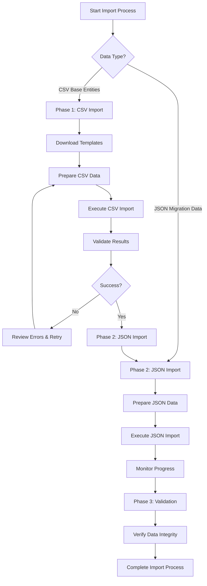

# UMIG Data Import User Guide

**Version**: 2.0.0  
**Date**: September 3, 2025  
**Target Audience**: Migration Teams, System Administrators, Project Managers  

## Overview

This guide provides step-by-step instructions for importing migration data into the UMIG system. The import process supports both CSV-based base entity imports and JSON-based hierarchical migration data with comprehensive validation, progress tracking, and rollback capabilities.

## Prerequisites

### Required Access
- **Confluence Administrator Access**: All import operations require administrator privileges
- **UMIG System Access**: Active Confluence session with UMIG system access
- **Network Connectivity**: Access to UMIG system at `http://localhost:8090` (development) or production URL

### Required Knowledge
- Understanding of entity relationships (Teams → Users → Migration Data)
- Basic familiarity with CSV format and JSON structure
- Migration planning concepts and data dependencies

### Required Data Preparation
- Migration data organized according to UMIG schema
- CSV files formatted according to provided templates
- JSON data extracted from Confluence HTML (if applicable)

## Import Data Types

### Base Entity Data (CSV Format)
- **Teams**: Organizational teams involved in migrations
- **Users**: User accounts with team associations and roles
- **Applications**: Application definitions for migration tracking
- **Environments**: Environment definitions (DEV, TEST, PROD, etc.)

### Migration Data (JSON Format)
- **Steps**: High-level migration steps with metadata
- **Instructions**: Detailed instructions within each step
- **Hierarchical Data**: Complete migration plans with step-instruction relationships

## Import Workflow Overview



---

## Phase 1: Base Entity Import (CSV)

### Step 1: Download CSV Templates

#### Via Admin GUI (Recommended)
1. Navigate to UMIG Admin Interface
2. Go to **Data Management** → **Import**
3. Click **Download Templates** section
4. Download required templates:
   - `teams_template.csv` - Team definitions
   - `applications_template.csv` - Application definitions  
   - `environments_template.csv` - Environment definitions
   - `users_template.csv` - User accounts (import last)

#### Via API (Advanced Users)
```bash
# Download all templates
for entity in teams users applications environments; do
  curl -X GET "http://localhost:8090/rest/scriptrunner/latest/custom/import/templates/${entity}" \
    -H "Authorization: Basic <credentials>" \
    -o "${entity}_template.csv"
done
```

### Step 2: Prepare CSV Data

#### Entity Dependencies and Import Order
**CRITICAL**: Import entities in this exact order due to foreign key dependencies:

1. **Teams** (no dependencies)
2. **Applications** (no dependencies)
3. **Environments** (no dependencies)
4. **Users** (depends on Teams via tms_id)

#### Teams Data Preparation
**Template**: `teams_template.csv`
```csv
tms_id,tms_name,tms_email,tms_description
1,Platform Engineering,platform-eng@company.com,Core platform engineering team
2,Data Engineering,data-eng@company.com,Data platform and analytics team
```

**Validation Rules**:
- `tms_name`: Required, max 64 characters, must be unique
- `tms_email`: Optional, max 255 characters, must be unique if provided
- `tms_description`: Optional text field

#### Applications Data Preparation
**Template**: `applications_template.csv`
```csv
app_id,app_code,app_name,app_description
1,CRM001,Customer CRM,Customer relationship management system
2,ERP002,Enterprise ERP,Enterprise resource planning system
```

**Validation Rules**:
- `app_code`: Required, max 50 characters, must be unique
- `app_name`: Optional, max 64 characters
- `app_description`: Optional text field

#### Environments Data Preparation
**Template**: `environments_template.csv`
```csv
env_id,env_code,env_name,env_description
1,DEV,Development,Development environment
2,TEST,Testing,Testing and QA environment
3,PROD,Production,Production environment
```

**Validation Rules**:
- `env_code`: Required, max 10 characters, must be unique
- `env_name`: Optional, max 64 characters
- `env_description`: Optional text field

#### Users Data Preparation
**Template**: `users_template.csv`
```csv
usr_id,usr_code,usr_first_name,usr_last_name,usr_email,usr_is_admin,tms_id,rls_id
1,JDO,John,Doe,john.doe@company.com,true,1,1
2,JSM,Jane,Smith,jane.smith@company.com,false,2,2
```

**Validation Rules**:
- `usr_code`: Required, exactly 3 characters, must be unique
- `usr_first_name`: Required, max 50 characters
- `usr_last_name`: Required, max 50 characters
- `usr_email`: Required, max 255 characters, must be unique
- `usr_is_admin`: Boolean (true/false), defaults to false
- `tms_id`: Optional, must reference existing team
- `rls_id`: Optional, must reference existing role

#### CSV Formatting Guidelines
1. **Use UTF-8 encoding** for all CSV files
2. **Include header row** with exact column names from templates
3. **Quote text fields** containing commas or special characters
4. **Use Unix (LF) or Windows (CRLF)** line endings (both supported)
5. **Leave blank for NULL values** (don't use "null" or "NULL")
6. **Boolean values**: Use `true` or `false` (case-insensitive)
7. **Integer values**: Plain numbers without quotes

### Step 3: Execute CSV Import

#### Import Individual Entities (Recommended for First-Time Import)

**Teams Import**:
```bash
curl -X POST http://localhost:8090/rest/scriptrunner/latest/custom/import/csv/teams \
  -H "Content-Type: text/csv" \
  --data-binary @teams_prepared.csv
```

**Applications Import**:
```bash
curl -X POST http://localhost:8090/rest/scriptrunner/latest/custom/import/csv/applications \
  -H "Content-Type: text/csv" \
  --data-binary @applications_prepared.csv
```

**Environments Import**:
```bash
curl -X POST http://localhost:8090/rest/scriptrunner/latest/custom/import/csv/environments \
  -H "Content-Type: text/csv" \
  --data-binary @environments_prepared.csv
```

**Users Import** (after teams):
```bash
curl -X POST http://localhost:8090/rest/scriptrunner/latest/custom/import/csv/users \
  -H "Content-Type: text/csv" \
  --data-binary @users_prepared.csv
```

#### Import All Entities in Sequence (Advanced)
```bash
curl -X POST http://localhost:8090/rest/scriptrunner/latest/custom/import/csv/all \
  -H "Content-Type: application/json" \
  -d '{
    "teams": "tms_id,tms_name,tms_email,tms_description\n1,Platform Engineering,platform-eng@company.com,Core platform engineering team",
    "applications": "app_id,app_code,app_name,app_description\n1,CRM001,Customer CRM,Customer relationship management system",
    "environments": "env_id,env_code,env_name,env_description\n1,DEV,Development,Development environment",
    "users": "usr_id,usr_code,usr_first_name,usr_last_name,usr_email,usr_is_admin,tms_id,rls_id\n1,JDO,John,Doe,john.doe@company.com,true,1,1"
  }'
```

### Step 4: Validate CSV Import Results

#### Success Response Example
```json
{
  "success": true,
  "message": "Teams import completed successfully",
  "batchId": "550e8400-e29b-41d4-a716-446655440000",
  "statistics": {
    "totalRows": 10,
    "processedRows": 10,
    "importedRows": 8,
    "skippedRows": 2,
    "errorRows": 0
  },
  "source": "teams_import.csv"
}
```

#### Error Handling
- **Skipped Rows**: Usually due to duplicate records (not errors)
- **Error Rows**: Validation failures requiring data correction
- **Processing Errors**: System-level issues requiring administrator intervention

#### Import Statistics Validation
1. **Verify Import Counts**: Check that `importedRows` matches expected record count
2. **Review Skipped Records**: Confirm skipped records are intentional duplicates
3. **Check Error Details**: Address any error rows before proceeding
4. **Validate Data Integrity**: Spot-check imported data in UMIG system

---

## Phase 2: Migration Data Import (JSON)

### Step 1: Prepare JSON Migration Data

#### JSON Data Sources
- **Confluence HTML Extraction**: Use provided extraction tools to convert Confluence pages to JSON
- **Manual JSON Creation**: Create JSON files following UMIG schema
- **Third-party System Export**: Convert data exports to UMIG JSON format

#### Required JSON Structure
```json
{
  "steps": [
    {
      "title": "Database Migration Setup",
      "description": "Prepare database for migration process",
      "step_type": "PRE",
      "estimated_duration": 120,
      "instructions": [
        {
          "text": "Create backup of current database",
          "order": 1,
          "instruction_type": "MANUAL"
        },
        {
          "text": "Verify backup integrity",
          "order": 2,
          "instruction_type": "VALIDATION"
        }
      ]
    }
  ]
}
```

#### JSON Validation Requirements
- **Valid JSON Format**: Use JSON validator to ensure proper syntax
- **Required Fields**: All required fields must be present and non-null
- **Data Types**: Ensure field types match schema (strings, integers, arrays)
- **Relationships**: Verify step-instruction relationships are properly structured

### Step 2: Execute JSON Import

#### Single File Import
```bash
curl -X POST http://localhost:8090/rest/scriptrunner/latest/custom/import/json \
  -H "Content-Type: application/json" \
  -d '{
    "source": "migration_plan_phase1.json",
    "content": "{\"steps\": [{\"title\": \"Database Setup\", \"instructions\": [{\"text\": \"Create schema\", \"order\": 1}]}]}"
  }'
```

#### Batch Import (Multiple Files)
```bash
curl -X POST http://localhost:8090/rest/scriptrunner/latest/custom/import/batch \
  -H "Content-Type: application/json" \
  -d '{
    "files": [
      {
        "filename": "phase1_migration.json",
        "content": "{\"steps\": [{\"title\": \"Phase 1 Setup\"}]}"
      },
      {
        "filename": "phase2_migration.json", 
        "content": "{\"steps\": [{\"title\": \"Phase 2 Execution\"}]}"
      }
    ]
  }'
```

### Step 3: Monitor Import Progress

#### Check Import Status
```bash
# Get specific batch details
curl -X GET http://localhost:8090/rest/scriptrunner/latest/custom/import/batch/{batchId} \
  -H "Authorization: Basic <credentials>"

# Get import statistics
curl -X GET http://localhost:8090/rest/scriptrunner/latest/custom/import/statistics \
  -H "Authorization: Basic <credentials>"
```

#### Progress Monitoring Best Practices
1. **Record Batch IDs**: Save batch IDs from import responses for tracking
2. **Monitor System Resources**: Watch for memory/CPU usage during large imports
3. **Check Database Growth**: Monitor database size increases during import
4. **Review Processing Times**: Track import duration for capacity planning

---

## Phase 3: Validation and Verification

### Step 1: Data Integrity Checks

#### Verify Entity Relationships
1. **Team-User Associations**: Confirm users are correctly linked to teams
2. **Application References**: Verify applications are properly imported
3. **Environment Consistency**: Check environment definitions match requirements
4. **Step-Instruction Hierarchy**: Validate step-instruction relationships in migration data

#### Database Validation Queries
```sql
-- Check team-user relationships
SELECT t.tms_name, COUNT(u.usr_id) as user_count 
FROM tbl_teams_master t 
LEFT JOIN tbl_users_master u ON t.tms_id = u.tms_id 
GROUP BY t.tms_name;

-- Check import batch completion
SELECT imb_status, COUNT(*) as batch_count 
FROM tbl_import_batches 
GROUP BY imb_status;

-- Verify step-instruction counts
SELECT COUNT(*) as total_steps FROM stg_steps;
SELECT COUNT(*) as total_instructions FROM stg_step_instructions;
```

#### Admin GUI Validation
1. Navigate to Admin Interface
2. Review imported entities in each section:
   - Teams Management
   - User Management  
   - Applications Management
   - Environments Management
3. Spot-check data accuracy and completeness
4. Test navigation and search functionality

### Step 2: Import Statistics Review

#### Key Metrics to Validate
- **Total Records Processed**: Should match expected data volume
- **Success Rate**: Aim for >95% successful imports
- **Error Rate**: Address any errors before going to production
- **Processing Time**: Validate performance meets requirements

#### Import History Analysis
```bash
# Get comprehensive import history
curl -X GET "http://localhost:8090/rest/scriptrunner/latest/custom/import/history?limit=50" \
  -H "Authorization: Basic <credentials>"
```

**Review Import History For**:
- Import completion status
- Processing times and performance
- Error patterns or recurring issues
- User attribution and audit trail

### Step 3: Data Quality Validation

#### Content Validation Checklist
- [ ] **Team Names**: Check for proper naming conventions
- [ ] **User Email Addresses**: Validate email format and uniqueness
- [ ] **Application Codes**: Verify code format and uniqueness
- [ ] **Environment Types**: Confirm environment categories are correct
- [ ] **Step Instructions**: Review instruction text for completeness
- [ ] **Migration Dependencies**: Validate step ordering and dependencies

#### Business Logic Validation
- [ ] **User Role Assignments**: Verify admin users have appropriate access
- [ ] **Team Hierarchies**: Check team structures match organizational chart
- [ ] **Application Ownership**: Validate application-team assignments
- [ ] **Environment Purposes**: Confirm environment descriptions are accurate

---

## Error Handling and Troubleshooting

### Common Import Errors

#### CSV Import Errors

**Duplicate Key Violations (HTTP 409)**
```json
{
  "error": "Duplicate data detected", 
  "details": "Team name 'Platform Engineering' already exists"
}
```
**Resolution**: Check for existing data or update CSV to avoid duplicates

**Foreign Key Violations (HTTP 400)**
```json
{
  "error": "Foreign key constraint violation",
  "details": "Referenced team does not exist for user import" 
}
```
**Resolution**: Ensure teams are imported before users

**Invalid Data Format**
```json
{
  "error": "Invalid CSV format",
  "details": "Missing required column: tms_name"
}
```
**Resolution**: Verify CSV headers match template exactly

#### JSON Import Errors

**Invalid JSON Structure**
```json
{
  "error": "Invalid JSON format in content field",
  "details": "Unexpected character at position 45"
}
```
**Resolution**: Validate JSON syntax using online JSON validator

**Schema Validation Failures**
```json
{
  "error": "Missing required fields in JSON structure",
  "details": "Field 'title' is required for all steps"
}
```
**Resolution**: Review JSON structure against UMIG schema requirements

### Recovery Procedures

#### Data Rollback Process
```bash
# Rollback specific import batch
curl -X POST http://localhost:8090/rest/scriptrunner/latest/custom/import/rollback/{batchId} \
  -H "Content-Type: application/json" \
  -d '{
    "reason": "Data validation failed - rolling back for corrections"
  }'
```

#### Incremental Re-Import Strategy
1. **Identify Failed Records**: Use import statistics to identify issues
2. **Prepare Corrected Data**: Fix data issues in source files
3. **Re-Import Corrected Data**: Import only corrected records
4. **Validate Results**: Confirm import success and data integrity

#### Emergency Recovery
1. **Stop Additional Imports**: Halt any running import processes
2. **Contact Administrator**: Escalate to system administrator
3. **Database Backup**: Consider restoring from backup if critical
4. **System Validation**: Comprehensive testing after recovery

### Best Practices for Error Prevention

#### Data Preparation Best Practices
1. **Use Templates**: Always start with provided CSV templates
2. **Validate Locally**: Check CSV format and JSON syntax before import
3. **Test with Subset**: Test import process with small data sample first
4. **Document Changes**: Maintain log of data modifications and sources

#### Import Process Best Practices
1. **Sequential Imports**: Import entities in proper dependency order
2. **Batch Size Limits**: Keep import batches under recommended size limits
3. **Monitor Resources**: Watch system performance during large imports
4. **Backup Before Import**: Create database backup before major imports

#### Quality Assurance Practices
1. **Data Validation**: Implement thorough data validation procedures
2. **Peer Review**: Have second person review import data before execution
3. **Testing Environment**: Test imports in non-production environment first
4. **Documentation**: Document all import procedures and decisions

---

## Master Plan Configuration

### Creating Master Plan Import Configuration

Master Plan configuration creates the foundational structure for managing complex migration imports.

#### API Usage
```bash
curl -X POST http://localhost:8090/rest/scriptrunner/latest/custom/import/master-plan \
  -H "Content-Type: application/json" \
  -d '{
    "planName": "Q1 2025 Migration Plan",
    "description": "Comprehensive migration plan for Q1 2025 objectives",
    "userId": "admin"
  }'
```

#### Success Response
```json
{
  "success": true,
  "planId": "550e8400-e29b-41d4-a716-446655440005",
  "message": "Master Plan configuration created successfully",
  "batchId": "550e8400-e29b-41d4-a716-446655440006",
  "planName": "Q1 2025 Migration Plan",
  "description": "Comprehensive migration plan for Q1 2025 objectives",
  "createdBy": "admin"
}
```

### Integration with Import Workflow

Master Plan configuration should be created **before** importing migration data to establish proper data governance and tracking.

**Recommended Workflow**:
1. Create Master Plan configuration
2. Import base entities (Teams, Users, Applications, Environments)  
3. Import migration data (Steps, Instructions) linked to Master Plan
4. Validate complete import workflow

---

## Import Management and Monitoring

### Import History Tracking

#### Viewing Import History
```bash
# Get recent import history
curl -X GET "http://localhost:8090/rest/scriptrunner/latest/custom/import/history?limit=20" \
  -H "Authorization: Basic <credentials>"

# Get history for specific user
curl -X GET "http://localhost:8090/rest/scriptrunner/latest/custom/import/history?userId=admin&limit=10" \
  -H "Authorization: Basic <credentials>"
```

#### Import Statistics Analysis
```bash
curl -X GET http://localhost:8090/rest/scriptrunner/latest/custom/import/statistics \
  -H "Authorization: Basic <credentials>"
```

**Statistics Include**:
- Total import batches by type and status
- Success and failure rates over time
- Average processing times by import type
- User activity and attribution
- System performance metrics

### Batch Management

#### Monitoring Active Imports
- Check import batch status regularly during long-running imports
- Monitor system resources (CPU, memory, database connections)
- Review error logs for early warning signs
- Track processing times against expected durations

#### Import Batch Lifecycle
1. **CREATED**: Batch record created, import initiated
2. **IN_PROGRESS**: Data processing in progress
3. **COMPLETED**: Import successfully finished
4. **FAILED**: Import encountered unrecoverable error
5. **ROLLED_BACK**: Import manually rolled back

---

## Advanced Import Scenarios

### Large Data Volume Imports

#### Recommendations for Large Datasets
- **Batch Size**: Keep individual imports under 50MB for optimal performance
- **Sequential Processing**: Import large datasets in multiple smaller batches
- **Off-Peak Timing**: Schedule large imports during low-usage periods
- **Resource Monitoring**: Monitor database and system resources closely

#### Performance Optimization
- **Staging Tables**: Leverage staging table architecture for data validation
- **Transaction Management**: Use database transactions for data consistency
- **Memory Management**: Monitor memory usage during large import operations
- **Network Considerations**: Ensure stable network connectivity for large uploads

### Multi-Environment Imports

#### Development to Production Migration
1. **Test in Development**: Validate complete import process in dev environment
2. **Document Process**: Create detailed runbook for production import
3. **Schedule Maintenance**: Plan production import during maintenance window
4. **Backup Strategy**: Create comprehensive backup before production import
5. **Rollback Plan**: Prepare rollback procedures in case of issues

#### Environment-Specific Considerations
- **Data Sanitization**: Remove or mask sensitive data for non-production environments
- **Configuration Differences**: Adjust environment-specific configurations
- **Access Controls**: Verify proper access controls in each environment
- **Performance Impact**: Consider performance differences between environments

### Integration with External Systems

#### Data Source Integration
- **ERP Systems**: Export migration data from enterprise resource planning systems
- **Project Management Tools**: Import project data from external PM tools  
- **Version Control**: Integrate with Git for tracking import data versions
- **Monitoring Systems**: Send import metrics to external monitoring platforms

#### API Integration Patterns
```javascript
// Example: Automated import from external system
class AutomatedImportService {
  async importFromExternalSystem() {
    // 1. Fetch data from external system
    const externalData = await this.fetchExternalData();
    
    // 2. Transform to UMIG format
    const umigData = this.transformToUmigFormat(externalData);
    
    // 3. Execute import
    const importResult = await this.executeImport(umigData);
    
    // 4. Validate and report
    return this.validateAndReport(importResult);
  }
}
```

---

## Security and Compliance

### Access Control Requirements

#### User Permission Validation
- All import operations require Confluence Administrator access
- User context automatically captured for audit trail
- Session-based authentication with ScriptRunner integration
- Group membership validation before import execution

#### Data Protection Measures
- Input validation to prevent SQL injection attacks
- File size limits to prevent denial-of-service attacks
- Content sanitization for CSV and JSON imports
- Audit trail for all import operations and data access

### Audit Trail and Compliance

#### Comprehensive Logging
All import operations generate detailed audit logs including:
- User identification and session information
- Timestamp of all import operations
- Source identification (filenames, descriptions)
- Import statistics and success/failure details
- Rollback operations with detailed reasons

#### Compliance Reporting
```bash
# Generate import audit report
curl -X GET "http://localhost:8090/rest/scriptrunner/latest/custom/import/history?limit=1000" \
  -H "Authorization: Basic <credentials>" > import_audit_report.json
```

**Audit Report Contents**:
- Complete import history with timestamps
- User attribution for all operations
- Success/failure statistics
- Data volume and processing metrics
- Rollback operations and reasons

---

## Conclusion

This comprehensive guide provides complete instructions for importing data into the UMIG system using both CSV and JSON import capabilities. Following these procedures ensures data integrity, proper error handling, and comprehensive audit trail for migration operations.

### Key Success Factors
1. **Follow Import Order**: Always import base entities before migration data
2. **Validate Data**: Thoroughly validate data before and after import
3. **Monitor Progress**: Track import progress and system performance
4. **Document Process**: Maintain detailed documentation of import procedures
5. **Test Thoroughly**: Test import process in development environment first

### Next Steps After Import
1. **User Training**: Train migration teams on using imported data
2. **System Integration**: Integrate with other systems as needed
3. **Performance Monitoring**: Monitor system performance with imported data
4. **Maintenance Planning**: Plan for ongoing data maintenance and updates
5. **Backup Strategy**: Implement regular backup procedures for imported data

### Support and Resources
- **API Documentation**: `/docs/api/ImportApi-v2-specification.md`
- **CSV Templates**: `/local-dev-setup/data-utils/CSV_Templates/`
- **Admin GUI**: UMIG Admin Interface for visual import management
- **Technical Support**: Contact UMIG development team for technical issues

---

**Document Version**: 2.0.0  
**Last Updated**: September 3, 2025  
**Review Schedule**: Quarterly or when import API changes are implemented