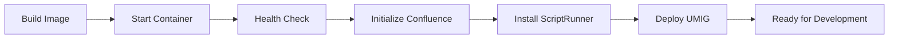
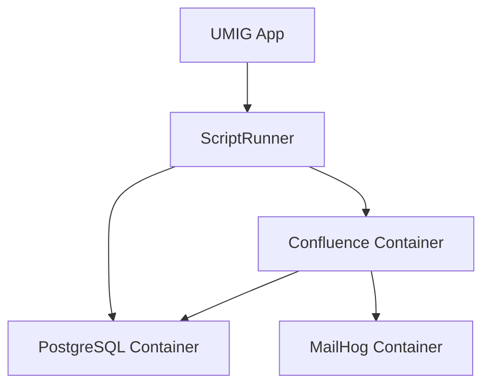

# Custom Confluence Image for UMIG

**Purpose**: Container-based Atlassian Confluence environment for UMIG development with session authentication support
**Sprint**: Enhanced in Sprint 7 for TD-008 session-based authentication
**Architecture**: Podman-based containerization with PostgreSQL integration

## Overview

This directory contains the `Containerfile` used to build the custom Atlassian Confluence image for the UMIG local development environment. The image provides a consistent Confluence 9.2.7 environment with PostgreSQL JDBC driver integration and supports session-based authentication for external API testing.

## Container Configuration

### Base Image

```dockerfile
FROM atlassian/confluence:9.2.7
```

### Included Components

- **Confluence Server**: Version 9.2.7 (Data Center compatible)
- **PostgreSQL JDBC Driver**: For ScriptRunner database connectivity
- **Java Runtime**: OpenJDK 11 (bundled with Confluence)
- **Session Management**: Support for JSESSIONID-based authentication

### NOT Included (Manual Installation Required)

- **ScriptRunner Plugin**: Installed manually via Marketplace (ADR-007)
- **UMIG Application**: Deployed separately after container start
- **SSL Certificates**: For production environments only

## Prerequisites

- **Podman 4.7+** or Docker 20.10+
- **8GB RAM minimum** (16GB recommended)
- **10GB disk space** for container and data
- **PostgreSQL container** running (via podman-compose)
- **Network connectivity** for Marketplace access

## Quick Start

```bash
# 1. Start the complete stack (includes building if needed)
cd ..  # Navigate to local-dev-setup
npm start

# 2. Access Confluence
# Navigate to http://localhost:8090

# 3. Default credentials
# Username: admin
# Password: 123456

# 4. Install ScriptRunner manually
# Go to Settings → Find new apps → Search "ScriptRunner"
```

## Container Architecture

### Directory Structure

```
confluence/
├── Containerfile           # Container definition
├── config/                 # Configuration files (if any)
├── scripts/               # Container helper scripts
│   ├── entrypoint.sh     # Custom entrypoint
│   └── health-check.sh   # Health check script
└── README.md             # This file
```

### Container Lifecycle



## Session Authentication Integration (TD-008)

### Container Support for Session Authentication

The Confluence container is configured to support session-based authentication:

```yaml
# podman-compose.yml configuration
confluence:
  environment:
    - ATL_AUTOLOGIN_COOKIE_AGE=1800 # 30-minute sessions
    - ATL_PROXY_NAME=localhost
    - ATL_PROXY_PORT=8090
```

### Session Capture from Container

```bash
# 1. Login to Confluence UI
# Navigate to http://localhost:8090 and login

# 2. Capture session using TD-008 utilities
npm run auth:capture-session

# 3. Validate session works
curl -H "Cookie: JSESSIONID=$JSESSIONID" \
     -H "X-Requested-With: XMLHttpRequest" \
     http://localhost:8090/rest/api/2/myself
```

### Container Session Persistence

Sessions are maintained across container restarts:

```bash
# Session persists through restart
podman restart umig_confluence

# Session lost on recreate
podman-compose down
podman-compose up -d  # New session required
```

## Building the Image

### Automatic Build (Recommended)

The image is built automatically by:

```bash
# Via npm scripts
npm start  # Builds if not present

# Via Ansible playbook
ansible-playbook setup.yml

# Via docker-compose
podman-compose build
```

### Manual Build

```bash
# Build with Podman
cd confluence/
podman build -t umig-confluence:9.2.7 -f Containerfile .

# Build with Docker
docker build -t umig-confluence:9.2.7 -f Containerfile .

# Build with specific tags
podman build -t umig-confluence:latest \
             -t umig-confluence:9.2.7 \
             -f Containerfile .
```

### Build Arguments

```dockerfile
# Customize build
ARG CONFLUENCE_VERSION=9.2.7
ARG JDBC_VERSION=42.5.4
```

## Container Management

### Starting the Container

```bash
# Start via npm (recommended)
npm start

# Start via podman-compose
podman-compose up -d confluence

# Start standalone
podman run -d \
  --name umig_confluence \
  -p 8090:8090 \
  -v confluence_data:/var/atlassian/application-data/confluence \
  umig-confluence:9.2.7
```

### Container Health Checks

```bash
# Check container status
podman ps --filter name=umig_confluence

# View health status
podman inspect umig_confluence --format='{{.State.Health.Status}}'

# Check logs
podman logs umig_confluence --tail 50

# Execute health check manually
podman exec umig_confluence /scripts/health-check.sh
```

### Container Logs

```bash
# View all logs
podman logs umig_confluence

# Follow logs in real-time
podman logs -f umig_confluence

# View Confluence application logs
podman exec umig_confluence tail -f /var/atlassian/application-data/confluence/logs/atlassian-confluence.log

# View Tomcat logs
podman exec umig_confluence tail -f /opt/atlassian/confluence/logs/catalina.out
```

## ScriptRunner Installation (Manual Process)

### Why Manual Installation?

Per ADR-007, ScriptRunner is installed manually to:

- Ensure stable environment initialization
- Avoid licensing complications
- Support different ScriptRunner versions
- Enable clean environment resets

### Installation Steps

1. **Access Confluence Admin**

   ```
   http://localhost:8090
   Login: admin / 123456
   ```

2. **Navigate to Marketplace**

   ```
   Settings → Find new apps
   Search: "ScriptRunner for Confluence"
   ```

3. **Install ScriptRunner**

   ```
   Click "Try it free"
   Accept license terms
   Wait for installation (~2 minutes)
   ```

4. **Verify Installation**

   ```
   Settings → Manage apps
   Confirm ScriptRunner 9.21.0 is listed
   ```

5. **Configure ScriptRunner**
   ```
   Apps → ScriptRunner
   Follow initial setup wizard
   ```

## Troubleshooting

### Common Issues

#### Container Won't Start

```
Error: Confluence container exits immediately
```

**Solution**:

1. Check port 8090 is available: `lsof -i :8090`
2. Verify sufficient memory: `free -h` (need 4GB minimum)
3. Check container logs: `podman logs umig_confluence`
4. Ensure volume permissions: `podman volume inspect confluence_data`

#### Session Authentication Failures

```
Error: JSESSIONID not working with container
```

**Solution**:

1. Ensure you're accessing via http://localhost:8090 (not IP)
2. Check container is healthy: `podman ps`
3. Verify session hasn't expired (30-minute timeout)
4. Try capturing fresh session: `npm run auth:capture-session`

#### ScriptRunner Not Available

```
Error: ScriptRunner menu not appearing
```

**Solution**:

1. Verify installation in Manage Apps
2. Check ScriptRunner license is active
3. Restart Confluence: `podman restart umig_confluence`
4. Clear browser cache and reload

#### Database Connection Issues

```
Error: ScriptRunner cannot connect to PostgreSQL
```

**Solution**:

1. Verify PostgreSQL container is running: `podman ps`
2. Check network connectivity: `podman network inspect umig-net`
3. Validate JDBC driver is present in container
4. Review connection string in ScriptRunner settings

### Debug Commands

```bash
# Container internals
podman exec -it umig_confluence /bin/bash

# Check Java version
podman exec umig_confluence java -version

# View running processes
podman exec umig_confluence ps aux

# Check disk usage
podman exec umig_confluence df -h

# Network connectivity test
podman exec umig_confluence ping -c 3 umig_postgres

# Database connectivity test
podman exec umig_confluence \
  java -cp /opt/atlassian/confluence/confluence/WEB-INF/lib/postgresql-*.jar \
  org.postgresql.Driver
```

## Performance Optimization

### Container Resources

```yaml
# podman-compose.yml optimizations
confluence:
  mem_limit: 8g
  cpus: 4
  environment:
    - JVM_MINIMUM_MEMORY=2048m
    - JVM_MAXIMUM_MEMORY=6144m
    - ATL_TOMCAT_MAXTHREADS=200
```

### JVM Tuning

```bash
# Custom JVM settings
-XX:+UseG1GC
-XX:MaxGCPauseMillis=200
-XX:+ParallelRefProcEnabled
-XX:+DisableExplicitGC
```

### Volume Performance

```bash
# Use native volume driver
podman volume create confluence_data --driver local

# Mount with optimized options
-v confluence_data:/data:Z,cached
```

## Security Considerations

1. **Default Credentials**: Change admin password immediately in production
2. **Session Security**: Sessions expire after 30 minutes
3. **Network Isolation**: Container runs in isolated network
4. **JDBC Security**: Database credentials managed via environment variables
5. **Volume Permissions**: Ensure proper ownership (uid:gid = 2002:2002)

## Maintenance

### Regular Tasks

1. **Weekly Updates**

   ```bash
   # Check for Confluence updates
   podman pull atlassian/confluence:9.2.7
   ```

2. **Log Rotation**

   ```bash
   # Clear old logs
   podman exec umig_confluence \
     find /var/atlassian/application-data/confluence/logs \
     -name "*.log" -mtime +7 -delete
   ```

3. **Health Monitoring**

   ```bash
   # Monitor resource usage
   podman stats umig_confluence
   ```

4. **Backup Data**
   ```bash
   # Backup volume
   podman run --rm \
     -v confluence_data:/data \
     -v $(pwd):/backup \
     busybox tar czf /backup/confluence-backup.tar.gz /data
   ```

### Container Updates

```bash
# 1. Stop container
podman stop umig_confluence

# 2. Backup data
podman run --rm -v confluence_data:/data -v $(pwd):/backup \
  busybox tar czf /backup/confluence-backup.tar.gz /data

# 3. Remove old container
podman rm umig_confluence

# 4. Pull new image
podman pull atlassian/confluence:9.2.7

# 5. Rebuild custom image
podman build -t umig-confluence:9.2.7 -f Containerfile .

# 6. Start new container
npm start
```

## Integration with UMIG Stack

### Stack Components

| Component  | Container Name  | Port | Purpose            |
| ---------- | --------------- | ---- | ------------------ |
| Confluence | umig_confluence | 8090 | Application server |
| PostgreSQL | umig_postgres   | 5432 | Database           |
| MailHog    | umig_mailhog    | 8025 | Email testing      |

### Network Configuration

```yaml
# All containers share umig-net network
networks:
  umig-net:
    driver: bridge
    ipam:
      config:
        - subnet: 172.28.0.0/16
```

### Service Dependencies



## Related Documentation

- [Session Authentication Utilities](../SESSION_AUTH_UTILITIES.md)
- [TD-008: Session Authentication](../../docs/roadmap/sprint7/TD-008-session-based-authentication-infrastructure.md)
- [Local Dev Setup](../README.md)
- [Infrastructure Guide](../infrastructure/README.md)
- [ADR-007: Plugin Installation](../../docs/architecture/adr/ADR-007-local-dev-setup-plugin-installation.md)

## Version History

- **v1.2.0** (2025-09-21): Added TD-008 session authentication support
- **v1.1.0** (2025-09): Updated for Confluence 9.2.7
- **v1.0.0** (2025-08): Initial containerization with PostgreSQL JDBC

---

**Note**: This container is for development use only. Production deployments require additional security hardening, SSL configuration, and proper backup strategies.
